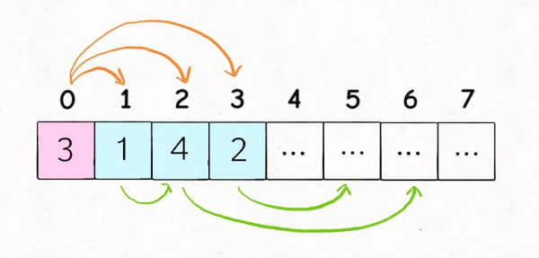
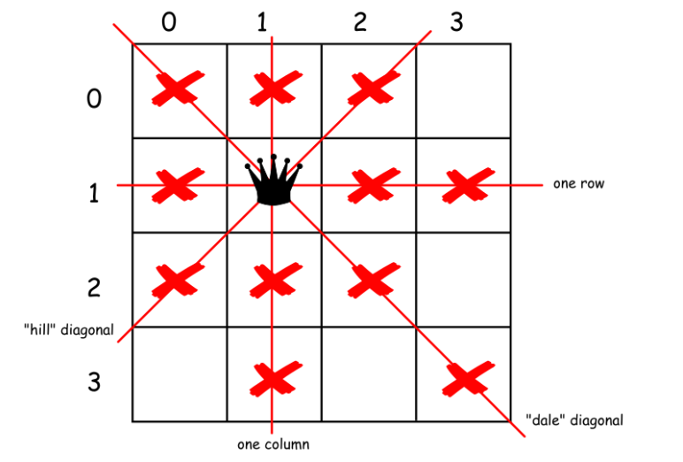
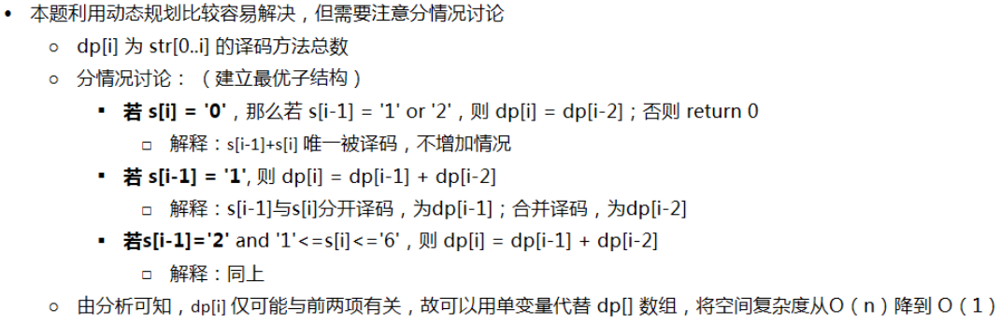

# 1. 两数之和
给定一个整数数组 `nums` 和一个目标值 `target`，请你在该数组中找出和为目标值的那 **两个** 整数，并返回他们的数组下标。

你可以假设每种输入只会对应一个答案。但是，你不能重复利用这个数组中同样的元素。

**示例:**

```
给定 nums = [2, 7, 11, 15], target = 9

因为 nums[0] + nums[1] = 2 + 7 = 9
所以返回 [0, 1]
```

利用hash表映射，时间复杂度为$O(n)$

```python
class Solution:
    def twoSum(self, nums: List[int], target: int) -> List[int]:
        hash_map = {}
        for index, num1 in enumerate(nums):
            num2 = target - num1
            if num2 in hash_map:
                return [index, hash_map[num2]]
            hash_map[num1] = index
        return None
```

```c++
class Solution {
public:
    vector<int> twoSum(vector<int>& nums, int target) {
        unordered_map<int, int> hash_map;
        for (int i = 0; i < nums.size();i++) {
            if (hash_map.count(target - hash_map[i])) {
                return {i, hash_map[target - hash_map[i]]};
            }
            hash_map[nums[i]] = i;
        }
        return {-1, -1};
    }
};
```
# 2. 两数相加

给出两个 **非空** 的链表用来表示两个非负的整数。其中，它们各自的位数是按照 **逆序** 的方式存储的，并且它们的每个节点只能存储 **一位** 数字。

如果，我们将这两个数相加起来，则会返回一个新的链表来表示它们的和。

您可以假设除了数字 0 之外，这两个数都不会以 0 开头。

**示例：**
```
输入：(2 -> 4 -> 3) + (5 -> 6 -> 4)
输出：7 -> 0 -> 8
原因：342 + 465 = 807
```
**递归**
```python
#Definition for singly-linked list.
# class ListNode:
#     def __init__(self, x):
#         self.val = x
#         self.next = None

class Solution:
    def addTwoNumbers(self, l1: ListNode, l2: ListNode) -> ListNode:
        if not l1:
            return l2
        if not l2:
            return l1
        val = l1.val + l2.val
        res_node = ListNode(val % 10)
        res_node.next = self.addTwoNumbers(l1.next, l2.next)
        if val >= 10:
            res_node.next = self.addTwoNumbers(ListNode(1), res_node.next)
        return res_node
```

```c++
/**
 * Definition for singly-linked list.
 * struct ListNode {
 *     int val;
 *     ListNode *next;
 *     ListNode(int x) : val(x), next(NULL) {}
 * };
 */
class Solution {
public:
    ListNode* addTwoNumbers(ListNode* l1, ListNode* l2) {
        if (l1 == NULL)
            return l2;
        if (l2 == NULL)
            return l1;
        int val = l1->val + l2->val;
        ListNode* res_node = new ListNode(val % 10);
        res_node->next = this->addTwoNumbers(l1->next, l2->next);
        if (val > 9)
            res_node->next = this->addTwoNumbers(new ListNode(1), res_node->next);
        return res_node;
    }
};
```
# 3. 最长回文子串
给定一个字符串 `s`，找到 `s` 中最长的回文子串。你可以假设 `s` 的最大长度为 1000。

**示例 1：**

```
输入: "babad"
输出: "bab"
注意: "aba" 也是一个有效答案。
```

**示例 2：**

```
输入: "cbbd"
输出: "bb"
```

**中心扩展法**

单字符中心$n$种情况，双字符中心$n-1$种情况，一共$2n-1$个中心

复杂度分析

**时间复杂度**：$O(n^2)$，由于围绕中心来扩展回文会耗去 $O(n)$ 的时间，所以总的复杂度为 $O(n^2)$。

**空间复杂度**：$O(1)$。

```python
class Solution:
    def longestPalindrome(self, s: str) -> str:
        if not s:
            return s
        start = 0
        end = 0
        for i in range(len(s)):
            len1 = self.expandCenter(s, i, i) # 单字符中心
            len2 = self.expandCenter(s, i, i + 1) # 双字符中心
            # max_len是个偶数的话说明是双字符中心，奇数是单字符中心
            max_len = max(len1, len2)
            if max_len > end - start:
                start = i - ((max_len - 1) >> 1)
                end = i +  (max_len >> 1)
        return s[start:end + 1]
        
    @staticmethod
    def expandCenter(s, left, right):
        while left >= 0 and right < len(s) and s[left] == s[right]:
            left -= 1
            right += 1
        return right - left - 1
```

```c++
class Solution {
public:
    string longestPalindrome(string s) {
        if (s.size() < 1)
            return "";
        
        int start = 0;
        int end = 0;
        for (int i = 0; i < s.size(); i++) {
            int len1 = this->expandCenter(s, i, i);
            int len2 = this->expandCenter(s, i, i + 1);
            int len = len1 > len2 ? len1 : len2;
            if (len > end - start) {
                start = i - ((len - 1) >> 1);
                end = i + (len >> 1);
            }
        }
        
        return s.substr(start, end - start + 1);
    }
    
    int expandCenter(const string s, int left, int right) {
        int L = left, R = right;
        while(L >= 0 && R < s.size() && s[L] == s[R]) {
            L--;
            R++;
        }
        return R - L - 1;
    }
};
```


# 4. 整数反转


给出一个 32 位的有符号整数，你需要将这个整数中每位上的数字进行反转。

**示例 1:**

```
输入: 123
输出: 321
```

 **示例 2:**

```
输入: -123
输出: -321
```

**示例 3:**

```
输入: 120
输出: 21
```

**注意:**

假设我们的环境只能存储得下 32 位的有符号整数，则其数值范围为 [−231,  231 − 1]。请根据这个假设，如果反转后整数溢出那么就返回 0。


```python
class Solution(object):
    def reverse(self, x):
        """
        :type x: int
        :rtype: int
        """
        temp = 1
        if x < 0:
            x = 0 - x
            temp = -1
        result = 0
        while x:
            tail = x % 10
            result = result * 10 + tail
            x = x // 10
        if result > (2**31 - 1) or result < -2**31:
            return 0
        else:
            return result * temp
```


```c++
#include <cmath>
class Solution {
public:
    int reverse(long x) {
        int tail;
        long result = 0;
        int temp = 1;
        if (x < 0) {
            x = 0 - x;
            temp = -1;
        }
            
        while (x != 0) {
            tail = x % 10;
            result = result * 10 + tail;
            if (result < -pow(2, 31) or result > pow(2, 31) - 1) 
                return 0;
            x = x / 10;
        }
        return result * temp;

};
```


# 5. 字符串转换整数 (atoi)


请你来实现一个 `atoi` 函数，使其能将字符串转换成整数。

首先，该函数会根据需要丢弃无用的开头空格字符，直到寻找到第一个非空格的字符为止。

当我们寻找到的第一个非空字符为正或者负号时，则将该符号与之后面尽可能多的连续数字组合起来，作为该整数的正负号；假如第一个非空字符是数字，则直接将其与之后连续的数字字符组合起来，形成整数。

该字符串除了有效的整数部分之后也可能会存在多余的字符，这些字符可以被忽略，它们对于函数不应该造成影响。

注意：假如该字符串中的第一个非空格字符不是一个有效整数字符、字符串为空或字符串仅包含空白字符时，则你的函数不需要进行转换。

在任何情况下，若函数不能进行有效的转换时，请返回 0。

**说明：**

假设我们的环境只能存储 32 位大小的有符号整数，那么其数值范围为 [−231,  231 − 1]。如果数值超过这个范围，请返回  INT_MAX (231 − 1) 或 INT_MIN (−231) 。

**示例 1:**

```
输入: "42"
输出: 42
```

**示例 2:**

```
输入: "   -42"
输出: -42
解释: 第一个非空白字符为 '-', 它是一个负号。
     我们尽可能将负号与后面所有连续出现的数字组合起来，最后得到 -42 。
```

**示例 3:**

```
输入: "4193 with words"
输出: 4193
解释: 转换截止于数字 '3' ，因为它的下一个字符不为数字。
```

**示例 4:**

```
输入: "words and 987"
输出: 0
解释: 第一个非空字符是 'w', 但它不是数字或正、负号。
     因此无法执行有效的转换。
```

**示例 5:**

```
输入: "-91283472332"
输出: -2147483648
解释: 数字 "-91283472332" 超过 32 位有符号整数范围。 
     因此返回 INT_MIN (−231) 。
```


```python
class Solution(object):
    def myAtoi(self, s):
        """
        :type str: str
        :rtype: int
        """
        INT_MAX = 2**31 - 1
        INT_MIN = -2**31
        s = s.lstrip() # 去除左侧空格
        if (not s) or (s[0] not in ['-', '+'] and not s[0].isdigit()) \
                   or (len(s) == 1 and not s.isdigit()):
            return 0
        if s[0] in ['-', '+']:
            start = 1
            result = s[0]
        else:
            result = ""
            start = 0
        for i in s[start:]:
            if i.isdigit():
                result += i
            else:
                break
        if len(result) == 1 and not result.isdigit():
            return 0
        result = min(max(int(result) ,INT_MIN), INT_MAX)
        return result
    
class Solution(object):
    def myAtoi(self, s):
        """
        :type str: str
        :rtype: int
        """
        INT_MAX = 2**31 - 1
        INT_MIN = -2**31
        return max(INT_MIN, min(INT_MAX, int(*re.findall("^[\+\-]?\d+", s.lstrip()))))
```


```c++
#include <cmath>
class Solution {
public:
    int myAtoi(string str) {
        int i = 0;
        while (i < str.size() && str[i] == ' ')
            i++;
        int temp = 1;
        long long result = 0;
        if (str[i] == '-') {
            temp = -1;
            i++;
        } else if (str[i] == '+') {
            i++;
        } else if (str[i] < '0' or str[i] > '9') {
            return 0;
        }
        
        while (str[i] >= '0' && str[i] <= '9' && i < str.size()) {
            result = result * 10 + str[i++] - '0';
            if (result > pow(2, 31) - 1) {
                if (temp == 1)
                    return pow(2, 31) - 1;
                else
                    return -pow(2, 31);
            }
            
        }
        return result*temp;
        
    }
};
```


# 6. 罗马数字转整数

罗马数字包含以下七种字符: `I`， `V`， `X`， `L`，`C`，`D` 和 `M`。

```
字符          数值
I             1
V             5
X             10
L             50
C             100
D             500
M             1000
```

例如， 罗马数字 2 写做 `II` ，即为两个并列的 1。12 写做 `XII` ，即为 `X` + `II` 。 27 写做 `XXVII`, 即为 `XX` + `V` + `II` 。

通常情况下，罗马数字中小的数字在大的数字的右边。但也存在特例，例如 4 不写做 `IIII`，而是 `IV`。数字 1 在数字 5 的左边，所表示的数等于大数 5 减小数 1 得到的数值 4 。同样地，数字 9 表示为 `IX`。这个特殊的规则只适用于以下六种情况：

- `I` 可以放在 `V` (5) 和 `X` (10) 的左边，来表示 4 和 9。
- `X` 可以放在 `L` (50) 和 `C` (100) 的左边，来表示 40 和 90。 
- `C` 可以放在 `D` (500) 和 `M` (1000) 的左边，来表示 400 和 900。

给定一个罗马数字，将其转换成整数。输入确保在 1 到 3999 的范围内。

**示例 1:**

```
输入: "III"
输出: 3
```

**示例 2:**

```
输入: "IV"
输出: 4
```

**示例 3:**

```
输入: "IX"
输出: 9
```

**示例 4:**

```
输入: "LVIII"
输出: 58
解释: L = 50, V= 5, III = 3.
```

**示例 5:**

```
输入: "MCMXCIV"
输出: 1994
解释: M = 1000, CM = 900, XC = 90, IV = 4.
```


思路:

- 首先将所有的组合可能性列出并添加到哈希表中
- 然后对字符串进行遍历，由于组合只有两种，一种是 1 个字符，一种是 2 个字符，其中 2 个字符优先于 1 个字符
- 先判断两个字符的组合在哈希表中是否存在，存在则将值取出加到结果 res 中，并向后移2个字符。
- 不存在则将判断当前 1 个字符是否存在，存在则将值取出加到结果 res 中，并向后移 1 个字符
- 遍历结束返回结果 res


```python
class Solution:
    def romanToInt(self, s: str) -> int:
        hash_map = {'I':1, 'IV':4, 'V':5, 'IX':9, 'X':10, 'XL':40, 'L':50, 'XC':90, 'C':100, 'CD':400, 'D':500, 'CM':900, 'M':1000}
        res = 0
        l = len(s)
        i = 0
        while i < l:
            if i + 1 < l and s[i: i+2] in hash_map:
                res += hash_map[s[i: i+2]]
                i += 2
            else:
                res += hash_map[s[i]]
                i += 1
        return res
```


```c++
#include <string>
#include <map>
using namespace std;

class Solution
{
public:
    int romanToInt(string s)
    {
        int res = 0;
        map<string, int> hash_map = {{"I", 1}, {"IV", 4}, {"V", 5}, {"IX", 9}, {"X", 10}, {"XL", 40}, {"L", 50}, {"XC", 90}, {"C", 100}, {"CD", 400}, {"D", 500}, {"CM", 900}, {"M", 1000}};
        for (int i = 0; i < s.size(); i++) {
            if (i + 1 < s.size() && hash_map.find(s.substr(i, 2)) != hash_map.end()) {
                res += hash_map[s.substr(i, 2)];
                i++;
            }
            else {
                res += hash_map[s.substr(i, 1)];
            }
        }
        return res;
    }
};
```


# 7. 三数之和

给定一个包含 *n* 个整数的数组 `nums`，判断 `nums` 中是否存在三个元素 *a，b，c ，*使得 *a + b + c =* 0 ？找出所有满足条件且不重复的三元组。

**注意：**答案中不可以包含重复的三元组。

```
例如, 给定数组 nums = [-1, 0, 1, 2, -1, -4]，

满足要求的三元组集合为：
[
  [-1, 0, 1],
  [-1, -1, 2]
]
```


**算法流程：**

1. 特判，对于数组长度 n，如果数组为 null或者数组长度小于 3，返回 [][][]。
2. 对数组进行排序。
3. 遍历排序后数组：
   - ​	若 $nums[i]>0$：因为已经排序好，所以后面不可能有三个数加和等于 0，直接返回结果。
   - 对于重复元素：跳过，避免出现重复解
   - 令左指针$L=i+1$，右指针$R=n-1$，当$L<R$ 时，执行循环：
     - 当 $nums[i]+nums[L]+nums[R] = 0$，执行循环，判断左界和右界是否和下一位置重复，去除重复解。并同时将 $L,R$ 移到下一位置，寻找新的解
     - 若和大于 0，说明 $nums[R]$太大，R左移
     - 若和小于 0，说明 $nums[L]$太小，L右移

**复杂度分析:**

**时间复杂度**：$O\left(n^{2}\right)$，数组排序 $O(N \log N)$，遍历数组 $O\left(n\right)$，双指针遍历 $O\left(n\right)$，总体$O(N \log N)$ + $O\left(n\right) \times O\left(n\right)$ =  $O(n^{2})$

**空间复杂度**：$O(1)$


```python
class Solution:
    def threeSum(self, nums: List[int]) -> List[List[int]]:
        nums.sort() 
        result, visited = set(), {}  # 集合，字典
        for i in range(len(nums) - 2):
            table, target = {}, -nums[i]
            if nums[i] not in visited:
                for j in range(i + 1, len(nums)):
                    if nums[j] not in table:
                        table[target - nums[j]] = j
                    else:
                        result.add((nums[i], target - nums[j], nums[j]))
                visited[nums[i]] = 1
        return list(result)
    
# 双指针
class Solution:
    def threeSum(self, nums: List[int]) -> List[List[int]]:
        
        n=len(nums)
        res=[]
        if(not nums or n<3):
            return []
        nums.sort()
        res=[]
        for i in range(n):
            if(nums[i]>0):
                return res
            if(i>0 and nums[i]==nums[i-1]):
                continue
            L=i+1
            R=n-1
            while(L<R):
                if(nums[i]+nums[L]+nums[R]==0):
                    res.append([nums[i],nums[L],nums[R]])
                    while(L<R and nums[L]==nums[L+1]):
                        L=L+1
                    while(L<R and nums[R]==nums[R-1]):
                        R=R-1
                    L=L+1
                    R=R-1
                elif(nums[i]+nums[L]+nums[R]>0):
                    R=R-1
                else:
                    L=L+1
        return res
```

```c++
class Solution {
public:
    vector<vector<int>> threeSum(vector<int>& nums) {
        vector<vector<int>> res;
        int n = nums.size();
        if (n < 3)
            return res;
        //排序
        sort(nums.begin(), nums.end());
        for (int i = 0 ; i < n - 2; ++i) {
            if (nums[i] > 0)
                break;
            if (i > 0 && nums[i] == nums[i - 1])
                continue;
            int l = i + 1;
            int r = n - 1;
            //双指针
            while (l < r) {
                int sum = nums[i] + nums[l] + nums[r];
                if (sum == 0) {
                    res.emplace_back(vector<int> {nums[i], nums[l], nums[r]});
                    while (l < r && nums[l] == nums[l + 1])
                        l++;
                    while (l < r && nums[r] == nums[r - 1])
                        r--;
                    l++;
                    r--;
                    
                } else if (sum > 0) {
                    r--;
                } else {
                    l++;
                }
            }   
        }
        return res;
    }
};
```


# 8. 最长公共前缀

编写一个函数来查找字符串数组中的最长公共前缀。

如果不存在公共前缀，返回空字符串 `""`。

**示例 1:**

```
输入: ["flower","flow","flight"]
输出: "fl"
```

**示例 2:**

```
输入: ["dog","racecar","car"]
输出: ""
解释: 输入不存在公共前缀。
```

**说明:**

所有输入只包含小写字母 `a-z` 。


利用python的max()和min()，**在Python里字符串是可以比较的，按照ascII值排**，举例abb， aba，abac，最大为abb，最小为aba。所以只需要比较最大最小的公共前缀就是整个数组的公共前缀 

```python
class Solution(object):
    def longestCommonPrefix(self, strs):
        """
        :type strs: List[str]
        :rtype: str
        """
        if not strs:
            return ""
        if len(strs) == 1:
            return strs[0]
        
        min_str = min(strs)
        max_str = max(strs)
        for i, char in enumerate(min_str):
            if char != max_str[i]:
                return max_str[:i]
        return min_str
        
```


```c++
#include <algorithm>
class Solution {
public:
    string longestCommonPrefix(vector<string>& strs) {
        if (strs.empty())
            return "";
        
        int i, j;
        string s1 = strs[0];
        int min_length = s1.size();
        for (i = 0; i < strs.size(); i++) {
            if (min_length > strs[i].size())
                min_length = strs[i].size();
            
            for (j = 0; j < min_length;j++) {
                if (s1[j] != strs[i][j]) {
                    min_length = j;
                    break;
                }
            }
        }
        return s1.substr(0, min_length);  
    }
};
```


# 9. 电话号码的字母组合

给定一个仅包含数字 `2-9` 的字符串，返回所有它能表示的字母组合。

给出数字到字母的映射如下（与电话按键相同）。注意 1 不对应任何字母。


**示例:**

```
输入："23"
输出：["ad", "ae", "af", "bd", "be", "bf", "cd", "ce", "cf"].
```

**说明:**
尽管上面的答案是按字典序排列的，但是你可以任意选择答案输出的顺序。


```python
#回溯法
class Solution:
    def letterCombinations(self, digits: str) -> List[str]:
        res = []
        if not digits:
            return res
        phone = {
            '2':['a', 'b', 'c'],
            '3':['d', 'e', 'f'],
            '4':['g', 'h', 'i'],
            '5':['j', 'k', 'l'],
            '6':['m', 'o', 'n'],
            '7':['p', 'q', 'r', 's'],
            '8':['t', 'u', 'v'],
            '9':['w', 'x', 'y', 'z']
        }
        
        def BackTrack(combination, next_digits):
            if not next_digits:
                res.append(combination)
            else:
                # 检查数字的有效性
                while next_digits and next_digits[0] not in phone:
                    next_digits.pop(0)
                    
                for letter in phone[next_digits[0]]:
                    BackTrack(combination + letter, next_digits[1:])
        BackTrack("", digits)
        return res
```

```c++
#include<map>
class Solution {
public:
    map<char,string> phone;
    Solution() {
        phone.insert(make_pair('2', "abc"));
        phone.insert(make_pair('3', "def"));
        phone.insert(make_pair('4', "ghi"));
        phone.insert(make_pair('5', "jkl"));
        phone.insert(make_pair('6', "mno"));
        phone.insert(make_pair('7', "pqrs"));
        phone.insert(make_pair('8', "tuv"));
        phone.insert(make_pair('9', "wxyz")); 
    }
    
    vector<string> letterCombinations(string digits) {
        vector<string> res;
        backTrack("", digits, res);
        return res;
    }
    
private:
    void backTrack(string combination, string next_digits, vector<string> &res) {
        if (next_digits.empty()) {
            if (combination != "")
                res.push_back(combination);
        }
            
        else {
            while (!isPhoneNum(next_digits[0]) && !next_digits.empty())
                next_digits = next_digits.substr(1, next_digits.size() - 1);
            
            if (!next_digits.empty()) {
                string letters = phone[next_digits[0]];
                for (int i = 0; i < letters.size(); ++i) {
                    backTrack(combination + letters[i], next_digits.substr(1, next_digits.size() - 1), res);
                }
                
            }
        }
        return;
    }
    
    bool isPhoneNum(char ch) {
        return (ch >= '2' && ch <= '9');
    }
    
};
```


# 10. 合并两个有序链表

将两个有序链表合并为一个新的有序链表并返回。新链表是通过拼接给定的两个链表的所有节点组成的。 

**示例：**

```
输入：1->2->4, 1->3->4
输出：1->1->2->3->4->4
```


**方法 1：递归**

**想法**

我们可以如下递归地定义在两个链表里的 `merge` 操作（忽略边界情况，比如空链表等）


 也就是说，两个链表头部较小的一个与剩下元素的 `merge` 操作结果合并。 

**复杂度分析**

时间复杂度：$O(n + m)$。 因为每次调用递归都会去掉 `l1 `或者 `l2 `的头元素（直到至少有一个链表为空），函数 `mergeTwoList` 中只会遍历每个元素一次。所以，时间复杂度与合并后的链表长度为线性关系。

空间复杂度：$O(n + m)$。调用 `mergeTwoLists` 退出时 `l1` 和 `l2` 中每个元素都一定已经被遍历过了，所以$ n + m $个栈帧会消耗$ O(n + m)$的空间。


**方法 2：迭代**

**想法**

我们可以用迭代的方法来实现上述算法。我们假设 `l1` 元素严格比 `l2`元素少，我们可以将 `l2` 中的元素逐一插入 `l1` 中正确的位置。


```python
# Definition for singly-linked list.
# class ListNode:
#     def __init__(self, x):
#         self.val = x
#         self.next = None

class Solution:
    def mergeTwoLists(self, l1: ListNode, l2: ListNode) -> ListNode:
        """递归"""
        if not l1:
            return l2;
        elif not l2:
            return l1;
        elif l1.val < l2.val:
            l1.next = self.mergeTwoLists(l1.next, l2)
            return l1;
        else:
            l2.next = self.mergeTwoLists(l1, l2.next)
            return l2
        

class Solution:
    def mergeTwoLists(self, l1: ListNode, l2: ListNode) -> ListNode:
        """迭代插入""" 
        dummy = ListNode(-1)
        pointer = dummy
        while l1 and l2:
            if l1.val < l2.val:
                pointer.next = l1
                l1 = l1.next
                pointer = pointer.next
            else:
                pointer.next = l2
                l2 = l2.next
                pointer = pointer.next
        pointer.next = l1 if l1 else l2
        return dummy.next
```


```c++
/**
 * Definition for singly-linked list.
 * struct ListNode {
 *     int val;
 *     ListNode *next;
 *     ListNode(int x) : val(x), next(NULL) {}
 * };
 */
//迭代
class Solution {
public:
    ListNode* mergeTwoLists(ListNode* l1, ListNode* l2) {
        ListNode dummy = ListNode(-1);  //哨兵节点
        ListNode *pre = &dummy;
        while (l1 != nullptr && l2 != nullptr) {
            if (l1->val < l2->val) {
                pre->next = l1;
                l1 = l1->next;
            } else {
                pre->next = l2;
                l2 = l2->next;
            }
            pre = pre->next;
        }
        pre->next = (l1 == nullptr) ? l2 : l1;
        return dummy.next;
    }
};


//递归
class Solution {
public:
    ListNode* mergeTwoLists(ListNode* l1, ListNode* l2) {
        if (l1 == nullptr) {
            return l2;
        } else if (l2 == nullptr) {
            return l1;
        } else if (l1->val > l2->val) {
            l1->next = this->mergeTwoLists(l1->next, l2);
            return l1;
        } else {
            l2->next = this->mergeTwoLists(l1, l2->next);
            return l2;
        }
    }
};
```


# 11. 删除链表的倒数第N个节点

给定一个链表，删除链表的倒数第 *n* 个节点，并且返回链表的头结点。

**示例：**

```
给定一个链表: 1->2->3->4->5, 和 n = 2.

当删除了倒数第二个节点后，链表变为 1->2->3->5.
```

**说明：**

给定的 *n* 保证是有效的。

**进阶：**

你能尝试使用一趟扫描实现吗？

```python
# Definition for singly-linked list.
# class ListNode:
#     def __init__(self, x):
#         self.val = x
#         self.next = None

class Solution:
    def removeNthFromEnd(self, head: ListNode, n: int) -> ListNode:
        """双指针，快指针先走n步，然后快慢指针一起走"""
        fast = head
        slow = head
        
        for i in range(n):
            if fast.next:
                fast = fast.next
            else:
                # 删除head的情况，返回head的下一个node
                return head.next
            
        while fast.next:
            fast = fast.next
            slow = slow.next
        slow.next = slow.next.next
        return head
```


```c++
/**
 * Definition for singly-linked list.
 * struct ListNode {
 *     int val;
 *     ListNode *next;
 *     ListNode(int x) : val(x), next(NULL) {}
 * };
 */
class Solution {
public:
    ListNode* removeNthFromEnd(ListNode* head, int n) {
        
        if(!head || !(head->next))
            return nullptr;
        ListNode *fast_pointer = head;
        ListNode *slow_pointer = head;
        //快指针先走n步
        for (int i = 0; i < n; i++)
            fast_pointer = fast_pointer->next;
        //如果快指针走到头则删除的节点是头节点
        if (fast_pointer == nullptr)
            return head->next;
        //双指针同时向前走，快指针走到头时，慢指针走到需要删除的点处
        while (fast_pointer->next != nullptr) {
            fast_pointer = fast_pointer->next;
            slow_pointer = slow_pointer->next;
        }
        slow_pointer->next = slow_pointer->next->next;
        return head;
    }
};
```


# 12. 有效的括号

给定一个只包括 `'('`，`')'`，`'{'`，`'}'`，`'['`，`']'` 的字符串，判断字符串是否有效。

有效字符串需满足：

1. 左括号必须用相同类型的右括号闭合。
2. 左括号必须以正确的顺序闭合。

注意空字符串可被认为是有效字符串。

**示例 1:**

```
输入: "()"
输出: true
```

**示例 2:**

```
输入: "()[]{}"
输出: true
```

**示例 3:**

```
输入: "(]"
输出: false
```

**示例 4:**

```
输入: "([)]"
输出: false
```

**示例 5:**

```
输入: "{[]}"
输出: true
```


```python
class Solution:
    def isValid(self, s: str) -> bool:
        if not s:
            return True
        
        hash_map = {")": "(", "}": "{", "]": "["}
        stack = []
        
        for char in s:
            
            # char是个右括号
            if char in hash_map:
                # 如果stack为空则返回一个dummy符号#
                top_element = stack.pop() if stack else '#'
                
                if hash_map[char] != top_element:
                    return False
            else:
                stack.append(char)
        #如果stack非空，返回false
        return stack == []
```


```c++
#include <stack>
#include <map>
class Solution {
public:
    bool isValid(string s) {
        if (s.empty())
            return true;
        
        stack<char> sta;
        char top_element;
        
        map<char, char> hash_map;
        hash_map.insert(make_pair(')', '('));
        hash_map.insert(make_pair(']', '['));
        hash_map.insert(make_pair('}', '{'));
        
        for (int i = 0; i < s.size();i++) {
            if (hash_map.find(s[i]) != hash_map.end()) {
                if (!sta.empty())
                    top_element = sta.top();
                else
                    top_element = '#';
                
                if (top_element != hash_map[s[i]])
                    return false;
                sta.pop();
            } else {
                sta.push(s[i]);
            }
        }
        return sta.empty();
    }
};
```


# 13. 生成括号

给出 *n* 代表生成括号的对数，请你写出一个函数，使其能够生成所有可能的并且**有效的**括号组合。

例如，给出 *n* = 3，生成结果为：

```
[
  "((()))",
  "(()())",
  "(())()",
  "()(())",
  "()()()"
]
```

**复杂度分析**

我们的复杂度分析依赖于理解 helper() 中有多少个元素。这个分析超出了本文的范畴，但事实证明这是第 n 个卡塔兰数$\dfrac{1}{n+1}\binom{2n}{n}$，这是由 $\dfrac{4^n}{n\sqrt{n}}$ 渐近界定的。

时间复杂度：$O(\dfrac{4^n}{\sqrt{n}})$，在回溯过程中，每个有效序列最多需要 n 步。

空间复杂度：$O(\dfrac{4^n}{\sqrt{n}})$，如上所述，并使用 $O(n)$的空间来存储序列


```python
class Solution:
    def generateParenthesis(self, n: int) -> List[str]:
        res = []
        if n <= 0:
            return res
        def helper(combination, left, right):
            if left < right or right > n or left > n:
                return
            elif len(combination) == 2*n:
                res.append(combination)
            else:
                helper(combination + '(', left + 1, right)
                helper(combination + ')', left , right + 1)
        helper("", 0, 0)
        return res    
```


```c++
class Solution {
public:
    vector<string> generateParenthesis(int n) {
        vector<string> res;
        trackBack(res, n, "", 0, 0);
        return res;
    }
    
    void trackBack(vector<string> &res, const int n, string combination, int left, int right) {
        if (left < right || left > n || right > n)
            return;
        if (combination.size() == 2*n)
            res.push_back(combination);
        else {
            trackBack(res, n, combination + "(", left + 1, right);
            trackBack(res, n, combination + ")", left, right + 1);
        }
    }
};
```


# 14. 合并K个排序链表

合并 *k* 个排序链表，返回合并后的排序链表。请分析和描述算法的复杂度。

**示例:**

```
输入:
[
  1->4->5,
  1->3->4,
  2->6
]
输出: 1->1->2->3->4->4->5->6
```


方法 1：暴力
想法 & 算法

遍历所有链表，将所有节点的值放到一个数组中。
将这个数组排序，然后遍历所有元素得到正确顺序的值。
用遍历得到的值，创建一个新的有序链表。


```c++
/**
 * Definition for singly-linked list.
 * struct ListNode {
 *     int val;
 *     ListNode *next;
 *     ListNode(int x) : val(x), next(NULL) {}
 * };
 */
class Solution {
public:
    ListNode* mergeKLists(vector<ListNode*>& lists) {
        int n = lists.size();
        if (n == 0)
            return nullptr;
        
        vector<int> temp;
        for(int i = 0; i < n; ++i) {
            if (lists[i] == nullptr)
                continue;
            ListNode* p = lists[i];
            while (p) {
                temp.push_back(p->val);
                p = p->next;
            }  
        }
        
        if (temp.empty())
            return nullptr;
        else {
            sort(temp.begin(), temp.end(), less<int>());
            ListNode* head = new ListNode(temp[0]);
            ListNode* p = head;
            for (int i = 1; i < temp.size(); ++i) {
                p->next = new ListNode(temp[i]);
                p = p->next;
            }
            return head;
        }
        
    }
};
```


**方法 3：用优先队列优化方法 2**

将 **比较环节** 用 **优先队列** 进行了优化


```c++
/**
 * Definition for singly-linked list.
 * struct ListNode {
 *     int val;
 *     ListNode *next;
 *     ListNode(int x) : val(x), next(NULL) {}
 * };
 */
#include<queue>
class Solution {
public:
    ListNode* mergeKLists(vector<ListNode*>& lists) {
        int n = lists.size();
        if (n == 0)
            return nullptr;
        /**
           需要把lambda表达式作为优先队列参数进行初始化
           并且指定priority_queue的模板实参，decltype(cmp)，
           可以认为是确定函数的类型
           bool (const student & a,const student & b)
        */
        auto cmp = [](ListNode* p1, ListNode* p2){
            return p1->val > p2->val;
        };
        priority_queue<ListNode*, vector<ListNode*>, decltype(cmp)> pq(cmp);
        for (int i = 0 ; i < n; ++i) {
            if (lists[i] != nullptr)
                pq.push(lists[i]);
        }
        ListNode* dummyHead = new ListNode(0);
        ListNode* p = dummyHead;
        
        while (!pq.empty()) {
            ListNode* cur = pq.top();
            pq.pop();
            p->next = cur;
            p = p->next;
            if (cur->next != nullptr)
                pq.push(cur->next);
        }
        return dummyHead->next;
        
    }
};


/**
 * Definition for singly-linked list.
 * struct ListNode {
 *     int val;
 *     ListNode *next;
 *     ListNode(int x) : val(x), next(NULL) {}
 * };
 */
#include<queue>
class Solution {
public:
    ListNode* mergeKLists(vector<ListNode*>& lists) {
        int n = lists.size();
        if (n == 0)
            return nullptr;
        
        
        priority_queue<ListNode*, vector<ListNode*>, cmp> pq;
        for (int i = 0 ; i < n; ++i) {
            if (lists[i] != nullptr)
                pq.push(lists[i]);
        }
        ListNode* dummyHead = new ListNode(0);
        ListNode* p = dummyHead;
        
        while (!pq.empty()) {
            ListNode* cur = pq.top();
            pq.pop();
            p->next = cur;
            p = p->next;
            if (cur->next != nullptr)
                pq.push(cur->next);
        }
        return dummyHead->next;
    }
private:
    struct cmp {
        bool operator() (const ListNode* p1, const ListNode* p2){
            return p1->val > p2->val;
        }
    };
};
```


```c++
/**
 * Definition for singly-linked list.
 * struct ListNode {
 *     int val;
 *     ListNode *next;
 *     ListNode(int x) : val(x), next(NULL) {}
 * };
 */
#include<queue>
class Solution {
public:
    ListNode* mergeKLists(vector<ListNode*>& lists) {
        int n = lists.size();
        if (n == 0)
            return nullptr;
        int interval = 1;
        while (interval < n) {
            //根据当前间隔两两合并，并将合并后的结构放在第一个链表头
            for (int i = 0; i < n - interval; i += 2*interval)
                lists[i] = merge(lists[i], lists[i + interval]);
            //间隔变大
            interval *= 2;
        }
        return lists[0];
    }
    
    ListNode* merge(ListNode* l1, ListNode* l2) {
        if (l1 == nullptr)
            return l2;
        if (l2 == nullptr)
            return l1;
        ListNode* dummy = new ListNode(0);
        ListNode* p = dummy;
        while (l1 != nullptr and l2 != nullptr) {
            if (l1->val < l2->val) {
                p->next = l1;
                l1 = l1->next;
            }
            else {
                p->next = l2;
                l2 = l2->next;
            }
            p = p->next;
        }
        if (l1 != nullptr)
            p->next = l1;
        else
            p->next = l2;
        return dummy->next;
    }
};
```


# 15. 两两交换链表中的节点

给定一个链表，两两交换其中相邻的节点，并返回交换后的链表。

**你不能只是单纯的改变节点内部的值**，而是需要实际的进行节点交换。

 

**示例:**

```
给定 1->2->3->4, 你应该返回 2->1->4->3.
```


```python
# Definition for singly-linked list.
# class ListNode:
#     def __init__(self, x):
#         self.val = x
#         self.next = None

class Solution:
    def swapPairs(self, head: ListNode) -> ListNode:
        if head == None or head.next == None:
            return head
        
        firstNode = head
        secondNode = head.next
        
        # 交换
        firstNode.next = self.swapPairs(secondNode.next)
        secondNode.next = firstNode
        
        return secondNode
```


```c++
/**
 * Definition for singly-linked list.
 * struct ListNode {
 *     int val;
 *     ListNode *next;
 *     ListNode(int x) : val(x), next(NULL) {}
 * };
 */
class Solution {
public:
    ListNode* swapPairs(ListNode* head) {
        if (head == nullptr || head->next == nullptr)
            return head;
        ListNode* firstNode = head;
        ListNode* secondNode = head->next;
        
        //交换节点
        firstNode->next = swapPairs(secondNode->next);
        secondNode->next = firstNode;
        return secondNode;
        
    }
};
```


```python
# Definition for singly-linked list.
# class ListNode:
#     def __init__(self, x):
#         self.val = x
#         self.next = None

class Solution:
    def swapPairs(self, head: ListNode) -> ListNode:
        if head == None or head.next == None:
            return head
        
        dummyHead = ListNode(0)
        dummyHead.next = head
        prevNode = dummyHead
        
        while head and head.next:
            firstNode = head
            secondNode = head.next
            
            # prev->first->second->$
            prevNode.next = secondNode # prev->second->$
            firstNode.next = secondNode.next # first->$
            secondNode.next = firstNode # prev->second->first->$
            
            prevNode = firstNode
            head = firstNode.next
            
        return dummyHead.next     
```


```c++
/**
 * Definition for singly-linked list.
 * struct ListNode {
 *     int val;
 *     ListNode *next;
 *     ListNode(int x) : val(x), next(NULL) {}
 * };
 */
class Solution {
public:
    ListNode* swapPairs(ListNode* head) {
        if (head == nullptr || head->next == nullptr)
            return head;
        ListNode* firstNode;
        ListNode* secondNode;
        ListNode* dummyHead = new ListNode(0);
        ListNode* prevNode = dummyHead;
        dummyHead->next = head;
        
        while (head != nullptr && head->next != nullptr) {
            firstNode = head;
            secondNode = head->next;
            
            //交换
            prevNode->next = secondNode;
            firstNode->next = secondNode->next;
            secondNode->next = firstNode;
            
            prevNode = firstNode;
            head = firstNode->next;
        }
        return dummyHead->next;
    }
};
```


# 16. 删除排序数组中的重复元素

给定一个排序数组，你需要在**原地**删除重复出现的元素，使得每个元素只出现一次，返回移除后数组的新长度。

不要使用额外的数组空间，你必须在**原地修改输入数组**并在使用 O(1) 额外空间的条件下完成。

**示例 1:**

```
给定数组 nums = [1,1,2], 

函数应该返回新的长度 2, 并且原数组 nums 的前两个元素被修改为 1, 2。 

你不需要考虑数组中超出新长度后面的元素。
```

**示例 2:**

```
给定 nums = [0,0,1,1,1,2,2,3,3,4],

函数应该返回新的长度 5, 并且原数组 nums 的前五个元素被修改为 0, 1, 2, 3, 4。

你不需要考虑数组中超出新长度后面的元素。
```

**说明:**

为什么返回数值是整数，但输出的答案是数组呢?

请注意，输入数组是以 **“引用”** 方式传递的，这意味着在函数里修改输入数组对于调用者是可见的。

你可以想象内部操作如下:

```c++
// nums 是以“引用”方式传递的。也就是说，不对实参做任何拷贝
int len = removeDuplicates(nums);

// 在函数里修改输入数组对于调用者是可见的。
// 根据你的函数返回的长度, 它会打印出数组中该长度范围内的所有元素。
for (int i = 0; i < len; i++) {
    print(nums[i]);
}
```


```python
class Solution:
    def removeDuplicates(self, nums):
        index = 0
        for i in range(1, len(nums)):
            if nums[i] != nums[i-1]:
                index += 1
                nums[index] = nums[i]
        return index + 1
```


```c++
#include <vector>

class Solution {
public:
    int removeDuplicates(vector<int> &nums) {
        int index = 1;
        if (nums.empty()) {
            return 0;
        } else {
            for (int i = 1; i < nums.size(); i++) {
                if (nums[i] != nums[i - 1]) {
                    nums[index++] = nums[i];
                }
            }
            return index; 
        }
    }
};
```

在C++中：

i++ ：先引用后增加，先在i所在的表达式中使用i的当前值，后让i加1

++i ：先增加后引用，让i先加1，然后在i所在的表达式中使用i的新值


# 17. 实现 strStr()
实现 [strStr()](https://baike.baidu.com/item/strstr/811469) 函数。

给定一个 haystack 字符串和一个 needle 字符串，在 haystack 字符串中找出 needle 字符串出现的第一个位置 (从0开始)。如果不存在，则返回  **-1**。

**示例 1:**

```
输入: haystack = "hello", needle = "ll"
输出: 2
```

**示例 2:**

```
输入: haystack = "aaaaa", needle = "bba"
输出: -1
```

**说明:**

当 `needle` 是空字符串时，我们应当返回什么值呢？这是一个在面试中很好的问题。

对于本题而言，当 `needle` 是空字符串时我们应当返回 0 。这与C语言的 [strstr()](https://baike.baidu.com/item/strstr/811469) 以及 Java的 [indexOf()](https://docs.oracle.com/javase/7/docs/api/java/lang/String.html#indexOf(java.lang.String)) 定义相符。


```python
class Solution:
    def strStr(self, haystack: str, needle: str) -> int:
        return haystack.find(needle)
```


```c++
class Solution {
public:
    int strStr(string haystack, string needle) {
        if (needle.empty())
            return 0;
        if (needle.size() > haystack.size())
            return -1;
        int window = needle.size();
        for (int i = 0; i < haystack.size() - window + 1; i++) {
            if (haystack.substr(i, window).compare(needle) == 0) return i;
        }
        return -1;
    }
};
```

本题其实是字符串匹配算法，包括暴力法、BM算法、KMP算法等。

KMP算法：
```c++
#include <string>
#include <iostream>
#include <vector>
using namespace std;

class KMP {
public:
    int kmpSearch(string str, string pattern) {
        vector<int> next = getNext(pattern);
        int j = 0;
        for (int i = 0; i < str.size(); ++i) {
            while (j > 0 && pattern[j] != str[i]) {
                //遇到坏字符，查询next数组并改变模式串的起点
                j = next[j];
            }
            if (str[i] == pattern[j])
                ++j;
            if (j == pattern.size())
                //匹配成功，返回下标
                return i - pattern.size() + 1;
        }
        return -1;
    }

private:
    //生成next数组
    vector<int> getNext(string pattern) {
        int n = pattern.size();
        vector<int> next(n, 0);
        int j = 0;
        for (int i = 2; i < n; ++i) {
            while (j != 0 && pattern[j] != pattern[i - 1]) {
                //从next[i+1]回溯到next[j]
                j = next[j];
            }
            if (pattern[j] == pattern[i - 1])
                j++;
            next[i] = j;
        }
        return next;
    }
};
```

# 18. 搜索旋转排序数组

假设按照升序排序的数组在预先未知的某个点上进行了旋转。

( 例如，数组 `[0,1,2,4,5,6,7]` 可能变为 `[4,5,6,7,0,1,2]` )。

搜索一个给定的目标值，如果数组中存在这个目标值，则返回它的索引，否则返回 `-1` 。

你可以假设数组中不存在重复的元素。

你的算法时间复杂度必须是 *O*(log *n*) 级别。

**示例 1:**

```
输入: nums = [4,5,6,7,0,1,2], target = 0
输出: 4
```

**示例 2:**

```
输入: nums = [4,5,6,7,0,1,2], target = 3
输出: -1
```


**方法：二分查找**

题目要找到一种 $O(logN)$ 时间内的搜索方法，这提示我们可以用二分查找的方法。

算法非常直接：

找到旋转的下标 rotation_index ，也就是数组中最小的元素。二分查找在这里可以派上用场。
在选中的数组区域中再次使用二分查找。


```python
class Solution:
    def search(self, nums: List[int], target: int) -> int:
        def searchRotateIndex(left, right):
            if nums[left] < nums[right]:
                return 0
            
            while left <= right:
                mid = (left + right) >> 1
                if nums[mid] > nums[mid + 1]:
                    return mid + 1
                else:
                    if nums[mid] < nums[left]:
                        right = mid - 1
                    else:
                        left = mid + 1
        
        def binarySearch(left, right):
            while left <= right:
                mid = (left + right) >> 1
                if nums[mid] == target:
                    return mid
                elif nums[mid] > target:
                    right = mid - 1
                else:
                    left = mid + 1
            return -1 
        
        n = len(nums)
        
        if n == 0:
            return -1
        if n == 1:
            return 0 if nums[0] == target else -1
        
        rotateIndex = searchRotateIndex(0, n- 1)
        if nums[rotateIndex] == target:
            return rotateIndex
        
        if rotateIndex == 0:
            return binarySearch(0, n - 1)
        
        if target >= nums[0]:
            return binarySearch(0, rotateIndex - 1)
        return binarySearch(rotateIndex, n - 1)         
```


```c++
class Solution {
public:
    int search(vector<int>& nums, int target) {
        int n = nums.size();
        if (n == 0)
            return -1;
        else if (n == 1) {
            if (nums[0] == target)
                return 0;
            else
                return -1;
        }
        int rotateIndex = searchRotateIndex(nums, 0, n - 1);
        if (nums[rotateIndex] == target)
            return rotateIndex;
        if (rotateIndex == 0)
            return binarySearch(nums, 0, n - 1, target);
        if (target >= nums[0])
            return binarySearch(nums, 0, rotateIndex - 1, target);
        return binarySearch(nums, rotateIndex, n - 1, target);
    }
    
private:
    int searchRotateIndex(const vector<int> &nums, int left, int right) {
        if (nums[left] < nums[right])
            return 0;
        while (left <= right) {
            int mid = (left + right) >> 1;
            if (nums[mid] > nums[mid + 1])
                return mid + 1;
            else {
                if (nums[mid] < nums[left])
                    right = mid - 1;
                else
                    left = mid + 1;    
            }
        }
        return -1;
    }
    
    int binarySearch(const vector<int>& nums, int left, int right, int target) {
        while (left <= right) {
            int mid = (left + right) >> 1;
            if (nums[mid] == target)
                return mid;
            else if (nums[mid] > target)
                right = mid - 1;
            else
                left = mid + 1;
        }
        return -1;
    }
};
```


# 19. 在排序数组中查找元素的第一个和最后一个位置

给定一个按照升序排列的整数数组 `nums`，和一个目标值 `target`。找出给定目标值在数组中的开始位置和结束位置。

你的算法时间复杂度必须是 *O*(log *n*) 级别。

如果数组中不存在目标值，返回 `[-1, -1]`。

**示例 1:**

```
输入: nums = [5,7,7,8,8,10], target = 8
输出: [3,4]
```

**示例 2:**

```
输入: nums = [5,7,7,8,8,10], target = 6
输出: [-1,-1]
```


```python
class Solution:
    def searchRange(self, nums: List[int], target: int) -> List[int]:
        res = [-1, -1]
        if not nums:
            return res
        
        if len(nums) == 1 and nums[0] == target:
            return [0, 0]
        
        res[0] = self.searchLeft(nums, target)
        res[1] = self.searchRight(nums, target)
        return res
    
    @staticmethod
    def searchLeft(nums, target):
        if not nums:
            return -1
        left = 0
        right = len(nums)
        while left < right:
            mid = (left + right) >> 1
            if nums[mid] == target:
                right = mid
            elif nums[mid] > target:
                right = mid
            else:
                left = mid + 1
        if left == len(nums):
            return -1
        return left if nums[left] == target else -1
                              
                    
    @staticmethod               
    def searchRight(nums, target):
        if not nums:
            return -1
        left = 0
        right = len(nums)
        while left < right:
            mid = (left + right) >> 1
            if nums[mid] == target:
                left = mid + 1
            elif nums[mid] < target:
                left = mid + 1
            else:
                right = mid
        if right == 0:
            return -1
        return right - 1 if nums[right - 1] == target else -1
        
```


```c++
class Solution {
public:
    vector<int> searchRange(vector<int>& nums, int target) {
        vector<int> res(2, -1);
        res[0] = searchLeft(nums, target);
        res[1] = searchRight(nums, target);
        return res; 
    }
    
private:
    int searchLeft(const vector<int>& nums, int target) {
        if (nums.size() == 0)
            return -1;
        int i = 0;
        int j = nums.size();
        while (i < j) {
            int mid = (i + j) >> 1;
            if (nums[mid] == target)
                j = mid;
            else if (nums[mid] > target)
                j = mid;
            else
                i = mid + 1;
        }
        if (i == nums.size())
            return -1;
        if (nums[i] == target)
            return i;
        else
            return -1;
    }
    
    int searchRight(const vector<int>& nums, int target) {
        if (nums.size() == 0)
            return -1;
        int i = 0;
        int j = nums.size();
        while (i < j) {
            int mid = (i + j) >> 1;
            if (nums[mid] == target)
                i = mid + 1;
            else if (nums[mid] > target)
                j = mid;
            else
                i = mid + 1;
        }
        if (j == 0)
            return -1;
        if (nums[j - 1] == target)
            return j - 1;
        else
            return -1;
        
    }
};
```


# 20. 有效的数独


判断一个 9x9 的数独是否有效。只需要**根据以下规则**，验证已经填入的数字是否有效即可。

1. 数字 `1-9` 在每一行只能出现一次。
2. 数字 `1-9` 在每一列只能出现一次。
3. 数字 `1-9` 在每一个以粗实线分隔的 `3x3` 宫内只能出现一次。


上图是一个部分填充的有效的数独。

数独部分空格内已填入了数字，空白格用 `'.'` 表示。

**示例 1:**

```
输入:
[
  ["5","3",".",".","7",".",".",".","."],
  ["6",".",".","1","9","5",".",".","."],
  [".","9","8",".",".",".",".","6","."],
  ["8",".",".",".","6",".",".",".","3"],
  ["4",".",".","8",".","3",".",".","1"],
  ["7",".",".",".","2",".",".",".","6"],
  [".","6",".",".",".",".","2","8","."],
  [".",".",".","4","1","9",".",".","5"],
  [".",".",".",".","8",".",".","7","9"]
]
输出: true
```

**示例 2:**

```
输入:
[
  ["8","3",".",".","7",".",".",".","."],
  ["6",".",".","1","9","5",".",".","."],
  [".","9","8",".",".",".",".","6","."],
  ["8",".",".",".","6",".",".",".","3"],
  ["4",".",".","8",".","3",".",".","1"],
  ["7",".",".",".","2",".",".",".","6"],
  [".","6",".",".",".",".","2","8","."],
  [".",".",".","4","1","9",".",".","5"],
  [".",".",".",".","8",".",".","7","9"]
]
输出: false
解释: 除了第一行的第一个数字从 5 改为 8 以外，空格内其他数字均与 示例1 相同。
     但由于位于左上角的 3x3 宫内有两个 8 存在, 因此这个数独是无效的。
```

**说明:**

- 一个有效的数独（部分已被填充）不一定是可解的。
- 只需要根据以上规则，验证已经填入的数字是否有效即可。
- 给定数独序列只包含数字 `1-9` 和字符 `'.'` 。
- 给定数独永远是 `9x9` 形式的。

```python
class Solution:
    def isValidSudoku(self, board: List[List[str]]) -> bool:
        seen = []
        for i in range(9):
            for j in range(9):
                c = board[i][j]
                if c != '.':
                    # (c,i)第i行是否出现过c，(j, c)第j列是否出现过c
                    # //整数除法，将数独分成9个区域，(i//3, j//3)区域是否出现过c
                    # 注意这里的c是str类型，i和j是整型
                    seen+= (c, i), (j, c), (i//3, j//3, c)
        return len(seen) == len(set(seen))
```


```c++
class Solution {
public:
    bool isValidSudoku(vector<vector<char>>& board) {
        vector<vector<int>> row(9, vector<int>(10, 0));
        vector<vector<int>> column(9, vector<int>(10, 0));
        vector<vector<int>> square(9, vector<int>(10, 0));
        for (int i = 0; i < row.size(); i++) {
            for (int j = 0; j < column.size(); j++) {
                if(board[i][j] == '.') 
                    continue;
                int item = board[i][j] - '0';
                
                if (row[i][item] == 0) row[i][item]++;
                else return false;
                
                if(column[j][item] == 0) column[j][item]++;
                else return false;
                
                int k = map(i, j);
                if(square[k][item] == 0) square[k][item]++;
                else return false;
            }
        }
        return true;
    }
    
    static int map(int i, int j) {
        int a = i / 3;
        int b = j / 3;
        return a + 3 * b;
    }
};
```


# 21. 报数


报数序列是一个整数序列，按照其中的整数的顺序进行报数，得到下一个数。其前五项如下：

```
1.     1
2.     11
3.     21
4.     1211
5.     111221
```

`1` 被读作  `"one 1"`  (`"一个一"`) , 即 `11`。
`11` 被读作 `"two 1s"` (`"两个一"`）, 即 `21`。
`21` 被读作 `"one 2"`,  "`one 1"` （`"一个二"` ,  `"一个一"`) , 即 `1211`。

给定一个正整数 *n*（1 ≤ *n* ≤ 30），输出报数序列的第 *n* 项。

注意：整数顺序将表示为一个字符串。

 

**示例 1:**

```
输入: 1
输出: "1"
```

**示例 2:**

```
输入: 4
输出: "1211"
```


递归，正序

```python
class Solution:
    def countAndSay(self, n: int) -> str:
        if n == 1:
            return "1"
        new_str = ""  # 新的报数结果
        last_str = self.countAndSay(n - 1)  # 获取上一次的报数结果
        current_char = last_str[0]  # 当前字符
        current_num = 0  # 当前字符出现的次数

        for i in last_str:
            if i == current_char:
                current_num += 1
                
            else:
                # 报一次数并重新开始统计
                new_str += str(current_num) + current_char
                current_num = 1
                current_char = i
        # 循环结束后最后一部分还没有加到new_str中
        new_str += str(current_num) + current_char
        return new_str  
   
class Solution:
    def countAndSay(self, n: int) -> str:
        if n == 1:
            return "1"
        i = 1
        current_str = "1"
        current_char = current_str[0]
        current_num = 0
        while i < n:
            new_str = ""
            for char in current_str:
                if char == current_char:
                    current_num += 1
                else:
                    #current_num个current_char
                    new_str += str(current_num) + current_char
                    current_char = char
                    current_num = 1
            new_str += str(current_num) + current_char
            
            current_str = new_str
            current_char = current_str[0]
            current_num = 0
            i += 1
        return current_str
```


```c++
class Solution {
public:
    string countAndSay(int n) {
        if (n == 1)
            return "1";
        int count = 0;
        int i = 1;
        string current_str =  "1";
        string new_str;
        char current_char = current_str[0];
        while (i < n) {
            new_str = "";
            for (auto it : current_str) {
                if (it == current_char) {
                    count++;
                } else {
                    new_str += to_string(count) + current_char;
                    count = 1;
                    current_char = it;
                }
            }
            new_str += to_string(count) + current_char;
            current_str = new_str;
            count = 0;
            current_char = current_str[0];
            i++;
        }
        return current_str;
    }
};


class Solution {
public:
    string countAndSay(int n) {
        if (n == 1)
            return "1";
        string res = "1";
        for (int i = 1; i < n; i++)
            res = nextAndSay(res);
        return res;
    }
    
    string nextAndSay(const string &str) {
        int i = 0, j = i;
        string res;
        while (i < str.size()) {
            while(++j < str.size() && str[i] == str[j]);
            res += to_string(j - i) + str[i];
            i = j;
        }
        return res;
    }
};
```

# 22. 接雨水
给定 *n* 个非负整数表示每个宽度为 1 的柱子的高度图，计算按此排列的柱子，下雨之后能接多少雨水。


上面是由数组 [0,1,0,2,1,0,1,3,2,1,2,1] 表示的高度图，在这种情况下，可以接 6 个单位的雨水（蓝色部分表示雨水）。 **感谢 Marcos** 贡献此图。

**示例:**

```
输入: [0,1,0,2,1,0,1,3,2,1,2,1]
输出: 6
```


**复杂性分析** 
- 时间复杂度:$O(n^2)$。数组中的每个元素都需要向左向右扫描。
- 空间复杂度$O(1)$的额外空间。


```c++
//暴力法
class Solution {
public:
    int trap(vector<int>& height) {
        int res = 0;
        int n = height.size();
        if (n <= 2)
            return 0;
        for (int i = 1; i < n - 1; ++i) {
            int leftHeight = 0;
            int rightHeight = 0;
            for (int j = i; j >= 0; --j)
                leftHeight = leftHeight > height[j] ? leftHeight : height[j];
            for (int j = i; j < n; ++j)
                rightHeight = rightHeight > height[j] ? rightHeight : height[j];
            leftHeight = leftHeight < rightHeight ? leftHeight : rightHeight;
            res += leftHeight - height[i];
        }
        return res;
    }
};
```


**方法 2：动态编程**

在暴力方法中，我们仅仅为了找到最大值每次都要向左和向右扫描一次。但是我们可以提前存储这个值。因此，可以通过动态编程解决。

用两个数组left_max和right_max存储。$left\_max[i]$的意义：从$0$到$i$之间的最大值。


**复杂性分析**

时间复杂度：$O(n)$。

存储最大高度数组，需要两次遍历，每次 $O(n)$ 。

空间复杂度：$O(n)$额外空间。

和方法 1 相比使用了额外的$ O(n)$ 空间用来放置 数组。


```c++
//动态编程
class Solution {
public:
    int trap(vector<int>& height) {
        int res = 0;
        int n = height.size();
        if (n <= 2)
            return 0;
        vector<int> left_max(n, 0);
        left_max[0] = height[0];
        vector<int> right_max(n, 0);
        right_max[n - 1] = height[n - 1];
        
        for (int i = 1; i < n; ++i)
            left_max[i] = max(height[i], left_max[i - 1]);
        for (int i = n - 2; i >= 0; --i)
            right_max[i] = max(height[i], right_max[i + 1]);
        
        for (int i = 1; i < n - 1; ++i)
            res += min(left_max[i], right_max[i]) - height[i];
        
        return res;
    }
};
```


**复杂性分析**
- 时间复杂度：$O(n)$。单次遍历的时间$O(n)$。
- 空间复杂度：$O(1)$ 的额外空间。


```c++
class Solution {
public:
    int trap(vector<int>& height) {
        int res = 0;
        int n = height.size();
        if (n <= 2)
            return 0;
        int left_max = 0;
        int right_max = 0;
        int left = 0;
        int right = n - 1;
        while (left < right) {
            if (height[left] < height[right]) {
                if (height[left] > left_max)
                    left_max = height[left];
                else
                    res += left_max - height[left];
                left++;
            }
            
            else {
                if (height[right] > right_max)
                    right_max = height[right];
                else
                    res += right_max - height[right];
                right--;
            }
        }
        
        return res;
    }
};
```


# 23. 全排列

给定一个**没有重复**数字的序列，返回其所有可能的全排列。

**示例:**

```
输入: [1,2,3]
输出:
[
  [1,2,3],
  [1,3,2],
  [2,1,3],
  [2,3,1],
  [3,1,2],
  [3,2,1]
]
```


思路：

将数字看成两部分：第一个数字和剩下的数字；

第一步，求所有可能出现在第一个位置的数字，即把第一个数字和后面的所有数字交换；

第二步，固定第一个数字，求后面数字的排列。


复杂性分析

时间复杂度：$\mathcal{O}(\sum_{k = 1}^{N}{P(N, k)})， P(N, k) = \frac{N!}{(N - k)!} = N (N - 1) ... (N - k + 1)$,该式被称作 n 的 k排列，或者部分排列.
为了简单起见，使 $first + 1 = k$.
这个公式很容易理解：对于每个 $k$(每个$first$)
有 $N(N - 1) ... (N - k + 1)$ 次操作，
且 $k$ 的范围从 $1$ 到 $N$ ($first$ 从 $0$ 到 $N - 1$).

我们来做一个结果的粗略估计：
$N! \le \sum_{k = 1}^{N}{\frac{N!}{(N - k)!}} = \sum_{k = 1}^{N}{P(N, k)} \le N \times N!$
即算法比 $\mathcal{O}(N \times N!)$更优 且
比 $\mathcal{O}(N!)$稍慢.

空间复杂度：$\mathcal{O}(N!)$由于必须要保存
$N!$个解。

```python
class Solution:
    def permute(self, nums: List[int]) -> List[List[int]]:
        def trackBack(begin = 0):
            if begin == length:
                res.append(nums[:]) # 注意这里不能用nums
            for i in range(begin, length):
                nums[begin], nums[i] = nums[i], nums[begin] #交换第一个数字和后面的数字
                trackBack(begin + 1) # 对剩余的数字进行排列
                nums[begin], nums[i] = nums[i], nums[begin] #将数字换回来，恢复原数据
        length = len(nums) 
        res = []
        trackBack()
        return res         
```


```c++
class Solution {
public:
    vector<vector<int>> permute(vector<int>& nums) {
        vector<vector<int>> res;
        trackBack(nums, res, 0);
        return res;
    }
    
    void trackBack(vector<int>& nums, vector<vector<int>> &res, int begin) {
        if (begin == nums.size()) {
            res.push_back(nums);
            return;
        }
        else {
            for (int i = begin; i < nums.size(); ++i) {
                int temp = nums[begin];
                nums[begin] = nums[i];
                nums[i] = temp;
                
                trackBack(nums, res, begin + 1);
                
                temp = nums[begin];
                nums[begin] = nums[i];
                nums[i] = temp;
            }
        }
            
    }
};
```


# 24. 字谜分组

给定一个字符串数组，将字母异位词组合在一起。字母异位词指字母相同，但排列不同的字符串。

**示例:**

```
输入: ["eat", "tea", "tan", "ate", "nat", "bat"],
输出:
[
  ["ate","eat","tea"],
  ["nat","tan"],
  ["bat"]
]
```

**说明：**

- 所有输入均为小写字母。
- 不考虑答案输出的顺序。


**复杂度分析**

- 时间复杂度：$O(NK)$，其中 $N$是 $strs$ 的长度，而 $K$ 是 $strs$ 中字符串的最大长度。计算每个字符串的字符串大小是线性的，我们统计每个字符串。


- 空间复杂度：$O(NK)$，排序存储在 $ans$ 中的全部信息内容


```python
from collections import defaultdict
class Solution:
    def groupAnagrams(self, strs: List[str]) -> List[List[str]]:
        ans = defaultdict(list)
        for s in strs:
            count = [0] * 26
            for c in s:
                # ord()返回ASCII码整数值
                count[ord(c) - ord('a')] += 1
            # list不能hash，所以转化为tuple
            ans[tuple(count)].append(s)
        return ans.values()
```


# 25. 旋转图像


给定一个 *n* × *n* 的二维矩阵表示一个图像。

将图像顺时针旋转 90 度。

**说明：**

你必须在**原地**旋转图像，这意味着你需要直接修改输入的二维矩阵。**请不要**使用另一个矩阵来旋转图像。

**示例 1:**

```
给定 matrix = 
[
  [1,2,3],
  [4,5,6],
  [7,8,9]
],

原地旋转输入矩阵，使其变为:
[
  [7,4,1],
  [8,5,2],
  [9,6,3]
]
```

**示例 2:**

```
给定 matrix =
[
  [ 5, 1, 9,11],
  [ 2, 4, 8,10],
  [13, 3, 6, 7],
  [15,14,12,16]
], 

原地旋转输入矩阵，使其变为:
[
  [15,13, 2, 5],
  [14, 3, 4, 1],
  [12, 6, 8, 9],
  [16, 7,10,11]
]
```


数学坐标：(i, j) --> (j, n-j)

```python
class Solution:
    def rotate(self, matrix: List[List[int]]) -> None:
        """
        先对角交换再左右交换
        """
        n = len(matrix)
        for i in range(n):
            for j in range(i + 1,n):
                matrix[i][j], matrix[j][i] =   matrix[j][i], matrix[i][j]
        
        for  i in range(n):
            for j in range(n // 2):
                matrix[i][j], matrix[i][n-j-1] =  matrix[i][n-j-1], matrix[i][j]
                
class Solution:
    def rotate(self, matrix: List[List[int]]) -> None:
        """
        先左右交换再对角交换
        """
        n = len(matrix)
        
        for  i in range(n // 2):
            matrix[i], matrix[n-i-1] = matrix[n-i-1], matrix[i]
                
        for i in range(n):
            for j in range(i + 1,n):
                matrix[i][j], matrix[j][i] =   matrix[j][i], matrix[i][j]
                
                

```


```c++
class Solution {
public:
    void rotate(vector<vector<int>>& matrix) {
        //先上下交换再对角变换
        int n = matrix.size();
        for (int i = 0; i < n / 2; i++)  
            swap(matrix[i], matrix[n - i - 1]);
        for (int i = 0; i < n; i++) {
            for (int j = 0; j < i; j++)
                swap(matrix[i][j], matrix[j][i]);
        }
    }
};
```


# 26. Pow(x, n)

实现 [pow(*x*, *n*)](https://www.cplusplus.com/reference/valarray/pow/) ，即计算 x 的 n 次幂函数。

**示例 1:**

```
输入: 2.00000, 10
输出: 1024.00000
```

**示例 2:**

```
输入: 2.10000, 3
输出: 9.26100
```

**示例 3:**

```
输入: 2.00000, -2
输出: 0.25000
解释: 2-2 = 1/22 = 1/4 = 0.25
```

**说明:**

- -100.0 < *x* < 100.0
- *n* 是 32 位有符号整数，其数值范围是 [−231, 231 − 1] 。


```python
class Solution:
    def myPow(self, x: float, n: int) -> float:
        if n == 0:
            return 1.0
        if n < 0:
            n = -n
            x = 1 / x
        res = 1
        cur_product = x
        while n:
            if n % 2 == 1:
                res = res * cur_product
            cur_product = cur_product * cur_product
            n = n // 2
        return res
```


```c++
class Solution {
public:
    double myPow(double x, int n) {
        if (n == 0 || x == 1.0)
            return 1.0;
        long long N = n;
        if (N < 0) {
            x = 1/x;
            N = -N;
        }
        
        double res = 1.0;
        double cur = x;
        
        while (N > 0) {
            if (N % 2 == 1)
                res = res * cur;
            cur = cur * cur;
            N = N / 2;
            
        }
        return res;

    }
};
```


# 27. 最大子序和

给定一个整数数组 `nums` ，找到一个具有最大和的连续子数组（子数组最少包含一个元素），返回其最大和。

**示例:**

```
输入: [-2,1,-3,4,-1,2,1,-5,4],
输出: 6
解释: 连续子数组 [4,-1,2,1] 的和最大，为 6。
```

**进阶:**

如果你已经实现复杂度为 O(*n*) 的解法，尝试使用更为精妙的分治法求解。


**动态规划：**

$dp[i] = max(nums[i], nums[i] + dp[i - 1])$

$dp[i]$表示前i个数中连续子数组最大和。

时间复杂度：$O(n)$

空间复杂度：$O(1)$

**贪心法：**

从左到右迭代，一个个数字加上去，如果sum<0，重新开始找子串。

时间复杂度：$O(n)$

空间复杂度：$O(1)$


```python
class Solution:
    def maxSubArray(self, nums: List[int]) -> int:
        # 动态规划
        if not nums:
            return 0
        if len(nums) == 1:
            return nums[0]
        
        result = nums[0]
        dp = nums[0]
        for num in nums[1:]:
            dp = max(num, num + dp)
            result = max(result, dp)
        return result
    
class Solution:
    def maxSubArray(self, nums: List[int]) -> int:
        # 贪心法
        if not nums:
            return 0
        if len(nums) == 1:
            return nums[0]  
    
        import sys
        result = -sys.maxsize
        sum_ = 0
        
        for num in nums:
            sum_ += num
            result = max(result, sum_)
            if sum_ < 0:
                sum_ = 0
        return result
    

```


```c++
#include <algorithm>
class Solution {
public:
    int maxSubArray(vector<int>& nums) {
        if (nums.empty())
            return 0;
        if (nums.size() == 1)
            return nums[0];
        
        int result = nums[0];
        int dp = nums[0];
        for (int i = 1; i < nums.size(); i++) {
            dp = max(nums[i], dp + nums[i]);
            result = max(result, dp);
        }
        return result;
    }
};
```


# 28. 跳跃游戏

给定一个非负整数数组，你最初位于数组的第一个位置。

数组中的每个元素代表你在该位置可以跳跃的最大长度。

判断你是否能够到达最后一个位置。

**示例 1:**

```
输入: [2,3,1,1,4]
输出: true
解释: 我们可以先跳 1 步，从位置 0 到达 位置 1, 然后再从位置 1 跳 3 步到达最后一个位置。
```

**示例 2:**

```
输入: [3,2,1,0,4]
输出: false
解释: 无论怎样，你总会到达索引为 3 的位置。但该位置的最大跳跃长度是 0 ， 所以你永远不可能到达最后一个位置。
```


```python
#暴力解法
class Solution:
    def canJump(self, nums: List[int]) -> bool:
        if len(nums) < 2:
            return True
        
        n = len(nums)
        reach = [0] * n
        reach[0] = 1
        for i in range(n):
            if reach[i] == 0 and i < n - 1:
                return False
            if reach[-1] == 1:
                return True
            if nums[i] + i < n:
                reach[i: nums[i] + i + 1] = [1] * (nums[i])
            else:
                reach[i:] = 1
        return False
    
/*
贪心法：
解题思路：
如果某一个作为起跳点的格子可以跳跃的距离是3，那么表示后面3个格子都可以作为 起跳点。
可以对每一个能作为起跳点的格子都尝试跳一次，把能跳到最远的距离不断更新。
如果可以一直跳到最后，就成功了。
*/
class Solution:
    def canJump(self, nums: List[int]) -> bool:
        k = 0
        for i in range(len(nums)):
            if i > k:
                # 当前位置超过了最远能到达的距离
                return False;
            # 更新可到达的最远距离
            k = max(k,i+nums[i])
        return True
```


```c++
class Solution {
public:
    bool canJump(vector<int>& nums) {
        int k = 0;
        for (int i = 0; i < nums.size(); ++i) {
            if (i > k)
                return false;
            if (k > nums.size())
                return true;
            k = k > (nums[i] + i) ? k : (nums[i] + i);
        }
        return true;
    }
};
```


# 29. 合并区间

给出一个区间的集合，请合并所有重叠的区间。

**示例 1:**

```
输入: [[1,3],[2,6],[8,10],[15,18]]
输出: [[1,6],[8,10],[15,18]]
解释: 区间 [1,3] 和 [2,6] 重叠, 将它们合并为 [1,6].
```

**示例 2:**

```
输入: [[1,4],[4,5]]
输出: [[1,5]]
解释: 区间 [1,4] 和 [4,5] 可被视为重叠区间。
```


排序+线性扫描：

复杂度分析

时间复杂度：$O(n\log{}n)$

除去 sort 的开销，我们只需要一次线性扫描，所以主要的时间开销是排序的 $O(nlgn)$

空间复杂度：$O(1)$ (or $O(n)$)

如果我们可以原地排序 intervals ，就不需要额外的存储空间；否则，我们就需要一个线性大小的空间去存储 intervals 的备份，来完成排序过程。


```python
class Solution:
    def merge(self, intervals: List[List[int]]) -> List[List[int]]:
        res = []
        if not intervals:
            return res
        if len(intervals) == 1:
            return intervals
        
        intervals.sort(key = lambda x: x[0])
        cur = intervals[0]
        for i in range(1, len(intervals)):
            if cur[1] >= intervals[i][0]:
                cur[1] = max(cur[1], intervals[i][1])
            else:
                res.append(cur)
                cur = intervals[i]
        res.append(cur)
        return res
       
```


```c++
class Solution {
public:
    vector<vector<int>> merge(vector<vector<int>>& intervals) {
        vector<vector<int>> res;
        if (intervals.size() == 0)
            return res;
        if (intervals.size() == 1) {
            res.push_back(intervals[0]);
            return res;
        }
        sort(intervals.begin(), intervals.end(), cmp);
        vector<int> cur(intervals[0]);
        for (int i = 1; i < intervals.size(); ++i) {
            if (intervals[i][0] <= cur[1] )
                cur[1] = intervals[i][1] > cur[1] ? intervals[i][1] : cur[1];
            else {
                //当前区间计算结束
                res.push_back(cur);
                cur = intervals[i];
            }
        }
        res.push_back(cur);
        return res;
    }
private:   
    static bool cmp(const vector<int> &v1, const vector<int> & v2) {
        return v1[0] < v2[0];
    }
};

//cmp函数直接写sort里面
class Solution {
public:
    vector<vector<int>> merge(vector<vector<int>>& intervals) {
        vector<vector<int>> res;
        if (intervals.size() == 0)
            return res;
        if (intervals.size() == 1) {
            res.push_back(intervals[0]);
            return res;
        }
        sort(intervals.begin(), intervals.end(), 
             [](const vector<int> &v1, const vector<int> & v2) {return v1[0] < v2[0];});
        vector<int> cur(intervals[0]);
        for (int i = 1; i < intervals.size(); ++i) {
            if (intervals[i][0] <= cur[1] )
                cur[1] = intervals[i][1] > cur[1] ? intervals[i][1] : cur[1];
            else {
                //当前区间计算结束
                res.push_back(cur);
                cur = intervals[i];
            }
        }
        res.push_back(cur);
        return res;
    }
};
```


# 30. 第k个排列

给出集合 `[1,2,3,…,*n*]`，其所有元素共有 *n*! 种排列。

按大小顺序列出所有排列情况，并一一标记，当 *n* = 3 时, 所有排列如下：

1. `"123"`
2. `"132"`
3. `"213"`
4. `"231"`
5. `"312"`
6. `"321"`

给定 *n* 和 *k*，返回第 *k* 个排列。

**说明：**

- 给定 *n* 的范围是 [1, 9]。
- 给定 *k* 的范围是[1,  *n*!]。

**示例 1:**

```
输入: n = 3, k = 3
输出: "213"
```

**示例 2:**

```
输入: n = 4, k = 9
输出: "2314"
```


```python
class Solution:
    def getPermutation(self, n: int, k: int) -> str:
        if n < 1 or n > 9:
            return ""
        fac = self.factorial(n)
        if k > fac:
            return ""
        res = ""
        nums = [i for i in range(1, n + 1)]
        while n:
            fac = fac // n
            if k % fac == 0:
                index = k // fac - 1
            else:
                index = k // fac
            res = res + str(nums.pop(index))
            k = k - fac * index
            n -= 1
        return res
            
  
    @staticmethod
    def factorial(n):
        res = 1
        for i in range(1, n + 1):
            res = res * i
        return res
```


```c++
class Solution {
public:
    string getPermutation(int n, int k) {
        if (n < 1 || n > 9)
            return "";
        vector<int> nums;
        for (int i = 1; i <= n; ++i) {
            nums.push_back(i);
        }
        string res = "";
        int fac = factorial(n);
        int index;
        while (n > 0) {
            fac = fac / n;
            if (k % fac == 0)
                index = k / fac - 1;
            else
                index = k / fac;
            res = res + to_string(nums[index]);
            nums.erase(nums.begin() + index);
            k = k - fac*index;
            n--;
        }
        return res;
        
    }
    
private:
    int factorial(int n) {
        int res = 1;
        for (int i = 1; i < n + 1; ++i)
            res = res * i;
        return res;
    }
};
```


# 31. 不同路径

一个机器人位于一个 *m x n* 网格的左上角 （起始点在下图中标记为“Start” ）。

机器人每次只能向下或者向右移动一步。机器人试图达到网格的右下角（在下图中标记为“Finish”）。

问总共有多少条不同的路径？


例如，上图是一个7 x 3 的网格。有多少可能的路径？

**说明：***m* 和 *n* 的值均不超过 100。

**示例 1:**

```
输入: m = 3, n = 2
输出: 3
解释:
从左上角开始，总共有 3 条路径可以到达右下角。
1. 向右 -> 向右 -> 向下
2. 向右 -> 向下 -> 向右
3. 向下 -> 向右 -> 向右
```

**示例 2:**

```
输入: m = 7, n = 3
输出: 28
```


**思路一：排列组合**

因为机器到底右下角，向下几步，向右几步都是固定的，

比如，m=3, n=2，我们只要向下 1 步，向右 2 步就一定能到达终点。

即总共需要向下走$m - 1$步，向右走$n - 1$步，总共需要走$m+n-2$步。

所以有 $C_{m+n-2}^{m-1}$


**思路二：动态规划**

我们令 $dp[i][j]$ 是到达 i, j 最多路径

动态方程：$dp[i][j] = dp[i-1][j] + dp[i][j-1]$

注意，对于第一行 $dp[0][j]$，或者第一列$dp[i][0]$，由于都是在边界，所以只能为 1


```python
class Solution:
    def uniquePaths(self, m: int, n: int) -> int:
        if m == 1 or n == 1:
            return 1
        
        dp = [[0]*n for _ in range(m)]
        for i in range(m):
            dp[i][0] = 1
        for j in range(n):
            dp[0][j] = 1
        
        for i in range(1, m):
            for j in range(1, n):
                dp[i][j] = dp[i - 1][j] + dp[i][j - 1]
        return dp[m - 1][ n - 1]
        

# 优化空间
class Solution:
    def uniquePaths(self, m: int, n: int) -> int:
        if m == 1 or n == 1:
            return 1
        
        dp = [1] * n
        
        for i in range(1, m):
            for j in range(1, n):
                dp[j] = dp[j] + dp[j - 1]
        return dp[-1]
```


```c++
class Solution {
public:
    int uniquePaths(int m, int n) {
        if (m == 1 || n == 1)
            return 1;
        vector<int> dp(n, 1);
        for (int i = 1; i < m; ++i) {
            for (int j = 1; j < n; ++j)
                dp[j] = dp[j] + dp[j - 1];
        }
        return dp[dp.size() - 1];
    }
};
```


# 32. 加一

给定一个由**整数**组成的**非空**数组所表示的非负整数，在该数的基础上加一。

最高位数字存放在数组的首位， 数组中每个元素只存储**单个**数字。

你可以假设除了整数 0 之外，这个整数不会以零开头。

**示例 1:**

```
输入: [1,2,3]
输出: [1,2,4]
解释: 输入数组表示数字 123。
```

**示例 2:**

```
输入: [4,3,2,1]
输出: [4,3,2,2]
解释: 输入数组表示数字 4321。
```


思路

1. 从后向前遍历
2. 找到第一个不是9的数
3. 这个数后面所有数置0
4. 若这个数存在，自己加一
5. 若不存在，代表全是9,则最前面置1

```python
class Solution:
    def plusOne(self, digits: List[int]) -> List[int]:
        i = len(digits) - 1
        while digits[i] == 9 and i >= 0:
            digits[i] = 0
            i = i - 1
            if i == -1:
                digits.insert(0, 1)
                return digits
        digits[i] += 1
        return digits
        
```


```c++
class Solution {
public:
    vector<int> plusOne(vector<int>& digits) {
        int i = digits.size() - 1;
        while (digits[i] == 9 && i >= 0) {
            digits[i] = 0;
            i--;
            if (i == -1) {
                digits.insert(digits.begin(), 1);
                return digits;
            }
        }
        digits[i]++;
        return digits;
    }
};

class Solution {
public:
    vector<int> plusOne(vector<int>& digits) {
        int  c = 0;
        for (int i = (int)digits.size() - 1; i >= 0; i--) {
            c += digits[i];
            if(i == digits.size() - 1)
                c += 1;
            digits[i] = c % 10;
            if (c < 10) 
                return digits;   
            c /= 10;
        }
        if(c > 0) digits.insert(digits.begin(), c);
        return digits;  
    }   
};
```


# 33. x 的平方根

实现 `int sqrt(int x)` 函数。

计算并返回 *x* 的平方根，其中 *x* 是非负整数。

由于返回类型是整数，结果只保留整数的部分，小数部分将被舍去。

**示例 1:**

```
输入: 4
输出: 2
```

**示例 2:**

```
输入: 8
输出: 2
说明: 8 的平方根是 2.82842..., 
     由于返回类型是整数，小数部分将被舍去。
```


```python
class Solution:
    def mySqrt(self, x: int) -> int:
        if x < 0:
            return -1
        if x <= 1:
            return x
        left = 1
        right = x
        while left < right:
            if left * left < x and right * right > x and right - left == 1:
                return left
            mid = (left + right) >> 1;
            if mid * mid == x:
                return mid
            elif mid * mid > x:
                right = mid
            else:
                left = mid
            
```


```c++
class Solution {
public:
    int mySqrt(int x) {
        if (x < 0)
            return -1;
        if (x <= 1)
            return x;
        int left = 1;
        long long right = x;
        while (left < right) {
            if (left * left < x && right * right > x && right - left == 1)
                break;
            long long mid = (left + right) >> 1;
            if (mid * mid == x) {
                left = mid;
                break;
            }
            else if (mid * mid > x)
                right = mid;
            else
                left = mid;
        }
        return left;
    }
};
```


# 34. 爬楼梯

假设你正在爬楼梯。需要 *n* 阶你才能到达楼顶。

每次你可以爬 1 或 2 个台阶。你有多少种不同的方法可以爬到楼顶呢？

**注意：**给定 *n* 是一个正整数。

**示例 1：**

```
输入： 2
输出： 2
解释： 有两种方法可以爬到楼顶。
1.  1 阶 + 1 阶
2.  2 阶
```

**示例 2：**

```
输入： 3
输出： 3
解释： 有三种方法可以爬到楼顶。
1.  1 阶 + 1 阶 + 1 阶
2.  1 阶 + 2 阶
3.  2 阶 + 1 阶
```


**方法一：递归** 

将所有可能爬的阶数进行组合：

$ climbStairs(i,n)=climbStairs(i+1,n)+climbStairs(i+2,n) $

其中$i$为当前阶数，$n$为目标阶数

**复杂度分析**

- 时间复杂度：$O(n)$，树形递归的大小可以达到 $n$。
- 空间复杂度：$O(n)$，递归树的深度可以达到 $n$。


**方法二：动态规划**

第 *i* 阶可以由以下两种方法得到：

1. 在第 (*i*−1) 阶后向上爬1阶
2. 在第 (*i*−2) 阶后向上爬 2阶

所以到达第 i*i* 阶的方法总数就是到第 (i-1)(*i*−1) 阶和第 (i-2)(*i*−2) 阶的方法数之和。

令 $dp[i]$ 表示能到达第 $i$阶的方法总数 ：

​					$dp[i] = dp[i - 1] + dp[i - 2]$	

 $dp[i]$ 其实就是第 *i* 个斐波那契数 。

**复杂度分析**

- 时间复杂度：$O(n)$，单循环到 $n$ 。
- 空间复杂度：$O(n)$，$dp$ 数组用了 $n$ 的空间。


**方法三：斐波那契公式**

```python
class Solution:
    def climbStairs(self, n: int) -> int:
        # 递归，memory避免重复计算
        memory = [0] * (n + 1)
        def helper(i, n, memory):
            if i > n:
                return 0
            elif i == n:
                return 1
            else:
                if memory[i] > 0:
                    return memory[i]
                
                memory[i] = helper(i + 1, n, memory) + helper(i + 2, n, memory)
            return memory[i]
        return helper(0, n, memory)
    

class Solution:
    def climbStairs(self, n: int) -> int:
        # 动态规划
        if n == 1 or n == 2:
            return n
        dp = [0] * (n + 1)
        dp[1] = 1
        dp[2] = 2
        i = 3
        while i <= n:
            dp[i] = dp[i - 1] + dp[i - 2]
            i += 1
        return dp[n]
    
class Solution:
    def climbStairs(self, n: int) -> int:
        # 公式
        import math
        return int(1 / math.sqrt(5) * (math.pow((1 + math.sqrt(5)) / 2, n + 1) - math.pow((1 - math.sqrt(5)) / 2, n + 1)))
```


```c++
//动态规划
class Solution {
public:
    int climbStairs(int n) {
        if (n < 0)
            return 0;
        if (n == 1 || n == 2)
            return n;
        
        int dp[n + 1];
        dp[1] = 1;
        dp[2] = 2;
        int i = 3;
        while (i <= n){
            dp[i] = dp[i - 1] + dp[i - 2];
            i++;
        }
        return dp[n];
    }
};

//递归
class Solution {
public:
    int climbStairs(int n) {
        if (n < 0)
            return 0;
        if (n == 1 || n == 2)
            return n;
        int memory[n + 1] = {0};
        return this->helper(0, n, memory);
    }
    
    int helper(int i, int n, int memory[]) {
        if (i > n)
            return 0;
        else if (i == n)
            return 1;
        else {
            if (memory[i] > 0)
                return memory[i];
            memory[i] = this->helper(i + 1, n, memory) + this->helper(i + 2, n, memory);
            return memory[i];
        }
    }
};
```


# 35. 矩阵置零

给定一个 *m* x *n* 的矩阵，如果一个元素为 0，则将其所在行和列的所有元素都设为 0。请使用
**原地算法**。

**示例 1:**

```
输入: 
[
  [1,1,1],
  [1,0,1],
  [1,1,1]
]
输出: 
[
  [1,0,1],
  [0,0,0],
  [1,0,1]
]
```

**示例 2:**

```
输入: 
[
  [0,1,2,0],
  [3,4,5,2],
  [1,3,1,5]
]
输出: 
[
  [0,0,0,0],
  [0,4,5,0],
  [0,3,1,0]
]
```

**进阶:**

- 一个直接的解决方案是使用  O(*m**n*) 的额外空间，但这并不是一个好的解决方案。
- 一个简单的改进方案是使用 O(*m* + *n*) 的额外空间，但这仍然不是最好的解决方案。
- 你能想出一个常数空间的解决方案吗？
- 

**解题思路**

正常我们看到题目的第一想法是利用一个数组来存储每一行或者每一列是否全部为零，然后根据这个数组对matrix进行修改；这样的时间复杂度$O(m * n)$, 空间复杂度$O(m + n)$

而进阶要求我们使用常数空间，所以我们可以使用对第一行和第一列进行修改，然后根据第一行第一列来改变matrix

具体步骤为：

1. 首先要记录下第一行和第一列是否全部为零（就是第一行第一列内是否有零，最后再进行处理）

2. 遍历除第一行第一列以外的数据，如果有修改第一行第一列对应位置为零

3. 根据第一行第一列修改matrix

4. 修改第一行第一列


```python
class Solution:
    def setZeroes(self, matrix: List[List[int]]) -> None:
        """
        Do not return anything, modify matrix in-place instead.
        """
        
        is_col = False
        R = len(matrix)
        C = len(matrix[0])
        
        for i in range(R):
            if matrix[i][0] == 0:
                is_col = True
            
            for j in range(1, C):
                if matrix[i][j] == 0:
                    matrix[i][0] = 0
                    matrix[0][j] = 0
                    
        for i in range(1, R):
            for j in range(1, C):
                if matrix[i][0] == 0 or matrix[0][j] ==0:
                    matrix[i][j] = 0
        
        # 判断第一行是否需要置零
        if matrix[0][0] == 0:
            for j in range(1, C):
                matrix[0][j] = 0
                
        # 判断第一列是否需要置零
        if is_col:
            for i in range(R):
                matrix[i][0] = 0
```


```c++
class Solution {
public:
    void setZeroes(vector<vector<int>>& matrix) {
        const int R = matrix.size();
        const int C = matrix[0].size();
        if (R == 0 or C == 0)
            return;
        
        bool is_col = false;
        
        for (int i = 0; i < R; ++i) {
            if (matrix[i][0] == 0)
                is_col = true;
            
            for (int j = 1; j < C; ++j) {
                if (matrix[i][j] == 0) {
                    matrix[i][0] = 0;
                    matrix[0][j] = 0;
                }
            }
        }
        
        for (int i = 1; i < R; ++i) {
            for (int j = 1; j < C; ++j) {
                if (matrix[i][0] == 0 || matrix[0][j] == 0)
                    matrix[i][j] = 0;
            }
        }
        
        //判断第一行是否需要置零
        if (matrix[0][0] == 0) {
            for (int i = 1; i < C; ++i)
                matrix[0][i] = 0;
        }
        
        //判断第一列是否需要置零
        if (is_col) {
            for (int j = 0; j < R; ++j)
                matrix[j][0] = 0;
        }    
    }
};
```


# 36. 颜色分类

给定一个包含红色、白色和蓝色，一共 *n* 个元素的数组，**原地**对它们进行排序，使得相同颜色的元素相邻，并按照红色、白色、蓝色顺序排列。

此题中，我们使用整数 0、 1 和 2 分别表示红色、白色和蓝色。

**注意:**
不能使用代码库中的排序函数来解决这道题。

**示例:**

```
输入: [2,0,2,1,1,0]
输出: [0,0,1,1,2,2]
```

**进阶：**

- 一个直观的解决方案是使用计数排序的两趟扫描算法。
  首先，迭代计算出0、1 和 2 元素的个数，然后按照0、1、2的排序，重写当前数组。
- 你能想出一个仅使用常数空间的一趟扫描算法吗？


```python
class Solution:
    def sortColors(self, nums: List[int]) -> None:
        """
        Do not return anything, modify nums in-place instead.
        """
        p1 = cur = 0
        p2 = len(nums) - 1
        if p2 == 0:
            return
        
        while cur <= p2:
            if nums[cur] == 0:
                nums[p1], nums[cur] = nums[cur], nums[p1]
                p1 += 1
                cur += 1
            elif nums[cur] == 2:
                nums[p2], nums[cur] = nums[cur], nums[p2]
                p2 -= 1
            else:
                cur += 1
        return
        
```


```c++
class Solution {
public:
    void sortColors(vector<int>& nums) {
        int p1 = 0, cur = 0;
        int p2 = nums.size() - 1;
        if (p2 == 0)
            return;
        while (cur <= p2) {
            if (nums[cur] == 0) 
                swap(nums[cur++], nums[p1++]);
            
            else if (nums[cur] == 2)
                swap(nums[cur], nums[p2--]);
            else
                cur++;
        }
        return;
    }
};
```


# 37. 子集

给定一组**不含重复元素**的整数数组 *nums*，返回该数组所有可能的子集（幂集）。

**说明：** 解集不能包含重复的子集。

**示例:**

```
输入: nums = [1,2,3]
输出:
[
  [3],
  [1],
  [2],
  [1,2,3],
  [1,3],
  [2,3],
  [1,2],
  []
]
```


```python
# 迭代法
class Solution:
    def subsets(self, nums: List[int]) -> List[List[int]]:
        res = [[]]
        """
         for num in nums:
            for subset in res:
                res = res + [[num] + subset]
        """
        for i in nums:
            res += [[i] + subset for subset in res]
        return res
   
# 回溯法
class Solution:
    def subsets(self, nums: List[int]) -> List[List[int]]:
        res = []
        length = len(nums)
        def helper(i, temp):
            res.append(temp)
            for j in range(i, length):
                helper(j + 1, temp + [nums[j]])
        helper(0,[])
        return res
```


```c++
class Solution {
public:
    vector<vector<int>> subsets(vector<int>& nums) {
        vector<vector<int>> res;
        vector<int> temp;
        trackBack(nums, res, 0, temp);
        return res;
    }
    
    void trackBack(const vector<int>& nums, vector<vector<int>>& res, int begin, vector<int> temp) {
        res.push_back(temp);
        for (int i = begin; i < nums.size(); ++i) {
            temp.push_back(nums[i]);
            trackBack(nums, res, i + 1, temp);
            temp.pop_back();
        }
        return;
    }
};
```


# 38. 单词搜索

给定一个二维网格和一个单词，找出该单词是否存在于网格中。

单词必须按照字母顺序，通过相邻的单元格内的字母构成，其中“相邻”单元格是那些水平相邻或垂直相邻的单元格。同一个单元格内的字母不允许被重复使用。

**示例:**

```
board =
[
  ['A','B','C','E'],
  ['S','F','C','S'],
  ['A','D','E','E']
]

给定 word = "ABCCED", 返回 true.
给定 word = "SEE", 返回 true.
给定 word = "ABCB", 返回 false.
```


```python
class Solution:
    def exist(self, board: List[List[str]], word: str) -> bool:
        if word == "":
            return True
        
        row = len(board)
        if row == 0 :
            return False
        col = len(board[0])
        # 0表示未访问过，1表示访问过 
        # 注意这里千万不要写成[[0] * col] * row，否则赋值会出现错误
        visited = [[0] * col for _ in range(row)]
        
        def hasPathCore(i, j, wordIdx):
            if wordIdx == len(word):
                return True
            hasPath = False
            
            if (i >= 0 and i < row and j >= 0 and j < col and visited[i][j] == 0 and board[i][j] == word[wordIdx]):
                
                visited[i][j] = 1
                hasPath =   hasPathCore(i + 1, j, wordIdx + 1) or \
                            hasPathCore(i - 1, j, wordIdx + 1) or \
                            hasPathCore(i, j + 1, wordIdx + 1) or \
                            hasPathCore(i, j - 1, wordIdx + 1)
                # 如果没找到路径，回溯
                if hasPath == False:
                    visited[i][j] = 0
                
            return hasPath
        
        
        for i in range(row):
            for j in range(col):
                if hasPathCore(i, j, 0):
                    return True
        return False
```


```c++
class Solution {
public:
    bool exist(vector<vector<char>>& board, string word) {
        if(word.size() == 0)
            return true;
        int row = board.size();
        if (row == 0)
            return false;
        int col = board[0].size();
        vector<vector<int>> visited(row, vector<int>(col, 0));
        for(int i = 0; i < row; ++i) {
            for(int j = 0; j < col; ++j) {
                if(DFS(board, word, visited, i, j, 0))
                    return true;
            }
        }
        return false;
        
    }
    
private:
    bool DFS(const vector<vector<char>>& board, string word, vector<vector<int>>& visited, int i, int j, int wordIdx) {
        if (wordIdx == word.size())
            return true;
        int row = board.size();
        int col = board[0].size();
        bool hasPath = false;
        if (i >= 0 && i < row && j >= 0 && j < col && visited[i][j] == 0 && board[i][j] == word[wordIdx]) {
            visited[i][j] = 1;
            hasPath =   DFS(board, word, visited, i + 1, j, wordIdx + 1) ||
                        DFS(board, word, visited, i - 1, j, wordIdx + 1) ||
                        DFS(board, word, visited, i, j + 1, wordIdx + 1) ||
                        DFS(board, word, visited, i, j - 1, wordIdx + 1);
            if (!hasPath)
                visited[i][j] = 0;
        }
        return hasPath;
    }
};
```


# 39. 验证二叉搜索树

给定一个二叉树，判断其是否是一个有效的二叉搜索树。

假设一个二叉搜索树具有如下特征：

- 节点的左子树只包含**小于**当前节点的数。
- 节点的右子树只包含**大于**当前节点的数。
- 所有左子树和右子树自身必须也是二叉搜索树。

**示例 1:**

```
输入:
    2
   / \
  1   3
输出: true
```

**示例 2:**

```
输入:
    5
   / \
  1   4
     / \
    3   6
输出: false
解释: 输入为: [5,1,4,null,null,3,6]。
     根节点的值为 5 ，但是其右子节点值为 4 。
```


**思路：**

易错点：左子树的所有节点都要小于当前节点，右子树的所有节点都要大于当前节点；所以需要有一个上下界。

方法：

|     方法     |     时间复杂度     | 空间复杂度 |
| :----------: | :----------------: | :--------: |
|     递归     |      $O( n )$      |  $O( n )$  |
| 深度优先搜索 |      $O( n )$      |  $O( n )$  |
|   中序遍历   | 最坏情况下$O( n )$ |  $O( n )$  |

中序遍历（Inorder）：左子树 -> 节点 -> 右子树

中序遍历的算法十分简单：

- 计算中序遍历列表$inorder$
- 检查$inorder$中的每个元素是否小于下一个
- 事实上不需要保留整个$inorder$，每一步最后一个添加的元素就足以判断树是不是二叉搜索树


```python
# Definition for a binary tree node.
# class TreeNode:
#     def __init__(self, x):
#         self.val = x
#         self.left = None
#         self.right = None
# 深度优先
class Solution:
    def isValidBST(self, root: TreeNode) -> bool:
        if not root:
            return True
        if root.left == None and root.right == None:
            return True
        
        stack = []
        # 定义下界和上界
        lower = float("-inf")
        upper = float("inf")
        stack.append((root, lower, upper))
        while stack:
            current_node, lower, upper = stack.pop()
            if not current_node:
                continue
            val = current_node.val
            if val <= lower or val >= upper:
                return False
            # 二叉搜索树的左子树的值都比当前节点的值小，即左子树的上界为val
            stack.append((current_node.left, lower, val))
            # 二叉搜索树的左子树的值都比当前节点的值小，即左子树的上界为val
            stack.append((current_node.right, val, upper))
        return True
    
    
    
# 递归
class Solution:
    def isValidBST(self, root: TreeNode) -> bool:
        return self.helper(root)
        
    
    def helper(self, node, lower = float("-inf"), upper = float("inf")):
        if not node:
            return True
        val = node.val
        
        if val <= lower or val >= upper:
            return False
        
        return self.helper(node.left, lower, val) and \
    			self.helper(node.right, val, upper)
        
        
# 中序遍历
class Solution:
    def isValidBST(self, root: TreeNode) -> bool:
        stack = [] 
        inorder = float("-inf")
        
        while stack or root:
            while root:
                stack.append(root)
                root = root.left
            root = stack.pop()
            
            if root.val <= inorder:
                return False
            
            inorder = root.val
            root = root.right
        return True
```


```c++
//递归
class Solution {
public:
    bool isValidBST(TreeNode* root) {
        return this->helper(root, LONG_MIN, LONG_MAX);
    }
    
    bool helper(TreeNode *node, long lower, long upper) {
        if (node == nullptr)
            return true;
        
        int val = node->val;
        if (val <= lower || val >= upper)
            return false;
        
        return this->helper(node->left, lower, val) \
            && this->helper(node->right, val, upper);
    }
};

//中序遍历
#include <stack>
class Solution {
public:
    bool isValidBST(TreeNode* root) {
        stack <TreeNode*> s;
        long inorder = LONG_MIN;
        
        while (!s.empty() || root != nullptr) {
            while (root != nullptr) {
                s.push(root);
                root = root->left;
            }
            root = s.top();
            s.pop();
            
            if (root->val <= inorder)
                return false;
            inorder = root->val;
            root = root->right;
        }
        return true;
    }
};
```


# 40. 合并两个有序数组

给定两个有序整数数组 *nums1* 和 *nums2*，将 *nums2* 合并到 *nums1* 中，使得 *num1* 成为一个有序数组。

**说明:**

- 初始化 *nums1* 和 *nums2* 的元素数量分别为 *m* 和 *n*。
- 你可以假设 *nums1* 有足够的空间（空间大小大于或等于 *m + n*）来保存 *nums2* 中的元素。

**示例:**

```
输入:
nums1 = [1,2,3,0,0,0], m = 3
nums2 = [2,5,6],       n = 3

输出: [1,2,2,3,5,6]
```


双指针 / 从前往后

一般而言，对于有序数组可以通过 双指针法 达到$O(n + m)$的时间复杂度。

最直接的算法实现是将指针p1 置为 nums1的开头， p2为 nums2的开头，在每一步将最小值放入输出数组中。

由于 nums1 是用于输出的数组，需要将nums1中的前m个元素放在其他地方，也就需要 $O(m)$的空间复杂度。

- 时间复杂度 : $O(n + m)$。
- 空间复杂度 : $O(m)$。


双指针 / 从后往前

上述方法已经取得了最优的时间复杂度$O(n + m)$，但需要使用额外空间。这是由于在从头改变nums1的值时，需要把nums1中的元素存放在其他位置。

如果我们从结尾开始改写 nums1 的值又会如何呢？这里没有信息，因此不需要额外空间。

- 时间复杂度 : $O(n + m)$。
- 空间复杂度 : $O(1)$。


```python
class Solution:
    def merge(self, nums1: List[int], m: int, nums2: List[int], n: int) -> None:
        """
        Do not return anything, modify nums1 in-place instead.
        """
        pos = m + n - 1
        i = m - 1
        j = n - 1
        while i >= 0 and j >= 0:
            if nums1[i] >= nums2[j]:
                nums1[pos] = nums1[i]
                i -= 1
            else:
                nums1[pos] = nums2[j]
                j -= 1
            pos -= 1
        nums1[:j + 1] = nums2[:j + 1]
        return
```


```c++
class Solution {
public:
    void merge(vector<int>& nums1, int m, vector<int>& nums2, int n) {
        int i = m - 1;
        int j = n - 1;
        int pos = m + n -1;
        while (i >= 0 && j >= 0) {
            if (nums1[i] >= nums2[j])
                nums1[pos--] = nums1[i--];
            else
                nums1[pos--] = nums2[j--];
        }
        while (j >= 0)
            nums1[pos--] = nums2[j--];
        return;
        
    }
};
```


# 41. 中序遍历二叉树

给定一个二叉树，返回它的*中序* 遍历。

**示例:**

```
输入: [1,null,2,3]
   1
    \
     2
    /
   3

输出: [1,3,2]
```

**进阶:** 递归算法很简单，你可以通过迭代算法完成吗？


**复杂度分析**

**递归**

- 时间复杂度：$O(n)$。递归函数 $T(n) = 2 \cdot T(n/2)+1$。
- 空间复杂度：最坏情况下需要空间$O(n)$，平均情况为$O(\log n)$。


**基于栈的遍历**

- 时间复杂度：$O(n)$。
- 空间复杂度：$O(n)$。


```python
# Definition for a binary tree node.
# class TreeNode:
#     def __init__(self, x):
#         self.val = x
#         self.left = None
#         self.right = None
# 基于栈的遍历
class Solution:
    def inorderTraversal(self, root: TreeNode) -> List[int]:
        if not root:
            return []
        stack = []
        res = []
        curr = root
        while stack or curr:
            while curr:
                stack.append(curr)
                curr = curr.left
                
            curr = stack.pop()
            res.append(curr.val)
            curr = curr.right
        return res
# 递归 
class Solution:
    def inorderTraversal(self, root: TreeNode) -> List[int]:
        res = []
        self.helper(root, res)
        return res
    
    
    def helper(self, root, res):
        if root:
            if root.left:
                self.helper(root.left, res)

            res.append(root.val)

            if root.right:
                self.helper(root.right, res)
```


```c++
/**
 * Definition for a binary tree node.
 * struct TreeNode {
 *     int val;
 *     TreeNode *left;
 *     TreeNode *right;
 *     TreeNode(int x) : val(x), left(NULL), right(NULL) {}
 * };
 */
class Solution {
public:
    vector<int> inorderTraversal(TreeNode* root) {
        stack<TreeNode*> s;
        vector<int> res;
        TreeNode* curr = root;
        while(!s.empty() || curr != nullptr) {
            while(curr != nullptr) {
                s.push(curr);
                curr = curr->left;
            }
            curr = s.top();
            s.pop();
            res.push_back(curr->val);
            curr = curr->right;
        }
        return res;    
    }  
};
```


# 42. 不同的二叉搜索树 II

给定一个整数 *n*，生成所有由 1 ... *n* 为节点所组成的**二叉搜索树**。

**示例:**

```
输入: 3
输出:
[
  [1,null,3,2],
  [3,2,null,1],
  [3,1,null,null,2],
  [2,1,3],
  [1,null,2,null,3]
]
解释:
以上的输出对应以下 5 种不同结构的二叉搜索树：

   1         3     3      2      1
    \       /     /      / \      \
     3     2     1      1   3      2
    /     /       \                 \
   2     1         2                 3
```


这么一来，我们就得到了根节点 `i` 和两个可能的左右子树列表。 最后一步是遍历两个列表，将左右子树和根节点链接起来。


```python
# Definition for a binary tree node.
# class TreeNode:
#     def __init__(self, x):
#         self.val = x
#         self.left = None
#         self.right = None

class Solution:
    def generateTrees(self, n: int) -> List[TreeNode]:
        def helper(start, end):
            if start > end:
                return [None]
            all_trees = []
            for i in range(start, end + 1):
                left_trees = helper(start, i - 1)
                right_trees = helper(i + 1, end)
                for left_tree in left_trees:
                    for right_tree in right_trees:
                        cur_tree = TreeNode(i)
                        cur_tree.left = left_tree
                        cur_tree.right = right_tree
                        all_trees.append(cur_tree)
            return all_trees
        return helper(1, n) if n else []
```


```c++
/**
 * Definition for a binary tree node.
 * struct TreeNode {
 *     int val;
 *     TreeNode *left;
 *     TreeNode *right;
 *     TreeNode(int x) : val(x), left(NULL), right(NULL) {}
 * };
 */
class Solution {
public:
    vector<TreeNode*> generateTrees(int n) {
        vector<TreeNode*> res;
        if(n == 0)
            return res;
        return generateTrees(1, n);
    }
    
private:
    vector<TreeNode*> generateTrees(int start, int end) {
        vector<TreeNode*> all_trees;
        if (start > end) {
            all_trees.push_back(NULL);
            return all_trees;
        }
            
        for (int i = start; i <= end; ++i) {
            //左右子树
            vector<TreeNode*> left_trees = generateTrees(start, i - 1);
            vector<TreeNode*> right_trees = generateTrees(i + 1, end);
            //遍历左右子树
            for (int l = 0; l < left_trees.size(); ++l) {
                for (int r = 0; r < right_trees.size(); ++r) {
                    TreeNode* cur_tree = new TreeNode(i);
                    cur_tree->left = left_trees[l];
                    cur_tree->right = right_trees[r];
                    all_trees.push_back(cur_tree);
                }
            }
        }
        return all_trees;
    }
};
```


# 43. 对称二叉树

给定一个二叉树，检查它是否是镜像对称的。

例如，二叉树 `[1,2,2,3,4,4,3]` 是对称的。

```
    1
   / \
  2   2
 / \ / \
3  4 4  3
```

但是下面这个 `[1,2,2,null,3,null,3]` 则不是镜像对称的:

```
    1
   / \
  2   2
   \   \
   3    3
```

**说明:**

如果你可以运用递归和迭代两种方法解决这个问题，会很加分。


**方法1：递归**
如果一个树的左子树与右子树镜像对称，那么这个树是对称的。


因此，该问题可以转化为：两个树在什么情况下互为镜像？

如果同时满足下面的条件，两个树互为镜像：

它们的两个根结点具有相同的值。
每个树的右子树都与另一个树的左子树镜像对称。


就像人站在镜子前审视自己那样。镜中的反射与现实中的人具有相同的头部，但反射的右臂对应于人的左臂，反之亦然。

**复杂度分析**

时间复杂度：$O(n)$，因为我们遍历整个输入树一次，所以总的运行时间为 $O(n)$，其中 $n$是树中结点的总数。
空间复杂度：递归调用的次数受树的高度限制。在最糟糕情况下，树是线性的，其高度为 $O(n)$。因此，在最糟糕的情况下，由栈上的递归调用造成的空间复杂度为 $O(n)$。


**方法二：迭代**

除了递归的方法外，我们也可以利用队列进行迭代。队列中每两个连续的结点应该是相等的，而且它们的子树互为镜像。最初，队列中包含的是 root 以及 root。该算法的工作原理类似于$ BFS$，但存在一些关键差异。每次提取两个结点并比较它们的值。然后，将两个结点的左右子结点按相反的顺序插入队列中。当队列为空时，或者我们检测到树不对称（即从队列中取出两个不相等的连续结点）时，该算法结束。


```python
# Definition for a binary tree node.
# class TreeNode:
#     def __init__(self, x):
#         self.val = x
#         self.left = None
#         self.right = None
# 递归
class Solution:
    def isSymmetric(self, root: TreeNode) -> bool:
        return self.isMirror(root, root)
    
    def isMirror(self, t1, t2):
        if t1 == None and t2 == None:
            return True
        if t1 == None or t2 == None:
            return False
        
        return (t1.val == t2.val) and self.isMirror(t1.left, t2.right) \
                and self.isMirror(t1.right, t2.left)
        
# 迭代
class Solution:
    def isSymmetric(self, root: TreeNode) -> bool:
        queue = []
        queue.append(root)
        queue.append(root)
        
        while queue:
            t1 = queue.pop(0)
            t2 = queue.pop(0)
            if t1 == None and t2 == None:
                continue
            if t1 == None or t2 == None:
                return False
            
            if t1.val != t2.val:
                return False
            
            queue.append(t1.left)
            queue.append(t2.right)
            
            queue.append(t1.right)
            queue.append(t2.left)
        return True
```


```c++
/**
 * Definition for a binary tree node.
 * struct TreeNode {
 *     int val;
 *     TreeNode *left;
 *     TreeNode *right;
 *     TreeNode(int x) : val(x), left(NULL), right(NULL) {}
 * };
 */
//递归
class Solution {
public:
    bool isSymmetric(TreeNode* root) {
        return this->isMirror(root, root);
    }
    
    bool isMirror(TreeNode* t1, TreeNode* t2) {
        if (t1 == NULL && t2 == NULL)
            return true;
        if (t1 == NULL || t2 == NULL)
            return false;
        
        return (t1->val == t2->val) && this->isMirror(t1->left, t2->right) \
            && this->isMirror(t1->right, t2->left);
    }
};


//迭代
#include <queue>
class Solution {
public:
    bool isSymmetric(TreeNode* root) {
        queue <TreeNode*> q;
        q.push(root);
        q.push(root);
        TreeNode *t1,*t2;
        while (!q.empty()) {
            t1 = q.front();
            q.pop();
            t2 = q.front();
            q.pop();
            if (t1 == NULL && t2 == NULL)
                continue;
            if (t1 == NULL || t2 == NULL)
                return false;
            
            if (t1->val != t2->val)
                return false;
            
            q.push(t1->left);
            q.push(t2->right);
            
            q.push(t1->right);
            q.push(t2->left);
        }
        return true;
    } 
};
```


# 44. 二叉树的层次遍历

给定一个二叉树，返回其按层次遍历的节点值。 （即逐层地，从左到右访问所有节点）。

例如:
给定二叉树: `[3,9,20,null,null,15,7]`,

```
    3
   / \
  9  20
    /  \
   15   7
```

返回其层次遍历结果：

```
[
  [3],
  [9,20],
  [15,7]
]
```


方法 1：递归
算法

最简单的解法就是递归，首先确认树非空，然后调用递归函数` helper(node, level)`，参数是当前节点和节点的层次。程序过程如下：

- 输出列表称为` levels`，当前最高层数就是列表的长度 `len(levels)`。比较访问节点所在的层次 `level `和当前最高层次` len(levels) `的大小，如果前者更大就向` levels `添加一个空列表。
- 将当前节点插入到对应层的列表 `levels[level] `中。
- 递归非空的孩子节点：`helper(node.left / node.right, level + 1)`。


方法二：迭代


```python
# Definition for a binary tree node.
# class TreeNode:
#     def __init__(self, x):
#         self.val = x
#         self.left = None
#         self.right = None

class Solution:
    def levelOrder(self, root: TreeNode) -> List[List[int]]:
        # 递归
        levels = []
        if not root:
            return levels
        
        def helper(node, level):
            if len(levels) == level:
                levels.append([])
            
            levels[level].append(node.val)
            
            if node.left:
                helper(node.left, level + 1)
            if node.right:
                helper(node.right, level + 1)
        helper(root, 0)
        return levels
    

class Solution:
    def levelOrder(self, root: TreeNode) -> List[List[int]]:
        # 迭代
        levels = []
        if not root:
            return levels
        
        queue = []
        queue.append((root, 0))
        while queue:
            node, level = queue.pop(0)
            
            if len(levels) == level:
                levels.append([])
            
            levels[level].append(node.val)
            if node.left:
                queue.append((node.left, level + 1))
            if node.right:
                queue.append((node.right, level + 1))    
            
        return levels
```


```c++
class Solution {
public:
    vector<vector<int>> levels;
    vector<vector<int>> levelOrder(TreeNode* root) {
        if (root == nullptr)
            return levels;
        this->helper(root, 0);
        return levels;
        
    }
    
    void helper(TreeNode* node, int level) {
        if (node == nullptr)
            return;
        
        if (levels.size() == level)
            levels.resize(level + 1);
        
        levels[level].push_back(node->val);
        
        if (node->left != nullptr)
            this->helper(node->left, level + 1);
        if (node->right != nullptr)
            this->helper(node->right, level + 1);   
    }
};

#include <queue>
class Solution {
public:
    vector<vector<int>> levelOrder(TreeNode* root) {
        vector<vector<int>> levels;
        if (root == nullptr)
            return levels;
        
        TreeNode *node;
        int level = 0;
        queue<pair<TreeNode*, int>> q;
        q.push(make_pair(root, level));
        
        while (!q.empty()) {
            node = q.front().first;
            level = q.front().second;
            q.pop();
            
            if (levels.size() == level)
                levels.resize(level + 1);
            
            levels[level].push_back(node->val);
            
            if (node->left != nullptr)
                q.push(make_pair(node->left, level + 1));
            
            if (node->right != nullptr)
                q.push(make_pair(node->right, level + 1));
        }
        
        return levels;
    }
    
};
```


# 45. 二叉树的锯齿形层次遍历

给定一个二叉树，返回其节点值的锯齿形层次遍历。（即先从左往右，再从右往左进行下一层遍历，以此类推，层与层之间交替进行）。

例如：
给定二叉树 `[3,9,20,null,null,15,7]`,

```
    3
   / \
  9  20
    /  \
   15   7
```

返回锯齿形层次遍历如下：

```
[
  [3],
  [20,9],
  [15,7]
]
```


```python
# Definition for a binary tree node.
# class TreeNode:
#     def __init__(self, x):
#         self.val = x
#         self.left = None
#         self.right = None

class Solution:
    def zigzagLevelOrder(self, root: TreeNode) -> List[List[int]]:
        res = []
        if not root:
            return res
        
        queue = []
        queue.append(root)
        level = 0
        
        while queue:
            n = len(queue) # 本层节点个数
            deque = []
            for i in range(n):
                node = queue.pop(0)
                if level % 2 == 0: # 偶数层，加入到后面，这样就是从左往右
                    deque.append(node.val)
                else: # 奇数层，加入到前面，这样就是从右往左
                    deque.insert(0, node.val)
                if node.left:
                    queue.append(node.left)
                if node.right:
                    queue.append(node.right)
            res.append(deque)
            level += 1
        return res
```


```c++
/**
 * Definition for a binary tree node.
 * struct TreeNode {
 *     int val;
 *     TreeNode *left;
 *     TreeNode *right;
 *     TreeNode(int x) : val(x), left(NULL), right(NULL) {}
 * };
 */
//在每层遍历的时候用双端队列，偶数层在后面加（从零层开始算），即从左往右，奇数层在前面加（从零层开始算），即从右往左。
class Solution {
public:
    vector<vector<int>> zigzagLevelOrder(TreeNode* root) {
        vector<vector<int>> res;
        if (root == nullptr)
            return res;
        
        queue<TreeNode*> q;
        q.push(root);
        int level = 0;
        
        while (!q.empty()) {
            int n = q.size(); // 该层节点个数
            deque<int> temp_d;  // 双端队列
            for (int i = 0; i < n; i++) {
                TreeNode* p = q.front();
                q.pop();
                if(level % 2 == 0) 
                    temp_d.push_back(p->val); // 偶数层加在双端队列后面，即从左往右
                else
                    temp_d.push_front(p->val); // 奇数层加在双端队列前面，即从右往左
                
                // 如果node有左右子节点，加入到q中，但是由于for循环的次数限定，这些节点不会在此次的for循环中遍历到
                if(p->left != nullptr)
                    q.push(p->left);
                if(p->right != nullptr)
                    q.push(p->right);
            }
            res.push_back(vector<int>(temp_d.begin(), temp_d.end()));
            level++;
        }
        return res;
    }
};


```


# 46. 二叉树的最大深度

给定一个二叉树，找出其最大深度。

二叉树的深度为根节点到最远叶子节点的最长路径上的节点数。

**说明:** 叶子节点是指没有子节点的节点。

**示例：**
给定二叉树 `[3,9,20,null,null,15,7]`，

```
    3
   / \
  9  20
    /  \
   15   7
```

返回它的最大深度 3 。


方法一：递归，深度优先策略

复杂度分析

时间复杂度：我们每个结点只访问一次，因此时间复杂度为 $O(N)$，
其中 $N$是结点的数量。
空间复杂度：在最糟糕的情况下，树是完全不平衡的，例如每个结点只剩下左子结点，递归将会被调用 $N$次（树的高度），因此保持调用栈的存储将是$O(N)$。但在最好的情况下（树是完全平衡的），树的高度将是$log(N)$。因此，在这种情况下的空间复杂度将是 $O(log(N))$


方法二：迭代

**使用 DFS 策略访问每个结点，同时在每次访问时更新最大深度。**

所以我们从包含根结点且相应深度为 1 的栈开始。然后我们继续迭代：将当前结点弹出栈并推入子结点。每一步都会更新深度

**复杂度分析**

- 时间复杂度：$O(N)$。
- 空间复杂度：$O(N)$。


```python
# Definition for a binary tree node.
# class TreeNode:
#     def __init__(self, x):
#         self.val = x
#         self.left = None
#         self.right = None

class Solution:
    def maxDepth(self, root: TreeNode) -> int:
        # 递归
        if not root:
            return 0
        else:
            left_height = self.maxDepth(root.left)
            right_height = self.maxDepth(root.right)
            return 1 + max(left_height, right_height)
        


class Solution:
    def maxDepth(self, root: TreeNode) -> int:
        # 迭代
        stack = []
        if root:
            stack.append((1, root))
        
        depth = 0
        while stack:
            current_depth, current_node = stack.pop()
            if current_node:
                stack.append((current_depth + 1, current_node.left))
                stack.append((current_depth + 1, current_node.right))
                depth = max(depth, current_depth)
        
        return depth
```


```c++
/**
 * Definition for a binary tree node.
 * struct TreeNode {
 *     int val;
 *     TreeNode *left;
 *     TreeNode *right;
 *     TreeNode(int x) : val(x), left(NULL), right(NULL) {}
 * };
 */
//递归
#incude <algorithm>
class Solution {
public:
    int maxDepth(TreeNode* root) {
        if (root == NULL)
            return 0;
        int left_depth = this->maxDepth(root->left);
        int right_depth = this->maxDepth(root->right);
        return 1 + max(left_depth, right_depth);
        
    }
};


//深度优先
#include <stack>
#include <algorithm>
class Solution {
public:
    int maxDepth(TreeNode* root) {
        if (root == NULL)
            return 0;
        
        stack <pair<int, TreeNode*>> s;
        s.push(make_pair(1, root));
        
        int depth = 0;
        int current_depth;
        TreeNode *current_node;
        while (not s.empty()) {
            current_depth = s.top().first;
            current_node = s.top().second;
            s.pop();
            if (current_node != NULL) {
                depth = max(depth, current_depth);
                s.push(make_pair(current_depth + 1, current_node->left));
                s.push(make_pair(current_depth + 1, current_node->right));
            }
        }
        return depth;
        
    }
};

//广度优先,深度优先和广度优先的算法实现相似，只是深度用了栈广度用了队列
#include <queue>
#include <algorithm>
class Solution {
public:
    int maxDepth(TreeNode* root) {
        if (root == NULL)
            return 0;
        
        queue <pair<int, TreeNode*>> q;
        q.push(make_pair(1, root));
        
        int depth = 0;
        int current_depth;
        TreeNode *current_node;
        while (not q.empty()) {
            current_depth = q.front().first;
            current_node = q.front().second;
            q.pop();
            if (current_node != NULL) {
                depth = max(depth, current_depth);
                q.push(make_pair(current_depth + 1, current_node->left));
                q.push(make_pair(current_depth + 1, current_node->right));
            }
        }
        
        return depth;       
    }
};
```


# 47. 从前序与中序遍历序列构造二叉树

根据一棵树的前序遍历与中序遍历构造二叉树。

**注意:**
你可以假设树中没有重复的元素。

例如，给出

```
前序遍历 preorder = [3,9,20,15,7]
中序遍历 inorder = [9,3,15,20,7]
```

返回如下的二叉树：

```
    3
   / \
  9  20
    /  \
   15   7
```


如上文所提到的，先序遍历的顺序是 Root -> Left -> Right，这就能方便的从根开始构造一棵树。

首先，**preorder 中的第一个元素一定是树的根，这个根又将 inorder 序列分成了左右两棵子树**。现在我们只需要将先序遍历的数组中删除根元素，然后重复上面的过程处理左右两棵子树。

**复杂度分析**

时间复杂度：$O(N)$，我们用主定理来计算时间复杂度：

$T(N) = aT\left(\frac{N}{b}\right) + \Theta(N^d)$

这个方程表示在 $\Theta(N^d)$的时间内将问题分成 $a$个大小为$ \frac{N}{b} $的子问题解决。

当前将问题分解成了两个子问题 a = 2，每个子问题（计算左右两棵子树）的大小是原始问题的一般 b = 2，同时划分只需要常数的时间 d = 0。

这意味着$\log_b(a) > d$，因此适用于主定理的第一种情况，时间复杂度为 $O(N^{\log_b(a)}) = O(N)$。

空间复杂度：$O(N)$，存储整棵树的开销。


```python
# Definition for a binary tree node.
# class TreeNode:
#     def __init__(self, x):
#         self.val = x
#         self.left = None
#         self.right = None

class Solution:
    def buildTree(self, preorder: List[int], inorder: List[int]) -> TreeNode:   
        def helper(left = 0, right = len(inorder)):
            # nonlocal关键字修饰变量后标识该变量是上一级函数中的局部变量
            nonlocal pre_idx
            # 没有元素可以构建子树
            if left == right:
                return None
            
            # 选择前序遍历中元素作为当前字数的root
            root_val = preorder[pre_idx]
            root = TreeNode(root_val)
            
            # root将中序遍历列表中的元素分为左子树和右子树
            index = idx_map[root_val]
            
            # 递归构建左右子树
            pre_idx += 1
            root.left = helper(left, index)
            root.right = helper(index + 1, right)
            return root   
        pre_idx = 0
        idx_map = {val:idx for idx, val in enumerate(inorder)}
        return helper()
    
    
# Definition for a binary tree node.
# class TreeNode:
#     def __init__(self, x):
#         self.val = x
#         self.left = None
#         self.right = None

class Solution:
    def buildTree(self, preorder: List[int], inorder: List[int]) -> TreeNode:   
        if len(inorder) == 0:
            return None
        
        # 前序遍历的第一个值为root
        root = TreeNode(preorder[0])
        # 由于没有重复的元素，所以可以直接根据值查找根节点在中序遍历中的位置
        root_index = inorder.index(root.val)
        # 构建左右子树
        # 由于前序遍历的特性，preorder 第一个元素（根节点）后跟着的就是它的左子树节点，
        # 一共有 root_index 个，所以切了 [1:root_index+1] 出来
        root.left = self.buildTree(preorder[1:root_index + 1], inorder[:root_index])
        root.right = self.buildTree(preorder[root_index + 1:], inorder[root_index + 1:])
        
        return root
```


```c++
/**
 * Definition for a binary tree node.
 * struct TreeNode {
 *     int val;
 *     TreeNode *left;
 *     TreeNode *right;
 *     TreeNode(int x) : val(x), left(NULL), right(NULL) {}
 * };
 */
class Solution {
public:
    TreeNode* buildTree(vector<int>& preorder, vector<int>& inorder) {
        int len = inorder.size();
        if (len == 0)
            return NULL;
        
        TreeNode* root = new TreeNode(preorder[0]);
        int root_idx = 0;
        for (;root_idx < inorder.size(), inorder[root_idx] != root->val; root_idx++);
        
        vector<int> in_left, in_right, pre_left, pre_right;
        for (int i = 0; i < root_idx;i++) {
            in_left.push_back(inorder[i]);
            pre_left.push_back(preorder[i + 1]);
        }
        
        for (int i = root_idx + 1; i < len;i++) {
            in_right.push_back(inorder[i]);
            pre_right.push_back(preorder[i]);
        }
        
        // 左右子树
        root->left = buildTree(pre_left, in_left);
        root->right = buildTree(pre_right, in_right);
        return root;
    } 
};
```


# 48. 将有序数组转换为二叉搜索树

将一个按照升序排列的有序数组，转换为一棵高度平衡二叉搜索树。

本题中，一个高度平衡二叉树是指一个二叉树*每个节点* 的左右两个子树的高度差的绝对值不超过 1。

**示例:**

```
给定有序数组: [-10,-3,0,5,9],

一个可能的答案是：[0,-3,9,-10,null,5]，它可以表示下面这个高度平衡二叉搜索树：

      0
     / \
   -3   9
   /   /
 -10  5
```


递归二分

```python
# Definition for a binary tree node.
# class TreeNode:
#     def __init__(self, x):
#         self.val = x
#         self.left = None
#         self.right = None

class Solution:
    def sortedArrayToBST(self, nums: List[int]) -> TreeNode:
        if not nums:
            return None
        
        def helper(start_index, end_index):
            middle = (start_index + end_index) >> 1
            node = TreeNode(nums[middle])
            if middle > start_index:
                node.left = helper(start_index, middle - 1)
            if middle < end_index:
                node.right = helper(middle + 1, end_index)
            return node
            
        return helper(0, len(nums) - 1)
```


```c++
/**
 * Definition for a binary tree node.
 * struct TreeNode {
 *     int val;
 *     TreeNode *left;
 *     TreeNode *right;
 *     TreeNode(int x) : val(x), left(NULL), right(NULL) {}
 * };
 */
class Solution {
public:
    TreeNode* sortedArrayToBST(vector<int>& nums) {
        if (nums.empty())
            return NULL;
        return this->constructTree(nums, 0, nums.size() - 1);
    }
    
    TreeNode* constructTree(vector<int>& nums, int start, int end) {
        int mid = (start + end) >> 1;
        TreeNode* node = new TreeNode(nums[mid]);
        if (mid > start)
            node->left = this->constructTree(nums, start, mid - 1);
        if (mid < end)
            node->right = this->constructTree(nums, mid + 1, end);
        
        return node;
    }
};


class Solution {
public:
    TreeNode* sortedArrayToBST(vector<int>& nums) {
        if (nums.empty())
            return NULL;
        
        if (nums.size() == 1)
            return new TreeNode(nums[0]);
        
        int mid = nums.size() >> 1;
        TreeNode* node = new TreeNode(nums[mid]);
        
        vector<int> left(nums.begin(), nums.begin() + mid);
        node->left = this->sortedArrayToBST(left);
        
        vector<int> right(nums.begin() + mid + 1, nums.end());
        node->right = this->sortedArrayToBST(right);
        
        return node;
    }
};
```


# 49. 填充每个节点的下一个右侧节点指针

给定一个**完美二叉树**，其所有叶子节点都在同一层，每个父节点都有两个子节点。二叉树定义如下：

```
struct Node {
  int val;
  Node *left;
  Node *right;
  Node *next;
}
```

填充它的每个 next 指针，让这个指针指向其下一个右侧节点。如果找不到下一个右侧节点，则将 next 指针设置为 `NULL`。

初始状态下，所有 next 指针都被设置为 `NULL`。

 

**示例：**


```
输入：{"$id":"1","left":{"$id":"2","left":{"$id":"3","left":null,"next":null,"right":null,"val":4},"next":null,"right":{"$id":"4","left":null,"next":null,"right":null,"val":5},"val":2},"next":null,"right":{"$id":"5","left":{"$id":"6","left":null,"next":null,"right":null,"val":6},"next":null,"right":{"$id":"7","left":null,"next":null,"right":null,"val":7},"val":3},"val":1}

输出：{"$id":"1","left":{"$id":"2","left":{"$id":"3","left":null,"next":{"$id":"4","left":null,"next":{"$id":"5","left":null,"next":{"$id":"6","left":null,"next":null,"right":null,"val":7},"right":null,"val":6},"right":null,"val":5},"right":null,"val":4},"next":{"$id":"7","left":{"$ref":"5"},"next":null,"right":{"$ref":"6"},"val":3},"right":{"$ref":"4"},"val":2},"next":null,"right":{"$ref":"7"},"val":1}

解释：给定二叉树如图 A 所示，你的函数应该填充它的每个 next 指针，以指向其下一个右侧节点，如图 B 所示。
```

 

**提示：**

- 你只能使用常量级额外空间。
- 使用递归解题也符合要求，本题中递归程序占用的栈空间不算做额外的空间复杂度。


```python
"""
# Definition for a Node.
class Node:
    def __init__(self, val: int = 0, left: 'Node' = None, right: 'Node' = None, next: 'Node' = None):
        self.val = val
        self.left = left
        self.right = right
        self.next = next
"""
class Solution:
    def connect(self, root: 'Node') -> 'Node':
        # 拉拉链解法，先解决中间的，再解决左右子树
        if not root:
            return root
        left = root.left
        right = root.right
        
        while left:
            left.next = right
            left = left.right
            right = right.left
            
        # 左右子树也是完美二叉树
        self.connect(root.left)
        self.connect(root.right)
        return root
```


```c++
/*
// Definition for a Node.
class Node {
public:
    int val;
    Node* left;
    Node* right;
    Node* next;

    Node() : val(0), left(NULL), right(NULL), next(NULL) {}

    Node(int _val) : val(_val), left(NULL), right(NULL), next(NULL) {}

    Node(int _val, Node* _left, Node* _right, Node* _next)
        : val(_val), left(_left), right(_right), next(_next) {}
};
*/
class Solution {
public:
    Node* connect(Node* root) {
        if (root == nullptr)
            return root;
        Node* left = root->left;
        Node* right = root->right;
        
        while (left != nullptr) {
            left->next = right;
            left = left->right;
            right = right->left;
        }
        
        this->connect(root->left);
        this->connect(root->right);
        return root;
    }
};
```


# 50. 帕斯卡三角形

给定一个非负整数 *numRows，*生成杨辉三角的前 *numRows* 行。


在杨辉三角中，每个数是它左上方和右上方的数的和。

**示例:**

```
输入: 5
输出:
[
     [1],
    [1,1],
   [1,2,1],
  [1,3,3,1],
 [1,4,6,4,1]
]
```


```python
class Solution:
    def generate(self, numRows: int) -> List[List[int]]:
        if numRows <=0:
            return []
   
        res = []
        for i in range(numRows):
            row = [1] * (i + 1)
            if i < 2:
                res.append(row)
                continue
            for j in range(1, (i + 1) // 2 + 1):
                row[j] =  row[i - j] = res[i - 1][j - 1] + res[i - 1][j]
            res.append(row)
        return res
```


```c++
class Solution {
public:
    vector<vector<int>> generate(int numRows) {
        vector<vector<int>> res;
        if (numRows <= 0) {
            return res;
        }
        
        for (int i = 0; i < numRows; i++) {
            vector<int> row(i + 1, 1);
            if (i < 2){
                res.push_back(row);
                continue;
            }
            for (int j = 1; j <= (i + 1) / 2;j++) 
                row[j] = row[i - j] = res[i -1][j] + res[i - 1][j - 1];
            res.push_back(row);
        }
        return res;
    }
};
```

# 51. 杨辉三角 II

给定一个非负索引 *k*，其中 *k* ≤ 33，返回杨辉三角的第 *k* 行。


在杨辉三角中，每个数是它左上方和右上方的数的和。

**示例:**
```
输入: 3
输出: [1,3,3,1]
```

**进阶：**

你可以优化你的算法到 *O*(*k*) 空间复杂度吗？

```c++
class Solution {
public:
    vector<int> getRow(int rowIndex) {
        vector<int> row(rowIndex + 1, 1);
        if (rowIndex <= 1)
            return row;
        vector<vector<int>> temp(2, row);
        int flag = 1;
        //temp[1 - flag]当前行，temp[flag]上一行
        for (int i = 2; i <= rowIndex; ++i) {
            for (int j = 1; j < i/2 + 1; ++j) {
                temp[1 - flag][j] = temp[1 - flag][i - j] = temp[flag][j - 1] + temp[flag][j]; 
            }
            flag = 1 - flag;
        }
        return temp[flag];
    }
};
```


# 52. 三角形最小路径和

给定一个三角形，找出自顶向下的最小路径和。每一步只能移动到下一行中相邻的结点上。

例如，给定三角形：

```
[
     [2],
    [3,4],
   [6,5,7],
  [4,1,8,3]
]
```

自顶向下的最小路径和为 `11`（即，**2** + **3** + **5** + **1** = 11）。

**说明：**

如果你可以只使用 *O*(*n*) 的额外空间（*n* 为三角形的总行数）来解决这个问题，那么你的算法会很加分。


动态规划：

$dp[i][j] = min(dp[i-1][j - 1],dp[i-1][j]) + tri[i][j]$

$dp[i][j]$表示以$tri[i][j]$结尾的路径的最小长度，因为每次迭代之和前后两层有关，所以用一个长度$n$的一维数组存储。

```c++
class Solution {
public:
    int minimumTotal(vector<vector<int>>& triangle) {
        int n = triangle.size();
        if (n == 0)
            return 0;
        if (n == 1)
            return triangle[0][0];
        
        vector<int> dp(n, 0);
        dp[0] = triangle[0][0];
        for (int i = 1; i < n; ++i) {
            for (int j = i; j >= 0; --j) {
                if (j == i)
                    dp[j] = dp[j-1] + triangle[i][j];
                else if (j == 0)
                    dp[j] = dp[j] + triangle[i][j];
                else
                    dp[j] = min(dp[j-1], dp[j]) + triangle[i][j];
            }
        }
        int maxPath = INT_MAX;
        for (int i = 0; i < n; ++i) {
            if (dp[i] < maxPath)
                maxPath = dp[i];
        }
        return maxPath;
    }
};
```


# 53. 买卖股票的最佳时机

给定一个数组，它的第 *i* 个元素是一支给定股票第 *i* 天的价格。

如果你最多只允许完成一笔交易（即买入和卖出一支股票），设计一个算法来计算你所能获取的最大利润。

注意你不能在买入股票前卖出股票。

**示例 1:**

```
输入: [7,1,5,3,6,4]
输出: 5
解释: 在第 2 天（股票价格 = 1）的时候买入，在第 5 天（股票价格 = 6）的时候卖出，最大利润 = 6-1 = 5 。
     注意利润不能是 7-1 = 6, 因为卖出价格需要大于买入价格。
```

**示例 2:**

```
输入: [7,6,4,3,1]
输出: 0
解释: 在这种情况下, 没有交易完成, 所以最大利润为 0。
```

**方法一**：
我们需要找出给定数组中两个数字之间的最大差值（即，最大利润）。此外，第二个数字（卖出价格）必须大于第一个数字（买入价格）。

形式上，对于每组 i 和 j（其中 j > i）我们需要找出 $max(prices[j] - prices[i])$。


**方法二：**

​									$dp[i] = max(0, dp[i - 1] + diff[i] )$

注意这里$dp[i]$是数组$diff$的和,$diff$即离散序列的差分（对应于连续函数的求导）

 **解释：**

$F(b)$和$F(a)$分别代表买入卖出点，我们要算二者的差，所以:


$F(b) - F(a) $

$= F(b) - F(b - 1) + F(b - 1) - F(b - 2) + ... - F(a + 1) - F(a + 1)  - F(a) $

$= diff[b] + diff[b - 1] + ... + diff[a + 1]$


```python
import sys
class Solution:
    def maxProfit(self, prices: List[int]) -> int:
        min_price = sys.maxsize
        max_profit = 0
        for price in prices:
            if min_price > price:
                min_price = price
            profit = price - min_price
            if profit > max_profit:
                max_profit = profit
        return max_profit

    
# 动态规划
class Solution:
    def maxProfit(self, prices: List[int]) -> int:
        if len(prices) <= 1:
            return 0
        diff = []
        for i in range(1, len(prices)):
            diff.append(prices[i] - prices[i - 1])
            
        dp = [0] * len(prices)
        dp[0] = max(0, diff[0])
        max_profit = dp[0]
        for i in range(1, len(diff)):
            dp[i] = max(0, dp[i - 1] + diff[i])
            max_profit = max(dp[i], max_profit)
        
        return max_profit
    
# 动态规划优化
class Solution:
    def maxProfit(self, prices: List[int]) -> int:
        if len(prices) <= 1:
            return 0
        dp = 0
        max_profit = 0
        for i in range(len(prices) - 1):
            dp = max(0, dp + prices[i + 1] - prices[i])
            max_profit = max(max_profit, dp)
        return max_profit
```


```c++
//方法一
class Solution {
public:
    int maxProfit(vector<int>& prices) {
        int min_prices = INT_MAX;
        int max_profit = 0;
        int cur_profit;
        for (int i = 0;i < prices.size(); i++) {
            if (prices[i] < min_prices)
                min_prices = prices[i];
            
            cur_profit = prices[i] - min_prices;
            if (cur_profit > max_profit)
                max_profit = cur_profit;
        }
        return max_profit;
    }
};

//动态规划
#include <algorithm>
class Solution {
public:
    int maxProfit(vector<int>& prices) {
        if (prices.size() <= 1)
            return 0;
        
        int dp = 0;
        int max_profit = 0;
        for (int i = 0; i < prices.size() - 1; i++) {
            dp = max(0, dp + prices[i + 1] - prices[i]);
            max_profit = max(max_profit, dp);
        }
        return max_profit;
    }
};
```


# 54. 买卖股票的最佳时机 II

给定一个数组，它的第 *i* 个元素是一支给定股票第 *i* 天的价格。

设计一个算法来计算你所能获取的最大利润。你可以尽可能地完成更多的交易（多次买卖一支股票）。

**注意：**
你不能同时参与多笔交易（你必须在再次购买前出售掉之前的股票）。

**示例 1:**

```
输入: [7,1,5,3,6,4]
输出: 7
解释: 在第 2 天（股票价格 = 1）的时候买入，在第 3 天（股票价格 = 5）的时候卖出, 这笔交易所能获得利润 = 5-1 = 4 。
     随后，在第 4 天（股票价格 = 3）的时候买入，在第 5 天（股票价格 = 6）的时候卖出, 这笔交易所能获得利润 = 6-3 = 3 。
```

**示例 2:**

```
输入: [1,2,3,4,5]
输出: 4
解释: 在第 1 天（股票价格 = 1）的时候买入，在第 5 天 （股票价格 = 5）的时候卖出, 这笔交易所能获得利润 = 5-1 = 4 。
     注意你不能在第 1 天和第 2 天接连购买股票，之后再将它们卖出。
     因为这样属于同时参与了多笔交易，你必须在再次购买前出售掉之前的股票。
```

**示例 3:**

```
输入: [7,6,4,3,1]
输出: 0
解释: 在这种情况下, 没有交易完成, 所以最大利润为 0。
```


思路：贪心算法，总是做出在当前看来是最好的选择，不从整体最优上加以考虑，也就是说，只关心当前最优解。

我们要算的是利润，要有利润，自然要有一次交易。
所以我们就说说prices[1]，即是第一天股票价格。按照贪心策略，不关心以后，我们只关心当前利益。第0天买入，花费prices[0]，第一天卖出，得到prices[1]，那么我们的收获就是profit = prices[1] - prices[0],那么有两种情况

（1）当profit > 0 时，赶紧买入卖出，能赚一笔是一笔，苍蝇再小也是肉嘛 

（2）当profit <= 0 时，再买入卖出的话，那就是傻了，白费力气不说，还亏钱。

以此方式类推下去，即得最大利润。


```python
class Solution:
    def maxProfit(self, prices):
        max_profit = 0
        for i in range(1, len(prices)):
            if prices[i - 1] < prices[i]:
                max_profit += prices[i] - prices[i - 1]
        return max_profit
```


```c++
class Solution {
public:
    int maxProfit(vector<int> &prices) {
        int max_profit = 0;
        for (int i = 1; i < prices.size(); i++) {
            if (prices[i - 1] < prices[i])
                max_profit += prices[i] - prices[i - 1];
        }
        return max_profit;
    }
};
```


# 55. 二叉树中的最大路径和

给定一个**非空**二叉树，返回其最大路径和。

本题中，路径被定义为一条从树中任意节点出发，达到任意节点的序列。该路径**至少包含一个**节点，且不一定经过根节点。

**示例 1:**

```
输入: [1,2,3]

       1
      / \
     2   3

输出: 6
```

**示例 2:**

```
输入: [-10,9,20,null,null,15,7]

   -10
   / \
  9  20
    /  \
   15   7

输出: 42
```

方法 1：递归
想法

首先，考虑实现一个简化的函数 max_gain(node) ，参数是一个顶点，计算它及其子树的最大贡献。

换句话说，就是计算包含这个顶点的最大权值路径。


因此如果可知最后的最大路径和包含 root ，那么答案就是 max_gain(root)。

然而，最大路径可能并不包括根节点，比如下面的这棵树：


这意味着我们要修改上面的函数，在每一步都检查哪种选择更好：**是继续当前路径或者以当前节点作为最高节点计算新的路径。**


```python
# Definition for a binary tree node.
# class TreeNode:
#     def __init__(self, x):
#         self.val = x
#         self.left = None
#         self.right = None

class Solution:
    def maxPathSum(self, root: TreeNode) -> int:
        maxSum = float("-inf")
        def maxGain(node):
            nonlocal maxSum
            # 计算当前节点往下的子树所能提供的最大gain
            if not node:
                return 0
            # 如果是负值，则gain为0
            leftGain = max(maxGain(node.left), 0)
            rightGain = max(maxGain(node.right), 0)
            
            # 抛弃node上面的节点，新路径的长度
            newPath = node.val + leftGain + rightGain
            # 如果新路径长度大于maxSum，更新结果
            maxSum = max(maxSum, newPath)
            
            # 返回包括当前节点的gain
            return node.val + max(leftGain, rightGain)
        maxGain(root)
        return maxSum
                
```


```c++
/**
 * Definition for a binary tree node.
 * struct TreeNode {
 *     int val;
 *     TreeNode *left;
 *     TreeNode *right;
 *     TreeNode(int x) : val(x), left(NULL), right(NULL) {}
 * };
 */
class Solution {
public:
    
    int maxPathSum(TreeNode* root) {
        int maxSum = INT_MIN;
        maxGain(root, maxSum);
        return maxSum;
    }
    
    
private:
    int maxGain(TreeNode* node, int &maxSum) {
        if (node == nullptr)
            return 0;
        int leftGain = max(maxGain(node->left, maxSum), 0);
        int rightGain = max(maxGain(node->right, maxSum), 0);
        
        int newPath = node->val + leftGain + rightGain;
        maxSum = max(maxSum, newPath);
        return node->val + max(leftGain, rightGain);
    }
};
```


# 56. 验证回文字符串


给定一个字符串，验证它是否是回文串，只考虑字母和数字字符，可以忽略字母的大小写。

**说明：**
本题中，我们将空字符串定义为有效的回文串。

**示例 1:**

```
输入: "A man, a plan, a canal: Panama"
输出: true
```

**示例 2:**

```
输入: "race a car"
输出: false
```


```python
class Solution(object):
    def isPalindrome(self, s):
        """
        str.isalnum()用于判断字符串是否由数字和字母组成
        """
        left = 0
        right = len(s) - 1
        while left < right:
            while not s[left].isalnum() and left < right:
                left += 1
            while not s[right].isalnum() and left < right:
                right -= 1
            if s[left].lower() != s[right].lower():
                return False
            left += 1
            right -= 1
        return True
```


```c++
class Solution {
public:
    bool isPalindrome(string s) {
        int i = 0;
        int j = s.size() - 1;
        while (i < j) {
            while (i < j and Tran(s[i]) == -1) i++;
            while (i < j and Tran(s[j]) == -1) j--;
            if (Tran(s[i]) != Tran(s[j]))
                return false;
            i++;
            j--;
        }
        return true;
    }


    static int Tran(char x) {
        if ((x >= 'a' and x <= 'z') or (x >= '0' and x <= '9')) 
            return int(x);
        else if (x >= 'A' and x <= 'Z')
            return x + 32;
        else
            return -1;
    }
};
```


# 57. 单词接龙

给定两个单词（*beginWord* 和 *endWord*）和一个字典，找到从 *beginWord* 到 *endWord* 的最短转换序列的长度。转换需遵循如下规则：

1. 每次转换只能改变一个字母。
2. 转换过程中的中间单词必须是字典中的单词。

**说明:**

- 如果不存在这样的转换序列，返回 0。
- 所有单词具有相同的长度。
- 所有单词只由小写字母组成。
- 字典中不存在重复的单词。
- 你可以假设 *beginWord* 和 *endWord* 是非空的，且二者不相同。

**示例 1:**

```
输入:
beginWord = "hit",
endWord = "cog",
wordList = ["hot","dot","dog","lot","log","cog"]

输出: 5

解释: 一个最短转换序列是 "hit" -> "hot" -> "dot" -> "dog" -> "cog",
     返回它的长度 5。
```

**示例 2:**

```
输入:
beginWord = "hit"
endWord = "cog"
wordList = ["hot","dot","dog","lot","log"]

输出: 0

解释: endWord "cog" 不在字典中，所以无法进行转换。
```


我们将问题抽象在一个无向无权图中，每个单词作为节点，差距只有一个字母的两个单词之间连一条边。问题变成找到从起点到终点的最短路径，如果存在的话。因此可以使用广度优先搜索方法。

算法中最重要的步骤是找出相邻的节点，也就是只差一个字母的两个单词。为了快速的找到这些相邻节点，我们对给定的 wordList 做一个预处理，将单词中的某个字母用 * 代替。


这个预处理帮我们构造了一个单词变换的通用状态。例如：Dog ----> D\*g <---- Dig，Dog 和 Dig 都指向了一个通用状态 D*g。

这步预处理找出了单词表中所有单词改变某个字母后的通用状态，并帮助我们更方便也更快的找到相邻节点。否则，对于每个单词我们需要遍历整个字母表查看是否存在一个单词与它相差一个字母，这将花费很多时间。预处理操作在广度优先搜索之前高效的建立了邻接表。

例如，在广搜时我们需要访问 Dug 的所有邻接点，我们可以先生成 Dug 的所有通用状态：

Dug => \*ug
Dug => D\*g
Dug => Du\*
第二个变换 D*g 可以同时映射到 Dog 或者 Dig，因为他们都有相同的通用状态。拥有相同的通用状态意味着两个单词只相差一个字母，他们的节点是相连的。

**方法 1：广度优先搜索**

想法

利用广度优先搜索搜索从 beginWord 到 endWord 的路径。

算法

对给定的 wordList 做预处理，找出所有的通用状态。将通用状态记录在字典中，键是通用状态，值是所有具有通用状态的单词。

将包含 beginWord 和 1 的元组放入队列中，1 代表节点的层次。我们需要返回 endWord 的层次也就是从 beginWord 出发的最短距离。

为了防止出现环，使用**访问数组visited**记录。

当队列中有元素的时候，取出第一个元素，记为 current_word。

找到 current_word 的所有通用状态，并检查这些通用状态是否存在其它单词的映射，这一步通过检查 all_combo_dict 来实现。

从 all_combo_dict 获得的所有单词，都和 current_word 共有一个通用状态，所以都和 current_word 相连，因此将他们加入到队列中。

对于新获得的所有单词，向队列中加入元素 (word, level + 1) 其中 level 是 current_word 的层次。

最终当你到达期望的单词，对应的层次就是最短变换序列的长度。

标准广度优先搜索的终止条件就是找到结束单词。

**复杂度分析**

- 时间复杂度：$O(M \times N)$，其中 $M$ 是单词的长度 $N$ 是单词表中单词的总数。找到所有的变换

  需要对每个单词做 $M$ 次操作。同时，最坏情况下广度优先搜索也要访问所有的 $N$ 个单词。

- 空间复杂度：$O(M \times N)$，要在 all_combo_dict 字典中记录每个单词的 $M$ 个通用状态。访问数组的大小是 $N$。广搜队列最坏情况下需要存储 $N$ 个单词。


```python
from collections import defaultdict
class Solution:
    def ladderLength(self, beginWord: str, endWord: str, wordList: List[str]) -> int:
        if (not beginWord) or (not endWord) or (not wordList) or (endWord not in wordList):
            return 0
        
        allCombination = defaultdict(list)
        L = len(beginWord)
        for word in wordList:
            for i in range(L):
                starWord = word[:i] + "*" + word[i + 1:]
                allCombination[starWord].append(word)
        
        # BFS
        queue = [(beginWord, 1)]
        visited = {beginWord:True}
        while queue:
            curWord, level = queue.pop(0)
            for i in range(L):
                starWord = curWord[:i] + "*" + curWord[i+1:]
                for word in allCombination[starWord]:
                    if word == endWord:
                        return level + 1
                    if word not in visited:
                        visited[word] = True
                        queue.append((word, level + 1))
        return 0
```


```c++
class Solution {
public:
    int ladderLength(string beginWord, string endWord, vector<string>& wordList) {
        int n = wordList.size();
        int L = beginWord.size();
        if (n == 0)
            return 0;
        unordered_map<string, vector<string>> allCombination;
        for (int i = 0 ; i < n; ++i) {
            for (int j = 0; j < L; ++j) {
                string starWord = wordList[i];
                starWord = starWord.replace(j, 1, "*");
                if (!allCombination.count(starWord))
                    allCombination.insert(make_pair(starWord, vector<string> {wordList[i]}));
                else
                    allCombination[starWord].push_back(wordList[i]);
            }
        }
        
        // BFS
        unordered_map<string,bool> visited;
        visited.insert(make_pair(beginWord, true));
        queue<pair<string,int>> q;
        q.push(make_pair(beginWord, 1));
        while (!q.empty()) {
            auto it = q.front();
            string curWord = it.first;
            int level = it.second;
            q.pop();
            for (int i = 0; i < L; ++i) {
                string starWord = curWord;
                starWord = starWord.replace(i, 1, "*");
                if (allCombination.count(starWord)) {
                    //找到了当前词的相邻节点
                    //在starWord:[word1,word2,...]中依次查找，如果等于endWord，直接返回，否则继续搜索
                    for (int j = 0; j < allCombination[starWord].size(); ++j) {
                        string word = allCombination[starWord][j];
                        if (word == endWord)
                            return level + 1;
                        if (!visited.count(word)) {
                            q.push(make_pair(word, level + 1));
                            visited.insert(make_pair(word, true));
                        }  
                    }
                }
            }
        }
        return 0;
    }
};
```


**方法 2：双向广度优先搜索**
**想法**

根据给定字典构造的图可能会很大，而广度优先搜索的搜索空间大小依赖于每层节点的分支数量。假如每个节点的分支数量相同，搜索空间会随着层数的增长指数级的增加。考虑一个简单的二叉树，每一层都是满二叉树的扩展，节点的数量会以 2 为底数呈指数增长。

如果使用两个同时进行的广搜可以有效地减少搜索空间。一边从 beginWord 开始，另一边从 endWord 开始。我们每次从两边各扩展一个节点，当发现某一时刻两边都访问了某一顶点时就停止搜索。这就是双向广度优先搜索，它可以可观地减少搜索空间大小，从而降低时间和空间复杂度。

**算法**

1. 算法与之前描述的标准广搜方法相类似。
2. 唯一的不同是我们从两个节点同时开始搜索，同时搜索的结束条件也有所变化。
3. 我们现在有两个访问数组，分别记录从对应的起点是否已经访问了该节点。
4. 如果我们发现一个节点被两个搜索同时访问，就结束搜索过程。因为我们找到了双向搜索的交点。过程如同从中间相遇而不是沿着搜索路径一直走。双向搜索的结束条件是找到一个单词被两边搜索都访问过了。
5. 最短变换序列的长度就是中间节点在两边的层次之和。因此，我们可以在访问数组中记录节点的层次。

**复杂度分析**

**时间复杂度**：$O(M \times N)$，其中 M 是单词的长度 N是单词表中单词的总数。与单向搜索相同的是，找到所有的变换需要 M * N次操作。但是搜索时间会被缩小一半，因为两个搜索会在中间某处相遇。
**空间复杂度**：$O(M \times N)$，要在 all_combo_dict 字典中记录每个单词的 M 个通用状态，这与单向搜索相同。但是因为会在中间相遇，所以双向搜索的搜索空间变小。


```python
from collections import defaultdict
class Solution:
    def __init__(self):
        self.length  = 0
        self.allCombination = defaultdict(list)
        
    def ladderLength(self, beginWord: str, endWord: str, wordList: List[str]) -> int:
        if (not beginWord) or (not endWord) or (not wordList) or (endWord not in wordList):
            return 0
        
        self.length = len(beginWord)
        for word in wordList:
            for i in range(self.length):
                starWord = word[:i] + "*" + word[i + 1:]
                self.allCombination[starWord].append(word)
        
        # 双向BFS
        queue1 = [(beginWord, 1)]
        visited1 = {beginWord:1}
        queue2 = [(endWord, 1)]
        visited2 = {endWord:1}
        res = 0
        while queue1 and queue2:
            res = self.visiteWord(queue1, visited1, visited2)
            if res:
                return res
            res = self.visiteWord(queue2, visited2, visited1)
            if res:
                return res
        return 0
    
    def visiteWord(self, queue, visited, theOtherVisited):
        curWord, level = queue.pop(0)
        for i in range(self.length):
            starWord = curWord[:i] + "*" + curWord[i+1:]
            for word in self.allCombination[starWord]:
                if word in theOtherVisited:
                    return level + theOtherVisited[word]
                if word not in visited:
                    visited[word] = level + 1
                    queue.append((word, level + 1))
        return 0
```


# 58. 最长连续序列

给定一个未排序的整数数组，找出最长连续序列的长度。

要求算法的时间复杂度为 *O(n)*。

**示例:**

```
输入: [100, 4, 200, 1, 3, 2]
输出: 4
解释: 最长连续序列是 [1, 2, 3, 4]。它的长度为 4。
```


题目要求 O(n) 复杂度。

- 用哈希表存储每个端点值对应连续区间的长度

- 若数已在哈希表中：跳过不做处理

- 若是新数加入：

  - 取出其左右相邻数已有的连续区间长度 left 和 right
  - 计算当前数的区间长度为：`cur_length = left + right + 1`
  - 根据 cur_length 更新最大长度 max_length 的值
  - 更新区间两端点的长度值

  

```python
class Solution:
    def longestConsecutive(self, nums: List[int]) -> int:
        n = len(nums)
        if n <= 1:
            return n
        hash_map = {}
        maxLength = 1

        for num in nums:
            if num not in hash_map:
                left = hash_map.get(num - 1, 0)
                right = hash_map.get(num + 1, 0)
                curLength = left + right + 1
                if curLength > maxLength:
                    maxLength = curLength
                hash_map[num] = curLength
                # 如果num - 1不存在则left为0，下式不会添加新的key
                hash_map[num - left] = curLength
                hash_map[num + right] = curLength
        return maxLength
```


```c++
class Solution {
public:
    int longestConsecutive(vector<int>& nums) {
        int n = nums.size();
        if (n <= 1)
            return n;
        unordered_map<int, int> hash_map;
        int maxLength = 1;
        int curLength;
        for(int i = 0; i < n; ++i) {
            if (hash_map.count(nums[i]) == 0) {
                int left = 0;
                int right = 0;
                if (hash_map.count(nums[i] - 1) != 0)
                    left = hash_map[nums[i] - 1];
                if (hash_map.count(nums[i] + 1) != 0)
                    right = hash_map[nums[i] + 1];
                curLength = left + right + 1;
                if (curLength > maxLength)
                    maxLength = curLength;
                hash_map[nums[i]] = curLength;
                hash_map[nums[i] - left] = curLength;
                hash_map[nums[i] + right] = curLength;
            }
        }
        return maxLength;
    }
};
```


# 59. 加油站

在一条环路上有 *N* 个加油站，其中第 *i* 个加油站有汽油 `gas[i]` 升。

你有一辆油箱容量无限的的汽车，从第 *i* 个加油站开往第 *i+1* 个加油站需要消耗汽油 `cost[i]` 升。你从其中的一个加油站出发，开始时油箱为空。

如果你可以绕环路行驶一周，则返回出发时加油站的编号，否则返回 -1。

**说明:** 

- 如果题目有解，该答案即为唯一答案。
- 输入数组均为非空数组，且长度相同。
- 输入数组中的元素均为非负数。

**示例 1:**

```
输入: 
gas  = [1,2,3,4,5]
cost = [3,4,5,1,2]

输出: 3

解释:
从 3 号加油站(索引为 3 处)出发，可获得 4 升汽油。此时油箱有 = 0 + 4 = 4 升汽油
开往 4 号加油站，此时油箱有 4 - 1 + 5 = 8 升汽油
开往 0 号加油站，此时油箱有 8 - 2 + 1 = 7 升汽油
开往 1 号加油站，此时油箱有 7 - 3 + 2 = 6 升汽油
开往 2 号加油站，此时油箱有 6 - 4 + 3 = 5 升汽油
开往 3 号加油站，你需要消耗 5 升汽油，正好足够你返回到 3 号加油站。
因此，3 可为起始索引。
```

**示例 2:**

```
输入: 
gas  = [2,3,4]
cost = [3,4,3]

输出: -1

解释:
你不能从 0 号或 1 号加油站出发，因为没有足够的汽油可以让你行驶到下一个加油站。
我们从 2 号加油站出发，可以获得 4 升汽油。 此时油箱有 = 0 + 4 = 4 升汽油
开往 0 号加油站，此时油箱有 4 - 3 + 2 = 3 升汽油
开往 1 号加油站，此时油箱有 3 - 3 + 3 = 3 升汽油
你无法返回 2 号加油站，因为返程需要消耗 4 升汽油，但是你的油箱只有 3 升汽油。
因此，无论怎样，你都不可能绕环路行驶一周。
```


首先注意两件事情：

> 如果 `sum(gas) < sum(cost)` ，那么不可能环行一圈，这种情况下答案是 `-1` 。

我们可以用这个式子计算环行过程中**剩下的油**：$total\_tank = sum(gas) - sum(cost)$ ，如果 $total_tank < 0$ 则返回 -1 。

对于加油站 i ，如果 $gas[i] - cost[i] < 0$ ，则不可能从这个加油站出发，因为在前往 i + 1 的过程中，汽油就不够了。

第二个规则可以被一般化，我们引入变量 curr_tank ，**记录当前油箱里剩余的总油量**。如果在某一个加油站 curr_tank比 0 小，意味着我们无法到达这个加油站。

下一步我们把这个加油站当做新的起点，并将 curr_tank 重置为 0 ，因为重新出发，油箱中的油为 0 。（从上一次重置的加油站到当前加油站的任意一个加油站出发，到达当前加油站之前， curr_tank 也一定会比 0 小）


**算法**

那么现在算法是很直接明了的：

- 初始化$ total\_tank$ 和 $curr\_tank $为 0 ，并且选择 0 号加油站为起点。

- 遍历所有的加油站：
  - 每一步中，都通过加上 gas[i] 和减去 cost[i] 来更新 total_tank 和 curr_tank 。
  - 如果在 i + 1 号加油站， curr_tank < 0 ，将 i + 1 号加油站作为新的起点，同时重置 curr_tank = 0 ，让油箱也清空。

- 如果 total_tank < 0 ，返回 -1 ，否则返回 starting station。


**算法原理**

想象$total_tank >= 0$ 的情况，同时上述算法返回 $N_s
$	作为出发加油站。

算法直接保证了从$ N_s$可以到达 0 ，**但是剩余的路程，即从 0到站 $N_s$是否有足够的油呢**？

如何确保从 $N_s$出发可以环行一圈？

我们使用 反证法 。

假设存在$ 0 < k < N_s$，使得我们从 $N_s$出发无法到达 k 号加油站。

条件 $total_tank >= 0$ 可以被写作

$\sum_{i = 1}^{N}{\alpha_i} \ge 0 \qquad (1)$
其中 $\alpha_i = \textrm{gas[i]} - \textrm{cost[i]}$。

我们将出发站点 $N_s$和无法到达站点 k 作为分隔点，将左式分成三个部分：

$\sum_{i = 1}^{k}{\alpha_i} + \sum_{i = k + 1}^{N_s - 1}{\alpha_i} + \sum_{i = N_s}^{N}{\alpha_i} \ge 0 \qquad (2)
$

根据算法流程，第二项为负，因为每一个出发点前面一段路途的 $curr\_tank$ 一定为负。否则，出发点应该是比$ N_s$更靠前的一个加油站而不是 $N_s$。当且仅当$k = N_s - 1$ ，第二项才为 0 。

$\sum_{i = k + 1}^{i = N_s - 1}{\alpha_i} \le 0 \qquad (3)
$

结合不等式 (2) 和 (3) ，可以得到

$\sum_{i = 0}^{i = k}{\alpha_i} + \sum_{i = N_s}^{i = N}{\alpha_i} \ge 0 \qquad (4)
$

同时，因为 $k$ 是一个从 $N_s$出发不可到达的站点，意味着

$\sum_{i = N_s}^{i = N}{\alpha_i} + \sum_{i = 0}^{i = k}{\alpha_i} < 0 \qquad (5)
$

结合不等式 (4) 和 (5) ，可以得到一个矛盾。因此，假设 “存在一个 $0 < k < N_s$，从$ N_s$出发无法到达 $k$” 不成立。

因此，从 $N_s$出发一定能环行一圈， $N_s$是一个可行解。根据题目描述，答案是唯一的。


**复杂度分析**

**时间复杂度**： $\mathcal{O}(N)$， 这是因为只有一个遍历了所有加油站一次的循环。

**空间复杂度**： $\mathcal{O}(1)$，因为此算法只使用了常数个变量。


```c++
class Solution {
public:
    int canCompleteCircuit(vector<int>& gas, vector<int>& cost) {
        int cur = 0; //当前剩下的油
        int total = 0; //走完一圈剩下的油
        int n = gas.size();
        int res = 0;
        for (int i = 0; i < n; ++i) {
            total += gas[i] - cost[i];
            cur += gas[i] - cost[i];
            if (cur < 0) {
                //说明不能到达当前加油站，选下一个加油站作为新的起点
                cur = 0;
                res = i + 1;
            }
        }
        return total < 0 ? -1 : res;
    }
};
```


# 60. 只出现一次的数字


给定一个**非空**整数数组，除了某个元素只出现一次以外，其余每个元素均出现两次。找出那个只出现了一次的元素。

**说明：**

你的算法应该具有线性时间复杂度。 你可以不使用额外空间来实现吗？

**示例 1:**

```
输入: [2,2,1]
输出: 1
```

**示例 2:**

```
输入: [4,1,2,1,2]
输出: 4
```


按位异或：**异或：相同为0，不同为1**

1. 交换律：a ^ b ^ c <=> a ^ c ^ b

2. 任何数于0按位异或为其本身 0 ^ n => n

3. 相同的数异或为0: n ^ n => 0

   

```python
class Solution {
public:
    bool containsDuplicate(vector<int> &nums) {
        set<int> s;
        for (auto &it : nums)
            s.insert(it);
        return s.size() != nums.size();
    }
};
```


```c++
class Solution {
public:
    int singleNumber(vector<int>& nums) {
        int result = 0;
        for (auto &it : nums)
            result = result ^ it;
        return result;
    }
};
```


# 61. 复制带随机指针的链表

给定一个链表，每个节点包含一个额外增加的随机指针，该指针可以指向链表中的任何节点或空节点。

要求返回这个链表的 **[深拷贝](https://baike.baidu.com/item/深拷贝/22785317?fr=aladdin)**。 

我们用一个由 `n` 个节点组成的链表来表示输入/输出中的链表。每个节点用一个 `[val, random_index]` 表示：

- `val`：一个表示 `Node.val` 的整数。
- `random_index`：随机指针指向的节点索引（范围从 `0` 到 `n-1`）；如果不指向任何节点，则为 `null` 。

 

**示例 1：**


```
输入：head = [[7,null],[13,0],[11,4],[10,2],[1,0]]
输出：[[7,null],[13,0],[11,4],[10,2],[1,0]]
```

**示例 2：**


```
输入：head = [[1,1],[2,1]]
输出：[[1,1],[2,1]]
```

**示例 3：**


```
输入：head = [[3,null],[3,0],[3,null]]
输出：[[3,null],[3,0],[3,null]]
```

**示例 4：**

```
输入：head = []
输出：[]
解释：给定的链表为空（空指针），因此返回 null。
```

 

**提示：**

- `-10000 <= Node.val <= 10000`
- `Node.random` 为空（null）或指向链表中的节点。
- 节点数目不超过 1000 。


```python
"""
# Definition for a Node.
class Node:
    def __init__(self, x: int, next: 'Node' = None, random: 'Node' = None):
        self.val = int(x)
        self.next = next
        self.random = random
"""
class Solution:
    def __init__(self):
        self.visitedNode = {}
            
    def copyRandomList(self, head: 'Node') -> 'Node':
        if not head:
            return None
        if head in self.visitedNode:
            return self.visitedNode[head]
        # 新节点
        newNode = Node(head.val, None, None)
        self.visitedNode[head] = newNode
        
        newNode.next = self.copyRandomList(head.next)
        newNode.random = self.copyRandomList(head.random)
        
        return newNode
```


```c++
/*
// Definition for a Node.
class Node {
public:
    int val;
    Node* next;
    Node* random;
    
    Node(int _val) {
        val = _val;
        next = NULL;
        random = NULL;
    }
};
*/
class Solution {
public:
    unordered_map<Node*, Node*> visitedNode;
    Node* copyRandomList(Node* head) {
        if (head == nullptr)
            return head;
        if (visitedNode.count(head) != 0)
            return visitedNode[head];
        Node* newNode = new Node(head->val);
        visitedNode.insert(make_pair(head, newNode));
        newNode->next = copyRandomList(head->next);
        newNode->random = copyRandomList(head->random);
        return newNode;
    }
};
```


```python
"""
# Definition for a Node.
class Node:
    def __init__(self, x: int, next: 'Node' = None, random: 'Node' = None):
        self.val = int(x)
        self.next = next
        self.random = random
"""
class Solution:
    def __init__(self):
        self.visitedNode = {}
            
    def copyRandomList(self, head: 'Node') -> 'Node':
        if not head:
            return None
        # 新旧节点
        oldNode = head
        newNode = Node(head.val, None, None)
        self.visitedNode[head] = newNode
        while oldNode:
            # 拷贝
            newNode.next = self.getCopyNode(oldNode.next)
            newNode.random = self.getCopyNode(oldNode.random)
            
            oldNode = oldNode.next
            newNode = newNode.next
        return self.visitedNode[head]
        
    
    def getCopyNode(self, head):
        if not head:
            return None
        if head in self.visitedNode:
            return self.visitedNode[head]
        else:
            self.visitedNode[head] = Node(head.val, None, None)
            return self.visitedNode[head] 
```


```c++
/*
// Definition for a Node.
class Node {
public:
    int val;
    Node* next;
    Node* random;
    
    Node(int _val) {
        val = _val;
        next = NULL;
        random = NULL;
    }
};
*/
class Solution {
public:
    unordered_map<Node*, Node*> visitedNode;
    Node* copyRandomList(Node* head) {
        if (head == nullptr)
            return head;
        Node* oldNode = head;
        Node* newNode = new Node(head->val);
        visitedNode.insert(make_pair(oldNode, newNode));
        while (oldNode != nullptr) {
            newNode->next = getCopyNode(oldNode->next);
            newNode->random = getCopyNode(oldNode->random);
            
            oldNode = oldNode->next;
            newNode = newNode->next;
        }
        return visitedNode[head];
    }
    
    Node* getCopyNode(Node* head) {
        if (head == nullptr)
            return head;
        if (visitedNode.count(head) != 0)
            return visitedNode[head];
        else {
            Node* newNode = new Node(head->val);
            visitedNode.insert(make_pair(head, newNode));
            return newNode;
        }
    }
};
```


```python
"""
# Definition for a Node.
class Node:
    def __init__(self, x: int, next: 'Node' = None, random: 'Node' = None):
        self.val = int(x)
        self.next = next
        self.random = random
"""
class Solution:     
    def copyRandomList(self, head: 'Node') -> 'Node':
        if not head:
            return head
        p = head
        # A->B->C
        while p:
            newNode = Node(p.val)
            newNode.next = p.next
            p.next = newNode
            p = newNode.next
        # A->A'->B->B'->C->C'
        p = head
        # random指针
        while p:
            p.next.random = p.random.next if p.random else None
            p = p.next.next
            
        oldList = head # A->B->C
        newList = head.next # A'->B'->C'
        newHead = newList
        while oldList:
            oldList.next = oldList.next.next
            newList.next = newList.next.next if newList.next else None
            oldList = oldList.next
            newList = newList.next
        return newHead       
```


```c++
/*
// Definition for a Node.
class Node {
public:
    int val;
    Node* next;
    Node* random;
    
    Node(int _val) {
        val = _val;
        next = NULL;
        random = NULL;
    }
};
*/
class Solution {
public:
    Node* copyRandomList(Node* head) {
        if (head == nullptr)
            return head;
        Node* p = head;
        while (p != nullptr) {
            Node* newNode = new Node(p->val);
            newNode->next = p->next;
            p->next = newNode;
            p = newNode->next;
        }
        
        //处理random指针
        p = head;
        while (p != nullptr) {
            if (p->random != nullptr)
                p->next->random = p->random->next;
            p = p->next->next;
        }
        
        //裁剪
        Node* oldList = head;
        Node* newList = head->next;
        Node* newHead = newList;
        while (oldList != nullptr) {
            oldList->next = oldList->next->next;
            if (newList->next != nullptr)
                newList->next = newList->next->next;
            oldList = oldList->next;
            newList = newList->next;
        }
        return newHead;
    }
};
```


lia
# 62. 环形链表

给定一个链表，判断链表中是否有环。

为了表示给定链表中的环，我们使用整数 `pos` 来表示链表尾连接到链表中的位置（索引从 0 开始）。 如果 `pos` 是 `-1`，则在该链表中没有环。

 

**示例 1：**

```
输入：head = [3,2,0,-4], pos = 1
输出：true
解释：链表中有一个环，其尾部连接到第二个节点。
```


**示例 2：**

```
输入：head = [1,2], pos = 0
输出：true
解释：链表中有一个环，其尾部连接到第一个节点。
```


**示例 3：**

```
输入：head = [1], pos = -1
输出：false
解释：链表中没有环。
```


 

**进阶：**

你能用 *O(1)*（即，常量）内存解决此问题吗？

思路：快慢指针，如果快指针追上了慢指针则证明有环，空间复杂度$O(1)$，空间复杂度$O(n)$


```python
# Definition for singly-linked list.
# class ListNode:
#     def __init__(self, x):
#         self.val = x
#         self.next = None

class Solution:
    def hasCycle(self, head: ListNode) -> bool:
        slow = head
        fast = head
        while fast and fast.next:
            slow = slow.next
            fast = fast.next.next
            if slow == fast:
                return True
        return False
```


```c++
/**
 * Definition for singly-linked list.
 * struct ListNode {
 *     int val;
 *     ListNode *next;
 *     ListNode(int x) : val(x), next(NULL) {}
 * };
 */
class Solution {
public:
    bool hasCycle(ListNode *head) {
        ListNode *fast = head;
        ListNode *slow = head;
        while (fast != nullptr || fast->next != nullptr) {
            slow = slow->next;
            fast = fast->next->next;
            if (fast == slow)
                return true;
        }
        return false;
        
    }
};
```


# 63. 环形链表 II

给定一个链表，返回链表开始入环的第一个节点。 如果链表无环，则返回 `null`。

为了表示给定链表中的环，我们使用整数 `pos` 来表示链表尾连接到链表中的位置（索引从 0 开始）。 如果 `pos` 是 `-1`，则在该链表中没有环。

**说明：**不允许修改给定的链表。

 

**示例 1：**

```
输入：head = [3,2,0,-4], pos = 1
输出：tail connects to node index 1
解释：链表中有一个环，其尾部连接到第二个节点。
```


**示例 2：**

```
输入：head = [1,2], pos = 0
输出：tail connects to node index 0
解释：链表中有一个环，其尾部连接到第一个节点。
```


**示例 3：**

```
输入：head = [1], pos = -1
输出：no cycle
解释：链表中没有环。
```


 

**进阶：**
你是否可以不用额外空间解决此题？

**Floyd 算法**
想法

当然一个跑得快的人和一个跑得慢的人在一个圆形的赛道上赛跑，会发生什么？在某一个时刻，跑得快的人一定会从后面赶上跑得慢的人。

算法

Floyd 的算法被划分成两个不同的 阶段 。在第一阶段，找出列表中是否有环，如果没有环，可以直接返回 null 并退出。否则，用 相遇节点 来找到环的入口。

阶段 1

这里我们初始化两个指针 - 快指针和慢指针。我们每次**移动慢指针一步、快指针两步**，直到快指针无法继续往前移动。如果在某次移动后，快慢指针指向了同一个节点，我们就返回它。否则，我们继续，直到 while 循环终止且没有返回任何节点，这种情况说明没有成环，我们返回 null 。

下图说明了这个算法的工作方式：


环中的节点从 0 到 $C-1$编号，其中 $C$ 是环的长度。非环节点从 $-F$到$ -1$ 编号，其中 $F$是环以外节点的数目。 $F$次迭代以后，慢指针指向了 0 且快指针指向某个节点 $h$ ，其中 $F \equiv h \pmod C$。这是因为快指针在$ F$ 次迭代中遍历了 $2F$个节点，且恰好有$ F$个在环中。继续迭代 $C-h$次，慢指针显然指向第$ C-h$号节点，而快指针也会指向相同的节点。原因在于，快指针从$ h$号节点出发遍历了$ 2(C-h)$个节点。

$\begin{aligned} h + 2(C-h) &= 2C - h \\ &\equiv C-h \pmod C \end{aligned}$
	


因此，如果列表是有环的，快指针和慢指针最后会同时指向同一个节点，因此被称为 **相遇** 。

阶段 2

给定阶段 1 找到的相遇点，阶段 2 将找到环的入口。首先我们初始化额外的两个指针： ptr1 ，指向链表的头， ptr2 指向相遇点。然后，我们每次将它们往前移动一步，直到它们相遇，它们相遇的点就是环的入口，返回这个节点。

下面的图将更好的帮助理解和证明这个方法的正确性。


我们利用已知的条件：慢指针移动 1 步，快指针移动 2 步，来说明它们相遇在环的入口处。（下面证明中的 tortoise 表示慢指针，hare 表示快指针）

$\begin{aligned} 2 \cdot distance(tortoise) &= distance(hare) \\ 2(F+a) &= F+a+b+a \\ 2F+2a &= F+2a+b \\ F &= b \\ \end{aligned}$
	


因为 $F=b$ ，指针从$h$点出发和从链表的头出发，最后会遍历相同数目的节点后在环的入口处相遇。


```python
# Definition for singly-linked list.
# class ListNode:
#     def __init__(self, x):
#         self.val = x
#         self.next = None

class Solution:
    def detectCycle(self, head: ListNode) -> ListNode:
        slow = head
        fast = head
        while fast and fast.next:
            fast = fast.next.next
            slow = slow.next
            if fast == slow:
                slow = head
                while slow != fast:
                    slow = slow.next
                    fast = fast.next
                return fast
        return None
```


```c++
/**
 * Definition for singly-linked list.
 * struct ListNode {
 *     int val;
 *     ListNode *next;
 *     ListNode(int x) : val(x), next(NULL) {}
 * };
 */
class Solution {
public:
    ListNode *detectCycle(ListNode *head) {
        ListNode *slow = head;
        ListNode *fast = head;
        while (fast != nullptr && fast->next != nullptr) {
            fast = fast->next->next;
            slow = slow->next;
            //第二阶段
            if (fast == slow) {
                slow = head;
                while (slow != fast) {
                    slow = slow->next;
                    fast = fast->next;
                }
                return fast;
            }
                
        }
        return NULL;
    }
};
```


# 64. 二叉树的前序遍历

给定一个二叉树，返回其前序遍历。

 示例:

```
输入: [1,null,2,3]  
   1
    \
     2
    /
   3 
   
输出: [1,2,3]
```

进阶: 递归算法很简单，你可以通过迭代算法完成吗？


**方法1：迭代**

算法复杂度

时间复杂度：访问每个节点恰好一次，时间复杂度为 $O(N)$ ，其中 $N$ 是节点的个数，也就是树的大小。
空间复杂度：取决于树的结构，最坏情况存储整棵树，因此空间复杂度是 $O(N)$。


**方法 2：莫里斯遍历**
方法基于莫里斯的文章，可以优化空间复杂度。算法不会使用额外空间，只需要保存最终的输出结果。如果实时输出结果，那么空间复杂度是 $O(1)$。

算法

算法的思路是从当前节点向下访问先序遍历的前驱节点，每个前驱节点都恰好被访问两次。

首先从当前节点开始，向左孩子走一步然后沿着右孩子一直向下访问，直到到达一个叶子节点（当前节点的中序遍历前驱节点），所以我们更新输出并建立一条伪边 predecessor.right = root 更新这个前驱的下一个点。如果我们第二次访问到前驱节点，由于已经指向了当前节点，我们移除伪边并移动到下一个顶点。

如果第一步向左的移动不存在，就直接更新输出并向右移动。


```python
class Solution:
    def preorderTraversal(self, root: TreeNode) -> List[int]:
        if not root:
            return []
        
        stack = []
        res = []
        stack.append(root)
        while stack:
            curr = stack.pop()
            res.append(curr.val)
            if curr.right:
                stack.append(curr.right)
            if curr.left:
                stack.append(curr.left)
        return res
```


# 65. 二叉树的后序遍历

- 前序遍历：（preorder）根节点、左子树、右子树
- 中序遍历：（inorder）左子树、根节点、右子树
- 后序遍历：（postorder）左子树、右子树、根节点

```python
# Definition for a binary tree node.
# class TreeNode:
#     def __init__(self, x):
#         self.val = x
#         self.left = None
#         self.right = None

class Solution:
    def postorderTraversal(self, root: TreeNode) -> List[int]:
        if not root:
            return []
        stack = []
        res = []
        stack.append(root)
        while stack:
            curr = stack.pop()
            res.append(curr.val)
            if curr.left:
                stack.append(curr.left)
            
            if curr.right:
                stack.append(curr.right)
            
        return res[::-1]
```


# 66. LRU缓存机制

运用你所掌握的数据结构，设计和实现一个 [LRU (最近最少使用) 缓存机制](https://baike.baidu.com/item/LRU)。它应该支持以下操作： 获取数据 `get` 和 写入数据 `put` 。

获取数据 `get(key)` - 如果密钥 (key) 存在于缓存中，则获取密钥的值（总是正数），否则返回 -1。
写入数据 `put(key, value)` - 如果密钥不存在，则写入其数据值。当缓存容量达到上限时，它应该在写入新数据之前删除最近最少使用的数据值，从而为新的数据值留出空间。

**进阶:**

你是否可以在 **O(1)** 时间复杂度内完成这两种操作？

**示例:**

```
LRUCache cache = new LRUCache( 2 /* 缓存容量 */ );

cache.put(1, 1);
cache.put(2, 2);
cache.get(1);       // 返回  1
cache.put(3, 3);    // 该操作会使得密钥 2 作废
cache.get(2);       // 返回 -1 (未找到)
cache.put(4, 4);    // 该操作会使得密钥 1 作废
cache.get(1);       // 返回 -1 (未找到)
cache.get(3);       // 返回  3
cache.get(4);       // 返回  4
```


```python
from collections import OrderedDict
class LRUCache(OrderedDict):

    def __init__(self, capacity):
        """
        :type capacity: int
        """
        self.capacity = capacity

    def get(self, key):
        """
        :type key: int
        :rtype: int
        """
        if key not in self:
            return - 1
        
        self.move_to_end(key)
        return self[key]

    def put(self, key, value):
        """
        :type key: int
        :type value: int
        :rtype: void
        """
        if key in self:
            self.move_to_end(key)
        self[key] = value
        if len(self) > self.capacity:
            self.popitem(last = False)
```

内部数据结构：
1、unordered_map 哈希表
密钥 (key) 作为哈希表的key， 链表节点迭代器和密钥的值共同作为哈希表的value

2、链表
链表中必须要存密钥，缓存淘汰时需要根据最近最少访问的节点找到密钥.

因为只有链表才能做到插入/删除时间复杂度为O(1)，而std::unordered_map可以做到查询O(1)，自然能达到题目中的要求。

密钥的值可以选择存在哈希表里，也可以选择存在链表里，这里我选择存在哈希表中

put操作：O(1)时间复杂度
1、先判断key是否存在，如果key存在，直接修改值，注意：需要将该节点移动到链表头（这也是一种访问） 移动链表某个节点到链表某个位置，可以使用list.splice()
2、如果key不存在，则需要判断缓存是否满
如果缓存满了，则需要进行缓存淘汰，找到最近最少访问的节点对应的key，并在哈希表中删除该键值对，链表中删除该最近最少访问的节点，再在链表头插入节点，并在哈希表插入键值对
如果缓存没满，则直接在链表头插入节点，并在哈希表插入键值对

get操作：O(1)时间复杂度
1、如果key存在，则要将该key设置为最近访问的节点
需要将该节点移动到链表头（O(1)时间复杂度 则不能从头遍历链表，故需要在hash表中存储链表该节点的迭代器）
访问过后的节点会重新调度到链表的头部,所以没有被访问的节点就会逐渐的移动的链表的尾部，最近最少访问的节点会自动排在链表尾

2、key不存在，则返回-1


```c++
class LRUCache {
public:
    LRUCache(int capacity) {
        capa = capacity;
    }
    
    int get(int key) {
        if (hash.find(key) == hash.end())
            return -1;
        int value = hash[key]->second;
        //将key，value添加在链表头，表示最新访问
        ls.erase(hash[key]);
        ls.push_front(make_pair(key, value));
        hash[key] = ls.begin();
        return value;
    }
    
    void put(int key, int value) {
        //密钥存在，则删除原value，添加新的value
        if (hash.find(key) != hash.end()) {
            ls.erase(hash[key]);
        } else if (ls.size() >= capa) {
            //超过容量，删除最久未使用的数据值，即链表最后的值
            hash.erase(ls.back().first);
            ls.pop_back();
        }
        //写入数据
        ls.push_front(make_pair(key, value));
        hash[key] = ls.begin();
    }
    
private:
    int capa;
    list<pair<int,int>> ls;  //pair(key, value)
    unordered_map<int, list<pair<int,int>>::iterator> hash; //key->ListNode(key, value)
};

/**
 * Your LRUCache object will be instantiated and called as such:
 * LRUCache* obj = new LRUCache(capacity);
 * int param_1 = obj->get(key);
 * obj->put(key,value);
 */
```


# 67. 排序链表

在 *O*(*n* log *n*) 时间复杂度和常数级空间复杂度下，对链表进行排序。

**示例 1:**

```
输入: 4->2->1->3
输出: 1->2->3->4
```

**示例 2:**

```
输入: -1->5->3->4->0
输出: -1->0->3->4->5
```

------

思路：归并排序

由于题目要求空间复杂度是 O(1)，因此不能使用递归。因此这里使用 bottom-to-up 的算法来解决。

bottom-to-up 的归并思路是这样的：

先两个两个的 merge，完成一趟后，再 4 个4个的 merge，直到结束。


```python
# Definition for singly-linked list.
# class ListNode:
#     def __init__(self, x):
#         self.val = x
#         self.next = None

class Solution:
    def sortList(self, head: ListNode) -> ListNode:
        if head == None:
            return head
        dummyHead = ListNode(0)
        dummyHead.next = head
        length = 0
        p = head
        while p:
            length += 1
            p = p.next
        size = 1 # merge的大小，1,2,4,8,16,...
        while size < length:
            curHead = dummyHead.next
            tail = dummyHead
            while curHead:
                left = curHead
                right = self.cutList(left, size) # tail->left->@->@  right->@->@...
                curHead = self.cutList(right, size) # tail->left->@->@  right->@->@  curHead->@->@...
                tail.next = self.merge(left, right) # tail->(left...right...)  curHead->@->@...
                while tail.next:
                    tail = tail.next                # (left...right...tail)，此时tail指向排序好的链表中的尾节点
            size = size * 2
        return dummyHead.next
    
    @staticmethod
    def cutList(head, n):
        if head == None:
            return None
        p = head
        
        while p and n - 1:
            p = p.next
            n -= 1
        if p == None:
            return None
        nextNode = p.next
        p.next = None
        return nextNode
    
    @staticmethod
    def merge(l1, l2):
        if not l1:
            return l2
        if not l2:
            return l1
        dummyHead = ListNode(0)
        p = dummyHead
        while l1 and l2:
            if l1.val < l2.val:
                p.next = l1
                p = l1
                l1 = l1.next
            else:
                p.next = l2
                p = l2
                l2 = l2.next
        if l1:
            p.next = l1
        else:
            p.next = l2
        return dummyHead.next
```


```c++
/**
 * Definition for singly-linked list.
 * struct ListNode {
 *     int val;
 *     ListNode *next;
 *     ListNode(int x) : val(x), next(NULL) {}
 * };
 */
class Solution {
public:
    ListNode* sortList(ListNode* head) {
        ListNode dummyHead(0);
        dummyHead.next = head;
        int length = 0;
        ListNode* p = head;
        while (p) {
            length++;
            p = p->next;
        }
        for (int size = 1; size < length; size <<= 1) {
            ListNode* cur = dummyHead.next;
            ListNode* tail = &dummyHead;
            while (cur) {
                ListNode* left = cur; 
                ListNode* right = cutList(left, size); // tail->left->@->@   right->@->@->@  ->@...
                cur = cutList(right, size);            // tail->left->@->@   right->@->@  cur->@...
                // tail用来连接切断后的部分
                tail->next = merge(left, right);   // tail->(left->@->right->@->@)  cur->@... 括号内的已排好序
                while (tail->next)
                    tail = tail->next;             // (left->@->right->@->tail)  cur->@... 
                
            }
        }
        return dummyHead.next;
    }
    
private:
    ListNode* cutList(ListNode* head, int n) {
        /*
        n = 2时
        切断前: head-> @ -> @ -> next -> @...
        切断后: head-> @ -> @    next -> @...
        */
        ListNode* p = head;
        while (--n && p)
            p = p->next;
        
        if (!p)
            return nullptr;
        
        ListNode* next = p->next;
        p->next = nullptr;
        return next;
        
    }
    
    ListNode* merge(ListNode* l1, ListNode* l2) {
        if (!l1)
            return l2;
        if (!l2)
            return l1;
        ListNode dummyHead(0);
        ListNode* p = &dummyHead;
        while (l1 && l2) {
            if (l1->val < l2->val) {
                p->next = l1;
                p = l1;
                l1 = l1->next;
            }
            else {
                p->next = l2;
                p = l2;
                l2 = l2->next;
            }
        }
        p->next = l1 ? l1 : l2;
        return dummyHead.next;
    }
};
```

# 68. 直线上最多的点数

给定一个二维平面，平面上有 *n* 个点，求最多有多少个点在同一条直线上。

**示例 1:**

```
输入: [[1,1],[2,2],[3,3]]
输出: 3
解释:
^
|
|        o
|     o
|  o  
+------------->
0  1  2  3  4
```

**示例 2:**

```
输入: [[1,1],[3,2],[5,3],[4,1],[2,3],[1,4]]
输出: 4
解释:
^
|
|  o
|     o        o
|        o
|  o        o
+------------------->
0  1  2  3  4  5  6
```


根据公式$\frac{x_1 - x_2}{y_1 - y_2} = \frac{x - x_1}{y - y_1} $

时间复杂度：$O(n^3)$

空间复杂度：$O(1)$

```c++
class Solution {
public:
    int maxPoints(vector<vector<int>>& points) {
        int n = points.size();
        if (n < 3)
            return n;
        int res = 0;
        for (int i = 0; i < n; ++i) {
            //same用来标记重合的点,这个1表示i
            int same = 1;
            for (int j = i + 1; j < n; ++j) {
                //count统计和点i，j在同一直线上点的个数
                int count = 0;
                if (points[i][0] == points[j][0] && points[i][1] == points[j][1])
                    same++;
                else {
                    count++; //点j
                    long long xDiff1 = (long long) (points[i][0] - points[j][0]);
                    long long yDiff1 = (long long) (points[i][1] - points[j][1]);
                    
                    //Δy1/Δx1=Δy2/Δx2 => Δx1*Δy2=Δy1*Δx2，计算和直线ji在一条直线上的点
                    for (int k = j + 1; k < n; ++k) 
                        if (xDiff1 * (points[i][1] - points[k][1]) == yDiff1 * (points[i][0] - points[k][0]))
                            count++;
                }
                res = max(res, count + same);
            }
            //如果一条直线经过的点数超过了n/2，则不可能有比其经过点更多的直线了
            if (res > n / 2)
                return res;
        }
        return res;
    }
};
```


# 69. 逆波兰表达式求值

根据[逆波兰表示法](https://baike.baidu.com/item/逆波兰式/128437)，求表达式的值。

有效的运算符包括 `+`, `-`, `*`, `/` 。每个运算对象可以是整数，也可以是另一个逆波兰表达式。

**说明：**

- 整数除法只保留整数部分。
- 给定逆波兰表达式总是有效的。换句话说，表达式总会得出有效数值且不存在除数为 0 的情况。

**示例 1：**

```
输入: ["2", "1", "+", "3", "*"]
输出: 9
解释: ((2 + 1) * 3) = 9
```

**示例 2：**

```
输入: ["4", "13", "5", "/", "+"]
输出: 6
解释: (4 + (13 / 5)) = 6
```

**示例 3：**

```
输入: ["10", "6", "9", "3", "+", "-11", "*", "/", "*", "17", "+", "5", "+"]
输出: 22
解释: 
  ((10 * (6 / ((9 + 3) * -11))) + 17) + 5
= ((10 * (6 / (12 * -11))) + 17) + 5
= ((10 * (6 / -132)) + 17) + 5
= ((10 * 0) + 17) + 5
= (0 + 17) + 5
= 17 + 5
= 22
```


```c++
class Solution {
public:
    int evalRPN(vector<string>& tokens) {
        stack<int> s;
        int res = 0;
        for (int i = 0; i < tokens.size(); ++i) {
            if ((tokens[i][0] >= '0' && tokens[i][0] <= '9') || (tokens[i][0] == '-' && tokens[i].size() > 1))
                s.push(str2num(tokens[i]));
            else {
                int a = s.top();
                s.pop();
                int b = s.top();
                s.pop();
                int c;
                if (tokens[i] == "+")
                    c = b + a;
                else if (tokens[i] == "-")
                    c = b - a;
                else if (tokens[i] == "*")
                    c = b * a;
                else
                    c = b / a;
                s.push(c);
            }
        }
        return s.top();
    }

private:
    int str2num(string s) {
        int res = 0;
        int i = (s[0] == '-') ? 1 : 0;
        
        for (; i < s.size(); ++i)
            res = res * 10 + (s[i] - '0');
        
        return (s[0] == '-') ? (-res) : res;
    }
};
```


# 70. 乘积最大子序列

给定一个整数数组 $nums$ ，找出一个序列中乘积最大的连续子序列（该序列至少包含一个数）。

示例 1:

输入: [2,3,-2,4]
输出: 6
解释: 子数组 [2,3] 有最大乘积 6。
示例 2:

输入: [-2,0,-1]
输出: 0
解释: 结果不能为 2, 因为 [-2,-1] 不是子数组

**解题方案1**
思路：动态规划
遍历数组时计算当前最大值，不断更新
令$imax$为当前最大值，则当前最大值为

$imax = max(imax * nums[i], nums[i])$

由于存在负数，那么会导致最大的变最小的，最小的变最大的。因此还需要维护当前最小值$imin$，$imin = min(imin * nums[i], nums[i])$
当负数出现时则$imax$与$imin$进行交换再进行下一步计算
时间复杂度：$O(n)$


**解题方案2**

思路：根据符号的个数

- 当负数个数为偶数时候, 全部相乘一定最大

- 当负数个数为奇数时候, 它的左右两边的负数个数一定为偶数, 只需求两边最大值

- 当有`0`情况,重置就可以了

```python
# 动态规格
import sys
class Solution:
    def maxProduct(self, nums: List[int]) -> int:
        result_max = nums[0]
        current_max = nums[0]
        current_min = nums[0]
        for i in nums[1:]:
            if i < 0:
                current_max, current_min = current_min, current_max
            current_max = max(current_max * i, i)
            current_min = min(current_min * i, i)
            result_max = max(current_max, result_max)
        return result_max
    
# 根据符号的个数
# or 布尔"或", x or b, 如果 x 是 True，它返回 x 的值，否则它返回 y 的计算值。
class Solution:
    def maxProduct(self, nums: List[int]) -> int:
        reverse_nums = nums[::-1]
        for i in range(1, len(nums)):
            nums[i] *= nums[i - 1] or 1
            reverse_nums[i] *= reverse_nums[i - 1] or 1
        return max(nums + reverse_nums)
```


```c++
#include <algorithm>
class Solution {
public:
    int maxProduct(vector<int>& nums) {
        int res = nums[0];
        int current_max = nums[0];
        int current_min = nums[0];
        for (int i = 1; i < nums.size();i++) {
            if (nums[i] < 0) {
                int temp = current_max;
                current_max = current_min;
                current_min = temp;
            }
            current_max = max(current_max * nums[i], nums[i]);
            current_min = min(current_min * nums[i], nums[i]);
            res = max(current_max, res);
        }
        return res;
    }
};
```


# 71. 最小栈

设计一个支持 push，pop，top 操作，并能在常数时间内检索到最小元素的栈。

- push(x) -- 将元素 x 推入栈中。
- pop() -- 删除栈顶的元素。
- top() -- 获取栈顶元素。
- getMin() -- 检索栈中的最小元素。

**示例:**

```
MinStack minStack = new MinStack();
minStack.push(-2);
minStack.push(0);
minStack.push(-3);
minStack.getMin();   --> 返回 -3.
minStack.pop();
minStack.top();      --> 返回 0.
minStack.getMin();   --> 返回 -2.
```


用一个min_stack存储“曾经”的最小值

```python
class MinStack:

    def __init__(self):
        """
        initialize your data structure here.
        """
        self.stack = []
        self.min_stack = []

    def push(self, x: int) -> None:
        self.stack.append(x)
        if (self.min_stack == [] or x <= self.min_stack[-1]):
            self.min_stack.append(x)

    def pop(self) -> None:
        if not self.stack:
            return
        num = self.stack.pop()
        if num == self.min_stack[-1]:
            self.min_stack.pop()

    def top(self) -> int:
        return self.stack[-1] if self.stack else None

    def getMin(self) -> int:
        return self.min_stack[-1] if self.min_stack else None


# Your MinStack object will be instantiated and called as such:
# obj = MinStack()
# obj.push(x)
# obj.pop()
# param_3 = obj.top()
# param_4 = obj.getMin()
```


```c++
#include <stack>
class MinStack {
public:
    stack<int> s;
    stack<int> min_stack;
    /** initialize your data structure here. */
    MinStack() {
        
    }
    
    void push(int x) {
        s.push(x);
        if (min_stack.empty() || x <= min_stack.top())
            min_stack.push(x);
    }
    
    void pop() {
        int temp = s.top();
        if (s.top() == min_stack.top())
            min_stack.pop();
        s.pop();
    }
    
    int top() {
        if (!s.empty())
            return s.top();
        else
            return NULL;
    }
    
    int getMin() {
        if (!min_stack.empty())
            return min_stack.top();
        else
            return NULL;
    }
};

/**
 * Your MinStack object will be instantiated and called as such:
 * MinStack* obj = new MinStack();
 * obj->push(x);
 * obj->pop();
 * int param_3 = obj->top();
 * int param_4 = obj->getMin();
 */
```


# 72. 相交链表

编写一个程序，找到两个单链表相交的起始节点。

如下面的两个链表**：**


在节点 c1 开始相交。

 

**示例 1：**


```
输入：intersectVal = 8, listA = [4,1,8,4,5], listB = [5,0,1,8,4,5], skipA = 2, skipB = 3
输出：Reference of the node with value = 8
输入解释：相交节点的值为 8 （注意，如果两个列表相交则不能为 0）。从各自的表头开始算起，链表 A 为 [4,1,8,4,5]，链表 B 为 [5,0,1,8,4,5]。在 A 中，相交节点前有 2 个节点；在 B 中，相交节点前有 3 个节点。
```

 

**示例 2：**


```
输入：intersectVal = 2, listA = [0,9,1,2,4], listB = [3,2,4], skipA = 3, skipB = 1
输出：Reference of the node with value = 2
输入解释：相交节点的值为 2 （注意，如果两个列表相交则不能为 0）。从各自的表头开始算起，链表 A 为 [0,9,1,2,4]，链表 B 为 [3,2,4]。在 A 中，相交节点前有 3 个节点；在 B 中，相交节点前有 1 个节点。
```

 

**示例 3：**


```
输入：intersectVal = 0, listA = [2,6,4], listB = [1,5], skipA = 3, skipB = 2
输出：null
输入解释：从各自的表头开始算起，链表 A 为 [2,6,4]，链表 B 为 [1,5]。由于这两个链表不相交，所以 intersectVal 必须为 0，而 skipA 和 skipB 可以是任意值。
解释：这两个链表不相交，因此返回 null。
```

 

**注意：**

- 如果两个链表没有交点，返回 `null`.
- 在返回结果后，两个链表仍须保持原有的结构。
- 可假定整个链表结构中没有循环。
- 程序尽量满足 O(*n*) 时间复杂度，且仅用 O(*1*) 内存。


**双指针法**
创建两个指针$pA$和 $pB$，分别初始化为链表 A 和 B 的头结点。然后让它们向后逐结点遍历。
当 $pA$ 到达链表的尾部时，将它重定位到链表 B 的头结点 (你没看错，就是链表 B); 类似的，当 $pB$ 到达链表的尾部时，将它重定位到链表 A 的头结点。
若在某一时刻 $pA$ 和 $pB$ 相遇，则 $pA/pB$ 为相交结点。

如果两个链表存在相交，它们末尾的结点必然相同。因此当 $pA/pB$ 到达链表结尾时，记录下链表 A/B 对应的元素。若最后元素不相同，则两个链表不相交。

A和B两个链表长度可能不同，但是A+B和B+A的长度是相同的，所以遍历A+B和遍历B+A一定是同时结束。 如果A,B相交的话A和B有一段尾巴是相同的，所以两个遍历的指针一定会同时到达交点 如果A,B不相交的话两个指针就会同时到达A+B（B+A）的尾节点。

**复杂度分析**

- 时间复杂度 : $O(m+n)$。
- 空间复杂度 : $O(1)$。


```python
# Definition for singly-linked list.
# class ListNode:
#     def __init__(self, x):
#         self.val = x
#         self.next = None

class Solution:
    def getIntersectionNode(self, headA: ListNode, headB: ListNode) -> ListNode:
        p1 = headA
        p2 = headB
        while p1 != p2:
            # 这里如果是if p1.next，当两个链表不相交时就会出现死循环
            p1 = p1.next if p1 else headB
            p2 = p2.next if p2 else headA
        return p1
```


```c++
/**
 * Definition for singly-linked list.
 * struct ListNode {
 *     int val;
 *     ListNode *next;
 *     ListNode(int x) : val(x), next(NULL) {}
 * };
 */
class Solution {
public:
    ListNode *getIntersectionNode(ListNode *headA, ListNode *headB) {
        ListNode* p1 = headA;
        ListNode* p2 = headB;
        while (p1 != p2) {
            if (p1 == nullptr)
                p1 = headB;
            else
                p1 = p1->next;
            
            if (p2 == nullptr)
                p2 = headA;
            else
                p2 = p2->next;
        }
        return p1;
    }
};
```


# 73. 寻找峰值

峰值元素是指其值大于左右相邻值的元素。

给定一个输入数组 `nums`，其中 `nums[i] ≠ nums[i+1]`，找到峰值元素并返回其索引。

数组可能包含多个峰值，在这种情况下，返回任何一个峰值所在位置即可。

你可以假设 `nums[-1] = nums[n] = -∞`。

**示例 1:**

```
输入: nums = [1,2,3,1]
输出: 2
解释: 3 是峰值元素，你的函数应该返回其索引 2。
```

**示例 2:**

```
输入: nums = [1,2,1,3,5,6,4]
输出: 1 或 5 
解释: 你的函数可以返回索引 1，其峰值元素为 2；
     或者返回索引 5， 其峰值元素为 6。
```

**说明:**

你的解法应该是 $O(logN)$时间复杂度的。


方法一: 线性扫描
本方法利用了连续的两个元素 $nums[j]$ 和 $nums[j + 1]$ 不会相等这一事实。于是，我们可以从头开始遍历 $nums$ 数组。每当我们遇到数字 $nums[i]$，只需要检查它是否大于下一个元素 $nums[i+1]$ 即可判断 $nums[i]$是否是峰值。可以通过分别讨论问题的全部三种可能情况来理解本方法的思路。

情况 1. 所有的数字以降序排列。这种情况下，第一个元素即为峰值。我们首先检查当前元素是否大于下个元素。第一个元素满足这一条件，因此被正确判断为峰值。此时，我们不需要继续向下判断，也就不会有需要判断 $nums[i]$和上一个元素 $nums[i-1]$的大小的情况。


情况 2. 所有的数字以升序排列。这种情况下，我们会一直比较 $nums[i]$ 与 $nums[i+1]$ 以判断 $nums[i]$ 是否是峰值元素。没有元素符合这一条件，说明处于上坡而非峰值。于是，在结尾，我们返回末尾元素作为峰值元素，得到正确结果。在这种情况下，我们同样不需要比较 $nums[i]$和上一个元素 $nums[i-1]$，因为处于上坡是 $nums[i]$不是峰值的充分条件。


情况 3. 峰值出现在中间某处。这种情况下，当遍历上升部分时，与情况 2 相同，没有元素满足 $nums[i] > nums[i + 1]$。我们不需要比较 $nums[i]$ 和上一个元素 $nums[i-1]$。当到达峰值元素时，$nums[i] > nums[i + 1]$ 条件满足。此时，我们同样不需要比较 $nums[i]$ 和上一个元素 $nums[i-1]$。这是由于“遍历会到达第i个元素”本身就说明上一个元素（第i- 1个）不满足 $nums[i] > nums[i + 1]$ 这一条件，也就说明$ nums[i-1] < nums[$。于是，我们同样可以得到正确结果。


复杂度分析

时间复杂度 : $O(n)$。 我们对长度为 $n$ 的数组 $nums$ 只进行一次遍历。
空间复杂度 : $O(1)$。 只使用了常数空间。


**方法2：二分查找**

我们可以将 $nums$数组中的任何给定序列视为交替的升序和降序序列。通过利用这一点，以及“可以返回任何一个峰作为结果”的要求，我们可以利用二分查找来找到所需的峰值元素。

在简单的二分查找中，我们处理的是一个有序数列，并通过在每一步减少搜索空间来找到所需要的数字。在本例中，我们对二分查找进行一点修改。首先从数组 $nums$ 中找到中间的元素 $mid$。若该元素恰好位于降序序列或者一个局部下降坡度中（通过将 $nums[i]$与右侧比较判断)，则说明峰值会在本元素的左边。于是，我们将搜索空间缩小为 $mid$的左边(包括其本身)，并在左侧子数组上重复上述过程。

若该元素恰好位于升序序列或者一个局部上升坡度中（通过将 $nums[i]$与右侧比较判断)，则说明峰值会在本元素的右边。于是，我们将搜索空间缩小为 $mid$ 的右边，并在右侧子数组上重复上述过程。

就这样，我们不断地缩小搜索空间，直到搜索空间中只有一个元素，该元素即为峰值元素。


复杂度分析

时间复杂度 :$ O\big(log_2(n)\big)$。 每一步都将搜索空间减半。因此，总的搜索空间只需要$ log_2(n)l$ 步。其中 $n$ 为 $nums$ 数组的长度。
空间复杂度 : $O(1)$。 只使用了常数空间。


```python
class Solution:
    def findPeakElement(self, nums: List[int]) -> int:
        if not nums:
            return -1
        i = 0
        j = len(nums) - 1
        
        while i < j:
            mid = (i + j) // 2
            if nums[mid] > nums[mid + 1]:
                j = mid
            else:
                i = mid + 1
        return i
```

# 74. 分数到小数

给定两个整数，分别表示分数的分子 numerator 和分母 denominator，以字符串形式返回小数。

如果小数部分为循环小数，则将循环的部分括在括号内。

**示例 1:**

```
输入: numerator = 1, denominator = 2
输出: "0.5"
```

**示例 2:**

```
输入: numerator = 2, denominator = 1
输出: "2"
```

**示例 3:**

```
输入: numerator = 2, denominator = 3
输出: "0.(6)"
```


首先需要明确两个整数相除结果不可能是无限不循环小数（无理数），无理数是指实数范围内不能表示成两个整数之比的数。

`static_cast<long long>`强制类型转换

```c++
class Solution {
public:
    string fractionToDecimal(int numerator, int denominator) {
        if (numerator == 0)
            return "0";
        if (denominator == 0)
            return "";
        string res = "";
        long long num = static_cast<long long>(numerator);
        long long deno = static_cast<long long>(denominator);
        // 正负号判断
        if ((numerator > 0 && denominator < 0) || (numerator < 0 && denominator > 0))
            res += "-";
        // 分子分母转换为正数,同时为了防止溢出使用long long
        num = abs(num);
        deno = abs(deno);
        
        //整数部分
        res += to_string(num/deno);
        
        //小数部分
        //获取余数，如果为0则除完了
        num %= deno;
        if (num == 0)
            return res;
        res += "."; //小数点
        unordered_map<int,int> visited; //记录余数，value值为该余数第一次出现的index
        int index = res.size() - 1;
        while (num != 0 && visited.count(num) == 0) {
            visited[num] = ++index;
            num *= 10;
            res += to_string(num / deno);
            num %= deno;
        }
        if (visited.count(num)) {
            //出现了循环
            res.insert(visited[num], "(");
            res += ")";
        }
        return res;
    }
};
```


# 75. Excel表列序号

给定一个Excel表格中的列名称，返回其相应的列序号。

例如，

```
    A -> 1
    B -> 2
    C -> 3
    ...
    Z -> 26
    AA -> 27
    AB -> 28 
    ...
```

**示例 1:**

```
输入: "A"
输出: 1
```

**示例 2:**

```
输入: "AB"
输出: 28
```

**示例 3:**

```
输入: "ZY"
输出: 701
```


```python
class Solution:
    def titleToNumber(self, s: str) -> int:
        if len(s) == 1:
            return ord(s) - 64
        res = 0
        i = len(s) - 1
        while i >= 0:
            res += (ord(s[i]) - 64) * pow(26, len(s) - 1 - i)
            i -= 1
        return res
```


```c++
#include<cmath>
using namespace std;
 
class Solution {
public:
    int titleToNumber(string s) {
        if (s.size() == 1)
            return s[0] - 'A' + 1;
        int res = 0;
        int i = s.size() - 1;
        while (i >= 0) {
            res += (s[i] - 64) * pow(26, s.size() - 1 - i);
            i--;
        }
        return res;
    }
};
```


# 76. 阶乘后的零

给定一个整数 *n*，返回 *n*! 结果尾数中零的数量。

**示例 1:**

```
输入: 3
输出: 0
解释: 3! = 6, 尾数中没有零。
```

**示例 2:**

```
输入: 5
输出: 1
解释: 5! = 120, 尾数中有 1 个零.
```

**说明:** 你算法的时间复杂度应为 *O*(log *n*) 。


2* 5 = 10，结果尾部0的个数就是因式分解后（2，5）对的个数，而2的个数远大于5的个数，所以只需要找出因式分解后有多少个5即可。

每隔 5 个数，出现一个 5，每隔 25 个数，出现 2 个 5，每隔 125 个数，出现 3 个 5... 以此类推。

最终 5 的个数就是 n / 5 + n / 25 + n / 125 ...

```python
class Solution:
    def trailingZeroes(self, n: int) -> int:
        count = 0
        while n:
            count += n // 5
            n = n // 5
        return count
```


```c++
class Solution {
public:
    int trailingZeroes(int n) {
        int count = 0;
        while (n > 0) {
            count += n /5;
            n = n / 5;
        }
        return count;
    }
};
```


# 77. 最大数

给定一组非负整数，重新排列它们的顺序使之组成一个最大的整数。

**示例 1:**

```
输入: [10,2]
输出: 210
```

**示例 2:**

```
输入: [3,30,34,5,9]
输出: 9534330
```

**说明:** 输出结果可能非常大，所以你需要返回一个字符串而不是整数。


```c++
class Solution {
public:
    string largestNumber(vector<int>& nums) {
        //首位大的放在最前面
        sort(nums.begin(), nums.end(), cmp);
        //处理{0,0,0}这种特殊情况
        if (nums[0] == 0)
            return "0";
        string res = "";
        for (auto &it : nums)
            res += to_string(it) ;
        return res;
    }
 
private:
    static bool cmp(int num1, int num2) {
        string s1 = to_string(num1);
        string s2 = to_string(num2);
        return s1 + s2 > s2 + s1;
    }
};
```


# 78. 位1的个数

编写一个函数，输入是一个无符号整数，返回其二进制表达式中数字位数为 ‘1’ 的个数（也被称为[汉明重量](https://baike.baidu.com/item/汉明重量)）。

 

**示例 1：**

```
输入：00000000000000000000000000001011
输出：3
解释：输入的二进制串 00000000000000000000000000001011 中，共有三位为 '1'。
```

**示例 2：**

```
输入：00000000000000000000000010000000
输出：1
解释：输入的二进制串 00000000000000000000000010000000 中，共有一位为 '1'。
```

**示例 3：**

```
输入：11111111111111111111111111111101
输出：31
解释：输入的二进制串 11111111111111111111111111111101 中，共有 31 位为 '1'。
```

 

**提示：**

- 请注意，在某些语言（如 Java）中，没有无符号整数类型。在这种情况下，输入和输出都将被指定为有符号整数类型，并且不应影响您的实现，因为无论整数是有符号的还是无符号的，其内部的二进制表示形式都是相同的。
- 在 Java 中，编译器使用[二进制补码](https://baike.baidu.com/item/二进制补码/5295284)记法来表示有符号整数。因此，在上面的 **示例 3** 中，输入表示有符号整数 `-3`。

 

**进阶**:
如果多次调用这个函数，你将如何优化你的算法？


**方法 1：循环和位移动**
算法

这个方法比较直接。我们遍历数字的 32 位。如果某一位是 1 ，将计数器加一。

我们使用 位掩码 来检查数字的第 $i^{th}$i 位。一开始，掩码 m=1 因为 1 的二进制表示是
0000 0000 0000 0000 0000 0000 0000 0001

显然，任何数字跟掩码 11 进行逻辑与运算，都可以让我们获得这个数字的最低位。检查下一位时，我们将掩码左移一位。

0000 0000 0000 0000 0000 0000 0000 0010

并重复此过程。

复杂度分析

时间复杂度：$O(1)$ 。运行时间依赖于数字 $n$的位数。由于这题中 $n$ 是一个 32 位数，所以运行时间是 $O(1)$ 的。

空间复杂度：$O(1)$。没有使用额外空间。


**方法 2：位操作的小技巧**
算法

我们可以把前面的算法进行优化。我们不再检查数字的每一个位，而是不断把数字最后一个 1 反转，并把答案加一。当数字变成 0 的时候，我们就知道它没有 1 的位了，此时返回答案。

这里关键的想法是对于任意数字 n ，将 n 和 n - 1 做与运算，会把最后一个 1的位变成 0 。为什么？考虑 n 和 n - 1的二进制表示。


在二进制表示中，数字 n中最低位的 1总是对应 n - 1中的 0 。因此，将 n 和 n - 1与运算总是能把 n中最低位的 1 变成 0 ，并保持其他位不变。

使用这个小技巧，代码变得非常简单。

复杂度分析

时间复杂度：$O(1)$。运行时间与 n中位为 1的有关。在最坏情况下， n中所有位都是 1 。对于 32 位整数，运行时间是$O(1)$的。

空间复杂度：$O(1)$。没有使用额外空间。


```python
#方法一
class Solution(object):
    def hammingWeight(self, n):
        """
        :type n: int
        :rtype: int
        """
        mask = 1
        bits = 0
        for i in range(32):
            if (n & mask) != 0:
                bits += 1
            mask = mask << 1
        return bits
    
    
#方法二
class Solution(object):
    def hammingWeight(self, n):
        """
        :type n: int
        :rtype: int
        """
        res = 0
        while n != 0:
            res += 1
            n = n & (n - 1)
        return res
```


C++中

 **左移运算符（<<）**

将一个运算对象的各二进制位全部左移若干位（左边的二进制位丢弃，右边补0）。

例：a = a << 2 将a的二进制位左移2位，右补0，

左移1位后a = a * 2; 

若左移时舍弃的高位不包含1，则每左移一位，相当于该数乘以2。

 

**右移运算符（>>）**

将一个数的各二进制位全部右移若干位，正数左补0，负数左补1，右边丢弃。

操作数每右移一位，相当于该数除以2。

例如：a = a >> 2 将a的二进制位右移2位，

左补0 or 补1 得看被移数是正还是负。


```c++
class Solution {
public:
    int hammingWeight(uint32_t n) {
        int res = 0;
        for (int i = 0; i < 32; i++) {
            if (n & 1 != 0)
                res++;
            n = n >> 1;
        }
        return res;
    }
};

class Solution {
public:
    int hammingWeight(uint32_t n) {
        int res = 0;
        while (n != 0) {
            res++;
            n = n & (n - 1);
        }
        return res;
    }
};
```


# 79. 旋转数组

给定一个数组，将数组中的元素向右移动 *k* 个位置，其中 *k* 是非负数。

**示例 1:**

```
输入: [1,2,3,4,5,6,7] 和 k = 3
输出: [5,6,7,1,2,3,4]
解释:
向右旋转 1 步: [7,1,2,3,4,5,6]
向右旋转 2 步: [6,7,1,2,3,4,5]
向右旋转 3 步: [5,6,7,1,2,3,4]
```

**示例 2:**

```
输入: [-1,-100,3,99] 和 k = 2
输出: [3,99,-1,-100]
解释: 
向右旋转 1 步: [99,-1,-100,3]
向右旋转 2 步: [3,99,-1,-100]
```

**说明:**

- 尽可能想出更多的解决方案，至少有三种不同的方法可以解决这个问题。
- 要求使用空间复杂度为 O(1) 的 **原地** 算法。

思路：此题可以采用头插法，一个一个的移动。但是有种更加简单的选择数组的方式。我们可以采用翻转的方式，比如12345经过翻转就变成了54321，这样已经做到了把前面的数字放到后面去，但是还没有完全达到我们的要求，比如，我们只需要把12放在后面去，目标数组就是34512，与54321对比发现我们就只需要在把分界线前后数组再进行翻转一次就可得到目标数组了。所以此题只需要采取三次翻转的方式就可以得到目标数组，首先翻转分界线前后数组，再整体翻转一次即可。此题面试常考，大家可以记一下此方法。

```python
class Solution:
    def rotate(self, nums, k):
        """
        Do not return anything, modify nums in-place instead.
        """
        k = k % len(nums) if k > len(nums) else k
        #切片
        nums[:] = nums[-k:] + nums[:-k]
        #插入删除
        #for i in range(k):
        #    nums.insert(0, nums.pop())
```


```c++
#include <algorithm>
class Solution {
public:
    void rotate(vector<int>& nums, int k) {
        k = (k > nums.size()) ? k % int(nums.size()) : k;
        reverse(nums.begin(), nums.end() - k);
        reverse(nums.end() - k, nums.end());
        reverse(nums.begin(), nums.end());
    }
};
```


# 80. 颠倒二进制位

颠倒给定的 32 位无符号整数的二进制位。

 

**示例 1：**

```
输入: 00000010100101000001111010011100
输出: 00111001011110000010100101000000
解释: 输入的二进制串 00000010100101000001111010011100 表示无符号整数 43261596，
      因此返回 964176192，其二进制表示形式为 00111001011110000010100101000000。
```

**示例 2：**

```
输入：11111111111111111111111111111101
输出：10111111111111111111111111111111
解释：输入的二进制串 11111111111111111111111111111101 表示无符号整数 4294967293，
      因此返回 3221225471 其二进制表示形式为 10101111110010110010011101101001。
```

 

**提示：**

- 请注意，在某些语言（如 Java）中，没有无符号整数类型。在这种情况下，输入和输出都将被指定为有符号整数类型，并且不应影响您的实现，因为无论整数是有符号的还是无符号的，其内部的二进制表示形式都是相同的。
- 在 Java 中，编译器使用[二进制补码](https://baike.baidu.com/item/二进制补码/5295284)记法来表示有符号整数。因此，在上面的 **示例 2** 中，输入表示有符号整数 `-3`，输出表示有符号整数 `-1073741825`。

 

**进阶**:
如果多次调用这个函数，你将如何优化你的算法？

进位的本质。

在移位中，对于左移而言，末尾全部补上的是0，而对于右移而言左边补的是原本最高位的数字，比如一个32位的数字最高位为1就全部补上1，如果为0 就全部补上0. 

```python
class Solution:
    # @param n, an integer
    # @return an integer
    def reverseBits(self, n):
        res = 0 
        for _ in range(32):
            res <<= 1  
            res += n & 1  # 取出n的最后一位加到res中
            n >>= 1  
        return res
```


```c++
class Solution {
public:
    uint32_t reverseBits(uint32_t n) {
        uint32_t res;
        for (int i = 0; i < 32; i++) {
            res <<= 1;
            res += n & 1;
            n >>= 1;
        }
        return res;
    }
};
```


# 81. 打家劫舍

你是一个专业的小偷，计划偷窃沿街的房屋。每间房内都藏有一定的现金，影响你偷窃的唯一制约因素就是相邻的房屋装有相互连通的防盗系统，**如果两间相邻的房屋在同一晚上被小偷闯入，系统会自动报警**。

给定一个代表每个房屋存放金额的非负整数数组，计算你**在不触动警报装置的情况下**，能够偷窃到的最高金额。

**示例 1:**

```
输入: [1,2,3,1]
输出: 4
解释: 偷窃 1 号房屋 (金额 = 1) ，然后偷窃 3 号房屋 (金额 = 3)。
     偷窃到的最高金额 = 1 + 3 = 4 。
```

**示例 2:**

```
输入: [2,7,9,3,1]
输出: 12
解释: 偷窃 1 号房屋 (金额 = 2), 偷窃 3 号房屋 (金额 = 9)，接着偷窃 5 号房屋 (金额 = 1)。
     偷窃到的最高金额 = 2 + 9 + 1 = 12 。
```


**动态规划：**

令$dp[i]$为前$i$个房间中能偷到的最大数额，则：

$dp[1] = nums[0]$

$dp[2] = max(nums[0], nums[1])$

$n >= 3: dp[k] = max(dp[k - 2] + nums[k], dp[k - 1])$

每一步只需要前两个最大值，用两个变量就足够了。

```python
class Solution:
    def rob(self, nums: List[int]) -> int:
        # 动态规划
        if not nums:
            return 0
        
        prev_max = 0
        curr_max = 0
        
        for num in nums:
            temp = curr_max
            curr_max = max(prev_max + num, curr_max)
            prev_max = temp
        return curr_max
```


```c++
class Solution {
public:
    int rob(vector<int>& nums) {
        if (nums.empty())
            return 0;
        
        int curr_max = 0;
        int prev_max = 0;
        int temp;
        
        for (int i = 0; i < nums.size(); i++) {
            temp = curr_max;
            curr_max = max(prev_max + nums[i], curr_max);
            prev_max = temp;
        }
        return curr_max;
    }
};
```


# 82. 岛屿数量

给定一个由 `'1'`（陆地）和 `'0'`（水）组成的的二维网格，计算岛屿的数量。一个岛被水包围，并且它是通过水平方向或垂直方向上相邻的陆地连接而成的。你可以假设网格的四个边均被水包围。

**示例 1:**

```
输入:
11110
11010
11000
00000

输出: 1
```

**示例 2:**

```
输入:
11000
11000
00100
00011

输出: 3
```


**深度优先：**

复杂度分析

时间复杂度 : $O(M\times N)$，其中 $M$ 和$ N$ 分别为行数和列数。

空间复杂度 : 最坏情况下为 $O(M \times N)$，此时整个网格均为陆地，深度优先搜索的深度达到$ M \times N$。

```python
class Solution:
    def numIslands(self, grid: List[List[str]]) -> int:
        res = 0
        row = len(grid)
        if row == 0:
            return res
        col = len(grid[0])
        for i in range(row):
            for j in range(col):
                if grid[i][j] == '1':
                    res += 1
                    self.BFS(grid, i, j)
        return res
                    
    @staticmethod
    def BFS(grid, i, j):
        row = len(grid)
        if row == 0:
            return
        col = len(grid[0])
        # 到过的位置置零
        grid[i][j] = '0'
        queue = []
        queue.append((i, j))
        while queue:
            r,c = queue.pop(0)
            if r - 1 >= 0 and grid[r - 1][c] == '1':
                queue.append((r - 1, c))
                grid[r - 1][c] = '0'
            
            if r + 1 < row and grid[r + 1][c] == '1':
                queue.append((r + 1, c))
                grid[r + 1][c] = '0'
                
            if c - 1 >= 0 and grid[r][c -1] == '1':
                queue.append((r, c - 1))
                grid[r][c - 1] = '0'
                
            if c + 1 < col and grid[r][c + 1] == '1':
                queue.append((r, c + 1))
                grid[r][c + 1] = '0'
        return  
```


**广度优先：**

复杂度分析

时间复杂度 : $O(M \times N)$，其中 $M$ 和 $N$ 分别为行数和列数。

空间复杂度 : $O(min(M, N))$，在最坏的情况下（全部为陆地），队列的大小可以达到 $min(M，N)$。


```c++
class Solution {
public:
    int numIslands(vector<vector<char>>& grid) {
        int res = 0;
        int row = grid.size();
        if (row == 0)
            return res;
        int col = grid[0].size();
        
        for (int i = 0; i < row; ++i) {
            for (int j = 0; j < col; ++j) {
                if (grid[i][j] == '1') {
                    res++;
                    DFS(grid, i , j);
                }
                    
            }
        }
        return res;
    }

private:
    void DFS(vector<vector<char>>& grid, int r, int c) {
        int row = grid.size();
        int col = grid[0].size();
        
        //到过的“陆地”置零
        grid[r][c] = '0';
        
        if (r - 1 >= 0   && grid[r-1][c] == '1') 
            DFS(grid, r - 1, c);
        if (r + 1 < row  && grid[r+1][c] == '1') 
            DFS(grid, r + 1, c);
        if (c - 1 >= 0   && grid[r][c-1] == '1') 
            DFS(grid, r, c - 1);
        if (c + 1 < col  && grid[r][c+1] == '1') 
            DFS(grid, r, c + 1);
    }
};

//广度优先
class Solution {
public:
    int numIslands(vector<vector<char>>& grid) {
        int res = 0;
        int row = grid.size();
        if (row == 0)
            return res;
        int col = grid[0].size();
        
        for (int i = 0; i < row; ++i) {
            for (int j = 0; j < col; ++j) {
                if (grid[i][j] == '1') {
                    res++;
                    BFS(grid, i , j);
                }
                    
            }
        }
        return res;
    }

private:
    void BFS(vector<vector<char>>& grid, int i, int j) {
        int row = grid.size();
        int col = grid[0].size();
        
        //到过的“陆地”置零
        grid[i][j] = '0';
        queue<pair<int, int>> neighboors;
        neighboors.push({i, j});
        while (!neighboors.empty()) {
            auto rc = neighboors.front();
            neighboors.pop();
            int r = rc.first, c = rc.second;
            
            if (r - 1 >= 0   && grid[r-1][c] == '1') {
                neighboors.push({r - 1, c});
                grid[r - 1][c] = '0';
            }
            
            if (r + 1 < row  && grid[r+1][c] == '1') {
                neighboors.push({r + 1, c});
                grid[r + 1][c] = '0';
            }
                
                
            if (c - 1 >= 0   && grid[r][c-1] == '1') {
                neighboors.push({r, c - 1});
                grid[r][c - 1] = '0';
            }
            
            if (c + 1 < col  && grid[r][c+1] == '1') {
                neighboors.push({r, c + 1});
                grid[r][c + 1] = '0';
            }   
        }      
    }
};
```


# 83. 快乐数

编写一个算法来判断一个数是不是“快乐数”。

一个“快乐数”定义为：对于一个正整数，每一次将该数替换为它每个位置上的数字的平方和，然后重复这个过程直到这个数变为 1，也可能是无限循环但始终变不到 1。如果可以变为 1，那么这个数就是快乐数。

**示例:** 

输入: 19
输出: true
解释: 
$1^2 + 9^2 = 82$
$8^2 + 2^2 = 68$
$6^2 + 8^2 = 100$
$1^2 + 0^2 + 0^2 = 1$


```python
class Solution:
    def isHappy(self, n: int) -> bool:
        def bitSquareSum(num):
            res = 0
            while num:
                temp = num % 10
                res += temp * temp
                num = num // 10
            return res
        for i in range(10000):
            n = bitSquareSum(n)
            if n == 1:
                return True
        return False    
```


```c++
class Solution {
public:
    bool isHappy(int n) {
        if (n <= 0)
            return false;
        for (int i = 0; i < 10000; ++i) {
            n = bitSquareSum(n);
            if (n == 1)
                return true;
        }
        return false;
    }

private:
    int bitSquareSum(int n) {
        int res = 0;
        int temp;
        while (n != 0) {
            temp = n % 10;
            res += temp * temp;
            n = n / 10;
        }
        return res;
    }
}; 
```


# 84. 计数质数

统计所有小于非负整数 *n* 的质数的数量。

**示例:**

```
输入: 10
输出: 4
解释: 小于 10 的质数一共有 4 个, 它们是 2, 3, 5, 7 。
```


 *质数*是指在大于1的自然数中，除了1和它本身以外不再有其他因数的自然数 

**埃拉托斯特尼筛法**
本算法的核心思想是：给出要筛选数值的范围 n，找出 $\sqrt{𝑛}$ 以内的素数 $p_1, p_2..., p_𝑘$。先用 2 去筛，即把 2 留下，把 2 的倍数剔除掉；再用下一个素数，也就是 3 筛，把 3 留下，把 3 的倍数剔除掉；接下去用下一个素数 5 筛，把 5 留下，把 5 的倍数剔除掉；不断重复下去……

**算法优化：**

判断一个数$n$是否为素数,$i$不需要遍历到 n，而只需要到 sqrt(n) 即可。为什么呢，我们举个例子，假设 n = 12。

```
12 = 2 × 6
12 = 3 × 4
12 = sqrt(12) × sqrt(12)
12 = 4 × 3
12 = 6 × 2
```


可以看到，后两个乘积就是前面两个反过来，反转临界点就在 $sqrt(n)$。

换句话说，如果在 $[2,sqrt(n)] $这个区间之内没有发现可整除因子，就可以直接断定 n 是素数了，因为在区间 $[sqrt(n),n]$ 也一定不会发现可整除因子。


内层的 for 循环也可以优化。我们之前的做法是：

```c++
for (int j = 2 * i; j < n; j += i) 
    isPrim[j] = false;
```


这样可以把 i 的整数倍都标记为 false，但是仍然存在计算冗余。

比如 n = 25，i = 4 时算法会标记 4 × 2 = 8，4 × 3 = 12 等等数字，但是这两个数字已经被 i = 2 和 i = 3 的 2 × 4 和 3 × 4 标记了。

 我们可以稍微优化一下，让 `j` 从 `i` 的平方开始遍历，而不是从 `2 * i` 开始： 


复杂度：

操作数为：$\frac{n}{2} + \frac{n}{3} + \frac{n}{7} + ...$

最终结果为:$O(n*log(logn))$


```python
class Solution:
    def countPrimes(self, n: int) -> int:
        if n < 2:
            return 0
        
        sign = [1] * n
        i = 2
        while i * i < n:
            if sign[i] == 1:
                j = i * i
                while j < n:
                    sign[j] = 0
                    j += i
            i += 1
        return sum(sign) - 2
```


c++中布尔数据类型占一字节，整形占四字节

```c++
class Solution {
public:
    int countPrimes(int n) {
        //默认所有数都是质数
        
        vector<bool> sign(n, true);
        
        for (int i = 2; i * i < n; i++) {
            //当前数为质数，则其整数倍都不是质数
            if (sign[i]) {
                for (int j = i * i; j < n;j += i)
                    sign[j] = false;
            }
        }
        
        int count = 0;
        for (int i = 2; i < n; i++) {
            if (sign[i])
                count++;
        }
            
        return count;
    }
};
```


# 85. 反转链表

反转一个单链表。

**示例:**

```
输入: 1->2->3->4->5->NULL
输出: 5->4->3->2->1->NULL
```

**进阶:**
你可以迭代或递归地反转链表。你能否用两种方法解决这道题？


方法一：迭代

在遍历列表时，将当前节点的 next 指针改为指向前一个元素。由于节点没有引用其上一个节点，因此必须事先存储其前一个元素。在更改引用之前，还需要另一个指针来存储下一个节点。不要忘记在最后返回新的头引用！

**复杂度分析**

- 时间复杂度：$O(n)$，假设 n 是列表的长度，时间复杂度是 $O(n)$
- 空间复杂度：$O(1)$


方法二：递归

 假设列表的其余部分已经被反转，反转前面的部分。


**复杂度分析**

时间复杂度：$O(n)$，假设 n是列表的长度，那么时间复杂度为 $O(n)$。
空间复杂度：$O(n)$，由于使用递归，将会使用隐式栈空间。递归深度可能会达到 n 层。


```python
# Definition for singly-linked list.
# class ListNode:
#     def __init__(self, x):
#         self.val = x
#         self.next = None
#迭代
class Solution:
    def reverseList(self, head: ListNode) -> ListNode:
        if not head:
            return
        previous = None #当前节点的前一个节点
        current = head  #当前节点
        while current:
            next_ = current.next  #存储下一个节点
            current.next = previous  #当前节点指向上一个节点
            previous = current  
            current = next_
        return previous
    
#递归
# Definition for singly-linked list.
# class ListNode:
#     def __init__(self, x):
#         self.val = x
#         self.next = None

class Solution:
    def reverseList(self, head: ListNode) -> ListNode:
        if head == None or head.next == None:
            return head
        tail = self.reverseList(head.next)
        """
        head.next.next = head相当于：
        next_node = head.next
        next_node = head
        即令head指向的下一个节点指向自己，实现反转
        """
        head.next.next = head
        head.next = None
        return tail
    
"""
递归这里的解释：
如[1,2,3,4,5]
reverseList(5)时,返回节点5;
reverseList(4)中tail是节点5，head是节点4，执行完之后：5->4->None,返回节点5;
reverseList(3)中tail是节点5，head是节点3，执行完之后：5->4->3->None，返回节点5;
reverseList(2)中tail是节点5，head是节点2，执行完之后：5->4->3->2->None，返回节点5;
reverseList(1)中tail是节点5，head是节点1，执行完之后：5->4->3->1->None，返回节点5;
"""
```


```c++
/**
 * Definition for singly-linked list.
 * struct ListNode {
 *     int val;struct
 *     ListNode *next;
 *     ListNode(int x) : val(x), next(NULL) {}
 * };
 */
class Solution {
public:
    ListNode* reverseList(ListNode* head) {
        ListNode *current = head;
        ListNode *previous = nullptr;
        ListNode *next;
        while (current != nullptr) {
            next = current->next;
            current->next = previous;
            previous = current;
            current = next;
        }
        return previous;
    }
};


/**
 * Definition for singly-linked list.
 * struct ListNode {
 *     int val;
 *     ListNode *next;
 *     ListNode(int x) : val(x), next(NULL) {}
 * };
 */
class Solution {
public:
    ListNode* reverseList(ListNode* head) {
        if (head == nullptr || head->next == nullptr)
            return head;
        ListNode *tail = this->reverseList(head->next);
        head->next->next = head;
        head->next = nullptr;
        return tail;
    }
};
```


# 86. 课程表

现在你总共有 *n* 门课需要选，记为 `0` 到 `n-1`。

在选修某些课程之前需要一些先修课程。 例如，想要学习课程 0 ，你需要先完成课程 1 ，我们用一个匹配来表示他们: `[0,1]`

给定课程总量以及它们的先决条件，判断是否可能完成所有课程的学习？

**示例 1:**

```
输入: 2, [[1,0]] 
输出: true
解释: 总共有 2 门课程。学习课程 1 之前，你需要完成课程 0。所以这是可能的。
```

**示例 2:**

```
输入: 2, [[1,0],[0,1]]
输出: false
解释: 总共有 2 门课程。学习课程 1 之前，你需要先完成课程 0；并且学习课程 0 之前，你还应先完成课程 1。这是不可能的。
```

**说明:**

1. 输入的先决条件是由**边缘列表**表示的图形，而不是邻接矩阵。详情请参见[图的表示法](http://blog.csdn.net/woaidapaopao/article/details/51732947)。
2. 你可以假定输入的先决条件中没有重复的边。

**提示:**

1. 这个问题相当于查找一个循环是否存在于有向图中。如果存在循环，则不存在拓扑排序，因此不可能选取所有课程进行学习。
2. [通过 DFS 进行拓扑排序](https://www.coursera.org/specializations/algorithms) - 一个关于Coursera的精彩视频教程（21分钟），介绍拓扑排序的基本概念。
3. 拓扑排序也可以通过 [BFS](https://baike.baidu.com/item/宽度优先搜索/5224802?fr=aladdin&fromid=2148012&fromtitle=广度优先搜索) 完成。


**解题思路：**
本题可约化为：课程安排图是否是 有向无环图(DAG)。即课程间规定了前置条件，但不能构成任何环路，否则课程

前置条件将不成立。

思路是通过 **拓扑排序** 判断此课程安排图是否是 有向无环图(DAG)。

拓扑排序是对 DAG 的顶点进行排序，使得对每一条有向边 (u, v)，均有 u（在排序记录中）比 v 先出现。亦可理解为对某点 v 而言，只有当 v 的所有源点均出现了，v 才能出现。

通过课程前置条件列表 prerequisites 可以得到课程安排图的 邻接矩阵 adjacency，以下两种方法都会用到邻接矩阵。
**方法1：入度表（广度优先遍历）****
算法流程：

统计课程安排图中每个节点的入度，生成 入度表 indegrees。

借助一个队列 queue，将所有入度为 0 的节点入队。

当 queue 非空时，依次将队首节点出队，在课程安排图中删除此节点 pre：

并不是真正从邻接表中删除此节点 pre，而是将此节点对应所有邻接节点 cur 的入度 -1，即 indegrees[cur] -= 1。

当入度 -1后邻接节点 cur 的入度为 0，说明 cur 所有的前驱节点已经被 “删除”，此时将 cur 入队。
在每次 pre 出队时，执行 numCourses--；
若整个课程安排图是有向无环图（即可以安排），则所有节点一定都入队并出队过，即完成拓扑排序。换个角度说，**若课程安排图中存在环，一定有节点的入度始终不为 0**。

因此，拓扑排序出队次数等于课程个数，返回 numCourses == 0 判断课程是否可以成功安排。

**复杂度分析：**

- 时间复杂度 O(N + M)，遍历一个图需要访问所有节点和所有临边，N 和 M 分别为节点数量和临边数量；

- 空间复杂度 O(N)，为建立邻接矩阵所需额外空间。

```python
class Solution:
    def canFinish(self, numCourses: int, prerequisites: List[List[int]]) -> bool:
        n = numCourses
        in_degree = [0 for _ in range(n)]
        adjacency = [[] for _ in range(n)]
        
        for cur, pre in prerequisites:
            # 边的方向为pre->cur
            in_degree[cur] += 1
            adjacency[pre].append(cur)
            
        # BFS
        queue = []
        # 将入度为0的点加入队列
        for i in range(n):
            if in_degree[i] == 0:
                queue.append(i)
                
        while queue:
            pre = queue.pop(0)
            n -= 1
            for cur in adjacency[pre]:
                in_degree[cur] -= 1
                if in_degree[cur] == 0:
                    queue.append(cur)
        return True if n == 0 else False
```


```c++
class Solution {
public:
    bool canFinish(int numCourses, vector<vector<int>>& prerequisites) {
        int n = numCourses;
        vector<int> inDegree(n, 0);
        vector<vector<int>> adjacency(n);
        
        for (auto &it : prerequisites) {
            // pre->cur
            int cur = it[0];
            int pre = it[1];
            inDegree[cur]++;
            adjacency[pre].push_back(cur);
        }
        
        queue<int> q;
        for (int i = 0; i < n; ++i) {
            if (inDegree[i] == 0)
                q.push(i);
        }
        
        // BFS
        while (!q.empty()) {
            int pre = q.front();
            q.pop();
            n--;
            for (auto &cur : adjacency[pre]) {
                inDegree[cur]--;
                if (inDegree[cur] == 0)
                    q.push(cur);
            }
        }
        return (n == 0) ? true : false;
    }
};
```


**方法2：深度优先遍历**
算法流程（思路是通过 DFS 判断图中是否有环）：

1. 借助一个标志列表 flags，用于判断每个节点 i （课程）的状态：
   1. 未被 DFS 访问：i == 0；
   2. 已被其他节点启动的DFS访问：i == -1；
   3. 已被当前节点启动的DFS访问：i == 1。
2. 对 numCourses 个节点依次执行 DFS，判断每个节点起步 DFS 是否存在环，若存在环直接返回 False。DFS 流程；
   1. 终止条件：
      1. 当 flag[i] == -1，说明当前访问节点已被其他节点启动的 DFS 访问，无需再重复搜索，直接返回 TrueTrue。
      2. 当 flag[i] == 1，说明在本轮 DFS 搜索中节点 i 被第 22 次访问，即 课程安排图有环，直接返回 FalseFalse。
   2. 将当前访问节点 i 对应 flag[i] 置 11，即标记其被本轮 DFS 访问过；
   3. 递归访问当前节点 i 的所有邻接节点 j，当发现环直接返回 FalseFalse；
   4. 当前节点所有邻接节点已被遍历，并没有发现环，则将当前节点 flag 置为 -1−1 并返回 TrueTrue。
3. 若整个图 DFS 结束并未发现环，返回 TrueTrue。

复杂度分析：

- 时间复杂度 O(N + M)：遍历一个图需要访问所有节点和所有临边，N和 M分别为节点数量和临边数量；

- 空间复杂度 O(N)，为建立邻接矩阵所需额外空间。


```python
class Solution:
    def canFinish(self, numCourses: int, prerequisites: List[List[int]]) -> bool:
        n = numCourses
        adjacency = [[] for _ in range(n)]
        flags = [0 for _ in range(n)]
        
        for cur, pre in prerequisites:
            # 边的方向为pre->cur
            adjacency[pre].append(cur)
            
        def dfs(i):
            if flags[i] == -1:
                # 已被其他DFS路径访问过
                return True
            if flags[i] == 1:
                # 已被当前路径访问过，有环
                return False
            # 当前点标记为当前路径正在访问
            flags[i] = 1
            for next_node in adjacency[i]:
                if not dfs(next_node):
                    return False
            # 当前点标记为访问过
            flags[i] = -1
            return True
        for i in range(n):
            if not dfs(i):
                return False
        return True
                
```


# 87. 实现 Trie (前缀树)

实现一个 Trie (前缀树)，包含 `insert`, `search`, 和 `startsWith` 这三个操作。

**示例:**

```
Trie trie = new Trie();

trie.insert("apple");
trie.search("apple");   // 返回 true
trie.search("app");     // 返回 false
trie.startsWith("app"); // 返回 true
trie.insert("app");   
trie.search("app");     // 返回 true
```

**说明:**

- 你可以假设所有的输入都是由小写字母 `a-z` 构成的。
- 保证所有输入均为非空字符串。

------


**应用**
$Trie $(发音为 "try") 或前缀树是一种树数据结构，用于检索字符串数据集中的键。这一高效的数据结构有多种应用：

1. 自动补全

2. 拼写检查

3. IP 路由 (最长前缀匹配)

4. T9 (九宫格) 打字预测

5. 单词游戏


还有其他的数据结构，如平衡树和哈希表，使我们能够在字符串数据集中搜索单词。为什么我们还需要 Trie 树呢？尽管哈希表可以在 $O(1)$时间内寻找键值，却无法高效的完成以下操作：

找到具有同一前缀的全部键值。
按词典序枚举字符串的数据集。
Trie 树优于哈希表的另一个理由是，随着哈希表大小增加，会出现大量的冲突，时间复杂度可能增加到 $O(n)$，其中 $n$是插入的键的数量。与哈希表相比，Trie 树在存储多个具有相同前缀的键时可以使用较少的空间。此时 Trie 树只需要$ O(m)$的时间复杂度，其中 $m$ 为键长。而在平衡树中查找键值需要 $O(m \log n)$) 时间复杂度。


**Trie 树的结点结构**
Trie 树是一个有根的树，其结点具有以下字段：。

最多 $R$个指向子结点的链接，其中每个链接对应字母表数据集中的一个字母。
本文中假定 $R$为 26，小写拉丁字母的数量。
**布尔字段，以指定节点是对应键的结尾还是只是键前缀。**


​													**单词 "leet" 在 Trie 树中的表示**


Trie 树中最常见的两个操作是键的插入和查找。

**向 Trie 树中插入键**
我们通过搜索 Trie 树来插入一个键。我们从根开始搜索它对应于第一个键字符的链接。有两种情况：

链接存在。沿着链接移动到树的下一个子层。算法继续搜索下一个键字符。
链接不存在。创建一个新的节点，并将它与父节点的链接相连，该链接与当前的键字符相匹配。
重复以上步骤，直到到达键的最后一个字符，然后将当前节点标记为结束节点，算法完成。


**在 Trie 树中查找键**
每个键在 trie 中表示为从根到内部节点或叶的路径。我们用第一个键字符从根开始，检查当前节点中与键字符对应的链接。有两种情况：

- 存在链接。我们移动到该链接后面路径中的下一个节点，并继续搜索下一个键字符。
- 不存在链接。若已无键字符，且当前结点标记为 isEnd，则返回 true。否则有两种可能，均返回 false :
  - 还有键字符剩余，但无法跟随 Trie 树的键路径，找不到键。
  - 没有键字符剩余，但当前结点没有标记为 isEnd。也就是说，待查找键只是Trie树中另一个键的前缀。


**前缀树和多叉树的区别**


```c++
class Trie {
private:
    bool isEnd = false; //判断是否是一个串的结束
    Trie* next[26] = {nullptr};  //字母映射表
public:
    /** Initialize your data structure here. */
    Trie() {}
    
    /** Inserts a word into the trie. */
    void insert(string word) {
        Trie* node = this;
        for (char &ch : word) {
            //新的字符
            if (node->next[ch - 'a'] ==  nullptr)
                node->next[ch - 'a'] = new Trie();
            //已有字符
            node = node->next[ch - 'a'];
        }
        node->isEnd = true;
    }
    
    /** Returns if the word is in the trie. */
    bool search(string word) {
        Trie* node = this;
        for (char &ch : word) {
            if (node->next[ch - 'a'] == nullptr)
                return false;
            node = node->next[ch - 'a'];
        }
        return node->isEnd;
    }
    
    /** Returns if there is any word in the trie that starts with the given prefix. */
    bool startsWith(string prefix) {
        Trie* node = this;
        for (char &ch : prefix) {
            if (node->next[ch - 'a'] == nullptr)
                return false;
            node = node->next[ch - 'a'];
        }
        return true;
    }
};

/**
 * Your Trie object will be instantiated and called as such:
 * Trie* obj = new Trie();
 * obj->insert(word);
 * bool param_2 = obj->search(word);
 * bool param_3 = obj->startsWith(prefix);
 */
```


# 88. 课程表 II

现在你总共有 *n* 门课需要选，记为 `0` 到 `n-1`。

在选修某些课程之前需要一些先修课程。 例如，想要学习课程 0 ，你需要先完成课程 1 ，我们用一个匹配来表示他们: `[0,1]`

给定课程总量以及它们的先决条件，返回你为了学完所有课程所安排的学习顺序。

可能会有多个正确的顺序，你只要返回一种就可以了。如果不可能完成所有课程，返回一个空数组。

**示例 1:**

```
输入: 2, [[1,0]] 
输出: [0,1]
解释: 总共有 2 门课程。要学习课程 1，你需要先完成课程 0。因此，正确的课程顺序为 [0,1] 。
```

**示例 2:**

```
输入: 4, [[1,0],[2,0],[3,1],[3,2]]
输出: [0,1,2,3] or [0,2,1,3]
解释: 总共有 4 门课程。要学习课程 3，你应该先完成课程 1 和课程 2。并且课程 1 和课程 2 都应该排在课程 0 之后。
     因此，一个正确的课程顺序是 [0,1,2,3] 。另一个正确的排序是 [0,2,1,3] 。
```

**说明:**

1. 输入的先决条件是由**边缘列表**表示的图形，而不是邻接矩阵。详情请参见[图的表示法](http://blog.csdn.net/woaidapaopao/article/details/51732947)。
2. 你可以假定输入的先决条件中没有重复的边。

**提示:**

1. 这个问题相当于查找一个循环是否存在于有向图中。如果存在循环，则不存在拓扑排序，因此不可能选取所有课程进行学习。
2. [通过 DFS 进行拓扑排序](https://www.coursera.org/specializations/algorithms) - 一个关于Coursera的精彩视频教程（21分钟），介绍拓扑排序的基本概念。
3. 拓扑排序也可以通过 [BFS](https://baike.baidu.com/item/宽度优先搜索/5224802?fr=aladdin&fromid=2148012&fromtitle=广度优先搜索) 完成。

**方法一：深度优先遍历**
这里要使用逆邻接表。其实就是检测这个有向图中有没有环，只要存在环，这些课程就不能按要求学完。

算法流程：

第 1 步：构建邻接表；

第 2 步：递归处理每一个还没有被访问的结点，具体做法很简单：对于一个结点来说，先输出指向它的所有顶点，再输出自己。

第 3 步：如果这个顶点还没有被遍历过，就递归遍历它，把所有指向它的结点都输出了，再输出自己。注意：当访问一个结点的时候，应当先递归访问它的前驱结点，直至前驱结点没有前驱结点为止。

**复杂度分析**

**时间复杂度**: $O(N)$，其中$N$为课程数。我们需要要对森林中的所有结点执行完全的深度优先搜索。之所以是森林而不是图，是因为并非所有结点都连接在一起。也可能存在不连通的部分。
**空间复杂度**: $O(N)$, 递归栈占用的空间(不是用于存储拓扑排序的栈)。


```python
class Solution:
    def findOrder(self, numCourses: int, prerequisites: List[List[int]]) -> List[int]:
        n =  numCourses
        if n == 0:
            return []
        if len(prerequisites) == 0:
            return [i for i in range(n)]
        """
        0:该节点未访问过
        1:该节点已访问过
        2:正在访问该节点，用来判断环的存在
        """
        visited = [0 for _ in range(n)]
        # 这里是逆邻接矩阵
        adjacency = [[] for _ in range(n)]
        for cur,pre in prerequisites:
            # pre->cur
            adjacency[cur].append(pre)
        
        res = []
        for i in range(n):
            if self.dfs(i, visited, adjacency, res):
                return []
        return res
    
    def dfs(self, v, visited, adjacency, res):
        """
        如果存在环返回True
        """
        # 存在环
        if visited[v] == 2:
            return True
        # 已经访问过该节点，无需重复添加
        if visited[v] == 1:
            return False
        visited[v] = 2 # 当前节点v正在访问
        for pre in adjacency[v]:
            if self.dfs(pre, visited, adjacency, res):
                return True
        
        # 所有前驱节点访问完毕（此时已经将前驱节点加入res了）
        res.append(v)
        visited[v] = 1
        return False
```


```c++
class Solution {
public:
    vector<int> findOrder(int numCourses, vector<vector<int>>& prerequisites) {
        int n = numCourses;
        vector<int> res;
        if (n == 0)
            return res;
        if (prerequisites.empty()) {
            for (int i = 0; i < n; ++i)
                res.push_back(i);
            return res;
        }
        
        // 逆邻接矩阵
        vector<vector<int>> adjacency(n);
        for (auto &it : prerequisites)
            // 边的方向为：it[1]-> it[0]
            adjacency[it[0]].push_back(it[1]);
        // visited:0表示未访问过，1表示访问过，2表示正在访问
        vector<int> visited(n, 0);
        for (int i = 0; i < n; ++i) {
            if (dfs(i, adjacency, visited, res))
                return vector<int> {};
        }
        return res;
    }
    
private:
    bool dfs(int v, vector<vector<int>> &adjacency, vector<int> &visited, vector<int> &res) {
        if (visited[v] == 2)
            return true;
        if (visited[v] == 1)
            return false;
        visited[v] = 2;
        for (int &pre : adjacency[v]) {
            if (dfs(pre, adjacency, visited, res))
                return true;
        }
        visited[v] = 1;
        res.push_back(v);
        return false;
    }
};
```


**方法二: 利用结点的入度**

直觉

这种方法更容易直观地思考，这从下面关于拓扑排序的观点/事实可以清楚地看到。

拓扑排序中的第一个节点将是没有任何入边的节点。事实上，任何具有0入度的节点都可以开始拓扑排序。如果有多个这样的节点，它们的相对顺序并不重要，可以以任何顺序出现。

我们的算法就基于这个思路。首先处理入度为0的所有节点/课程（没有先修课程）。如果从图中删除所有这些课

程，以及它们的出边，就可以找到下一步应该处理的课程/节点。这些节点也是入度为0的节点。重复这样做，直到

所有的课程都被考虑在内。

算法

1. 初始化一个队列 Q来记录图中0入度的所有结点。
2. 遍历输入中的所有边，创建邻接表并存储每个结点的入度。
3. 将所有入度为0的边加入 Q.
4. 执行以下操作直到 Q为空。
   1. 从 Q中弹出一个元素。不妨称为 N。
   2. 对 N的所有邻接节点, 将其入度减去1。若任意结点的入度变为0，将其加入Q。
   3. 将节点N加入到存储拓扑排序的列表中。
   4. 回到4.1。图中的每个结点都处理了一次。

**复杂度分析**

时间复杂度: O(N)。图中的每个结点都处理了一次。
空间复杂度: O(N)。我们使用了一个中间的队列数据结构来存储所有具有0入度的结点。在最坏的情况下，没有任何先修关系，队列会包括所有的结点。

```python
from collections import defaultdict
class Solution:
    def findOrder(self, numCourses: int, prerequisites: List[List[int]]) -> List[int]:
        n =  numCourses
        if n == 0:
            return []
        if len(prerequisites) == 0:
            return [i for i in range(n)]
        # 入度
        in_degree = [0 for _ in range(n)]
        # 邻接矩阵
        adjacency = defaultdict(list)
        for cur, pre in prerequisites: # pre->cur
            in_degree[cur] += 1;
            adjacency[pre].append(cur)
        
        # BFS,拓扑排序
        res = []
        queue = []
        visited = [0 for _ in range(n)] # 0未访问，1已访问
        # 入度为0的节点加入队列（即先学基础课）
        for cur in range(n):
            if in_degree[cur] == 0:
                queue.append(cur)
        while queue:
            cur = queue.pop(0)
            if visited[cur] == 1:
                continue
            for next_node in adjacency[cur]:
                in_degree[next_node] -= 1
                if in_degree[next_node] == 0:
                    queue.append(next_node)
            visited[cur] = 1
            res.append(cur)
            
        # 如果有环，则最后会剩下入度非0的点没加入到res中
        return res if len(res) == n else []    
```


```c++
class Solution {
public:
    vector<int> findOrder(int numCourses, vector<vector<int>>& prerequisites) {
        int n = numCourses;
        vector<int> res;
        if (n == 0)
            return res;
        if (prerequisites.empty()) {
            for (int i = 0; i < n; ++i)
                res.push_back(i);
            return res;
        }
        
        // 邻接矩阵,入度
        vector<vector<int>> adjacency(n);
        vector<int> in_degree(n, 0);
        for (auto &it : prerequisites) {
            // 边的方向为：it[1]-> it[0]
            adjacency[it[1]].push_back(it[0]);
            in_degree[it[0]]++;
        }
        
        // visited:0表示未访问过，1表示访问过
        vector<int> visited(n, 0);
        // BFS，拓扑排序
        queue<int> q;
        for (int i = 0; i < n; ++i) {
            if (in_degree[i] == 0)
                q.push(i);
        }
        
        while (!q.empty()) {
            int cur = q.front();
            q.pop();
            if (visited[cur] == 1)
                continue;
            for (int &next_node : adjacency[cur]) {
                in_degree[next_node]--;
                if (in_degree[next_node] == 0)
                    q.push(next_node);
            }
            visited[cur] = 1;
            res.push_back(cur);
        }
        
        return (res.size() == n) ? res : vector<int> {};
    }
};
```


# 89. 单词搜索 II

给定一个二维网格 **board** 和一个字典中的单词列表 **words**，找出所有同时在二维网格和字典中出现的单词。

单词必须按照字母顺序，通过相邻的单元格内的字母构成，其中“相邻”单元格是那些水平相邻或垂直相邻的单元格。同一个单元格内的字母在一个单词中不允许被重复使用。

**示例:**

```
输入: 
words = ["oath","pea","eat","rain"] and board =
[
  ['o','a','a','n'],
  ['e','t','a','e'],
  ['i','h','k','r'],
  ['i','f','l','v']
]

输出: ["eat","oath"]
```

**说明:**
你可以假设所有输入都由小写字母 `a-z` 组成。

**提示:**

- 你需要优化回溯算法以通过更大数据量的测试。你能否早点停止回溯？
- 如果当前单词不存在于所有单词的前缀中，则可以立即停止回溯。什么样的数据结构可以有效地执行这样的操作？散列表是否可行？为什么？ 前缀树如何？如果你想学习如何实现一个基本的前缀树，请先查看这个问题： [实现Trie（前缀树）](https://leetcode-cn.com/problems/implement-trie-prefix-tree/description/)。


思路：**前缀树+深度优先搜索**

- 把words中的word存入前缀树

- 对board进行深度优先搜索

dfs三个核心部分：

-  新的字符不在搜索范围内，退出
- 新的字符在搜索范围内，且该字符与之前的字符串为words中的一个word,加入结果集，并将word结束标志置0，放置重复搜索
- 按深度优先递归搜索


```c++
class Solution {
public:
    struct TrieNode {
        bool isEnd;
        TrieNode* next[26];
        string word; //记录单词，DFS查找时方便加入res
        
    };
    
    Solution() {
        root = new TrieNode();
    }
    
    vector<string> findWords(vector<vector<char>>& board, vector<string>& words) {
        vector<string> res;
        if (words.empty() || board.empty())
            return res;
        //将每个单词加入前缀树
        for (string &word : words)
            insert(word); 
        for (int i = 0; i < board.size(); ++i) {
            for (int j = 0; j < board[i].size(); ++j) {
                if (root->next[board[i][j] - 'a'])
                    DFS(res, board, i, j, root);
            }
        }
        return res;
    }
    
private:
    TrieNode* root;
    
    void insert(string word) {
        TrieNode *node = this->root;
        for (char &ch : word) {
            if (node->next[ch - 'a'] == nullptr)
                node->next[ch - 'a'] = new TrieNode();
            node = node->next[ch - 'a'];
        }
        node->word = word;
        node->isEnd = true;
    }
    
    void DFS(vector<string> &res, vector<vector<char>>& board, int i, int j, TrieNode* node) {
        //没找到
        if(node == nullptr)
            return;
        //找到了
        if (node->isEnd) {
            res.push_back(node->word);
            node->isEnd = false; //visited
            return;
        }
        
        //边界值
        if (i < 0 || i == board.size() || j < 0 || j == board[0].size() || board[i][j] == '#')
            return;
        
        //继续搜索
        char ch = board[i][j];
        if (node->next[ch - 'a'] == nullptr)
            return;
        else {
            board[i][j] = '#'; //visited
            TrieNode* nextNode = node->next[ch - 'a'];
            DFS(res, board, i + 1, j, nextNode);
            DFS(res, board, i - 1, j, nextNode);
            DFS(res, board, i, j + 1, nextNode);
            DFS(res, board, i, j - 1, nextNode);
            board[i][j] = ch;
        }
    }
};
```


# 90. 数组中的第K个最大元素

在未排序的数组中找到第 **k** 个最大的元素。请注意，你需要找的是数组排序后的第 k 个最大的元素，而不是第 k 个不同的元素。

**示例 1:**

```
输入: [3,2,1,5,6,4] 和 k = 2
输出: 5
```

**示例 2:**

```
输入: [3,2,3,1,2,4,5,5,6] 和 k = 4
输出: 4
```

**说明:**

你可以假设 k 总是有效的，且 1 ≤ k ≤ 数组的长度。

**方法一：堆**
思路是创建一个小顶堆，将所有数组中的元素加入堆中，并保持堆的大小小于等于 k。这样，堆中就保留了前 k 个最大的元素。这样，堆顶的元素就是正确答案。

向大小为 k 的堆中添加元素的时间复杂度为 ${O}(\log k)$，我们将重复该操作 N 次，故总时间复杂度为 ${O}(N \log k)$。

在 Python 的 heapq 库中有一个 nlargest 方法，具有同样的时间复杂度，能将代码简化到只有一行。

本方法优化了时间复杂度，但需要 ${O}(k)$的空间复杂度。

**复杂度分析**

- 时间复杂度 : ${O}(N \log k)$。
- 空间复杂度 : ${O}(k)$，用于存储堆元素。


 **方法二：快速选择**

原理与快排相同。

首先，我们选择一个枢轴，并在线性时间内定义其在排序数组中的位置。这可以通过 划分算法 的帮助来完成。

为了实现划分，沿着数组移动，将每个元素与枢轴进行比较，并将小于枢轴的所有元素移动到枢轴的左侧。

这样，在输出的数组中，枢轴达到其合适位置。所有小于枢轴的元素都在其左侧，所有大于或等于的元素都在其右侧。

这样，数组就被分成了两部分。如果是快速排序算法，会在这里递归地对两部分进行快速排序，时间复杂度为 ${O}(N \log N)$。

而在这里，由于知道要找的第 N - k 小的元素在哪部分中，我们不需要对两部分都做处理，这样就将平均时间复杂度下降到 ${O}(N)$。

最终的算法十分直接了当 :

- 随机选择一个枢轴。


- 使用划分算法将枢轴放在数组中的合适位置 pos。将小于枢轴的元素移到左边，大于等于枢轴的元素移到右边。


比较 pos 和 N - k 以决定在哪边继续递归处理。


```python
# 堆
class Solution:
    def findKthLargest(self, nums: List[int], k: int) -> int:
        return heapq.nlargest(k, nums)[-1]
    
# 快排
class Solution:
    def findKthLargest(self, nums: List[int], k: int) -> int:
        def Partition(left, right):
            pivotIndex = right
            pivotNum = nums[pivotIndex]
            while left < right:
                while nums[left] >= pivotNum and left < right:
                    left += 1
                nums[right] = nums[left]
                
                while nums[right] <= pivotNum and left < right:
                    right -= 1
                nums[left] = nums[right]
            nums[right] = pivotNum
            return right
        def KthNum(left, right):
            index = Partition(left, right)
            if index == k - 1:
                return nums[index]
            elif index > k - 1:
                return KthNum(left, index - 1)
            else:
                return KthNum(index + 1, right)
        return KthNum(0, len(nums) - 1)
        
    
```


```c++
class Solution {
public:
    int findKthLargest(vector<int>& nums, int k) {
        priority_queue<int, vector<int>, greater<int>> minHeap;
        for (int i = 0; i < k; ++i)
            minHeap.push(nums[i]);
        for (int i = k; i < nums.size(); ++i) {
            if (nums[i] > minHeap.top()) {
                // 将该数加入堆，然后删除堆顶元素（即堆中最小的数）
                minHeap.push(nums[i]);
                minHeap.pop();
            }
        }
        return minHeap.top();
    }
};


class Solution {
public:
    int findKthLargest(vector<int>& nums, int k) {
        return KthNum(nums, 0, nums.size() - 1, k);
    }
    
private:
    int Partition(vector<int>& nums, int left, int right) {
        int i = left, j = right;
        int pivotNum = nums[j];
        while (i < j) {
            while (i < j && nums[i] >= pivotNum)
                i++;
            nums[j] = nums[i];
            
            while (i < j && nums[j] <= pivotNum)
                j--;
            nums[i] = nums[j];
        }
        nums[j] = pivotNum;
        return j;
    }
    
    int KthNum(vector<int> &nums, int left, int right, const int k) {
        int index = Partition(nums, left, right);
        if (index == k - 1)
            return nums[index];
        else if (index > k - 1)
            return KthNum(nums, left, index - 1, k);
        else
            return KthNum(nums, index + 1, right, k);
    }
};
```


# 91. 存在重复元素


给定一个整数数组，判断是否存在重复元素。

如果任何值在数组中出现至少两次，函数返回 true。如果数组中每个元素都不相同，则返回 false。

**示例 1:**

```
输入: [1,2,3,1]
输出: true
```

**示例 2:**

```
输入: [1,2,3,4]
输出: false
```

**示例 3:**

```
输入: [1,1,1,3,3,4,3,2,4,2]
输出: true
```


```python
class Solution:
    def containsDuplicate(self, nums):
        return len(nums) != len(set(nums))
```


```c++
class Solution {
public:
    bool containsDuplicate(vector<int> &nums) {
        set<int> s;
        for (auto &it : nums)
            s.insert(it);
        return s.size() != nums.size();
    }
};
```


# 92. 天际线问题

城市的天际线是从远处观看该城市中所有建筑物形成的轮廓的外部轮廓。现在，假设您获得了城市风光照片（图A）上**显示的所有建筑物的位置和高度**，请编写一个程序以输出由这些建筑物**形成的天际线**（图B）。

[ ](https://leetcode-cn.com/static/images/problemset/skyline1.jpg)[](https://leetcode-cn.com/static/images/problemset/skyline2.jpg)

每个建筑物的几何信息用三元组 `[Li，Ri，Hi]` 表示，其中 `Li` 和 `Ri` 分别是第 i 座建筑物左右边缘的 x 坐标，`Hi` 是其高度。可以保证 `0 ≤ Li, Ri ≤ INT_MAX`, `0 < Hi ≤ INT_MAX` 和 `Ri - Li > 0`。您可以假设所有建筑物都是在绝对平坦且高度为 0 的表面上的完美矩形。

例如，图A中所有建筑物的尺寸记录为：`[ [2 9 10], [3 7 15], [5 12 12], [15 20 10], [19 24 8] ] `。

输出是以 `[ [x1,y1], [x2, y2], [x3, y3], ... ]` 格式的“**关键点**”（图B中的红点）的列表，它们唯一地定义了天际线。**关键点是水平线段的左端点**。请注意，最右侧建筑物的最后一个关键点仅用于标记天际线的终点，并始终为零高度。此外，任何两个相邻建筑物之间的地面都应被视为天际线轮廓的一部分。

例如，图B中的天际线应该表示为：`[ [2 10], [3 15], [7 12], [12 0], [15 10], [20 8], [24, 0] ]`。

**说明:**

- 任何输入列表中的建筑物数量保证在 `[0, 10000]` 范围内。
- 输入列表已经按左 `x` 坐标 `Li` 进行升序排列。
- 输出列表必须按 x 位排序。
- 输出天际线中不得有连续的相同高度的水平线。例如 `[...[2 3], [4 5], [7 5], [11 5], [12 7]...]` 是不正确的答案；三条高度为 5 的线应该在最终输出中合并为一个：`[...[2 3], [4 5], [12 7], ...]`


**扫描线法**

使用扫描线，从左至右扫过。如果遇到左端点，将高度入堆，如果遇到右端点，则将高度从堆中删除。使用 last 变量记录上一个转折点。

可以参考下面的图，扫描线下方的方格就是堆。


利用了 muliset 这一数据结构自动排序的特性。

multiset中的元素是 pair，对pair排序默认的方式是:**先比较 first，哪个小则排在前；first 相等则 second小的排在前**。 而 first 这里表示横坐标，second 为负时，表示建筑的左侧在这一位置，其绝对值表示建筑在的高度；second 为正时，表示建筑的右侧在这一位置。

所以对muliset遍历时，首先会取出横坐标小的点。如果2个点横坐标相等，会先取出 second 小的点，对于负数来说，其实就是高度更高的建筑。也就是说，**两个点上有高度不同的建筑，会先取高的出来放入高度集合**，**集合中高度最大值和之前高度不同，就直接放入结果**。后面更低高度的建筑加入并不会改变最大高度。

如果second为正，表示建筑物在此处结束，需要把相应高度从高度集合中删除。有相同建筑同时在此结束，则会先让较低的建筑离开，因为它们不会改变最大高度。只有当最高的建筑物离开时，才进行改变。

如果一个位置既有建筑物进来，又有建筑物离开，会先选择进来的。

multiset的厉害之处在于O(Log(n))的时间复杂度下删除节点（出堆），在O（1）的时间下找到最大值。用vector的时候删除和最大值都需要O（n）

```c++
class Solution {
public:
    vector<vector<int>> getSkyline(vector<vector<int>>& buildings) {
        vector<vector<int>> res;
        if (buildings.empty())
            return res;
        multiset<pair<int, int>> points;  //存储左上角和右上角的点
        for (auto &it : buildings) {
            points.insert(make_pair(it[0], -it[2])); //左上角
            points.insert(make_pair(it[1], it[2]));  //右上角
        }
        multiset<int> heights = {0}; //存储高度
        vector<int> last = {0, 0};   //上一个点
        for (auto &p : points) {
            if (p.second < 0) //左端点，加入到树
                heights.insert(-p.second);
            else //右端点，表示扫描过该矩形，移除高度
                heights.erase(heights.find(p.second));
            
            //最大高度
            int curMaxHeight = *heights.rbegin();
            
            //如果当前高度不等于上一个转折点的高度，说明这是一个转折点
            if (last[1] != curMaxHeight) {
                //更新last并放入结果
                last[0] = p.first;
                last[1] = curMaxHeight;
                res.push_back(last);
            }
        }
        return res;
    }
};
```


# 93. 最大正方形

在一个由 0 和 1 组成的二维矩阵内，找到只包含 1 的最大正方形，并返回其面积。

**示例:**

```
输入: 

1 0 1 0 0
1 0 1 1 1
1 1 1 1 1
1 0 0 1 0

输出: 4
```


可以这么理解：以matrix[i,j]为右下角的话，相当于引入了两条边，即沿着matrix[i,j]向上，及沿着matrix[i,j]向左，现在就要看看这两条边能有多长？？
这就取决于沿着这两条边之前的正方形边长能有多长。同时还得看这两条边围成的面积，是否能填满1。
所以边长受三个因素制约，木桶原理，取最小值作为新正方形的边长。

```c++
class Solution {
public:
    int maximalSquare(vector<vector<char>>& matrix) {
        int row = matrix.size();
        if (row == 0)
            return 0;
        int col = matrix[0].size();
        vector<int> dp(col);
        int maxLen = 0;
        int prev = 0;
        for (int i = 0; i < row; ++i) {
            for (int j = 0; j < col; ++j) {
                int temp = dp[j];
                if (matrix[i][j] == '0')
                    dp[j] = 0;
                else {
                    if (i == 0 || j == 0)
                        dp[j] = matrix[i][j] - '0';
                    else 
                        dp[j] = min(min(dp[j - 1], dp[j]), prev) + 1;
                }
                prev = temp;
                if (dp[j] > maxLen)
                    maxLen = dp[j];
            }
        }
        return maxLen * maxLen;     
    }
};
```


# 94. 基本计算器 II

实现一个基本的计算器来计算一个简单的字符串表达式的值。

字符串表达式仅包含非负整数，`+`， `-` ，`*`，`/` 四种运算符和空格 ` `。 整数除法仅保留整数部分。

**示例 1:**

```
输入: "3+2*2"
输出: 7
```

**示例 2:**

```
输入: " 3/2 "
输出: 1
```

**示例 3:**

```
输入: " 3+5 / 2 "
输出: 5
```

**说明：**

- 你可以假设所给定的表达式都是有效的。
- 请**不要**使用内置的库函数 `eval`。


思路：利用栈将四则运算化简成加法运算


```c++
class Solution {
public:
    int calculate(string s) {
        stack<int> st;
        s += '#'; //占位符
        int res = 0;
        int curNum = 0;
        char preOption = '+';  //curNum前的运算符
        for (int i = 0; i < s.size(); ++i) {
            if (s[i] == ' ')
                continue;
            if (s[i] >= '0' and s[i] <= '9')
                curNum = curNum * 10 + (s[i] - '0');
            else {
                //遇到了运算符
                if (preOption == '+')
                    st.push(curNum);
                else if (preOption == '-')
                    st.push(-curNum);
                else if (preOption == '*')
                    st.top() *= curNum;
                else
                    st.top() /= curNum;
                curNum = 0;
                preOption = s[i];
            }
        }
        while (!st.empty()) {
            res += st.top();
            st.pop();
        }
        return res;
    }
};
```


# 95. 二叉树的最近公共祖先

给定一个二叉树, 找到该树中两个指定节点的最近公共祖先。

最近公共祖先的定义为：“对于有根树 T 的两个结点 p、q，最近公共祖先表示为一个结点 x，满足 x 是 p、q 的祖先且 x 的深度尽可能大（**一个节点也可以是它自己的祖先**）。”

例如，给定如下二叉树: root = [3,5,1,6,2,0,8,null,null,7,4]


 

**示例 1:**

```
输入: root = [3,5,1,6,2,0,8,null,null,7,4], p = 5, q = 1
输出: 3
解释: 节点 5 和节点 1 的最近公共祖先是节点 3。
```

**示例 2:**

```
输入: root = [3,5,1,6,2,0,8,null,null,7,4], p = 5, q = 4
输出: 5
解释: 节点 5 和节点 4 的最近公共祖先是节点 5。因为根据定义最近公共祖先节点可以为节点本身。
```

 

**说明:**

- 所有节点的值都是唯一的。
- p、q 为不同节点且均存在于给定的二叉树中。

**方法一：递归**


```c++
/**
 * Definition for a binary tree node.
 * struct TreeNode {
 *     int val;
 *     TreeNode *left;
 *     TreeNode *right;
 *     TreeNode(int x) : val(x), left(NULL), right(NULL) {}
 * };
 */
class Solution {
public:
    TreeNode* lowestCommonAncestor(TreeNode* root, TreeNode* p, TreeNode* q) {
        this->ans = nullptr;
        recurseTree(root, p, q);
        return this->ans;
        
    }
    
    bool recurseTree(TreeNode* curNode, TreeNode* p, TreeNode* q) {
        if (curNode == nullptr)
            return false;
        int left = recurseTree(curNode->left, p, q) ? 1 : 0;
        int right = recurseTree(curNode->right, p, q) ? 1 : 0;
        int mid = (curNode == p || curNode == q) ? 1 : 0;
        if ( left + right + mid >= 2)
            this->ans = curNode;
        return (left + right + mid > 0);
    }
    
private:
    TreeNode* ans;
};


/**
 * Definition for a binary tree node.
 * struct TreeNode {
 *     int val;
 *     TreeNode *left;
 *     TreeNode *right;
 *     TreeNode(int x) : val(x), left(NULL), right(NULL) {}
 * };
 */
class Solution {
public:
    TreeNode* lowestCommonAncestor(TreeNode* root, TreeNode* p, TreeNode* q) {
        if (root == nullptr || root == p || root == q)
            return root;
        //递归遍历左右子树
        TreeNode* left = lowestCommonAncestor(root->left, p, q);
        TreeNode* right = lowestCommonAncestor(root->right, p, q);
        if (left != nullptr && right != nullptr)
            return root;
        //只要不为 null 的一方就是最近的公共节点，因为它是最先被查出来的
        return left != nullptr ? left : right;
    }
};
```


# 96. 二叉搜索树中第K小的元素

给定一个二叉搜索树，编写一个函数 kthSmallest 来查找其中第 k 个最小的元素。

**说明：**
你可以假设 k 总是有效的，1 ≤ k ≤ 二叉搜索树元素个数。

**示例 1:**

```
输入: root = [3,1,4,null,2], k = 1
   3
  / \
 1   4
  \
   2
输出: 1
```

**示例 2:**

```
输入: root = [5,3,6,2,4,null,null,1], k = 3
       5
      / \
     3   6
    / \
   2   4
  /
 1
输出: 3
```

**进阶：**
如果二叉搜索树经常被修改（插入/删除操作）并且你需要频繁地查找第 k 小的值，你将如何优化 `kthSmallest` 函数？


**递归**中序遍历：

**复杂度分析**

- 时间复杂度：$O(N)$，遍历了整个树。
- 空间复杂度：$O(N)$，用了一个数组存储中序序列。


迭代：

 不用遍历整个树，可以在找到答案后停止。

复杂度分析

时间复杂度：$\mathcal{O}(H + k)$，其中 $H$H 指的是树的高度，由于我们开始遍历之前，要先向下达到叶，当树是一个平衡树时：复杂度为$ \mathcal{O}(\log N + k)$。当树是一个不平衡树时：复杂度为 $\mathcal{O}(N + k)$，此时所有的节点都在左子树。
空间复杂度：$\mathcal{O}(H + k)$O(H+k)。当树是一个平衡树时：$\mathcal{O}(\log N + k)$。当树是一个非平衡树时：$\mathcal{O}(N + k)$。


```python
# Definition for a binary tree node.
# class TreeNode:
#     def __init__(self, x):
#         self.val = x
#         self.left = None
#         self.right = None
# 中序遍历
class Solution:
    def kthSmallest(self, root: TreeNode, k: int) -> int:
        if root == None:
            return -1
        def inorder(root):
            return inorder(root.left) + [root.val] + inorder(root.right) if root else []
        
        return inorder(root)[k - 1]
        
class Solution:
    def kthSmallest(self, root: TreeNode, k: int) -> int:
        if root == None:
            return -1
        
        stack = []
        while True:
            while root:
                stack.append(root)
                root = root.left
            root = stack.pop()
            k -= 1
            if k == 0:
                return root.val
            
            root = root.right                     
```


```c++
/**
 * Definition for a binary tree node.
 * struct TreeNode {
 *     int val;
 *     TreeNode *left;
 *     TreeNode *right;
 *     TreeNode(int x) : val(x), left(NULL), right(NULL) {}
 * };
 */
class Solution {
public:
    int kthSmallest(TreeNode* root, int k) {
        stack<TreeNode*> s;
        if (root == nullptr)
            return -1;
        
        while (true) {
            while (root != nullptr) {
                s.push(root);
                root = root->left;
            }
            root = s.top();
            s.pop();
            k--;
            if (k == 0)
                return root->val;
            root = root->right;
        }
    }
};


class Solution {
public:
    int kthSmallest(TreeNode* root, int k) {
        if (root == nullptr || k <= 0)
            return -1;
        
        return InOrder(root, k)->val;
        }
    
    TreeNode* InOrder(TreeNode* root, int& k) {
        TreeNode* target = nullptr;
        if(root->left != nullptr) {
            target = InOrder(root->left, k);
        }
        
        if (target == nullptr) {
            if (k == 1)
                target = root;
            k--;
        }
        
        if(target == nullptr && root->right != nullptr)
            target = InOrder(root->right, k);
        return target;
    }
};
```


# 97. 回文链表

请判断一个链表是否为回文链表。

**示例 1:**

```
输入: 1->2
输出: false
```

**示例 2:**

```
输入: 1->2->2->1
输出: true
```

**进阶：**
你能否用 O(n) 时间复杂度和 O(1) 空间复杂度解决此题？

思路：快慢指针+翻转

```python
# Definition for singly-linked list.
# class ListNode:
#     def __init__(self, x):
#         self.val = x
#         self.next = None

class Solution:
    def isPalindrome(self, head: ListNode) -> bool:
        if head == None or head.next == None:
            return True
        
        fast = head
        slow = head
        while fast and fast.next:
            slow = slow.next
            fast = fast.next.next
        # 长度为奇数，slow在中间，fast在末尾
        # 长度为偶数，slow在中间往后一个，fast为None
        
        if fast:
            slow = slow.next
            
        # 翻转后半段
        pre = None
        curr = slow
        while curr:
            nex = curr.next
            curr.next = pre
            pre = curr
            curr = nex
        
        # 回文判断
        while pre:
            if pre.val != head.val:
                return False
            pre = pre.next
            head = head.next
        return True
```


```c++
/**
 * Definition for singly-linked list.
 * struct ListNode {
 *     int val;
 *     ListNode *next;
 *     ListNode(int x) : val(x), next(NULL) {}
 * };
 */
class Solution {
public:
    bool isPalindrome(ListNode* head) {
        if (head == nullptr || head->next == nullptr)
            return true;
        
        //快慢指针
        ListNode *fast = head;
        ListNode *slow = head;
        while (fast != nullptr && fast->next != nullptr) {
            slow = slow->next;
            fast = fast->next->next;
        }
        
        //奇偶判断
        if (fast != nullptr)
            slow = slow->next;
        
        //翻转右半部分
        ListNode *pre = nullptr;
        ListNode *curr = slow;
        ListNode *next = nullptr;
        while (curr != nullptr) {
            next = curr->next;
            curr->next = pre;
            pre = curr;
            curr = next;
        }
        
        //回文判断
        while (pre != nullptr) {
            if (pre->val != head->val)
                return false;
            pre = pre->next;
            head = head->next;
        }
        return true;
    }
};
```


# 98. 删除链表中的节点


请编写一个函数，使其可以删除某个链表中给定的（非末尾）节点，你将只被给定要求被删除的节点。

现有一个链表 -- head = [4,5,1,9]，它可以表示为:


 

**示例 1:**

```
输入: head = [4,5,1,9], node = 5
输出: [4,1,9]
解释: 给定你链表中值为 5 的第二个节点，那么在调用了你的函数之后，该链表应变为 4 -> 1 -> 9.
```

**示例 2:**

```
输入: head = [4,5,1,9], node = 1
输出: [4,5,9]
解释: 给定你链表中值为 1 的第三个节点，那么在调用了你的函数之后，该链表应变为 4 -> 5 -> 9.
```

 

**说明:**

- 链表至少包含两个节点。
- 链表中所有节点的值都是唯一的。
- 给定的节点为非末尾节点并且一定是链表中的一个有效节点。
- 不要从你的函数中返回任何结果。


```python
# Definition for singly-linked list.
# class ListNode:
#     def __init__(self, x):
#         self.val = x
#         self.next = None

class Solution:
    def deleteNode(self, node):
        """
        :type node: ListNode
        :rtype: void Do not return anything, modify node in-place instead.
        """
        node.val = node.next.val
        node.next = node.next.next
```


```c++
/**
 * Definition for singly-linked list.
 * struct ListNode {
 *     int val;
 *     ListNode *next;
 *     ListNode(int x) : val(x), next(NULL) {}
 * };
 */
class Solution {
public:
    void deleteNode(ListNode* node) {
        node->val = node->next->val;
        node->next = node->next->next;
    }
};
```


# 99. 除自身以外数组的乘积

给定长度为 *n* 的整数数组 `nums`，其中 *n* > 1，返回输出数组 `output` ，其中 `output[i]` 等于 `nums` 中除 `nums[i]` 之外其余各元素的乘积。

**示例:**

```
输入: [1,2,3,4]
输出: [24,12,8,6]
```

**说明:** 请**不要使用除法，**且在 O(*n*) 时间复杂度内完成此题。

**进阶：**
你可以在常数空间复杂度内完成这个题目吗？（ 出于对空间复杂度分析的目的，输出数组**不被视为**额外空间。）


```c++
//解法一
class Solution {
public:
    vector<int> productExceptSelf(vector<int>& nums) {
        int n = nums.size();
        vector<int> res(n);
        vector<int> left(n, 1);
        vector<int> right(n, 1);
        for (int i = 1; i < n; ++i) {
            left[i] = left[i - 1] * nums[i - 1];
            right[n - i - 1] = right[n - i] * nums[n - i];
        }
        for (int i = 0; i < n; ++i)
            res[i] = left[i] * right[i];
        return res;
    }
};

//解法二
class Solution {
public:
    vector<int> productExceptSelf(vector<int>& nums) {
        int n = nums.size();
        vector<int> res(n, 1);
        for (int i = 1; i < n; ++i)
            res[i] = res[i - 1] * nums[i - 1];
        //此时res第i个位置的元素为其左边乘积
        //rightProduct记录右侧乘积
        int rightProduct = 1;
        for (int i = n - 1; i >= 0; --i) {
            res[i] *= rightProduct;
            rightProduct *= nums[i];
        }     
        return res;
    }
};
```


# 100. 滑动窗口最大值

给定一个数组 *nums*，有一个大小为 *k* 的滑动窗口从数组的最左侧移动到数组的最右侧。你只可以看到在滑动窗口内的 *k* 个数字。滑动窗口每次只向右移动一位。

返回滑动窗口中的最大值。

 

**示例:**

```
输入: nums = [1,3,-1,-3,5,3,6,7], 和 k = 3
输出: [3,3,5,5,6,7] 
解释: 

  滑动窗口的位置                最大值
---------------               -----
[1  3  -1] -3  5  3  6  7       3
 1 [3  -1  -3] 5  3  6  7       3
 1  3 [-1  -3  5] 3  6  7       5
 1  3  -1 [-3  5  3] 6  7       5
 1  3  -1  -3 [5  3  6] 7       6
 1  3  -1  -3  5 [3  6  7]      7
```

 

**提示：**

你可以假设 *k* 总是有效的，在输入数组不为空的情况下，1 ≤ k ≤ 输入数组的大小。

 

**进阶：**

你能在线性时间复杂度内解决此题吗？


```c++
class Solution {
public:
    vector<int> maxSlidingWindow(vector<int>& nums, int k) {
        int n = nums.size();
        vector<int> res;
        if (n == 0)
            return res;
        if (k == 1)
            return nums;
        
        deque<int> dq; //使用双端队列存储窗口中最大值的索引
        for (int i = 0 ; i < k; ++i) {  
            cleanDeque(dq, nums, i, k);
            dq.push_back(i);
        }
        res.push_back(nums[dq.front()]);
        if (n <= k)
            return res;
        
        for (int i = k; i < n; ++i) {
            cleanDeque(dq, nums, i, k);
            dq.push_back(i);
            res.push_back(nums[dq.front()]);
        }
        return res;
    }
    
private:
    void cleanDeque(deque<int> &dq, const vector<int> &nums, int i, int k) {    
        //最大值元素在窗口外,弹出
        if (!dq.empty() && i - k == dq.front())
            dq.pop_front();
        //移除队列中比当前元素小的数
        while (!dq.empty() && nums[i] > nums[dq.back()])
            dq.pop_back();
        return;
    }
};
```


**方法三: 动态规划**
直觉

这是另一个$ {O}(N)$ 的算法。本算法的优点是不需要使用 数组 / 列表 之外的任何数据结构。

算法的思想是将输入数组分割成有 k 个元素的块。
若 $n % k != 0$，则最后一块的元素个数可能更少。


开头元素为 i ，结尾元素为 j 的当前滑动窗口可能在一个块内，也可能在两个块中。


情况 1 比较简单。 建立数组 left， 其中 left[j] 是从块的开始到下标 j 最大的元素，方向 左->右。


为了处理更复杂的情况 2，我们需要数组 right，其中 right[j] 是从块的结尾到下标 j 最大的元素，方向 右->左。right 数组和 left 除了方向不同以外基本一致。


两数组一起可以提供两个块内元素的全部信息。考虑从下标 i 到下标 j的滑动窗口。 根据定义，right[i] 是左侧块内的最大元素， left[j] 是右侧块内的最大元素。因此滑动窗口中的最大元素为 max(right[i], left[j])。


算法:

- 从左到右遍历数组，建立数组 left。


- 从右到左遍历数组，建立数组 right。


- 建立输出数组 max(right[i], left[i + k - 1])，其中 i 取值范围为 (0, n - k + 1)


```c++
class Solution {
public:
    vector<int> maxSlidingWindow(vector<int>& nums, int k) {
        int n = nums.size();
        vector<int> res;
        if (n == 0)
            return res;
        if (k == 1 || n == 1)
            return nums;
        
        vector<int> left(n, 0);
        left[0] = nums[0];
        vector<int> right(n, 0);
        right[n - 1] = nums[n - 1];
        for (int i = 1; i < n; ++i) {
            if (i % k == 0)
                left[i] = nums[i];
            else
                left[i] = max(left[i - 1], nums[i]);
        }
        
        for (int j = n - 2; j >= 0; --j) {
            if ((j + 1) % k == 0)
                right[j] = nums[j];
            else
                right[j] = max(right[j + 1], nums[j]);
        }
        
        for (int i = 0; i < n - k + 1; ++i)
            res.push_back(max(right[i], left[i + k - 1]));
        return res;
    }
};
```


# 101. 有效的字母异位词


给定两个字符串 *s* 和 *t* ，编写一个函数来判断 *t* 是否是 *s* 的字母异位词。

**示例 1:**

```
输入: s = "anagram", t = "nagaram"
输出: true
```

**示例 2:**

```
输入: s = "rat", t = "car"
输出: false
```

**说明:**
你可以假设字符串只包含小写字母。

**进阶:**
如果输入字符串包含 unicode 字符怎么办？你能否调整你的解法来应对这种情况？


```python
class Solution(object):
    def isAnagram(self, s, t):
        """
        :type s: str
        :type t: str
        :rtype: bool
        """
        if len(t) != len(s):
            return False
        dict_s = {}
        dict_t = {}
        for i in s:
            if i not in dict_s:
                dict_s[i] = 1
            else:
                dict_s[i] += 1
        
        for i in t:
            if i not in dict_t:
                dict_t[i] = 1
            else:
                dict_t[i] += 1 
                
        for key in dict_t:
            if key not in dict_s:
                return False
            elif dict_t[key] != dict_s[key]:
                return False
        return True
    
    
class Solution(object):
    def isAnagram(self, s, t):
        """
        :type s: str
        :type t: str
        :rtype: bool
        """
        if len(t) != len(s):
            return False
        letter_set = set(s)
        for letter in letter_set:
            if s.count(letter) != t.count(letter):
                return False
        return True
    
class Solution(object):
    def isAnagram(self, s, t):
        """
        :type s: str
        :type t: str
        :rtype: bool
        """
        return sorted(s) == sorted(t)
```


```c++
class Solution {
public:
    bool isAnagram(string s, string t) {
        int i, x[26] = {0}, y[26] = {0};
        for (i = 0; i < s.size(); i++)
            x[s[i] - 'a']++;
        for (i = 0; i < t.size(); i++)
            y[t[i] - 'a']++;
        for (i = 0; i < 26; i++) {
            if (x[i] != y[i]) return false;
        }
        return true;
    }
};


class Solution {
public:
    bool isAnagram(string s, string t) {
        sort(s.begin(), s.end());
        sort(t.begin(), t.end());
        return s == t;
    }
};
```


# 102. 缺失数字

给定一个包含 `0, 1, 2, ..., n` 中 *n* 个数的序列，找出 0 .. *n* 中没有出现在序列中的那个数。

**示例 1:**

```
输入: [3,0,1]
输出: 2
```

**示例 2:**

```
输入: [9,6,4,2,3,5,7,0,1]
输出: 8
```

**说明:**
你的算法应具有线性时间复杂度。你能否仅使用额外常数空间来实现?


**位运算**
分析

由于异或运算（XOR）满足结合律，并且**对一个数进行两次完全相同的异或运算会得到原来的数**，因此我们可以通过异或运算找到缺失的数字。

**异或运算：相同为0，不同为1。**

算法

我们知道数组中有 n 个数，并且缺失的数在 [0..n][0..n] 中。因此我们可以先得到 [0..n][0..n] 的异或值，再将结果对数组中的每一个数进行一次异或运算。未缺失的数在 [0..n][0..n] 和数组中各出现一次，因此异或后得到 0。而缺失的数字只在 [0..n][0..n] 中出现了一次，在数组中没有出现，因此最终的异或结果即为这个缺失的数字。

在编写代码时，由于 [0..n][0..n] 恰好是这个数组的下标加上 nn，因此可以用一次循环完成所有的异或运算，例如下面这个例子：


| 下标 | 0   | 1   | 2   | 3   |
| ---- | --- | --- | --- | --- |
| 数字 | 0   | 1   | 3   | 4   |


​	可以将结果的初始值设为 n，再对数组中的每一个数以及它的下标进行一个异或运算，即：

=4∧(0∧0)∧(1∧1)∧(2∧3)∧(3∧4)
=(4∧4)∧(0∧0)∧(1∧1)∧(3∧3)∧2
=0∧0∧0∧0∧2
=2
	


复杂度分析

时间复杂度：$O(n)$。这里假设异或运算的时间复杂度是常数的，总共会进行$ O(n)$ 次异或运算，因此总的时间复杂度为 $O(n)$。
空间复杂度：$O(1)$。算法中只用到了 $O(1) $的额外空间，用来存储答案。


**数学**
分析

我们可以用 高斯求和公式 求出 [0..n][0..n] 的和，减去数组中所有数的和，就得到了缺失的数字。高斯求和公式即

$$
\sum_{i=0}^{n}i = \frac{n(n+1)}{2}
$$
​	


算法

我们在线性时间内可以求出数组中所有数的和，并在常数时间内求出前 n+1个自然数（包括 0）的和，将后者减去前者，就得到了缺失的数字。


复杂度分析

时间复杂度：$O(n)$。求出数组中所有数的和的时间复杂度为 $O(n)$，高斯求和公式的时间复杂度为 $O(1)$，因此总的时间复杂度为$ O(n)$。
空间复杂度：$O(1)$。算法中只用到了 $O(1)$ 的额外空间，用来存储答案。


```python
class Solution:
    def missingNumber(self, nums: List[int]) -> int:
        missing = len(nums)
        for i, num in enumerate(nums):
            missing ^= i ^ num
        return missing
```


```c++
class Solution {
public:
    int missingNumber(vector<int>& nums) {
        int missing = nums.size();
        for (int i = 0; i < nums.size(); i++)
            missing ^= nums[i] ^ i;
        return missing;
    }
};
```


# 103. 第一个错误的版本

你是产品经理，目前正在带领一个团队开发新的产品。不幸的是，你的产品的最新版本没有通过质量检测。由于每个版本都是基于之前的版本开发的，所以错误的版本之后的所有版本都是错的。

假设你有 `n` 个版本 `[1, 2, ..., n]`，你想找出导致之后所有版本出错的第一个错误的版本。

你可以通过调用 `bool isBadVersion(version)` 接口来判断版本号 `version` 是否在单元测试中出错。实现一个函数来查找第一个错误的版本。你应该尽量减少对调用 API 的次数。

**示例:**

```
给定 n = 5，并且 version = 4 是第一个错误的版本。

调用 isBadVersion(3) -> false
调用 isBadVersion(5) -> true
调用 isBadVersion(4) -> true

所以，4 是第一个错误的版本。 
```


```python
# The isBadVersion API is already defined for you.
# @param version, an integer
# @return a bool
# def isBadVersion(version):

class Solution:
    def firstBadVersion(self, n):
        """
        :type n: int
        :rtype: int
        """
        left = 1
        right = n
        while left < right:
            mid = (left + right) >> 1
            if isBadVersion(mid):
                right = mid
            else:
                left = mid + 1
        return left
            
```


```c++
// Forward declaration of isBadVersion API.
bool isBadVersion(int version);

class Solution {
public:
    int firstBadVersion(int n) {
        int left = 1;
        int right = n;
        int mid;
        while (left < right) {
            mid = left + (right - left) / 2; //防止整数溢出
            if (isBadVersion(mid))
                right = mid;
            else
                left = mid + 1;
        }
        return left;
    }
};
```


# 104. 完全平方数

给定正整数 *n*，找到若干个完全平方数（比如 `1, 4, 9, 16, ...`）使得它们的和等于 *n*。你需要让组成和的完全平方数的个数最少。

**示例 1:**

```
输入: n = 12
输出: 3 
解释: 12 = 4 + 4 + 4.
```

**示例 2:**

```
输入: n = 13
输出: 2
解释: 13 = 4 + 9.
```


参考322题零钱兑换

```c++
class Solution {
public:
    int numSquares(int n) {
        vector<int> dp(n+1, 0);
        for (int i = 1; i <= n; ++i) {
            dp[i] = i; //最坏情况下全是1
            for (int j = 1; i - j*j >= 0; ++j)
                dp[i] = min(dp[i - j*j] + 1, dp[i]);
        }
        return dp[n];
    }
};
```


# 105. 寻找重复数

给定一个包含 *n* + 1 个整数的数组 *nums*，其数字都在 1 到 *n* 之间（包括 1 和 *n*），可知至少存在一个重复的整数。假设只有一个重复的整数，找出这个重复的数。

**示例 1:**

```
输入: [1,3,4,2,2]
输出: 2
```

**示例 2:**

```
输入: [3,1,3,4,2]
输出: 3
```

**说明：**

1. **不能**更改原数组（假设数组是只读的）。
2. 只能使用额外的 *O*(1) 的空间。
3. 时间复杂度小于 *O*(*n*2) 。
4. 数组中只有一个重复的数字，但它可能不止重复出现一次。


```c++
class Solution {
public:
    int findDuplicate(vector<int>& nums) {
        int n = nums.size() - 1;
        return binaryFindDuplicate(nums, 1, n);
    }
    
private:
    int binaryFindDuplicate(const vector<int> &nums, int left, int right) {
        if (left == right)
            return left;
        int mid = (left + right) >> 1;
        int leftCount = 0;
        int rightCount = 0;
        for (int i = 0; i < nums.size(); ++i) {
            if (nums[i] >= left && nums[i] <= mid)
                leftCount++;
            if (nums[i] > mid && nums[i] <= right)
                rightCount++;
        }
        
        if (leftCount > rightCount) //重复数字在[left, mid]
            return binaryFindDuplicate(nums, left, mid);
        else //重复数字在(mid,right]
            return binaryFindDuplicate(nums, mid + 1, right);
    }
};
```


# 106. 数据流的中位数

中位数是有序列表中间的数。如果列表长度是偶数，中位数则是中间两个数的平均值。

例如，

[2,3,4] 的中位数是 3

[2,3] 的中位数是 (2 + 3) / 2 = 2.5

设计一个支持以下两种操作的数据结构：

- void addNum(int num) - 从数据流中添加一个整数到数据结构中。
- double findMedian() - 返回目前所有元素的中位数。

**示例：**

```
addNum(1)
addNum(2)
findMedian() -> 1.5
addNum(3) 
findMedian() -> 2
```

**进阶:**

1. 如果数据流中所有整数都在 0 到 100 范围内，你将如何优化你的算法？
2. 如果数据流中 99% 的整数都在 0 到 100 范围内，你将如何优化你的算法？

**方法三：两个堆**

事实证明，有两种数据结构符合：

- 堆（或优先级队列）

- 自平衡二进制搜索树（我们将在方法4中详细讨论它们）

堆是这道题的天然原料！向元素添加元素需要对数时间复杂度。它们还可以直接访问组中的最大/最小元素。

如果我们可以用以下方式维护两个堆：

- 用于存储输入数字中较小一半的最大堆

- 用于存储输入数字的较大一半的最小堆

这样就可以访问输入中的中值：它们组成堆的顶部！

如果满足以下条件：

- 两个堆都是平衡的（或接近平衡的）

- 最大堆包含所有较小的数字，而最小堆包含所有较大的数字

那么我们可以这样说：

最大堆中的所有数字都小于或等于最大堆的top元素（我们称之为 x）
最小堆中的所有数字都大于或等于最小堆的顶部元素（我们称之为 y）
那么 x和 y 几乎小于（或等于）元素的一半，大于（或等于）另一半。这就是中值元素的定义。

这使我们在这种方法中遇到了一个巨大的难题：平衡这两个堆！

算法：

两个优先级队列：

- 用于存储较小一半数字的最大堆 low

- 用于存储较大一半数字的最小堆 high

最大堆 low 允许存储的元素最多比最小堆 high 多一个。因此，如果我们处理了 k 元素：

- 如果 $k=2*n+1 \quad(\forall,n \in \mathbb z)$则允许 low 持有 n+1元素，而 high 可以持有 n元素。

- 如果 $k=2*n\quad(\forall,n\in\mathbb z)$，那么两个堆都是平衡的，并且每个堆都包含 n 个元素。

这给了我们一个很好的特性，即当堆完全平衡时，中间值可以从两个堆的顶部派生。否则，最大堆 low 的顶部保留合法的中间值。

添加一个数 num：

- 将 num 添加到最大堆 low。因为 low 收到了一个新元素，所以我们必须为 high 做一个平衡步骤。因此，从 low 中移除最大的元素并将其提供给 high。

- 在上一个操作之后，最小堆 high 可能会比最大堆 low 保留更多的元素。我们通过从 high 中去掉最小的元素并将其提供给 low 来解决这个问题。

上面的步骤确保两个堆能够平衡

复杂度分析

- 时间复杂度：$ O(5 \cdot \log n) + O(1) \approx O(\log n)$。

最坏情况下，从顶部有三个堆插入和两个堆删除。每一个都需要花费 $O(\log n)$ 时间。

找到平均值需要持续的 $O(1)$时间，因为可以直接访问堆的顶部。

- 空间复杂度：$O(n)$ 用于在容器中保存输入的线性空间。


```c++
//两个堆
class MedianFinder {
private:
    priority_queue<int> low; //maxHeap
    priority_queue<int, vector<int>, greater<int>> high; //minHeap
public:
    /** initialize your data structure here. */
    MedianFinder() {}
    
    void addNum(int num) {
        //添加元素
        low.push(num);
        high.push(low.top());
        low.pop();
        
        //平衡
        if (low.size() < high.size()) {
            low.push(high.top());
            high.pop();
        }
    }
    
    double findMedian() {
        return low.size() > high.size() ? (double) low.top() : (low.top() + high.top()) * 0.5;
    }
};

/**
 * Your MedianFinder object will be instantiated and called as such:
 * MedianFinder* obj = new MedianFinder();
 * obj->addNum(num);
 * double param_2 = obj->findMedian();
 */

//AVL树
class MedianFinder {
private:
    multiset<int> data;
    multiset<int>::iterator low,high;
public:
    /** initialize your data structure here. */
    MedianFinder() {}
    
    void addNum(int num) {
        int n = data.size();
        data.insert(num);
        
        if(!n) {
            //data为空，添加元素后迭代器指向该数据
            low = high = data.begin();
        }
        else if (n & 1) {
            //n为奇数，即插入之前有low = high，插入之后又high = low + 1
            if (num < *low) {
                //数据插入到了左边,low左移
                low--;
            }
            else {
                //数据插入到了右边，high右移
                high++;
            }
        }
        else {
            //n为偶数，插入之前有high = low + 1，插入之后有high = low
            if (num > *low && num < *high) {
                //新数据在low和high中间，两个迭代器向中间靠拢
                low++;
                high--;
            }
            else if (num >= *high) {
                //新数据插入到了右边，low右移
                low++;
            }
            else {
                //新数据插入到了左边
                low = --high;
            }
        }
    }
    
    double findMedian() {
        return (double) (*low + *high) * 0.5;
    }
};
```


# 107. 二叉树的序列化与反序列化

序列化是将一个数据结构或者对象转换为连续的比特位的操作，进而可以将转换后的数据存储在一个文件或者内存中，同时也可以通过网络传输到另一个计算机环境，采取相反方式重构得到原数据。

请设计一个算法来实现二叉树的序列化与反序列化。这里不限定你的序列 / 反序列化算法执行逻辑，你只需要保证一个二叉树可以被序列化为一个字符串并且将这个字符串反序列化为原始的树结构。

**示例:** 

```
你可以将以下二叉树：

    1
   / \
  2   3
     / \
    4   5

序列化为 "[1,2,3,null,null,4,5]"
```

**提示:** 这与 LeetCode 目前使用的方式一致，详情请参阅 [LeetCode 序列化二叉树的格式](https://leetcode-cn.com/faq/#binary-tree)。你并非必须采取这种方式，你也可以采用其他的方法解决这个问题。

**说明:** 不要使用类的成员 / 全局 / 静态变量来存储状态，你的序列化和反序列化算法应该是无状态的。


```python
# Definition for a binary tree node.
# class TreeNode(object):
#     def __init__(self, x):
#         self.val = x
#         self.left = None
#         self.right = None

class Codec:

    def serialize(self, root):
        """Encodes a tree to a single string.
        
        :type root: TreeNode
        :rtype: str
        """
        def helper(treeNode, string):
            if treeNode == None:
                string = string + "None,"
            else:
                string = string + str(treeNode.val) + ","
                string = helper(treeNode.left, string)
                string = helper(treeNode.right, string)
            return string
        return helper(root, "")
            

    def deserialize(self, data):
        """Decodes your encoded data to tree.
        
        :type data: str
        :rtype: TreeNode
        """
        def helper(node_list):
            if node_list[0] == "None":
                node_list.pop(0)
                return None
            
            root = TreeNode(node_list[0])
            node_list.pop(0)
            root.left = helper(node_list)
            root.right = helper(node_list)
            return root
        tree = data.split(",")
        root = helper(tree)
        return root
  

# Your Codec object will be instantiated and called as such:
# codec = Codec()
# codec.deserialize(codec.serialize(root))
```


# 108. 最长上升子序列

给定一个无序的整数数组，找到其中最长上升子序列的长度。

**示例:**

```
输入: [10,9,2,5,3,7,101,18]
输出: 4 
解释: 最长的上升子序列是 [2,3,7,101]，它的长度是 4。
```

**说明:**

- 可能会有多种最长上升子序列的组合，你只需要输出对应的长度即可。
- 你算法的时间复杂度应该为 O(*n2*) 。

**进阶:** 你能将算法的时间复杂度降低到 O(*n* log *n*) 吗?


**方法1：动态规划**

我们使用 $dp$ 数组来存储所需的数据。 $dp[i]$表示考虑到数组元素一直到$ i^{th}$的情况下可能的最长上升子序列的长度，**必须包括$ i^{th}$元素**。为了找出 $dp[i]$，我们需要尝试在每个可能的最长上升子序列中附加当前元素（$nums[i]$）到 $(i-1)^{th}$（包括 $(i-1)^{th}$），这样通过添加当前元素形成的新序列也是一个上升子序列。因此，我们可以很容易地确定 $dp[i]$ 使用：

$dp[i] = \text{max}(dp[j]) + 1, \forall 0\leq j < i$

最后，确定最终结果的所有 $dp[i]$ 中的最大值。

$maxLen=max(dp[i]),∀0≤i<n$

**复杂度分析**

- 时间复杂度：$O(n^2)$。有两个$ n$ 的循环。
- 空间复杂度：$O(n)$，用了大小为 $n*$* 的矩阵 dp。


**方法2：动态规划和二分搜索**
算法：很具小巧思。新建数组 cell，用于保存最长上升子序列。

对原序列进行遍历，将每位元素二分插入 cell 中。

- 如果 cell 中元素都比它小，将它插到最后

- 否则，用它覆盖掉比它大的元素中最小的那个。

  

  总之，思想就是让 cell 中**存储比较小的元素**。这样，cell 未必是真实的最长上升子序列，但长度是对的。

总结一下：二分的做法是，总是致力于构造最小上升队列，让后面新的数更有可能累加上。

**复杂度分析**

时间复杂度：$O(n\log n)$。二分搜索需要花费$ \log n$的时间且调用$ n$次。
空间复杂度：$O(n)$，用了大小为$ n$ 的矩阵 $dp$。


```python
class Solution:
    def lengthOfLIS(self, nums: List[int]) -> int:
        # 动态规划
        if not nums:
            return 0
        dp = [0] * len(nums)
        dp[0] = 1
        maxLen = 1
        for i in range(1, len(nums)):
            for j in range(i):
                if nums[i] > nums[j]:
                    dp[i] = max(dp[i], dp[j])
            dp[i] += 1
            if dp[i] > maxLen:
                maxLen = dp[i]
        return maxLen
        
class Solution:
    def lengthOfLIS(self, nums: List[int]) -> int:
        # 动态规划 + 二分查找
        n = len(nums)
        if n < 2:
            return n
        # cell严格递增
        cell = [nums[0]]
        for num in nums[1:]:
            # 当前数比cell所有数大，加入cell
            if num > cell[-1]:
                cell.append(num)
                continue
            left = 0
            right = len(cell) - 1
            # 用num覆盖掉比其大的数中最小的
            while left < right:
                mid = (left + right) >> 1
                if cell[mid] < num:
                    left = mid + 1
                else:
                    right = mid
            cell[left] = num
        return len(cell)     
```


```c++
class Solution {
public:
    int lengthOfLIS(vector<int>& nums) {
        int n = nums.size();
        if (n < 2)
            return n;
        vector<int> dp;
        dp.push_back(nums[0]);
        for (int i = 1; i < n; ++i) {
            if (nums[i] > dp[dp.size() - 1]) {
                dp.push_back(nums[i]);
                continue;
            }
            int left = 0;
            int right = dp.size() - 1;
            while (left < right) {
                int mid = (left + right) >> 1;
                if (dp[mid] < nums[i])
                    left = mid + 1;
                else
                    right = mid;
            }
            dp[left] = nums[i];
        }
        return dp.size();
    }
};
```


# 109. 计算右侧小于当前元素的个数

给定一个整数数组 *nums*，按要求返回一个新数组 *counts*。数组 *counts* 有该性质： `counts[i]` 的值是 `nums[i]` 右侧小于 `nums[i]` 的元素的数量。

**示例:**

```
输入: [5,2,6,1]
输出: [2,1,1,0] 
解释:
5 的右侧有 2 个更小的元素 (2 和 1).
2 的右侧仅有 1 个更小的元素 (1).
6 的右侧有 1 个更小的元素 (1).
1 的右侧有 0 个更小的元素.
```


```python
class TreeNode:
    def __init__(self, val):
        self.val = val
        self.left = None
        self.right = None 
        self.leftCount = 0 # 左子树节点个数

class Solution:
    def countSmaller(self, nums: List[int]) -> List[int]:
        n = len(nums)
        if n == 0:
            return []
        res = [0 for _ in range(n)]
        root = None
        for i in reversed(range(n)):
            root = self.insertNode(root, nums[i], res, i)
        return res
        
        
    def insertNode(self, root, val, res, res_index):
        if root == None:
            root = TreeNode(val)
        elif val <= root.val:
            # 放入左子树,左子树节点个数+1
            root.left = self.insertNode(root.left, val, res, res_index)
            root.leftCount += 1
        elif val > root.val:
            """
            当 nums[res_index] 加入 root 的右子树时，小于 nums[res_index] 的元素个数为：root 左子树的所有节点 + root 本身。
            那个 +1 代表的就是 root 自己。
            """
            res[res_index] += root.leftCount + 1
            root.right = self.insertNode(root.right, val, res, res_index)
        return root
```


```c++
class Solution {
public:
    vector<int> countSmaller(vector<int>& nums) {
        int n = nums.size();
        vector<int> res(n, 0);
        if (n == 0)
            return res;
        TreeNode* root = nullptr;
        for (int i = n - 1; i >= 0; --i)
            root = insertNode(root, nums[i], res, i);
        return res;
    }
    
private:
    struct TreeNode {
        int val;
        TreeNode* left;
        TreeNode* right;
        int leftCount;
        TreeNode(int x) : val(x), left(nullptr), right(nullptr), leftCount(0) {};
    };
    
    TreeNode* insertNode(TreeNode* root, int val, vector<int>& res, int res_index) {
        if (!root) 
            root = new TreeNode(val);a
        else if (val <= root->val) {
            //小于根节点的值，插入左子树，并且左子树数量+1
            root->left = insertNode(root->left, val, res, res_index);
            root->leftCount++;
        }
        else if (val > root->val) {
            //大于根节点的值，插入右子树，并且更新res
            res[res_index] += root->leftCount + 1;
            root->right = insertNode(root->right, val, res, res_index);
        }
        return root;
    }
};
```


**归并排序**

要计算某个元素后面比它小的个数，实际上可以统计在归并排序过程中，从它的右侧转移到它左侧的元素的个数。

在 merge 中，如果右半部的数组指针指向的位置为 j，左半部数组指针指向的位置为 i，如果 $left[i] <= right[j]$，则说明$ right[0...j) $中所有的元素，都是从 arr[x] 的右侧转移到 arr[x] 左侧的。x 表示 left[i] 元素在原数组中的位置。

这里用pair保存数据在原数组中的索引，即**地址映射**。

```c++
class Solution {
public:
    using VecPairIt = vector<pair<int,int>>::iterator;
    vector<int> countSmaller(vector<int>& nums) {
        int n = nums.size();
        vector<int> res(n, 0);
        if (n == 0)
            return res;
        vector<pair<int,int>> num2idx; //元素(num, index)
        for (int i = 0; i < n; ++i)
            num2idx.push_back(make_pair(nums[i], i));
        mergeSort(num2idx.begin(), num2idx.end(), res); //[begin, end)
        return res;
    }
    
private:
    void mergeSort(VecPairIt left, VecPairIt right, vector<int>& res) {
        if (right - left <= 1)
            return;
        auto mid = left + (right - left) / 2;
        mergeSort(left, mid, res);  // [left,mid)
        mergeSort(mid, right, res); // [mid, right)
        auto i = left;
        auto j = mid;
        while (i < mid || j < right) {
            if (j == right || (i < mid && i->first <= j->first)) {
                // 位置i的数比[mid...j)的数都大
                res[i->second] += j - mid;
                i++;
            }
            else
                j++;
        }
        // 归并排序
        std::inplace_merge(left, mid, right);
    }
};
```


# 110. 零钱兑换

给定不同面额的硬币 coins 和一个总金额 amount。编写一个函数来计算可以凑成总金额所需的最少的硬币个数。如果没有任何一种硬币组合能组成总金额，返回 `-1`。

**示例 1:**

```
输入: coins = [1, 2, 5], amount = 11
输出: 3 
解释: 11 = 5 + 5 + 1
```

**示例 2:**

```
输入: coins = [2], amount = 3
输出: -1
```

**说明**:
你可以认为每种硬币的数量是无限的。


例子1：假设

```
coins = [1, 2, 5], amount = 11
```


复杂度分析

时间复杂度：$O(Sn)$。在每个步骤中，算法在 $n$ 个硬币中查找计算下一个 $F(i)$，其中 $1\leq i\leq s$。因此，总的来说，迭代次数是 $Sn$
空间复杂度：$O(S)$，dp 使用的空间。


```python
import sys
class Solution:
    def coinChange(self, coins: List[int], amount: int) -> int:
        dp = [amount + 1] * (amount + 1) 
        dp[0] = 0
        for i in range(1, amount + 1):
            for j in range(len(coins)):
                 if i >= coins[j]:
                        dp[i] = min(dp[i], dp[i - coins[j]] + 1)
        if dp[amount] > amount:
            return -1
        else:
            return dp[amount]
```


```c++
class Solution {
public:
    int coinChange(vector<int>& coins, int amount) {
        vector<int> dp(amount + 1, amount + 1);
        dp[0] = 0;
        for(int i = 1; i <= amount; ++i) {
            for(int j = 0; j < coins.size();++j) {
                if (i >= coins[j])
                    dp[i] = dp[i] > (dp[i - coins[j]] + 1) ? (dp[i - coins[j]] + 1) : dp[i];
            }
        }
        if (dp[amount] > amount)
            return -1;
        else
            return dp[amount];
    }
};
```


# 111. 摆动排序 II

给定一个无序的数组 `nums`，将它重新排列成 `nums[0] < nums[1] > nums[2] < nums[3]...` 的顺序。

**示例 1:**

```
输入: nums = [1, 5, 1, 1, 6, 4]
输出: 一个可能的答案是 [1, 4, 1, 5, 1, 6]
```

**示例 2:**

```
输入: nums = [1, 3, 2, 2, 3, 1]
输出: 一个可能的答案是 [2, 3, 1, 3, 1, 2]
```

**说明:**
你可以假设所有输入都会得到有效的结果。

**进阶:**
你能用 O(n) 时间复杂度和 / 或原地 O(1) 额外空间来实现吗？


```c++
class Solution {
public:
    void wiggleSort(vector<int>& nums) {
        vector<int> temp(nums);
        //排序
        sort(temp.begin(), temp.end());
        //插值
        int mid = (nums.size() + 1) / 2 - 1;
        int end = nums.size() - 1;
        for (int i = 0; i < nums.size(); ++i) {
            nums[i] = (i % 2 == 0) ? temp[mid--] : temp[end--];
        }
    }
};
```


```c++
class Solution {
public:
    void wiggleSort(vector<int>& nums) {
        int n = nums.size();
        std::nth_element(nums.begin(), nums.begin() + n/2, nums.end());
        int mid = nums[n/2];
        
        //3-way-partition
        # define m(i) nums[(2*(i) + 1) % (n | 1)]
        /*
        i,j,k指向虚拟地址，(2*i + 1) % (n | 1)是实际地址
        m(i)的作用是通过虚拟地址访问到真实地址中的内容，可以理解为虚拟地址中的内容。
        如果虚地址中数组表现为：大->mid->小，那么在实际地址中数组就表现为摆动排序。
        下面的代码参考leetcode75题，荷兰国旗问题
        如n = 8时
        虚拟地址 -> 实际地址
        0 -> 1
        1 -> 3
        2 -> 5
        3 -> 7
        4 -> 0 
        5 -> 2
        6 -> 4
        7 -> 6
        */
        int left = 0;
        int cur = 0;
        int right = n - 1;
        while (cur <= right) {
            if(m(cur) > mid)
                //大数放到mid左边
                swap(m(left++), m(cur++));
            else if (m(cur) < mid)
                //小数放到mid右边
                swap(m(right--), m(cur));
            else
                cur++;
        }
    }
};
```


# 112. 3的幂

给定一个整数，写一个函数来判断它是否是 3 的幂次方。

**示例 1:**

```
输入: 27
输出: true
```

**示例 2:**

```
输入: 0
输出: false
```

**示例 3:**

```
输入: 9
输出: true
```

**示例 4:**

```
输入: 45
输出: false
```

**进阶：**
你能不使用循环或者递归来完成本题吗？


```python
#递归
class Solution:
    def isPowerOfThree(self, n: int) -> bool:
        if n < 0:
            return False
        
        if n == 1:
            return True
        elif n == 0:
            return False
        else:
            return self.isPowerOfThree(n // 3) and n % 3 ==0
```


```c++
class Solution {
public:
    bool isPowerOfThree(int n) {
        //3的幂次质因子只有3，而整数范围内的3的幂次最大是3的19次幂1162261467
        return n > 0 && 1162261467 % n == 0;
    }
};

//递归
class Solution {
public:
    bool isPowerOfThree(int n) {
        if (n <= 0)
            return false;
        
        if (n == 1)
            return true;
        else
            return this->isPowerOfThree(n / 3) && n % 3 == 0;
    }
};
```


283 移动零


给定一个数组 `nums`，编写一个函数将所有 `0` 移动到数组的末尾，同时保持非零元素的相对顺序。

**示例:**

```
输入: [0,1,0,3,12]
输出: [1,3,12,0,0]
```

**说明**:

1. 必须在原数组上操作，不能拷贝额外的数组。
2. 尽量减少操作次数。

```python
class Solution(object):
    def moveZeroes(self, nums):
        """
        :type nums: List[int]
        :rtype: None Do not return anything, modify nums in-place instead.
        """
        length = len(nums)
        i = 0
        while i < length:
            if nums[i] == 0:
                nums.pop(i)
                nums.append(0)
                length -= 1
                continue
            i += 1
        return nums

 #通过数据交换，将非零元素移到后面
class Solution(object):
    def moveZeroes(self, nums):
        """
        :type nums: List[int]
        :rtype: None Do not return anything, modify nums in-place instead.
        """
        j = 0
        for i in range(len(nums)):
            if nums[i] != 0:
                nums[i], nums[j] = nums[j], nums[i]
                j += 1
                return nums
```


```c++
class Solution {
public:
    void moveZeroes(vector<int>& nums) {
        int j = 0;
        for (int i = 0; i < nums.size(); i++) {
            if (nums[i] != 0) {
                swap(nums[i], nums[j]);
                j++;
            }
        }
    }
};

class Solution {
public:
    void moveZeroes(vector<int>& nums) {
        int j = 0;
        for (int i = 0; i < nums.size(); i++) {
            if (nums[i] != 0) nums[j++] = nums[i];
        }
        
        while (j < nums.size()) {
            nums[j] = 0;
            j++;
        }
    }
};
```


# 113. 奇偶链表

给定一个单链表，把所有的奇数节点和偶数节点分别排在一起。请注意，这里的奇数节点和偶数节点指的是节点编号的奇偶性，而不是节点的值的奇偶性。

请尝试使用原地算法完成。你的算法的空间复杂度应为 O(1)，时间复杂度应为 O(nodes)，nodes 为节点总数。

**示例 1:**

```
输入: 1->2->3->4->5->NULL
输出: 1->3->5->2->4->NULL
```

**示例 2:**

```
输入: 2->1->3->5->6->4->7->NULL 
输出: 2->3->6->7->1->5->4->NULL
```

**说明:**

- 应当保持奇数节点和偶数节点的相对顺序。
- 链表的第一个节点视为奇数节点，第二个节点视为偶数节点，以此类推。


思路：将奇节点放在一个链表里，偶链表放在另一个链表里。然后把偶链表接在奇链表的尾部。

```python
# Definition for singly-linked list.
# class ListNode:
#     def __init__(self, x):
#         self.val = x
#         self.next = None

class Solution:
    def oddEvenList(self, head: ListNode) -> ListNode:
        if not head:
            return head
        
        even_head = head.next
        even = head.next
        odd = head
        
        while even and even.next:
            odd.next = even.next
            odd = odd.next
            
            even.next = odd.next
            even = even.next
        odd.next = even_head
        return head
```


```c++
/**
 * Definition for singly-linked list.
 * struct ListNode {
 *     int val;
 *     ListNode *next;
 *     ListNode(int x) : val(x), next(NULL) {}
 * };
 */
class Solution {
public:
    ListNode* oddEvenList(ListNode* head) {
        if (head == nullptr || head->next == nullptr)
            return head;
            
        ListNode* odd = head;
        ListNode* even_head = head->next;
        ListNode* even = head->next;
        
        while (even != nullptr && even->next != nullptr) {
            odd->next = even->next;
            odd = odd->next;
            even->next = odd->next;
            even = even->next;
        }
        odd->next = even_head;
        return head;
    }
};
```


# 114. 矩阵中的最长递增路径

给定一个整数矩阵，找出最长递增路径的长度。

对于每个单元格，你可以往上，下，左，右四个方向移动。 你不能在对角线方向上移动或移动到边界外（即不允许环绕）。

**示例 1:**

```
输入: nums = 
[
  [9,9,4],
  [6,6,8],
  [2,1,1]
] 
输出: 4 
解释: 最长递增路径为 [1, 2, 6, 9]。
```

**示例 2:**

```
输入: nums = 
[
  [3,4,5],
  [3,2,6],
  [2,2,1]
] 
输出: 4 
解释: 最长递增路径是 [3, 4, 5, 6]。注意不允许在对角线方向上移动。
```

**方法一：朴素的深度优先搜索 【超时】**
**直觉**

深度优先搜索可以找到从任何单元格开始的最长递增路径。我们可以对全部单元格进行深度优先搜索。

**算法**

每个单元格可以看作图 G中的一个定点。若两相邻位置的值满足 a < b，则存在有向边 (a, b)。问题转化成：

寻找有向图 G 中的最长路径。

一般而言，在深度优先搜索或广度优先搜索中，我们可以使用集合visited 来避免重复访问。在下一节中我们将介绍基于此的更优算法。

**复杂度分析**

**时间复杂度** ：$O(2^{m+n})$。对每个有效递增路径均进行搜索。在最坏情况下，会有 $O(2^{m+n})$次调用。例如：

```
1 2 3 . . . n
2 3 . . .   n+1
3 . . .     n+2
.           .
.           .
.           .
m m+1 . . . n+m-1
```

**空间复杂度** ：$ O(mn)$。 对于每次深度优先搜索，系统栈需要 $O(h)$ 空间，其中 $h$ 为递归的最深深度。最坏情况下， $O(h) = O(mn)$ 。

**解法二：记忆化深度优先搜索 【通过】**

**将递归的结果存储下来，这样每个子问题只需要计算一次。**


在计算中，记忆化是一种优化技术，它通过存储“昂贵”的函数调用的结果，在相同的输入再次出现时返回缓存的结果，以此加快程序的速度。

在本问题中，我们多次递归调用 $dfs(x, y) $。但是，如果我们已经知道四个相邻单元格的结果，就只需要常数时间。在搜索过程中，如果未计算过单元格的结果，我们会计算并将其缓存；否则，直接从缓存中获取之。

**复杂度分析**

**时间复杂**度 : $O(mn)$。 每个顶点/单元格均计算一次，且只被计算一次。

**空间复杂度** : $O(mn)$。缓存决定了空间复杂度。


```c++
class Solution {
public:
    int longestIncreasingPath(vector<vector<int>>& matrix) {
        int m = matrix.size();
        if (m == 0)
            return 0;
        int n = matrix[0].size();
        vector<vector<int>> memory(m, vector<int>(n, 0));
        int res = 0;
        for (int i = 0; i < m; ++i) {
            for (int j = 0; j < n; ++j)
                res = max(res, DFS(matrix, i, j, memory));
        }
        return res;
    }
    
private:
    vector<vector<int>> directions = {{0,1}, {0,-1}, {1,0}, {-1,0}};
    
    int DFS(const vector<vector<int>> &matrix, int i, int j, vector<vector<int>> &memory) {
        if (memory[i][j] != 0)
            return memory[i][j];
        for (auto &direction : directions) {
            int x = i + direction[0];
            int y = j + direction[1];
            if (x >= 0 and x < matrix.size() and y >= 0 and y < matrix[0].size() and matrix[x][y] > matrix[i][j]) {
                memory[i][j] = max(memory[i][j], DFS(matrix, x, y, memory));
            }
        }
        return ++memory[i][j]; //这个1表示i，j位置
    }
};
```


**方法三：“剥洋葱”动态规划**

定义从单元格 $(i, j)$ 结尾的最长递增路径为函数$f(i, j)$


则可以写出状态转移函数:

$f(i, j) = max\{f(x, y)| (x, y)~\mathrm{is~a~neighboor~of} (i, j)~\mathrm{and} ~\mathrm{matrix}[x][y] < \mathrm{matrix}[i][j]\} + 1$


每个单元格可以看作图 G 中的一个定点。若两相邻节点的值满足 a < b，则存在有向边 (a, b)。问题转化成：

> 寻找有向图 G 中的最长路径。


**想要让动态规划有效，如果问题 B 依赖于问题 A 的结果，就必须确保问题 A 比问题 B先计算**。这样的依赖顺序对许多问题十分简单自然。如著名的斐波那契数列：

$F(0) = 1, F(1) = 1, F(n) = F(n - 1) + F(n - 2)$

子问题$ F(n)$ 依赖于 $F(n - 1)$和$F(n - 2)$。因此，自然顺序就是正确的计算顺序。被依赖者总会先被计算。

这种依赖顺序的术语是“拓扑顺序”或“拓扑排序”：

>  对有向无环图的拓扑排序是顶点的一个线性排序，使得对于任何有向边 (u, v)，顶点 u 都在 顶点 v 的前面。

在本问题中，拓扑顺序并不简单自然。没有矩阵的值，我们无法知道两个邻居 A 和 B 的依赖关系。作为预处理，我们必须显式执行拓扑排序。之后，我们可以按照存储的拓扑顺序使用状态转移函数动态地解决问题。

有多种实现拓扑排序的方法。这里我们使用的是一种被称为“剥洋葱”的方法。

其思路是在一个有向无环图中，会有一些不依赖于其他顶点的顶点，称为“叶子”，即**入度为0的点**。


我们将这些叶子放在一个列表中（他们的内部排序不重要），然后将他们从图中移除，通过减小入度实现从图中移除。

移除之后，会产生新的“叶子”，即新的入度为0的点。重复以上过程，就像一层一层一层地拨开洋葱的心，不断更新$dp$的值。

**复杂度分析**

**时间复杂度** : $O(mn)$。拓扑排序的时间复杂度为 $O(V+E) = O(mn)$。V是顶点总数，E 是边总数。本问题中，$O(V) = O(mn)$，$O(E) = O(4V) = O(mn)$。

**空间复杂度** : $O(mn)$。我们需要存储出度和每层的叶子。


在本问题中，因为我们想要求出在整个图中最长的路径，也就是“洋葱”的层总数。因此，我们可以在“剥离”的期间计算层数，在不调用动态规划的情况下返回计数。


```c++
class Solution {
public:
    int longestIncreasingPath(vector<vector<int>>& matrix) {
        int m = matrix.size();
        if (m == 0)
            return 0;
        int n = matrix[0].size();
        vector<vector<int>> inDegree(m, vector<int>(n, 0));  //入度初始化为0
        vector<vector<int>> dp(m, vector<int>(n, 1)); //dp初始化为1，表示该位置自身这个路径
        
        //计算所有点的入度，有向图中如果a > b，则边由b指向a，a的入度+1
        for (int i = 0; i < m; ++i) {
            for (int j = 0; j < n; ++j) {
                for (auto &it : directions) {
                    int x = i + it[0];
                    int y = j + it[1];
                    if (x >= 0 && x < m && y>= 0 && y < n && matrix[i][j] > matrix[x][y])
                        inDegree[i][j]++;
                }
            }   
        }
        
        //挑出入度为0的点(这种点的值<=邻居的值)，在dp时其值不依赖于其他点
        vector<pair<int,int>> zeroInDegree;
        for (int i = 0; i < m; ++i) {
            for (int j = 0; j < n; ++j) {
                if (inDegree[i][j] == 0)
                    zeroInDegree.push_back(make_pair(i, j));
            }   
        }
        
        //拓扑排序
        int res = 0;
        while (!zeroInDegree.empty()) {
            auto it = zeroInDegree.back();
            int i = it.first;
            int j = it.second;
            zeroInDegree.pop_back();
            res = max(res, dp[i][j]);
            //如果matrix[i][j] < neighboor，该邻居点的入度-1实现将i，j点从图中移除
            //dp[i][j]表示以i,j结尾的最大路径
            int temp = dp[i][j] + 1;
            for (auto &it : directions) {
                int x = i + it[0];
                int y = j + it[1];
                if (x >= 0 && x < m && y >= 0 && y < n && matrix[i][j] < matrix[x][y]) {
                    dp[x][y] = max(dp[x][y], temp);
                    inDegree[x][y]--;
                    if (inDegree[x][y] == 0) {
                        //新的叶子点
                        zeroInDegree.push_back(make_pair(x, y));
                    }
                }
            }
        }
        return res;
        
    }
    
private:
    vector<vector<int>> directions = {{0,1}, {0,-1}, {1,0}, {-1,0}};
};
```


# 115. 递增的三元子序列

给定一个未排序的数组，判断这个数组中是否存在长度为 3 的递增子序列。

数学表达式如下:

> 如果存在这样的 *i, j, k,* 且满足 0 ≤ *i* < *j* < *k* ≤ *n*-1，
> 使得 *arr[i]* < *arr[j]* < *arr[k]* ，返回 true ; 否则返回 false 。

**说明:** 要求算法的时间复杂度为 O(*n*)，空间复杂度为 O(*1*) 。

**示例 1:**

```
输入: [1,2,3,4,5]
输出: true
```

**示例 2:**

```
输入: [5,4,3,2,1]
输出: false
```


生活经验告诉我们，一个较小的数后面更容易接大数，就像我们打扑克总是小牌插到大牌前边。
不同的是我们只需要维护大小为2的数组cat即可。每次只需要比较当前元素和cat[0]和cat[1]的大小，如果比cat[0]小，则替换cat[0];同理比cat[1]小，则替换cat[1]，但是一旦当前元素比cat[1]大，那说明我们找到了一个升序三元组，直接return就可以了。


```python
import sys
class Solution:
    def increasingTriplet(self, nums: List[int]) -> bool:
        small = sys.maxsize
        mid = sys.maxsize
        for i in range(len(nums)):
            if nums[i] <= small:
                small = nums[i]
            elif nums[i] <= mid:
                mid = nums[i]
            else:
                return True
        return False
```


```c++
class Solution {
public:
    bool increasingTriplet(vector<int>& nums) {
        int small = INT_MAX;
        int mid = INT_MAX;
        for (int num:nums) {
            if (num <= small)
                small = num;
            else if (num <= mid)
                mid = num;
            else
                return true;
        }
        return false;
    }
};
```


# 116. 扁平化嵌套列表迭代器

给你一个嵌套的整型列表。请你设计一个迭代器，使其能够遍历这个整型列表中的所有整数。

列表中的每一项或者为一个整数，或者是另一个列表。

 

**示例 1:**

```
输入: [[1,1],2,[1,1]]
输出: [1,1,2,1,1]
解释: 通过重复调用 next 直到 hasNext 返回 false，next 返回的元素的顺序应该是: [1,1,2,1,1]。
```

**示例 2:**

```
输入: [1,[4,[6]]]
输出: [1,4,6]
解释: 通过重复调用 next 直到 hasNext 返回 false，next 返回的元素的顺序应该是: [1,4,6]。
```


```c++
/**
 * // This is the interface that allows for creating nested lists.
 * // You should not implement it, or speculate about its implementation
 * class NestedInteger {
 *   public:
 *     // Return true if this NestedInteger holds a single integer, rather than a nested list.
 *     bool isInteger() const;
 *
 *     // Return the single integer that this NestedInteger holds, if it holds a single integer
 *     // The result is undefined if this NestedInteger holds a nested list
 *     int getInteger() const;
 *
 *     // Return the nested list that this NestedInteger holds, if it holds a nested list
 *     // The result is undefined if this NestedInteger holds a single integer
 *     const vector<NestedInteger> &getList() const;
 * };
 */
//使用一个动态数组存储结果，递归
class NestedIterator {
private:
    vector<int> pool;
    int k = 0;
public:
    NestedIterator(vector<NestedInteger> &nestedList) {
        for (auto &it : nestedList)
            parseNestedInteger(it);
    }
    
    void parseNestedInteger(NestedInteger item) {
        if (item.isInteger())
            pool.push_back(item.getInteger());
        else {
            auto list = item.getList();
            for (auto &it : list) {
                parseNestedInteger(it);
            }
        }
        
    }
    
    int next() {
        return pool[k++];
    }

    bool hasNext() {
        return k < pool.size() ? true : false;
    }
};

/**
 * Your NestedIterator object will be instantiated and called as such:
 * NestedIterator i(nestedList);
 * while (i.hasNext()) cout << i.next();
 */
```


344 反转字符串


编写一个函数，其作用是将输入的字符串反转过来。输入字符串以字符数组 `char[]` 的形式给出。

不要给另外的数组分配额外的空间，你必须**原地修改输入数组**、使用 O(1) 的额外空间解决这一问题。

你可以假设数组中的所有字符都是 [ASCII](https://baike.baidu.com/item/ASCII) 码表中的可打印字符。

 

**示例 1：**

```
输入：["h","e","l","l","o"]
输出：["o","l","l","e","h"]
```

**示例 2：**

```
输入：["H","a","n","n","a","h"]
输出：["h","a","n","n","a","H"]
```


```python
class Solution(object):
    def reverseString(self, s):
        """
        :type s: List[str]
        :rtype: None Do not return anything, modify s in-place instead.
        """
        s.reverse()
        
class Solution(object):
    def reverseString(self, s):
        """
        :type s: List[str]
        :rtype: None Do not return anything, modify s in-place instead.
        """
        for i in range(len(s) // 2):
            s[i], s[len(s) - i - 1] = s[len(s) - i - 1], s[i]
```


```c++
class Solution {
public:
    void reverseString(vector<char>& s) {
        for (int i = 0; i < s.size() / 2; i++)
            swap(s[i], s[s.size() - i - 1]);
    }
};
```


# 117. 前 K 个高频元素

给定一个非空的整数数组，返回其中出现频率前 ***k\*** 高的元素。

**示例 1:**

```
输入: nums = [1,1,1,2,2,3], k = 2
输出: [1,2]
```

**示例 2:**

```
输入: nums = [1], k = 1
输出: [1]
```

**说明：**

- 你可以假设给定的 *k* 总是合理的，且 1 ≤ k ≤ 数组中不相同的元素的个数。
- 你的算法的时间复杂度**必须**优于 O(*n* log *n*) , *n* 是数组的大小。


k = 1 时问题很简单，线性时间内就可以解决。只需要用哈希表维护元素出现频率，每一步更新最高频元素即可。

当 k > 1 就需要一个**能够根据出现频率快速获取元素**的数据结构，这就是**优先队列**。

首先建立一个元素值对应出现频率的哈希表。

这个步骤需要 $O(N)$时间其中 $N$ 是列表中元素个数。

第二步建立堆，堆中添加一个元素的复杂度是 $O(\log(k))$，要进行$ N$ 次复杂度是 $O(N)$。

最后一步是输出结果，复杂度为 $O(k\log(k))$。

**复杂度分析**

时间复杂度：$O(N\log(k))$。建堆和输出的复杂度是 $O(N \log(k))$
空间复杂度：$O(N)$，存储哈希表的开销


如果使用最大堆，则需要把哈希表都加入进去，所以应该使用最小堆


```c++
#include<queue>
#include<map>
class Solution {
public:
    vector<int> topKFrequent(vector<int>& nums, int k) {
        vector<int> res;
        unordered_map<int, int> counts;
        // 默认为最大堆
        //等同于priority_queue<pair<int,int>, vector<pair<int,int>>, less<pair<int,int>>> maxHeap;
        priority_queue<pair<int, int>> maxHeap;
        
        for (const auto &it : nums)
            counts[it]++;
        for (const auto &it : counts)
            // 堆中元素是pair时，排序顺序按照第一个元素排序，如果第一个元素相等则比较第二个元素
            maxHeap.push(make_pair(it.second, it.first));
        for (int i = 0; i < k; ++i) {
            res.push_back(maxHeap.top().second);
            maxHeap.pop(); //删除堆顶元素
        }
        return res;
    }
};


#include<queue>
#include<map>
class Solution {
public:
    vector<int> topKFrequent(vector<int>& nums, int k) {
        vector<int> res;
        unordered_map<int, int> counts;
        // 默认为最大堆,最小堆需要仿函数greater
        priority_queue<pair<int, int>, vector<pair<int,int>>, greater<pair<int,int>>> minHeap;
        
        for (const auto &it : nums)
            counts[it]++;
        for (const auto &it : counts) {
            // 堆中元素是pair时，排序顺序按照第一个元素排序，如果第一个元素相等则比较第二个元素
            minHeap.push(make_pair(it.second, it.first));
            if (minHeap.size() > k)
                minHeap.pop();
        }
            
        for (int i = 0; i < k; ++i) {
            res.push_back(minHeap.top().second);
            minHeap.pop(); //删除堆顶元素
        }
        return res;
    }
};
```


# 118. 两个数组的交集 II


给定两个数组，编写一个函数来计算它们的交集。

**示例 1:**

```
输入: nums1 = [1,2,2,1], nums2 = [2,2]
输出: [2,2]
```

**示例 2:**

```
输入: nums1 = [4,9,5], nums2 = [9,4,9,8,4]
输出: [4,9]
```

**说明：**

- 输出结果中每个元素出现的次数，应与元素在两个数组中出现的次数一致。
- 我们可以不考虑输出结果的顺序。

**进阶:**

- 如果给定的数组已经排好序呢？你将如何优化你的算法？
- 如果 *nums1* 的大小比 *nums2* 小很多，哪种方法更优？
- 如果 *nums2* 的元素存储在磁盘上，磁盘内存是有限的，并且你不能一次加载所有的元素到内存中，你该怎么办？

python中remove() 函数用于移除列表中某个值的**第一个匹配项**。

```python
class Solution:
    def intersect(self, nums1: List[int], nums2: List[int]) -> List[int]:
        intersection = set(nums1) & set(nums2)
        result = []
        for i in intersection:
            result += [i] * min(nums1.count(i), nums2.count(i))
        return result
    
class Solution:
    def intersect(self, nums1: List[int], nums2: List[int]) -> List[int]:
        if len(nums1) > len(nums2):
            nums1, nums2 = nums2, nums1
        result = []
        for i in range(len(nums1)):
            if nums1[i] in nums2:
                result.append(nums1[i])
                nums2.remove(nums1[i])
        return result
    
    
class Solution:
    def intersect(self, nums1: List[int], nums2: List[int]) -> List[int]:
        return [nums2.pop(nums2.index(n)) for n in nums1 if n in nums2]
    
class Solution:
    def intersect(self, nums1: List[int], nums2: List[int]) -> List[int]:
        hash_map = {}
        result = []
        for i in nums1:
            if i not in hash_map:
                hash_map[i] = 1
            else:
                hash_map[i] += 1
        
        for i in nums2:
            if i in hash_map.keys() and hash_map[i] != 0:
                result.append(i)
                hash_map[i] -= 1
        return result
```


```c++
class Solution {
public:
    vector<int> intersect(vector<int>& nums1, vector<int>& nums2) {
        map<int, int> hash_map;
        vector<int> res;
        for (auto i : nums1)
            hash_map[i]++;
        
        for (auto i : nums2) {
            if (hash_map[i] > 0) {
                res.push_back(i);
                hash_map[i]--;
            }
        }
        return res;
    }
};
```


# 119. 俄罗斯套娃信封问题

给定一些标记了宽度和高度的信封，宽度和高度以整数对形式 `(w, h)` 出现。当另一个信封的宽度和高度都比这个信封大的时候，这个信封就可以放进另一个信封里，如同俄罗斯套娃一样。

请计算最多能有多少个信封能组成一组“俄罗斯套娃”信封（即可以把一个信封放到另一个信封里面）。

**说明:**
不允许旋转信封。

**示例:**

```
输入: envelopes = [[5,4],[6,4],[6,7],[2,3]]
输出: 3 
解释: 最多信封的个数为 3, 组合为: [2,3] => [5,4] => [6,7]。
```

  


```c++
class Solution {
public:
    int maxEnvelopes(vector<vector<int>>& envelopes) {
        int n = envelopes.size();
        if (n <= 1)
            return n;
        sort(envelopes.begin(), envelopes.end(), cmp);
        vector<int> height;
        for (int i = 0; i < n; ++i) {
            height.push_back(envelopes[i][1]);
        }
        
        vector<int> cell;
        cell.push_back(height[0]);
        for (int i = 1; i < n; ++i) {
            if (height[i] > cell[cell.size() - 1])
                cell.push_back(height[i]);
            else
                binaryReplace(cell, height[i]);
        }
        return cell.size();
    }

private:
    static bool cmp(const vector<int> &a, const vector<int> &b) {
        //w升序排列，h降序排列
        if (a[0] == b[0])
            return a[1] > b[1];
        else
            return a[0] < b[0];
    }
    
    void binaryReplace(vector<int> &cell, int num) {
        int left = 0;
        int right = cell.size() - 1;
        while (left < right) {
            int mid = (left + right) >> 1;
            if (num > cell[mid])
                left = mid + 1;
            else
                right = mid;
        }
        cell[left] = num;
        return;
    }
};
```


# 120. 两整数之和

**不使用**运算符 `+` 和 `-` ，计算两整数 `a` 、`b` 之和。

**示例 1:**

```
输入: a = 1, b = 2
输出: 3
```

**示例 2:**

```
输入: a = -2, b = 3
输出: 1
```


用三步走的方式计算二进制值相加： 5---101，7---111

第一步：相加各位的值，不算进位，得到010，**二进制每位相加就相当于各位做异或操作**，101^111。

第二步：计算进位值，得到1010，相当于**各位进行与操作得到101，再向左移一位得到1010**，(101&111)<<1。

第三步重复上述两步，各位相加 010^1010=1000，进位值为100=(010 & 1010)<<1。

继续重复上述两步：1000^100 = 1100，进位值为0，跳出循环，1100为最终结果。
结束条件：进位为0，即a为最终的求和结果。


**为什么负数也成立：**

我们都知道计算机中负数的存储用补码，相应处理方法是，正数不变，**负数由相应正数取反再加一得到**，那对负数进行这样的操作的原因是什么呢

以钟表为例，顺时针走3格和逆时针走9格表示的含义相同；同样，补码中负数的存储，就是在逆时针走，只是此时表盘上不只有12格了而已
int类占四个字节32位，第一位是符号位；按数学方式考虑，对正数a取反之后，得到$2^{32}-1-a$，再加上1，正好得到$2^{32}$-a，-a此时表示为$2^{32} - a$。也就是说，表盘上一共有$ 2 ^ {32} $格；
表盘的前一半，顺时针走得快，也就是大概$2^{31}$个正数，0到$2^{31}$，符号位为0；
表盘后一半，逆时针走得快，同样大概$2^{31}$个负数，$(2^{32}-0) 到 (2^{32}-2^{31})$ ，符号位为1；

补码的好处呢，就是**减法此时可以换成加法的形式**，举个例子，
4 - 5，变成了 4 + (-5)，按照上面的数学方式理解也就是 4 + (2^32-5) = 2^32-1，结果落在表盘的后一半，还是负数，得到-1；

至于为什么这个方法负数同样适用，就得益于补码的这个特点，它消除了加法中的符号特性，计算机可以直接对数进行二进制加，结果再利用补码存储。
上面的用异或和与操作一起模拟的，实现的就是二进制加法的过程；保证结果正确的，是补码本身


```c++
class Solution {
public:
    int getSum(int a, int b) {
        while (b != 0) {
            int carry = (unsigned int) (a & b) << 1;
            a = a ^ b;  
            b = carry; 
        }
        return a;
    }
};

class Solution {
public:
    int getSum(int a, int b) {
        if (b == 0)
            return a;
        int carry = (unsigned int) (a & b) << 1;
        int sumWithoutCarry = a ^ b;
        return getSum(sumWithoutCarry, carry);
    }
};
```


# 121. 有序矩阵中第K小的元素

给定一个 *n x n* 矩阵，其中每行和每列元素均按升序排序，找到矩阵中第k小的元素。
请注意，它是排序后的第k小元素，而不是第k个元素。

**示例:**

```
matrix = [
   [ 1,  5,  9],
   [10, 11, 13],
   [12, 13, 15]
],
k = 8,

返回 13。
```

**说明:**
你可以假设 k 的值永远是有效的, $1 ≤ k ≤ n^2$。


```c++
//堆
class Solution {
public:
    int kthSmallest(vector<vector<int>>& matrix, int k) {
        priority_queue<int> maxHeap;
        //如果n>K，只需比较前k行
        int n = matrix.size() > k ? k : matrix.size();
        for (int i = 0; i < n; ++i) {
            for (int j = 0; j < matrix[i].size(); ++j) {
                maxHeap.push(matrix[i][j]);
                if (maxHeap.size() > k)
                    maxHeap.pop();
            }
        }
        return maxHeap.top();
    }
};

//二分
//二分查找
class Solution {
public:
    int kthSmallest(vector<vector<int>>& matrix, int k) {
        int n = matrix.size();
        int left = matrix[0][0];
        int right = matrix[n - 1][n - 1];
        while (left < right) {
            int mid = (left + right) >> 1;
            int c  = count(matrix, mid);
            if (c < k)
                left = mid + 1;
            else
                right = mid;
        }
        return right;
    }

    
private:
    int count(vector<vector<int>>& matrix, int target) {
        //从右上角开始搜索，找比target小的数的个数
        int i = 0;
        int j = matrix[0].size() - 1;
        int count = 0;
        while (i < matrix.size() && j >= 0) {
            if (matrix[i][j] <= target) {
                //第i行的前j个元素都比target小
                count += j + 1;
                i++;
            }
            else {
                j--;
            }
        }
        return count;
    }
};
```


# 122. 常数时间插入、删除和获取随机元素

设计一个支持在*平均* 时间复杂度 **O(1)** 下，执行以下操作的数据结构。

1. `insert(val)`：当元素 val 不存在时，向集合中插入该项。
2. `remove(val)`：元素 val 存在时，从集合中移除该项。
3. `getRandom`：随机返回现有集合中的一项。每个元素应该有**相同的概率**被返回。

**示例 :**

```
// 初始化一个空的集合。
RandomizedSet randomSet = new RandomizedSet();

// 向集合中插入 1 。返回 true 表示 1 被成功地插入。
randomSet.insert(1);

// 返回 false ，表示集合中不存在 2 。
randomSet.remove(2);

// 向集合中插入 2 。返回 true 。集合现在包含 [1,2] 。
randomSet.insert(2);

// getRandom 应随机返回 1 或 2 。
randomSet.getRandom();

// 从集合中移除 1 ，返回 true 。集合现在包含 [2] 。
randomSet.remove(1);

// 2 已在集合中，所以返回 false 。
randomSet.insert(2);

// 由于 2 是集合中唯一的数字，getRandom 总是返回 2 。
randomSet.getRandom();
```


```python
from random import choice
class RandomizedSet:

    def __init__(self):
        """
        Initialize your data structure here.
        """
        self.list = []
        self.dic = {}

    def insert(self, val: int) -> bool:
        """
        Inserts a value to the set. Returns true if the set did not already contain the specified element.
        """
        if val in self.dic:
            return False
        self.dic[val] = len(self.list)
        self.list.append(val)
        return True

    def remove(self, val: int) -> bool:
        """
        Removes a value from the set. Returns true if the set contained the specified element.
        """
        if val not in self.dic:
            return False
        # 把最后一个元素移动到idx位置
        last_element, idx = self.list[-1], self.dic[val]
        self.list[idx] = last_element
        self.dic[last_element] = idx
        # 删除最后一个元素
        del self.dic[val]
        self.list.pop()
        return True
        

    def getRandom(self) -> int:
        """
        Get a random element from the set.
        """
        return choice(self.list)


# Your RandomizedSet object will be instantiated and called as such:
# obj = RandomizedSet()
# param_1 = obj.insert(val)
# param_2 = obj.remove(val)
# param_3 = obj.getRandom()
```


```c++
class RandomizedSet {
public:
    vector<int> data;
    unordered_map<int, int> num2idx;
    /** Initialize your data structure here. */
    RandomizedSet() {}
    
    /** Inserts a value to the set. Returns true if the set did not already contain the specified element. */
    bool insert(int val) {
        if (num2idx.count(val) != 0)
            return false;
        num2idx.insert(make_pair(val, data.size()));
        data.push_back(val);
        return true;
    }
    
    /** Removes a value from the set. Returns true if the set contained the specified element. */
    bool remove(int val) {
        if (num2idx.count(val) == 0)
            return false;
        int idx = num2idx[val];
        int lastElement = data[data.size() - 1];
        data[idx] = lastElement;
        num2idx[lastElement] = idx;
        data.pop_back();
        num2idx.erase(val);
        return true;
    }
    
    /** Get a random element from the set. */
    int getRandom() {
        return data[rand() % data.size()];
    }
};

/**
 * Your RandomizedSet object will be instantiated and called as such:
 * RandomizedSet* obj = new RandomizedSet();
 * bool param_1 = obj->insert(val);
 * bool param_2 = obj->remove(val);
 * int param_3 = obj->getRandom();
 */
```

# 123. Shuffle an Array

打乱一个没有重复元素的数组。

**示例:**

```
// 以数字集合 1, 2 和 3 初始化数组。
int[] nums = {1,2,3};
Solution solution = new Solution(nums);

// 打乱数组 [1,2,3] 并返回结果。任何 [1,2,3]的排列返回的概率应该相同。
solution.shuffle();

// 重设数组到它的初始状态[1,2,3]。
solution.reset();

// 随机返回数组[1,2,3]打乱后的结果。
solution.shuffle();
```

**方法一： 暴力 【通过】**


复杂度分析

时间复杂度： $O(n^2)$
乘方时间复杂度来自于$ list.remove（list.pop）$。每次操作都是线性时间的，总共发生 n 次。

空间复杂度： $O(n)$
因为需要实现 重置 方法，需要额外的空间把原始数组另存一份，在重置的时候用来恢复原始状态。


**方法二： Fisher-Yates 洗牌算法 【通过】**

思路

我们可以用一个简单的技巧来降低之前算法的时间复杂度和空间复杂度，那就是让数组中的元素互相交换，这样就可以避免掉每次迭代中用于修改列表的时间了。

算法

Fisher-Yates 洗牌算法跟暴力算法很像。在每次迭代中，生成一个范围在当前下标到数组末尾元素下标之间的随机整数。接下来，将当前元素和随机选出的下标所指的元素互相交换 - 这一步模拟了每次从 “帽子” 里面摸一个元素的过程，其中选取下标范围的依据在于每个被摸出的元素都不可能再被摸出来了。此外还有一个需要注意的细节，当前元素是可以和它本身互相交换的 - 否则生成最后的排列组合的概率就不对了。

复杂度分析

时间复杂度 ： $O(n)$
Fisher-Yates 洗牌算法时间复杂度是线性的，因为算法中生成随机序列，交换两个元素这两种操作都是常数时间复杂度的。

空间复杂度： $O(n)$
因为要实现 重置 功能，原始数组必须得保存一份，因此空间复杂度并没有优化。


```python
import random
class Solution:
    def __init__(self, nums: List[int]):
        self.array = nums
        self.original = list(nums)

    def reset(self) -> List[int]:
        """
        Resets the array to its original configuration and return it.
        """
        self.array = self.original
        self.original = list(self.original)
        return self.array

    def shuffle(self) -> List[int]:
        """
        Returns a random shuffling of the array.
        """
        aux = list(self.array)
        
        for idx in range(len(self.array)):
            remove_index = random.randrange(len(aux))
            self.array[idx] = aux.pop(remove_index)
        return self.array
    
import random
class Solution:
    def __init__(self, nums: List[int]):
        self.array = nums
        self.original = list(nums)

    def reset(self) -> List[int]:
        """
        Resets the array to its original configuration and return it.
        """
        self.array = self.original
        self.original = list(self.original)
        return self.array

    def shuffle(self) -> List[int]:
        """
        Returns a random shuffling of the array.
        """
        for i in range(len(self.array)):
            swap_idx = random.randrange(i, len(self.array))
            self.array[i], self.array[swap_idx] = self.array[swap_idx], self.array[i]
        return self.array


# Your Solution object will be instantiated and called as such:
# obj = Solution(nums)
# param_1 = obj.reset()
# param_2 = obj.shuffle()
```


```c++
class Solution {
public:
    vector<int> array;
    vector<int> original;
    
    Solution(vector<int>& nums) {
        this->array = nums;
        this->original.assign(nums.begin(), nums.end());
        
    }
    
    /** Resets the array to its original configuration and return it. */
    vector<int> reset() {
        this->array.clear();
        this->array.assign(this->original.begin(), this->original.end());
        return this->array;
    }
    
    /** Returns a random shuffling of the array. */
    vector<int> shuffle() {
        for (int i = 0; i < this->array.size(); i++) {
            srand(clock());
            swap(this->array[i + rand() % (array.size() - i)], this->array[i]);
        }
        return this->array;
    }
};
/**
 * Your Solution object will be instantiated and called as such:
 * Solution* obj = new Solution(nums);
 * vector<int> param_1 = obj->reset();
 * vector<int> param_2 = obj->shuffle();
 */
```


# 124. 字符串中的第一个唯一字符


给定一个字符串，找到它的第一个不重复的字符，并返回它的索引。如果不存在，则返回 -1。

**案例:**

```
s = "leetcode"
返回 0.

s = "loveleetcode",
返回 2.
```

 

**注意事项：**您可以假定该字符串只包含小写字母。

```python
class Solution(object):
    def firstUniqChar(self, s):
        """
        :type s: str
        :rtype: int
        正向遍历每个字符，如果该字符位置的左右子串中都不包括该字符，则返回这个字符的索引
        """
        seen = {}
        for i, char in enumerate(s):
            if char not in s[:i] and char not in s[i+1:]:
                return i
        return -1

    
from collections import OrderedDict
# 使用OrderedDict会根据放入元素的先后顺序进行排序
class Solution(object):
    def firstUniqChar(self, s):
        """
        :type s: str
        :rtype: int
        """
        seen = OrderedDict()
        for char in s:
            seen[char] = seen.get(char, 0) + 1
        for k, v in seen.items():
            if v <= 1:
                return s.index(k)
        return -1
```


```c++
class Solution {
public:
    int firstUniqChar(string s) {
        int array[26] = {};  //数组初始化大括号内不写将默认置零
        for (auto it : s)
            array[it - 'a']++;
        for (int i = 0; i < s.size(); i++) {
            if (array[s[i] - 'a'] == 1)
                return i;
        }
        return -1;
    }
};


class Solution {
public:
    int firstUniqChar(string s) {
        unordered_map<int, int> hash_map;
        for (auto it : s)
            hash_map[it - 'a']++;
        for (int i = 0; i < s.size(); i++) {
            if (hash_map[s[i] - 'a'] == 1)
                return i;
        }
        return -1;
    }
};
```


# 125. 至少有K个重复字符的最长子串

找到给定字符串（由小写字符组成）中的最长子串 ***T\*** ， 要求 ***T\*** 中的每一字符出现次数都不少于 *k* 。输出 ***T\*** 的长度。

**示例 1:**

```
输入:
s = "aaabb", k = 3

输出:
3

最长子串为 "aaa" ，其中 'a' 重复了 3 次。
```

**示例 2:**

```
输入:
s = "ababbc", k = 2

输出:
5

最长子串为 "ababb" ，其中 'a' 重复了 2 次， 'b' 重复了 3 次。
```

------


**分治法**

统计每个字母出现的次数，如某个字符出现次数小于k，则结果必不包含该字符，递归左右字串。

```python
class Solution:
    def longestSubstring(self, s: str, k: int) -> int:
        a = ord("a")
        counts = [0 for _ in range(26)]
        for char in s:
            counts[ord(char) - a] += 1
        left = 0
        right = len(s) - 1
        # left和right剔除左右两边不符合的部分
        while right - left + 1 >= k and counts[ord(s[left]) - a] < k:
            left += 1
        while right - left + 1 >= k and counts[ord(s[right]) - a] < k:
            right -= 1
        # 所有字符出现次数都小于k
        if right - left + 1 < k:
            return 0
        i = left
        # 找到分治切割点
        while i < right and counts[ord(s[i]) - a] >= k:
            i += 1
        if i == right:
            return right - left + 1
        return max(self.longestSubstring(s[:i], k), self.longestSubstring(s[i + 1:], k))           
```


```c++
class Solution {
public:
    int longestSubstring(string s, int k) {
        vector<int> counts(26, 0);
        for (int i = 0; i < s.size(); ++i)
            counts[s[i] - 'a']++;
        int left = 0;
        int right = s.size() - 1;
        while (right - left + 1 > k && counts[s[left] - 'a'] < k)
            left++;
        while (right - left + 1 > k && counts[s[right] - 'a'] < k)
            right--;
        if (right - left + 1 < k)
            return 0;
        int i = left;
        while (i < right && counts[s[i] - 'a'] >= k)
            i++;
        if (i == right)
            return right - left + 1;
        else
            return max(longestSubstring(s.substr(left, i - left), k), longestSubstring(s.substr(i + 1, right - i), k));
    }
};
```


# 126. Fizz Buzz

写一个程序，输出从 1 到 *n* 数字的字符串表示。

1. 如果 *n* 是3的倍数，输出“Fizz”；

2. 如果 *n* 是5的倍数，输出“Buzz”；

   3.如果 *n* 同时是3和5的倍数，输出 “FizzBuzz”。


```python
class Solution:
    def fizzBuzz(self, n: int) -> List[str]:
        res = []
        for i in range(1, n + 1):
            num1 = i % 3
            num2 = i % 5
            if num1 == 0 and num2 == 0:
                res.append("FizzBuzz")
            elif num1 == 0 and num2 != 0:
                res.append("Fizz")
            elif num1 != 0 and num2 == 0:
                res.append("Buzz")
            else:
                res.append(str(i))
        return res
  

class Solution:
    def fizzBuzz(self, n: int) -> List[str]:
        res = []
        for i in range(1, n + 1):
            temp_str = ""
            if i % 3 == 0:
                temp_str += "Fizz"
            if i % 5 == 0:
                temp_str += "Buzz"
            if not temp_str:
                temp_str += str(i)
            res.append(temp_str)
        return res
```


整型转字符串：`std::to_string(i)`

```c++
class Solution {
public:
    vector<string> fizzBuzz(int n) {
        vector<string> res;
        string temp_str;
        for (int i = 1; i <= n ; i++) {
            temp_str = "";
            if (i % 3 == 0)
                temp_str += "Fizz";
            if (i % 5 == 0)
                temp_str += "Buzz";
            if (temp_str.empty())
                temp_str = std::to_string(i);
            res.push_back(temp_str);
        }
        return res;
    }
};
```


# 127. 四数相加 II

给定四个包含整数的数组列表 A , B , C , D ,计算有多少个元组 `(i, j, k, l)` ，使得 `A[i] + B[j] + C[k] + D[l] = 0`。

为了使问题简单化，所有的 A, B, C, D 具有相同的长度 N，且 0 ≤ N ≤ 500 。所有整数的范围在 -228 到 228 - 1 之间，最终结果不会超过 231 - 1 。

**例如:**

```
输入:
A = [ 1, 2]
B = [-2,-1]
C = [-1, 2]
D = [ 0, 2]

输出:
2

解释:
两个元组如下:
1. (0, 0, 0, 1) -> A[0] + B[0] + C[0] + D[1] = 1 + (-2) + (-1) + 2 = 0
2. (1, 1, 0, 0) -> A[1] + B[1] + C[0] + D[0] = 2 + (-1) + (-1) + 0 = 0
```


```c++
class Solution {
public:
    int fourSumCount(vector<int>& A, vector<int>& B, vector<int>& C, vector<int>& D) {
        if (A.empty() || B.empty() || C.empty() || D.empty())
            return 0;
        int res = 0;
        unordered_map<int, int> hashAB;
        for (int &a : A) {
            for (int &b : B)
                hashAB[a+b]++;
        }
        
        for (int &c : C) {
            for (int &d : D) {
                int temp = c + d;
                res += hashAB[-temp];
            }    
        }
        
        return res;
    }
};
```


# 128. 汉明距离

两个整数之间的[汉明距离](https://baike.baidu.com/item/汉明距离)指的是这两个数字对应二进制位不同的位置的数目。

给出两个整数 `x` 和 `y`，计算它们之间的汉明距离。

**注意：**
0 ≤ `x`, `y` < 231.

**示例:**

```
输入: x = 1, y = 4

输出: 2

解释:
1   (0 0 0 1)
4   (0 1 0 0)
       ↑   ↑

上面的箭头指出了对应二进制位不同的位置。
```


异或：相同为0，不同为1

```python
class Solution:
    def hammingDistance(self, x: int, y: int) -> int:
        # 按位异或，然后统计结果中1的个数
        temp = x ^ y
        res = 0
        while temp != 0:
            res += 1
            temp = temp & (temp - 1)
        return res
```


```c++
class Solution {
public:
    int hammingDistance(int x, int y) {
        int temp = x ^ y;
        int res = 0;
        while (temp != 0) {
            res++;
            temp = temp & (temp - 1);
        }
        return res;
    }
};


#include <bitset>
using namespace std;
class Solution {
public:
    int hammingDistance(int x, int y) {
        return bitset<32> (x ^ y).count();
    }
};
```


# 129. 斐波那契数

**斐波那契数**，通常用 `F(n)` 表示，形成的序列称为**斐波那契数列**。该数列由 `0` 和 `1` 开始，后面的每一项数字都是前面两项数字的和。也就是：

```
F(0) = 0,   F(1) = 1
F(N) = F(N - 1) + F(N - 2), 其中 N > 1.
```

给定 `N`，计算 `F(N)`。

 

**示例 1：**

```
输入：2
输出：1
解释：F(2) = F(1) + F(0) = 1 + 0 = 1.
```

**示例 2：**

```
输入：3
输出：2
解释：F(3) = F(2) + F(1) = 1 + 1 = 2.
```

**示例 3：**

```
输入：4
输出：3
解释：F(4) = F(3) + F(2) = 2 + 1 = 3.
```

 

**提示：**

- 0 ≤ `N` ≤ 30


```c++
class Solution {
public:
    int fib(int N) {
        if (N <= 1)
            return N;
        vector<int> memo(N + 1, 0);
        memo[1] = 1;
        for (int i = 2; i <= N; ++i) {
            memo[i] = memo[i - 1] + memo[i - 2];
        }
        return memo[N];
    }
};
```


# 130. 朋友圈

班上有 **N** 名学生。其中有些人是朋友，有些则不是。他们的友谊具有是传递性。如果已知 A 是 B 的朋友，B 是 C 的朋友，那么我们可以认为 A 也是 C 的朋友。所谓的朋友圈，是指所有朋友的集合。

给定一个 **N \* N** 的矩阵 **M**，表示班级中学生之间的朋友关系。如果M[i][j] = 1，表示已知第 i 个和 j 个学生**互为**朋友关系，否则为不知道。你必须输出所有学生中的已知的朋友圈总数。

**示例 1:**

```
输入: 
[[1,1,0],
 [1,1,0],
 [0,0,1]]
输出: 2 
说明：已知学生0和学生1互为朋友，他们在一个朋友圈。
第2个学生自己在一个朋友圈。所以返回2。
```

**示例 2:**

```
输入: 
[[1,1,0],
 [1,1,1],
 [0,1,1]]
输出: 1
说明：已知学生0和学生1互为朋友，学生1和学生2互为朋友，所以学生0和学生2也是朋友，所以他们三个在一个朋友圈，返回1。
```

**注意：**

1. N 在[1,200]的范围内。
2. 对于所有学生，有$M[i][i] = 1$。
3. 如果有$M[i][j] = 1$，则有$M[j][i] = 1$。


```python
class Solution:
    def findCircleNum(self, M: List[List[int]]) -> int:
        def DFS(i):
            for j in range(n):
                if M[i][j] == 1 and visited[j] == 0:
                    visited[j] = 1
                    DFS(j)
            return
        
        n = len(M)
        visited = [0] * n
        count = 0
        for i in range(n):
            if visited[i] == 0:
                DFS(i)
                count += 1
        return count

class Solution:
    def findCircleNum(self, M: List[List[int]]) -> int:
        def BFS(i):
            queue = []
            queue.append(i)
            while queue:
                cur = queue.pop(0)
                visited[cur] = 1
                for j in range(n):
                    if M[cur][j] == 1 and visited[j] == 0:
                        queue.append(j)
            return 
        
        n = len(M)
        visited = [0] * n
        count = 0
        for i in range(n):
            if visited[i] == 0:
                BFS(i)
                count += 1
        return count
                
```


```c++
class Solution {
public:
    int findCircleNum(vector<vector<int>>& M) {
        int n = M.size();
        if (n <= 1)
            return n;
        vector<int> visited(n, 0);
        int count = 0;
        for (int i = 0; i < n; ++i) {
            if (visited[i] == 0) {
                BFS(M, visited, i);
                count++;
            }
        }
        return count;
    }
    
private:
    void BFS(const vector<vector<int>>& M, vector<int> &visited, int i) {
        queue<int> q;
        q.push(i);
        while (!q.empty()) {
            int cur = q.front();
            visited[cur] = 1;
            q.pop();
            for (int j = 0; j < visited.size(); ++j) {
                if (M[cur][j] == 1 && visited[j] == 0)
                    q.push(j);
            }
        }
        return;
    }
};
```


# 131. 三个数的最大乘积

给定一个整型数组，在数组中找出由三个数组成的最大乘积，并输出这个乘积。

示例 1:

输入: [1,2,3]
输出: 6
示例 2:

输入: [1,2,3,4]
输出: 24
注意:

给定的整型数组长度范围是[3,104]，数组中所有的元素范围是[-1000, 1000]。
输入的数组中任意三个数的乘积不会超出32位有符号整数的范围。


思路1：

结果应该是$max(最大的三个正数乘积, 最小的两个负数与最大的正数乘积)$

线性扫描：

时间复杂度：O(n)​

空间复杂度：O(1)​

```python
class Solution:
    def maximumProduct(self, nums: List[int]) -> int:
        min1 = min2 = 1000
        max1 = max2 = max3 = -1000
        # min1 < min2, max1 > max2 > max3
        for num in nums:
            if num <= min1:
                min2 = min1
                min1 = num
            elif num <= min2:
                min2 = num
                
            if num >= max1:
                max3 = max2
                max2 = max1
                max1 = num
            elif num >= max2:
                max3 = max2
                max2 = num
            elif num >= max3:
                max3 = num
        return max(max1 * max2 * max3, min1 * min2 * max1)
```


```c++
class Solution {
public:
    int maximumProduct(vector<int>& nums) {
        //min1 < min2, max1 > max2 > max3
        int min1 = 1000, min2 = 1000;
        int max1 = -1000, max2 = -1000, max3 = -1000;
        for (int num:nums) {
            if (num <= min1) {
                min2 = min1;
                min1 = num;
            } else if (num <= min2) {
                min2 = num;
            }
            
            if (num >= max1) {
                max3 = max2;
                max2 = max1;
                max1 = num;
            } else if (num >= max2) {
                max3 = max2;
                max2 = num;
            } else if (num >= max3) {
                max3 = num;
            }
        }
        int res1 = max1 * max2 * max3;
        int res2 = min1 * min2 * max1;
        return res1 > res2 ? res1 : res2;
    }
};
```


# 132. 课程表 III


这里有 `n` 门不同的在线课程，他们按从 `1` 到 `n` 编号。每一门课程有一定的持续上课时间（课程时间）`t` 以及关闭时间第 d 天。一门课要持续学习 `t` 天直到第 d 天时要完成，你将会从第 1 天开始。

给出 `n` 个在线课程用 `(t, d)` 对表示。你的任务是找出最多可以修几门课。
**示例：**

```
输入: [[100, 200], [200, 1300], [1000, 1250], [2000, 3200]]
输出: 3
解释: 
这里一共有 4 门课程, 但是你最多可以修 3 门:
首先, 修第一门课时, 它要耗费 100 天，你会在第 100 天完成, 在第 101 天准备下门课。
第二, 修第三门课时, 它会耗费 1000 天，所以你将在第 1100 天的时候完成它, 以及在第 1101 天开始准备下门课程。
第三, 修第二门课时, 它会耗时 200 天，所以你将会在第 1300 天时完成它。
第四门课现在不能修，因为你将会在第 3300 天完成它，这已经超出了关闭日期。
```

 

**提示:**

1. 整数 1 <= d, t, n <= 10,000 。
2. 你不能同时修两门课程。


**方法一：优先队列**

我们首先可以发现，如果两门课$ (t1, d1) $和 $t2, d2) $满足 $d1 <= d2$，即后者的结束时间不晚于前者，那么我们**先学**

**习前者再学习后者总是最优的**。因为如果先学习前者，即需要满足 ：

$x + t_1 <= d_1 且 x + t_1 + t_2 <= d_2$；

如果先学习后者，则需要满足:

$ x + t_2 <= d_2 且 x + t_1 + t_2 <= d_1$。

如果后者中的$ x + t_1 + t_2 <= d_1 $成立，那么显然有

$ x + t_1 <= d_1 且 x + t_1 + t_2 <= d_1 <= d_2$，

即前者一定成立；反之如果

 $x = 0, (t1, d1) = (2, 3), (t2, d2) = (5, 100)$，那么前者成立且后者不成立。

因此先学习前者再学习后者总是最优的。


基于上面的结论，我们可以**将课程按照完成时间 d 递增排序**。假设我们在前 i 门课中最多可以选取 k 门课，并且这 

k 门课的总时长最短（称为最优方案），那么有下面的不等式：

$t_1 + t_2 <= d_2$
$t_1 + t_2 + t_3 <= d_3$
...
$t_1 + t_2 + ... + t_k <= d_k$

此时我们需要判断第 i + 1 门课$ (t_0, d_0)$ 是否可选。如果

$t_1 + t_2 + ... + t_k + t_0 <= d_0$
那么$ (t_0, d_0) $一定可选，此时前 i + 1 门课的最优方案是选取 $t_1, t_2, ..., t_k, t_0$ 这 k + 1 门课。

如果上述不等式不满足，那么我们找出$ t_1, t_2, ..., t_k$ 中时间最长的那一门课 $t_j$，如果 $t_j > t_0$，那么我们可以将$ t_j$ 用$t_0$ 代替，即 $t_1, t_2, ..., t_{j-1}, t_{j+1}, ..., t_k, t_0$ 是一种最优方案。这里可以使用反证法来证明。如果$ t_j <= t_0$，那么最优方案仍然为$ t_1, t_2, ..., t_k$。

因此我们依次遍历每一门课程，通过上面的方法，就可以得到最优方案。我们就可以通过优先队列在若干个数中选出最大值，在遍历每一门课程$ (ti, di) $时，依次进行如下操作：

- 如果当前优先队列中所有课程的时间之和 t 与 ti 之和小于等于 di，那么就把 (ti, di) 加入优先队列中；


- 如果当前优先队列中所有课程的时间之和 t 与 ti 之和大于 di，那么找到当前优先队列中课程时间最大的课程 $(t_j, d_j)$（即为堆顶），如果 $tj > ti$，则将它移出优先队列，并把 $(t_i, d_i)$ 加入优先队列中。


在所有的课程都判断完毕后，优先队列中包含的课程数目就代表了最多能选择的课程数目。


```c++
class Solution {
public:
    int scheduleCourse(vector<vector<int>>& courses) {
        priority_queue<pair<int,int>> maxHeap; //堆顶元素为t最大的课程
        //根据课程的结束时间d进行升序排序
        sort(courses.begin(), courses.end(), cmp);
        int t_sum = 0; //记录堆中总t
        for (auto &course : courses) {
            int t = course[0];
            int d = course[1];
            if (maxHeap.empty() || (!maxHeap.empty() && t + t_sum <= d)) {
                maxHeap.push(make_pair(t, d));
                t_sum += t;
            } else {
                auto top = maxHeap.top();
                if (top.first > t) {
                    //删除top，并把当前课程加入，更新t_sum
                    t_sum += t - top.first;
                    maxHeap.pop();
                    maxHeap.push(make_pair(t, d));
                }
            }
        }
        // 最后堆中的课程个数就是最多可以修几门课
        return maxHeap.size();
};

private:
    static bool cmp(vector<int> a, vector<int> b) {
        return a[1] < b[1];
    }
};
```


# 133. 最长连续递增序列

给定一个未经排序的整数数组，找到最长且**连续**的的递增序列。

**示例 1:**

```
输入: [1,3,5,4,7]
输出: 3
解释: 最长连续递增序列是 [1,3,5], 长度为3。
尽管 [1,3,5,7] 也是升序的子序列, 但它不是连续的，因为5和7在原数组里被4隔开。 
```

**示例 2:**

```
输入: [2,2,2,2,2]
输出: 1
解释: 最长连续递增序列是 [2], 长度为1。
```

**注意：**数组长度不会超过10000。


```python
class Solution:
    def findLengthOfLCIS(self, nums: List[int]) -> int:
        n = len(nums)
        if n <= 1:
            return n

        maxLength = 1
        curLength = 1
        for i in range(1, n):
            if nums[i] > nums[i - 1]:
                curLength += 1
            else:
                curLength = 1
            if curLength > maxLength:
                maxLength = curLength
        return maxLength
        
```


```c++
class Solution {
public:
    int findLengthOfLCIS(vector<int>& nums) {
        int len = nums.size();
        if (len <= 0)
            return len;
        int curLength = 1;
        int maxLength = 1;
        for (int i = 1; i < len; ++i) {
            if (nums[i] > nums[i - 1])
                curLength++;
            else
                curLength = 1;
            if (curLength > maxLength)
                maxLength = curLength;
        }
        return maxLength;
    }
};
```


# 134. 第K个语法符号

在第一行我们写上一个 `0`。接下来的每一行，将前一行中的`0`替换为`01`，`1`替换为`10`。

给定行数 `N` 和序数 `K`，返回第 `N` 行中第 `K`个字符。（`K`从1开始）


**例子:**

```
输入: N = 1, K = 1
输出: 0

输入: N = 2, K = 1
输出: 0

输入: N = 2, K = 2
输出: 1

输入: N = 4, K = 5
输出: 1

解释:
第一行: 0
第二行: 01
第三行: 0110
第四行: 01101001
```


**注意：**

1. `N` 的范围 `[1, 30]`.
2. `K` 的范围 `[1, 2^(N-1)]`.


```python
class Solution:
    def kthGrammar(self, N: int, K: int) -> int:
        if N == 1:
            return 0;
        """
        ^异或：相同为0,不同为1
        父位为0，那么这一位就是1 - K%2
        父位为1，那么这一位就是K%2
        1 - K % 2结果为0或1
        """
        return (1 - K % 2) ^ self.kthGrammar(N - 1, (K+1)//2)
```


```python
class Solution:
    def kthGrammar(self, N: int, K: int) -> int:
        if N == 1:
            return 0;
        """
        ^异或：相同为0,不同为1
        1 ^ 1 = 0
        1 ^ 0 = 1
        所以1或0和1异或操作实现取反
        第N层长度为2.exp(N-1)
        """
        #在前半部分，和上一层对应位置一样
        if K <= (2**(N-2)):
            return self.kthGrammar(N-1,K)
        #在后半部分，则和前半部分对应位置相反
        return self.kthGrammar(N-1,K - 2**(N-2)) ^ 1
    
class Solution:
    def kthGrammar(self, N: int, K: int) -> int:
        if N == 1:
            return 0;
        """
        ^异或：相同为0,不同为1
        1 ^ 1 = 0
        1 ^ 0 = 1
        所以1或0和1异或操作实现取反
        第N层长度为2.exp(N-1)
        """
        #在前半部分，和上一层对应位置一样
        if K <= (1 << (N-2)):
            return self.kthGrammar(N-1,K)
        #在后半部分，则和前半部分对应位置相反
        return self.kthGrammar(N-1,K - (1 << (N-2))) ^ 1
        
```

**方法四：二进制计数**

**思路和算法**

在 方法三 中，每一行的后半部分是前半部分反转后的结果。

当索引 `K` 写为二进制形式后（从 0 开始索引），后半部分的索引的第一位总是 `1`。

这意味着，当使用方法三中的算法时，我们翻转最终答案的次数仅仅是 `K-1` 的二进制表示中的 `1` 的个数。

这是因为$2^{N-2}$可以写成`1 << (N-2)`，即`1`左移`N-2`位。

**复杂度分析**

- 时间复杂度：$O(\log n)$，`n` 是二进制表示的位数。如果$ \log N$ 是有界的，那么可以将其视作 $O(1)$。
- 空间复杂度：$O(1)$。（在 Python 中，`bin(X)` 会创造一个长度为 $O(\log X)$ 的字符串，这是可以避免的。）

```python
class Solution:
    def kthGrammar(self, N: int, K: int) -> int:
        # bin() 返回一个整数 int 或者长整数 long int 的二进制表示(字符串形式)。
        return bin(K - 1).count("1") % 2
```


# 135. 鸡蛋掉落

你将获得 `K` 个鸡蛋，并可以使用一栋从 `1` 到 `N` 共有 `N` 层楼的建筑。

每个蛋的功能都是一样的，如果一个蛋碎了，你就不能再把它掉下去。

你知道存在楼层 `F` ，满足 `0 <= F <= N` 任何从高于 `F` 的楼层落下的鸡蛋都会碎，从 `F` 楼层或比它低的楼层落下的鸡蛋都不会破。

每次*移动*，你可以取一个鸡蛋（如果你有完整的鸡蛋）并把它从任一楼层 `X` 扔下（满足 `1 <= X <= N`）。

你的目标是**确切地**知道 `F` 的值是多少。

无论 `F` 的初始值如何，你确定 `F` 的值的最小移动次数是多少？

 


**示例 1：**

```
输入：K = 1, N = 2
输出：2
解释：
鸡蛋从 1 楼掉落。如果它碎了，我们肯定知道 F = 0 。
否则，鸡蛋从 2 楼掉落。如果它碎了，我们肯定知道 F = 1 。
如果它没碎，那么我们肯定知道 F = 2 。
因此，在最坏的情况下我们需要移动 2 次以确定 F 是多少。
```

**示例 2：**

```
输入：K = 2, N = 6
输出：3
```

**示例 3：**

```
输入：K = 3, N = 14
输出：4
```

 

**提示：**

1. `1 <= K <= 100`
2. `1 <= N <= 10000`


```python
class Solution:
    def superEggDrop(self, K, N):
    # 动态规划问题
    # 递推公式，dp[k][m] = dp[k - 1][m - 1] + dp[k][m - 1] + 1
    # dp[k][m]表示手里有k个鸡蛋，移动m次所能确定的最高楼层
        dp = [0 for _ in range(K+1)]
        m = 0
        while dp[K] < N:
            m += 1
            for k in range(K,0,-1):
                dp[k] += dp[k-1] + 1
            if dp[K] >= N:
                return m
```


```c++
class Solution {
public:
    int superEggDrop(int K, int N) {
        vector<int> dp(K + 1, 0);
        int m = 0;
        while (dp[K] < N) {
            m++;
            for (int i = K; i > 0; --i) {
                dp[i] += dp[i - 1] + 1;
            }
            
        }
        return m;
    }
};
```

# 4 寻找两个有序数组的中位数
给定两个大小为 m 和 n 的有序数组 nums1 和 nums2。

请你找出这两个有序数组的中位数，并且要求算法的时间复杂度为 O(log(m + n))。

你可以假设 nums1 和 nums2 不会同时为空。

示例 1:

```
nums1 = [1, 3]
nums2 = [2]
```

则中位数是 2.0
示例 2:

```
nums1 = [1, 2]
nums2 = [3, 4]
```

则中位数是 (2 + 3)/2 = 2.5

**方法：递归法**
为了解决这个问题，我们需要理解 “中位数的作用是什么”。在统计中，中位数被用来：

> 将一个集合划分为两个长度相等的子集，其中一个子集中的元素总是大于另一个子集中的元素。

如果理解了中位数的划分作用，我们就很接近答案了。

首先，让我们在任一位置 $i$ 将 $\text{A} $划分成两个部分：

          left_A             |        right_A
    A[0], A[1], ..., A[i-1]  |  A[i], A[i+1], ..., A[m-1]
由于 $\text{A}$ 中有 $m$ 个元素， 所以我们有 $m+1$ 种划分的方法$（i = 0 \sim m）$。

我们知道：

> $\text{len}(\text{left\_A}) = i, \text{len}(\text{right\_A}) = m - i$.

注意：当 $i = 0$ 时，$\text{left\_A}$ 为空集， 而当 $i = m$时, $\text{right\_A}$ 为空集。

采用同样的方式，我们在任一位置 $j$ 将 $\text{B}$ 划分成两个部分：

          left_B             |        right_B
    B[0], B[1], ..., B[j-1]  |  B[j], B[j+1], ..., B[n-1]
将 $\text{left\_A}$ 和 $\text{left\_B}$ 放入一个集合，并将 $\text{right\_A}$ 和 $\text{right\_B}$ 放入另一个集合。 再把这两个新的集合分别命名为 $\text{left\_part}$ 和 $\text{right\_part}$：

          left_part          |        right_part
    A[0], A[1], ..., A[i-1]  |  A[i], A[i+1], ..., A[m-1]
    B[0], B[1], ..., B[j-1]  |  B[j], B[j+1], ..., B[n-1]
如果我们可以确认：

> $\text{len}(\text{left\_part}) = \text{len}(\text{right\_part})$

> $\max(\text{left\_part}) \leq \min(\text{right\_part})$

那么，我们已经将 $\{\text{A}, \text{B}\}$ 中的所有元素划分为相同长度的两个部分，且其中一部分中的元素总是大于另一部分中的元素。那么：

$\text{median} = \frac{\text{max}(\text{left}\_\text{part}) + \text{min}(\text{right}\_\text{part})}{2}$
​	
 

要确保这两个条件，我们只需要保证：

- $i + j = m - i + n - j（或：m - i + n - j + 1）$
如果 $n \geq m$，只需要使 $\ i = 0 \sim m,\ j = \frac{m + n + 1}{2} - i$

- $\text{B}[j-1] \leq \text{A}[i]$ 以及 $\text{A}[i-1] \leq \text{B}[j]$

ps.1 为了简化分析，假设 $\text{A}[i-1], \text{B}[j-1], \text{A}[i], \text{B}[j]$ 总是存在，哪怕出现 $i=0$，$i=m$，$j=0$，或是 $j=n$ 这样的临界条件。将在最后讨论如何处理这些临界值。

ps.2 为什么 $n \geq m$？由于$0 \leq i \leq m$ 且 $j = \frac{m + n + 1}{2} - i$，我必须确保 $j$ 不是负数。如果 $n < m$，那么 $j$ 将可能是负数，而这会造成错误的答案。

所以，我们需要做的是：

在 $[0，m]$ 中搜索并找到目标对象 $i$，以使：

$\qquad \text{B}[j-1] \leq \text{A}[i]$ 且 $\text{A}[i-1] \leq \text{B}[j]$, 其中 $j = \frac{m + n + 1}{2} - i$

接着，我们可以按照以下步骤来进行二叉树搜索：

- 设 $\text{imin} = 0$，$\text{imax} = m$, 然后开始在 $[\text{imin}, \text{imax}]$ 中进行搜索。

- 令 $i = \frac{\text{imin} + \text{imax}}{2}$， $j = \frac{m + n + 1}{2} - i$

- 现在我们有 $\text{len}(\text{left}\_\text{part})=\text{len}(\text{right}\_\text{part})$。 而且我们只会遇到三种情况：

    -  $\text{B}[j-1] \leq \text{A}[i]$ 且 $\text{A}[i-1] \leq \text{B}[j]$：
这意味着我们找到了目标对象 ii，所以可以停止搜索。

    - $\text{B}[j-1] > \text{A}[i]$：
    这意味着 $\text{A}[i]$ 太小，我们必须调整 $i$ 以使 $\text{B}[j-1] \leq \text{A}[i]$。
        - 我们可以增大 $i$ 吗？
      是的，因为当 $i$ 被增大的时候，$j$ 就会被减小。因此 $\text{B}[j-1]$会减小，而 $\text{A}[i]$ 会增大，那么 $\text{B}[j-1] \leq \text{A}[i]$就可能被满足。
        - 我们可以减小 $i$ 吗？
      不行，因为当 $i$ 被减小的时候，$j$ 就会被增大。因此$\text{B}[j-1]$ 会增大，而 $\text{A}[i]$ 会减小，那么 $\text{B}[j-1] \leq \text{A}[i]$ 就可能不满足。
所以我们必须增大 $i$。也就是说，我们必须将搜索范围调整为 $[i+1, \text{imax}]$。
因此，设 $\text{imin} = i+1$，并转到步骤 2。

    - $\text{A}[i-1] > \text{B}[j]$：
这意味着 $\text{A}[i-1]$太大，我们必须减小 $i$ 以使 $\text{A}[i-1]\leq \text{B}[j]$。
也就是说，我们必须将搜索范围调整为 $[\text{imin}, i-1]$。
因此，设 $\text{imax} = i-1$，并转到步骤 2。

当找到目标对象 $i$ 时，中位数为：

> $\max(\text{A}[i-1], \text{B}[j-1])$, 当 $m + n$ 为奇数时

> $\frac{\max(\text{A}[i-1], \text{B}[j-1]) + \min(\text{A}[i], \text{B}[j])}{2}$, 当 $m + n$ 为偶数时

现在，让我们来考虑这些临界值 $i=0,i=m,j=0,j=n$，此时 $\text{A}[i-1],\text{B}[j-1],\text{A}[i],\text{B}[j]$ 可能不存在。
其实这种情况比你想象的要容易得多。


因此我们的循环搜索可以改写为

```c++
if (i < m && B[j - 1] > A[i]) {
    //i太小，需要增大i
    imin = i + 1;
} else if (i > 0 && A[i - 1] > B[j]) {
    //i太大，需要减小i
    imax = i - 1;
}
else {
    //无需改变i了
}

```

**复杂度分析**

**时间复杂度**：$O\big(\log\big(\text{min}(m,n)\big)\big)$，
首先，查找的区间是 $[0, m]$。
而该区间的长度在每次循环之后都会减少为原来的一半。
所以，我们只需要执行 $\log(m)$ 次循环。由于我们在每次循环中进行常量次数的操作，所以时间复杂度为 $O\big(\log(m)\big)$。
由于 $m \leq n$，所以时间复杂度是 $O\big(\log\big(\text{min}(m,n)\big)\big)$。

**空间复杂度**：$O(1)$，
我们只需要恒定的内存来存储常数个局部变量， 所以空间复杂度为 $O(1)$。

```c++
class Solution {
public:
    double findMedianSortedArrays(vector<int>& nums1, vector<int>& nums2) {
        int m = nums1.size();
        int n = nums2.size();
        //保证nums1的长度比nums2的长度小
        if (m > n)
            return findMedianSortedArrays(nums2, nums1);
        int imin = 0, imax = m;
        //如m+n为奇数则len_left = len_right + 1; j = mid_len - i
        int half_len = (m + n + 1) / 2;
        while (imin <= imax) {
            int i = (imin + imax) >> 1;
            int j = half_len - i;
            if (i > 0 && nums1[i - 1] > nums2[j]) {
                imax = i - 1;
            }
            else if (i < m && nums2[j - 1] > nums1[i]) {
                imin = i + 1;
            }
            else {
                int max_left;
                if (i == 0)
                    max_left = nums2[j - 1];
                else if (j == 0)
                    max_left = nums1[i - 1];
                else
                    max_left = max(nums1[i - 1], nums2[j - 1]);
                
                if ((m + n) & 1 != 0) //m+n为奇数
                    return max_left;
                
                int min_right = 0;
                if (i == m)
                    min_right = nums2[j];
                else if (j == n)
                    min_right = nums1[i];
                else
                    min_right = min(nums1[i], nums2[j]);
                return (max_left + min_right) / 2.0;
            }
        }
        return 0.0;
    }
};
```

# 16最接近的三数之和
给定一个包括 n 个整数的数组 nums 和 一个目标值 target。找出 nums 中的三个整数，使得它们的和与 target 最接近。返回这三个数的和。假定每组输入只存在唯一答案。

例如，给定数组 nums = [-1，2，1，-4], 和 target = 1.

与 target 最接近的三个数的和为 2. (-1 + 2 + 1 = 2).


```c++
class Solution {
public:
    int threeSumClosest(vector<int>& nums, int target) {
        //排序
        sort(nums.begin(), nums.end());
        //双指针
        int n = nums.size();
        int res = 0;
        if (n <= 3) {
            for (auto &it : nums)
                res += it;
            return res;
        }
        res = nums[0] + nums[1] + nums[2];    
        for (int i = 0; i < n - 2; ++i) {
            int left = i + 1;
            int right = n - 1;
            while (left < right) {
                int sum = nums[i] + nums[left] + nums[right];
                if (abs(sum - target) < abs(res - target))
                    res = sum;
                if (sum > target)
                    right--;
                else if(sum < target)
                    left++;
                else
                    return sum;
            }
        }
        return res;
    }
};
```

# 11 盛最多水的容器
给你 n 个非负整数 a1，a2，...，an，每个数代表坐标中的一个点 (i, ai) 。在坐标内画 n 条垂直线，垂直线 i 的两个端点分别为 (i, ai) 和 (i, 0)。找出其中的两条线，使得它们与 x 轴共同构成的容器可以容纳最多的水。

说明：你不能倾斜容器，且 n 的值至少为 2。
 

> 图中垂直线代表输入数组 [1,8,6,2,5,4,8,3,7]。在此情况下，容器能够容纳水（表示为蓝色部分）的最大值为 49。
 

示例：

```
输入：[1,8,6,2,5,4,8,3,7]
输出：49
```

思路：双指针。
```c++
class Solution {
public:
    int maxArea(vector<int>& height) {
        int n = height.size();
        int i = 0, j = n - 1;
        int res = 0;
        while (i < j) {
            int min_height = min(height[i], height[j]);
            int distance = j - i;
            res = max(res, min_height * distance);
            if (height[i] < height[j])
                i++;
            else
                j--;
        }
        return res;
    }
};
```

# 557 反转字符串中的单词 III
给定一个字符串，你需要反转字符串中每个单词的字符顺序，同时仍保留空格和单词的初始顺序。

示例 1:

输入: "Let's take LeetCode contest"
输出: "s'teL ekat edoCteeL tsetnoc" 
注意：在字符串中，每个单词由单个空格分隔，并且字符串中不会有任何额外的空格。

```c++
class Solution {
public:
    string reverseWords(string s) {
        int start;
        int i = 0;
        while (i < s.size()) {
            while (s[i] == ' ' && i < s.size())
                i++;
            start =  i;
            while (s[i] != ' ' && i < s.size())
                i++;
            reverse(s, start, i); //[start, i)
        }
        return s;
    }
    
private:
    void reverse(string &s, int start, int end) {
        int i = start;
        int j = end - 1;
        while (i < j) {
            //交换
            char temp = s[i];
            s[i] = s[j];
            s[j] = temp;
            i++;
            j--;
        }
        return;
    }
};
```

# 54 螺旋矩阵
给定一个包含 m x n 个元素的矩阵（m 行, n 列），请按照顺时针螺旋顺序，返回矩阵中的所有元素。

```
示例 1:

输入:
[
 [ 1, 2, 3 ],
 [ 4, 5, 6 ],
 [ 7, 8, 9 ]
]
输出: [1,2,3,6,9,8,7,4,5]
示例 2:

输入:
[
  [1, 2, 3, 4],
  [5, 6, 7, 8],
  [9,10,11,12]
]
输出: [1,2,3,4,8,12,11,10,9,5,6,7]
```
**思路：“剥洋葱”。**
```c++
class Solution {
public:
    vector<int> spiralOrder(vector<vector<int>>& matrix) {
        vector<int> res;
        int row = matrix.size();
        if (row == 0)
            return res;
        int col = matrix[0].size();
        int start = 0;
        int right = col - 1;
        int bottom = row - 1;
        while (right >= start && bottom >= start) {
            circle(matrix, res, start, right, bottom);
            start++;
            right--;
            bottom--;
        }
        return res;
    }
    
private:
    void circle(vector<vector<int>>& matrix, vector<int> &res, int start, int right, int bottom) {
        int i = start;
        int j = start;
        //只有一列
        if (start == right) {
            for (i = start; i <= bottom; ++i)
                res.push_back(matrix[i][start]);
            return;
        }
        
        //上
        for (; j <= right; ++j)
            res.push_back(matrix[start][j]);
        //只有一行
        if (start == bottom)
            return;
        //右
        for (i = start + 1; i <= bottom; ++i)
            res.push_back(matrix[i][right]);
        //下
        j = right - 1;
        for (;j >= start; --j)
            res.push_back(matrix[bottom][j]);
        //左
        i = bottom - 1;
        for (; i > start; --i)
            res.push_back(matrix[i][start]);
        return;
    }
};
```

# 59 螺旋矩阵 II
给定一个正整数 n，生成一个包含 1 到 n2 所有元素，且元素按顺时针顺序螺旋排列的正方形矩阵。

示例:
```
输入: 3
输出:
[
 [ 1, 2, 3 ],
 [ 8, 9, 4 ],
 [ 7, 6, 5 ]
]
```

```c++
class Solution {
public:
    vector<vector<int>> generateMatrix(int n) {
        int start = 0;
        int end = n - 1;
        vector<vector<int>> matrix(n, vector<int>(n, 0));
        int num = 1;
        while (start <= end) {
            writeCircle(matrix, num, start++, end--);
        }
        return matrix;
    }
    
private:
    void writeCircle(vector<vector<int>> &matrix, int &n, int start, int end) {
        //一个数的情况
        if (start == end) {
            matrix[start][start] = n++;
            return;
        }
        //上
        for (int j = start; j <= end; ++j) {
            matrix[start][j] = n++;
        }
        //两行的情况
        if (end - start == 1) {
            for (int j = end; j >= start; --j) 
                matrix[end][j] = n++;
            return;
        }
        //右
        for (int i = start + 1; i <= end; ++i) {
            matrix[i][end] = n++;
        }
        //下
        for (int j = end - 1; j >= start; --j) 
            matrix[end][j] = n++;
        //左
        for (int i = end - 1; i > start; --i)
            matrix[i][start] = n++;
        return;
    }
};
```

# 45 跳跃游戏 II
给定一个非负整数数组，你最初位于数组的第一个位置。

数组中的每个元素代表你在该位置可以跳跃的最大长度。

你的目标是使用最少的跳跃次数到达数组的最后一个位置。

示例:
```
输入: [2,3,1,1,4]
输出: 2
```
解释: 跳到最后一个位置的最小跳跃数是 2。
     从下标为 0 跳到下标为 1 的位置，跳 1 步，然后跳 3 步到达数组的最后一个位置。
说明:

假设你总是可以到达数组的最后一个位置。

**思路**：贪心算法



比如上图这种情况应该跳多少呢？

显然应该跳 2 步调到索引 2，因为nums[2]的可跳跃区域涵盖了索引区间[3..6]，比其他的都大。如果想求最少的跳跃次数，那么往索引 2 跳必然是最优的选择。

```c++
class Solution {
public:
    int jump(vector<int>& nums) {
        int n = nums.size();
        int farthest = 0;
        int end = 0;
        int count = 0;
        for (int i = 0; i < n - 1; ++i) {
            //i + nums[i]是从当前点所能跳的最远距离
            farthest = max(farthest, i + nums[i]);
            if (end == i) {
                count++;
                end = farthest;
                if (farthest >= n - 1)
                    break;
            }  
        }
        return count;
    }
};
```
i和end标记了可以选择的跳跃步数，farthest标记了所有可选择跳跃步数[i..end]中能够跳到的最远距离，count记录了跳跃次数。

# 986. 区间列表的交集
给定两个由一些闭区间组成的列表，每个区间列表都是成对不相交的，并且已经排序。

返回这两个区间列表的交集。

（形式上，闭区间 [a, b]（其中 a <= b）表示实数 x 的集合，而 a <= x <= b。两个闭区间的交集是一组实数，要么为空集，要么为闭区间。例如，[1, 3] 和 [2, 4] 的交集为 [2, 3]。）


示例：

```
输入：A = [[0,2],[5,10],[13,23],[24,25]], B = [[1,5],[8,12],[15,24],[25,26]]
输出：[[1,2],[5,5],[8,10],[15,23],[24,24],[25,25]]
注意：输入和所需的输出都是区间对象组成的列表，而不是数组或列表。
```

提示：
```
0 <= A.length < 1000
0 <= B.length < 1000
0 <= A[i].start, A[i].end, B[i].start, B[i].end < 10^9
```

                  
思路：贪心法+双指针
```c++
class Solution {
public:
    vector<vector<int>> intervalIntersection(vector<vector<int>>& A, vector<vector<int>>& B) {
        vector<vector<int>> res;
        int i = 0;
        int j = 0;
        int m = A.size();
        int n = B.size();
        while (i < m && j < n) {
            int a1 = A[i][0], a2 = A[i][1]; 
            int b1 = B[j][0], b2 = B[j][1];
            if (b2 >= a1 && a2 >= b1) {
                //相交
                int left = max(a1, b1);
                int right = min(a2, b2);
                res.push_back(vector<int> {left, right});
            }
            if (a2 < b2)
                i++;
            else
                j++;
        }
        return res;
    }
};
```

# 3. 无重复字符的最长子串
给定一个字符串，请你找出其中不含有重复字符的 最长子串 的长度。

示例 1:

输入: "abcabcbb"
输出: 3 
解释: 因为无重复字符的最长子串是 "abc"，所以其长度为 3。
示例 2:

输入: "bbbbb"
输出: 1
解释: 因为无重复字符的最长子串是 "b"，所以其长度为 1。
示例 3:

输入: "pwwkew"
输出: 3
解释: 因为无重复字符的最长子串是 "wke"，所以其长度为 3。
     请注意，你的答案必须是 子串 的长度，"pwke" 是一个子序列，不是子串。

**滑动窗口**


```python
class Solution:
    def lengthOfLongestSubstring(self, s: str) -> int:
        n = len(s)
        if n <= 1:
            return n
        i = 0
        j = 0
        window = set()
        res = 0
        while i < n and j < n:
            if s[j] not in window:
                window.add(s[j])
                j += 1
                res = max(res, j - i)
            else:
                window.remove(s[i])
                i += 1
        return res     
```

```c++
class Solution {
public:
    int lengthOfLongestSubstring(string s) {
        int n = s.size();
        if (n <= 1)
            return n;
        set<int> window;
        int i = 0, j = 0;
        int res = 0;
        while (i < n && j < n) {
            if (window.count(s[j]) == 0) {
                //新的字符，加入到set
                window.insert(s[j++]);
                res = max(res, j - i);
            } else {
                //i往前推进
                window.erase(s[i++]);
            }
        }
        return res;
    }
};
```


```c++
class Solution {
public:
    int lengthOfLongestSubstring(string s) {
        int n = s.size();
        if (n <= 1)
            return n;
        map<char, int> char2idx;
        int i = 0, j = 0;
        int res = 0;
        for (int j = 0; j < n; ++j) {
            if (char2idx.count(s[j]) != 0)
                i = max(i, char2idx[s[j]] + 1);
            res = max(res, j - i + 1);
            //如果不存在则添加，存在则更新
            char2idx[s[j]] = j;
        }
        return res;
    }
};
```

# 61 旋转链表
给定一个链表，旋转链表，将链表每个节点向右移动 k 个位置，其中 k 是非负数。

示例 1:
```
输入: 1->2->3->4->5->NULL, k = 2
输出: 4->5->1->2->3->NULL
解释:
向右旋转 1 步: 5->1->2->3->4->NULL
向右旋转 2 步: 4->5->1->2->3->NULL
```

示例 2:
```
输入: 0->1->2->NULL, k = 4
输出: 2->0->1->NULL
解释:
向右旋转 1 步: 2->0->1->NULL
向右旋转 2 步: 1->2->0->NULL
向右旋转 3 步: 0->1->2->NULL
向右旋转 4 步: 2->0->1->NULL
```
**思路：双指针**

```c++
/**
 * Definition for singly-linked list.
 * struct ListNode {
 *     int val;
 *     ListNode *next;
 *     ListNode(int x) : val(x), next(NULL) {}
 * };
 */
class Solution {
public:
    ListNode* rotateRight(ListNode* head, int k) {
        if (head == nullptr)
            return head;
        
        int length = 0;
        ListNode* p1 = head;
        ListNode* p2 = head;
        while (p1 != nullptr) {
            length++;
            p1 = p1->next;
        }
        p1 = head;
        k = k % length;
        if (k == 0)
            return head;
        //p1先走k步
        for (int i = 0; i < k; ++i) {
            p1 = p1->next;
        }
        //p1,p2一起走
        while (p1->next != nullptr) {
            p1 = p1->next;
            p2 = p2->next;
        }
        ListNode* newHead = p2->next;
        p2->next = nullptr;
        p1->next = head;
        return newHead;
        
    }
};
```

# 9 回文数
判断一个整数是否是回文数。回文数是指正序（从左向右）和倒序（从右向左）读都是一样的整数。

示例 1:

输入: 121
输出: true
示例 2:

输入: -121
输出: false
解释: 从左向右读, 为 -121 。 从右向左读, 为 121- 。因此它不是一个回文数。
示例 3:

输入: 10
输出: false
解释: 从右向左读, 为 01 。因此它不是一个回文数。
进阶:

你能不将整数转为字符串来解决这个问题吗？

```c++
class Solution {
public:
    bool isPalindrome(int x) {
        if (x < 0)
            return false;
        vector<int> nums;
        while (x != 0) {
            nums.push_back(x % 10);
            x = x / 10;
        }
        int left = 0;
        int right = nums.size() - 1;
        while (left <= right) {
            if (nums[left] != nums[right])
                return false;
            left++;
            right--;
        }
        return true;
    }
};
```

# 231 2的幂
给定一个整数，编写一个函数来判断它是否是 2 的幂次方。

示例 1:

输入: 1
输出: true
解释: 20 = 1
示例 2:

输入: 16
输出: true
解释: 24 = 16
示例 3:

输入: 218
输出: false

```c++
class Solution {
public:
    bool isPowerOfTwo(int n) {
        if (n <= 0)
            return false;
        int count = 0;
        for (int i = 0; i < 32; ++i) {
            if (n & 1)
                count++;
            if (count > 1)
                return false;
            n = n >> 1;
        }
        return true;
    }
};
```

# 235 二叉搜索树的最近公共祖先
给定一个二叉搜索树, 找到该树中两个指定节点的最近公共祖先。

百度百科中最近公共祖先的定义为：“对于有根树 T 的两个结点 p、q，最近公共祖先表示为一个结点 x，满足 x 是 p、q 的祖先且 x 的深度尽可能大（一个节点也可以是它自己的祖先）。”

例如，给定如下二叉搜索树:  root = [6,2,8,0,4,7,9,null,null,3,5]


```
示例 1:

输入: root = [6,2,8,0,4,7,9,null,null,3,5], p = 2, q = 8
输出: 6 
解释: 节点 2 和节点 8 的最近公共祖先是 6。
```
示例 2:
```
输入: root = [6,2,8,0,4,7,9,null,null,3,5], p = 2, q = 4
输出: 2
解释: 节点 2 和节点 4 的最近公共祖先是 2, 因为根据定义最近公共祖先节点可以为节点本身。
```

说明:

所有节点的值都是唯一的。
p、q 为不同节点且均存在于给定的二叉搜索树中。

```c++
/**
 * Definition for a binary tree node.
 * struct TreeNode {
 *     int val;
 *     TreeNode *left;
 *     TreeNode *right;
 *     TreeNode(int x) : val(x), left(NULL), right(NULL) {}
 * };
 */
class Solution {
public:
    TreeNode* lowestCommonAncestor(TreeNode* root, TreeNode* p, TreeNode* q) {
        if (p->val == q->val)
            return p;
        //如果p，q中有值等于root的点
        if (p->val == root->val || q->val == root->val)
            return root;
        //按照p的值小于q的值处理
        if (p->val > q->val)
            return lowestCommonAncestor(root, q, p);
        //p在root左子树中，q在root右子树中
        if (p->val <= root->val && q->val >= root->val)
            return root;
        //p，q都在root的左子树
        if (p->val < root->val && q->val < root->val)
            return lowestCommonAncestor(root->left, q, p);
        //p，q都在root的右子树
        if (p->val > root->val && q->val > root->val)
            return lowestCommonAncestor(root->right, q, p);
        return nullptr;
    }
};
```

# 89 格雷编码
格雷编码是一个二进制数字系统，在该系统中，两个连续的数值仅有一个位数的差异。

给定一个代表编码总位数的非负整数 n，打印其格雷编码序列。格雷编码序列必须以 0 开头。

示例 1:
```
输入: 2
输出: [0,1,3,2]
解释:
00 - 0
01 - 1
11 - 3
10 - 2

对于给定的 n，其格雷编码序列并不唯一。
例如，[0,2,3,1] 也是一个有效的格雷编码序列。

00 - 0
10 - 2
11 - 3
01 - 1
```
示例 2:
```
输入: 0
输出: [0]
解释: 我们定义格雷编码序列必须以 0 开头。
     给定编码总位数为 n 的格雷编码序列，其长度为 2n。当 n = 0 时，长度为 20 = 1。
     因此，当 n = 0 时，其格雷编码序列为 [0]。
```


```c++
class Solution {
public:
    vector<int> grayCode(int n) {
        vector<int> res = {0};
        int head = 1;
        for (int i = 1; i <= n; ++i) {
            for (int j = res.size() - 1; j >= 0; --j) {
                res.push_back(res[j] + head);
            }
            head = head << 1;
        }
        return res;
    }
};
```

# 找出单向链表中的一个节点，该节点到尾指针的距离为K

**题目描述**

找出单向链表中的一个节点，该节点到尾指针的距离为K。链表的倒数第0个结点为链表的尾指针。要求时间复杂度为O(n)。
链表结点定义如下：
struct ListNode
{
   int m_nKey;
   ListNode* m_pNext;
}
链表节点的值初始化为1，2，3，4，5，6，7。

输入描述:

```
该节点到尾指针的距离K
```

**输出描述:**

```
返回该单向链表的倒数第K个节点，输出节点的值
```

示例1

输入

```
2
```

输出

```
6
```

备注:

```
请自觉实现一个链表，将1到7依次加入链表，然后再寻找倒数第K个节点。要求加节点与找节点的操作复杂度均为O(n)。
```


```c++
#include<iostream>
using namespace std;

struct ListNode
{
    int m_nKey;
    ListNode* m_pNext;
    ListNode(int x): m_nKey(x), m_pNext(nullptr) {}
};

class Solution {
public:
    int findKthNodeFromEnd(int  k) {
        if (k > 7)
            return -1;
        ListNode* list = new ListNode(1);
        ListNode* temp = list;
        for (int i = 2; i <= 7; ++i) {
            ListNode* cur = new ListNode(i);
            temp->m_pNext = cur;
            temp = cur;
        }
        //p1快指针，p2慢指针
        ListNode *p1 = list;
        ListNode *p2 = list;
        for (int i = 0; i < k; ++i) {
            p1 = p1->m_pNext;
        }
        
        while (p1 != nullptr) {
            p1 = p1->m_pNext;
            p2 = p2->m_pNext;
        }
        return p2->m_nKey;
    }  
};

int main() {
    int k;
    cin >> k;
    Solution solution;
    cout << solution.findKthNodeFromEnd(k) << endl;
    return 0;
    
}
```


# 进制间转换

题目描述

设计一个函数， 可以将任意十进制的数， 转换成任意2到9的进制表示的形式

输入描述:

```
需要转换的数字x(0<=x<=1e18) 转换使用的进制k(2<=k<=9)
```

输出描述:

```
对应进制的结果
```

示例1

 输入


```
33 2
```

 输出


```
100001
```


```c++
#include<stack>
#include<iostream>
using namespace std;

class Solution {
public:
    void transNum(unsigned long num, unsigned int k) {
        if (k < 2 or k >9)
            return;
        if (num == 0) {
            cout << 0 << endl;
            return;
        }
            
        stack<int> s;
        while (num != 0) {
            s.push(num % k);
            num /= k;
        }
        
        while (!s.empty()) {
            cout << s.top();
            s.pop();
        }
        cout << endl;
        
    }
};

int main() {
    unsigned long num;
    unsigned int k;
    cin >> num >> k;
    Solution solution;
    solution.transNum(num, k);
    return 0;
}
```


# 最少立方数之和

 题目描述

给出一个数字N（0<N<1000000）,将N写成立方数和的形式，求出需要的最少立方数个数。
例如N=17，1+8+8 = 17，最少需要3个立方数，则输出3。
N= 28,1+1+1+1+8+8+8=28, 需要7个立方数，1+27=28,需要2个立方数，所以最少立方数为2，则输出2。

 输入描述:

```
一个数字N（0<N<1000000）
```

 输出描述:

```
最少立方数个数
```

示例1

 输入


```
28
```

 输出


```
2
```


```c++
#include<bits/stdc++.h>
using namespace std;

class Solution {
public:
    int minCube(int n) {
        if (n < 0)
            return -1;
        if (n < 8 && n >= 0)
            return n;
        vector<int> dp(n + 1);
        dp[0] = 0;
        for (int i = 1; i <= n; ++i) {
            int temp = INT_MAX;
            for (int j = 1; j*j*j <= i; ++j)
                temp = min(dp[i - j*j*j],temp);
            dp[i] = temp + 1;
        }
        return dp[n];
    }
};

int main() {
    int n;
    cin >> n;
    Solution solution;
    cout << solution.minCube(n) << endl;
    return 0;
}
```


# 资产包打包（动态规格背包问题）

 输入描述:

```
资产总量,资产种类,每类资产条数,每类资产价值(逗号分隔)；其中每类资产条数与每类资产价值为空格分隔。
总格式如下：
资产总量,资产种类,资产A条数 资产B条数 资产C条数,资产A价值 资产B价值 资产C价值！
举例，资产总量为12，资产种类3种，3种资产条数分别为4，5，7，三种资产价值分别是500元，600元，800元，输入如下：
12,3,4 5 7,500 600 800
资产总量和资产种类都不超过1000，资产条数不超过1000，资产价值不超过10000，所有数值均为正整数。
```

 输出描述:

```
资产包中资产最大总价值
```

示例1

 输入


```
12,3,4 5 7,500 600 800
```

 输出


```
1400
```


背包问题


```c++
 #include<bits/stdc++.h>
using namespace std;


class Solution {
public:
    int maxValue(int n, const vector<int> &values, const vector<int> &weights) {
        if (n <= 0)
            return 0;
        vector<int> dp(n + 1, 0);
        for (int i = 0; i < values.size(); ++i) {
            for (int j = n; j >= weights[i]; --j) {
                dp[j] = max(dp[j], dp[j - weights[i]] + values[i]);
            }
        }
        return dp[n];
    }
};

int main() {
    //n资产总量，m资产种类,c用来接受逗号
    int n,m;
    char c;
    cin >> n >> c >> m >> c;
    vector<int> weights(m);
    vector<int> values(m);
    for (int i = 0; i < m; ++i)
        cin >> weights[i];
    cin >> c;
    for (int i = 0; i < m; ++i)
        cin >> values[i];
    Solution solution;
    cout << solution.maxValue(n, values, weights) << endl;
    return 0;
    
}
```


# 爬楼梯

 题目描述

在你面前有一个n阶的楼梯，你一步只能上1阶或2阶。
请问计算出你可以采用多少种不同的方式爬完这个楼梯。

 输入描述:

```
一个正整数n(n<=100)，表示这个楼梯一共有多少阶
```

 输出描述:

```
一个正整数，表示有多少种不同的方式爬完这个楼梯
```

示例1

 输入


```
5
```

 输出


```
8
```


大数问题，用字符串表示大数


```c++
#include<bits/stdc++.h>
using namespace std;

class Solution {
public:
    string climbFloor(int n) {
        if (n <= 0)
            return "0";
        if (n <= 2)
            return to_string(n);
        vector<string> memo(n + 1);
        memo[1] = "1";
        memo[2] = "2";
        for (int i = 3; i <= n; ++i)
            memo[i] = add(memo[i - 1], memo[i - 2]);
        return memo[n];
    }
    
private:
    string add(string s1, string s2) {
        string res = "";
        //短的字符串前面补零
        if (s1.size() > s2.size()) {
            for (int k = 0; k < s1.size() - s2.size(); ++k)
                s2 = '0' + s2;
        }
        else {
            for (int k = 0; k < s2.size() - s1.size(); ++k)
                s1 = '0' + s1;
        }
        int len = s1.size();
        //进位
        int carry = 0;
        int temp;
        for (int i = len - 1; i >= 0; --i) {
            temp = (s1[i] - '0') + (s2[i] - '0') + carry;
            carry = temp / 10;
            temp = temp % 10;
            res = to_string(temp) + res;
        }
        if (carry == 1)
            res = to_string(carry) + res;
        return res;
    }
};

int main() {
    int n;
    cin >> n;
    Solution solution;
    cout << solution.climbFloor(n) << endl;
    return 0;
}
```

# 面试题03. 数组中重复的数字
找出数组中重复的数字。


在一个长度为 n 的数组 nums 里的所有数字都在 0～n-1 的范围内。数组中某些数字是重复的，但不知道有几个数字重复了，也不知道每个数字重复了几次。请找出数组中任意一个重复的数字。

示例 1：
```
输入：
[2, 3, 1, 0, 2, 5, 3]
输出：2 或 3 
```

限制：

`2 <= n <= 100000`

```c++
class Solution {
public:
    int findRepeatNumber(vector<int>& nums) {
        multiset<int> m;
        for (auto &num : nums) {
            if (m.count(num) != 0)
                return num;
            m.insert(num);
        }
        return -1;
    }
};
```

# 面试题04. 二维数组中的查找
在一个 n * m 的二维数组中，每一行都按照从左到右递增的顺序排序，每一列都按照从上到下递增的顺序排序。请完成一个函数，输入这样的一个二维数组和一个整数，判断数组中是否含有该整数。

 

示例:

现有矩阵 matrix 如下：
```
[
  [1,   4,  7, 11, 15],
  [2,   5,  8, 12, 19],
  [3,   6,  9, 16, 22],
  [10, 13, 14, 17, 24],
  [18, 21, 23, 26, 30]
]
给定 target = 5，返回 true。

给定 target = 20，返回 false。
```
 

限制：
```
0 <= n <= 1000

0 <= m <= 1000
```
```c++
class Solution {
public:
    bool findNumberIn2DArray(vector<vector<int>>& matrix, int target) {
        int row = matrix.size();
        if (row == 0)
            return false;
        int col = matrix[0].size();
        //从右上角开始搜索
        int i = 0;
        int j = col - 1;
        int cur;
        while (i < row && j >= 0) {
            cur = matrix[i][j];
            if (cur == target)
                return true;
            if (cur > target) //往左
                j--;
            else //往下
                i++;
        }
        return false;
    }
};
```

# 面试题05. 替换空格
请实现一个函数，把字符串 s 中的每个空格替换成"%20"。


示例 1：
```
输入：s = "We are happy."
输出："We%20are%20happy."
```

限制：
`0 <= s 的长度 <= 10000`

```c++
class Solution {
public:
    string replaceSpace(string s) {
        string res;
        for (auto &ch : s) {
            if (ch != ' ')
                res += ch;
            else
                res += "%20";
        }
        return res;
    }
};
```

# 面试题06. 从尾到头打印链表
输入一个链表的头节点，从尾到头反过来返回每个节点的值（用数组返回）。

 

示例 1：
```
输入：head = [1,3,2]
输出：[2,3,1]
```

限制：

`0 <= 链表长度 <= 10000`

```c++
/**
 * Definition for singly-linked list.
 * struct ListNode {
 *     int val;
 *     ListNode *next;
 *     ListNode(int x) : val(x), next(NULL) {}
 * };
 */
class Solution {
public:
    vector<int> reversePrint(ListNode* head) {
        vector<int> res;
        ListNode* p = head;
        while (p != nullptr) {
            res.push_back(p->val);
            p = p->next;
        }
        int n = res.size();
        for (int i = 0; i < n / 2; ++i) {
            int temp = res[i];
            res[i] = res[n - i - 1];
            res[n - i - 1] = temp;
        }
        return res;
    }
};
```

# 面试题07. 重建二叉树
输入某二叉树的前序遍历和中序遍历的结果，请重建该二叉树。假设输入的前序遍历和中序遍历的结果中都不含重复的数字。

 

例如，给出
```
前序遍历 preorder = [3,9,20,15,7]
中序遍历 inorder = [9,3,15,20,7]
返回如下的二叉树：

    3
   / \
  9  20
    /  \
   15   7
```

限制：

`0 <= 节点个数 <= 5000`

```c++
/**
 * Definition for a binary tree node.
 * struct TreeNode {
 *     int val;
 *     TreeNode *left;
 *     TreeNode *right;
 *     TreeNode(int x) : val(x), left(NULL), right(NULL) {}
 * };
 */
class Solution {
public:
    TreeNode* buildTree(vector<int>& preorder, vector<int>& inorder) {
        if (preorder.size() != inorder.size())
            return nullptr;
        int n = preorder.size();
        if (n == 0)
            return nullptr;
        //前序遍历：根->左->右；中序遍历：左->根->右
        TreeNode* root = new TreeNode(preorder[0]);
        int root_index = 0;
        for (int i = 0; i < n;++i) {
            if (inorder[i] == root->val) {
                root_index = i;
                break;
            }
        }
        vector<int> pre_left, pre_right, in_left, in_right;
        //根据中序遍历找出左右子树的中序遍历
        for (int i = 0; i < root_index; ++i) 
            in_left.push_back(inorder[i]);
        
        for (int i = root_index + 1; i < n; ++i) 
            in_right.push_back(inorder[i]);
        
        //找出左右子树的前序遍历
        for (int i = 1; i < 1 + in_left.size(); ++i)
            pre_left.push_back(preorder[i]);
        for (int i = 1 + in_left.size(); i < n; ++i)
            pre_right.push_back(preorder[i]);
        
        root->left = buildTree(pre_left, in_left);
        root->right = buildTree(pre_right, in_right);
        return root;
    }
};
```

# 最小删除次数
 * 美团笔试题:
 * 给定数组nums和整数x，每次可以删除一个数，找出最小的删除次数，使得max(nums) - min(nums) <= x
 * 思路：排序+树的深度优先搜索
```c++
class Solution {
public:
    int minDeleteCounts(vector<int> &nums, int x) {
        if (x < 0)
            return -1;
        sort(nums.begin(), nums.end());
        for(auto &it : nums)
            cout << it << " ";
        cout << endl;
        return DFS(nums, 0, nums.size() - 1, x);

}

private:
    int DFS(vector<int> &nums, int i, int j, int x) {
        if (nums[j] - nums[i] <= x)
            return i + (nums.size() - 1 - j);
        return min (DFS(nums, i + 1, j, x),DFS(nums, i, j - 1, x));
    }
};
```

# ABA型字符串
给定字符串s和整数k，判断s是否属于ABA型字符串，其中len(B) >= 1, len(A) >= k
```c++
class Solution {
public:
    int isABAString(string s, int k) {
        int n = s.size();
        if (k*2 >= n)
            return 0;
        for (int i = k - 1; i < (n - 1) / 2; ++i) {
            int j = n - 1 - i;
            string left = s.substr(0, i + 1);
            string right = s.substr(j, i + 1);
            if (left == right)
                return 1;
        }
        return 0;
    }
};
```

# 6. Z 字形变换
将一个给定字符串根据给定的行数，以从上往下、从左到右进行 Z 字形排列。

比如输入字符串为 "LEETCODEISHIRING" 行数为 3 时，排列如下：
```
L   C   I   R
E T O E S I I G
E   D   H   N
```
之后，你的输出需要从左往右逐行读取，产生出一个新的字符串，比如："LCIRETOESIIGEDHN"。

请你实现这个将字符串进行指定行数变换的函数：

string convert(string s, int numRows);
示例 1:
```
输入: s = "LEETCODEISHIRING", numRows = 3
输出: "LCIRETOESIIGEDHN"
```
示例 2:
```
输入: s = "LEETCODEISHIRING", numRows = 4
输出: "LDREOEIIECIHNTSG"

解释:

L     D     R
E   O E   I I
E C   I H   N
T     S     G
```

上下的Z字形


```c++
class Solution {
public:
    string convert(string s, int numRows) {
        if (numRows < 2)
            return s;
        vector<string> rows(numRows, "");
        int flag = -1;
        int j = 0;
        for (int i = 0; i < s.size(); ++i) {
            rows[j] += s[i];
            if (j == 0 || j == numRows - 1)
                flag = -flag;
            j += flag;
        }
        string res = "";
        for (auto &it : rows)
            res += it;
        return res;
    }
};
```

# 面试题57 - II. 和为s的连续正数序列
输入一个正整数 target ，输出所有和为 target 的连续正整数序列（至少含有两个数）。

序列内的数字由小到大排列，不同序列按照首个数字从小到大排列。

 

示例 1：
```
输入：target = 9
输出：[[2,3,4],[4,5]]
示例 2：

输入：target = 15
输出：[[1,2,3,4,5],[4,5,6],[7,8]]
```

限制：

`1 <= target <= 10^5`

思路：滑动窗口+双指针
```c++
class Solution {
public:
    vector<vector<int>> findContinuousSequence(int target) {
        vector<vector<int>> res;
        int l = 1;
        int r = 2;
        long long sum;
        while (l < r) {
            sum = (l + r) * (r - l + 1) / 2;
            if (sum == target) {
                vector<int> temp;
                for (int i = l; i <= r; ++i)
                    temp.emplace_back(i);
                res.emplace_back(temp);
                l++;
            } else if (sum < target) {
                r++;
            } else {
                l++;
            }
        }
        return res;
    }
};
```

# 12. 整数转罗马数字
罗马数字包含以下七种字符： I， V， X， L，C，D 和 M。
```
字符          数值
I             1
V             5
X             10
L             50
C             100
D             500
M             1000
```
例如， 罗马数字 2 写做 II ，即为两个并列的 1。12 写做 XII ，即为 X + II 。 27 写做  XXVII, 即为 XX + V + II 。

通常情况下，罗马数字中小的数字在大的数字的右边。但也存在特例，例如 4 不写做 IIII，而是 IV。数字 1 在数字 5 的左边，所表示的数等于大数 5 减小数 1 得到的数值 4 。同样地，数字 9 表示为 IX。这个特殊的规则只适用于以下六种情况：

- I 可以放在 V (5) 和 X (10) 的左边，来表示 4 和 9。
- X 可以放在 L (50) 和 C (100) 的左边，来表示 40 和 90。 
- C 可以放在 D (500) 和 M (1000) 的左边，来表示 400 和 900。

给定一个整数，将其转为罗马数字。输入确保在 1 到 3999 的范围内。
```
示例 1:

输入: 3
输出: "III"
示例 2:

输入: 4
输出: "IV"
示例 3:

输入: 9
输出: "IX"
示例 4:

输入: 58
输出: "LVIII"
解释: L = 50, V = 5, III = 3.
示例 5:

输入: 1994
输出: "MCMXCIV"
解释: M = 1000, CM = 900, XC = 90, IV = 4.
```

```c++
class Solution {
public:
    string intToRoman(int num) {
        unordered_map<int, string> m;
        vector<int> nums = {1000, 900, 500, 400, 100, 90, 50, 40, 10, 9, 5, 4, 1};
        m.insert(make_pair(1000, "M"));
        m.insert(make_pair(900, "CM"));
        m.insert(make_pair(500, "D"));
        m.insert(make_pair(400, "CD"));
        m.insert(make_pair(100, "C"));
        m.insert(make_pair(90, "XC"));
        m.insert(make_pair(50, "L"));
        m.insert(make_pair(40, "XL"));
        m.insert(make_pair(10, "X"));
        m.insert(make_pair(9, "IX"));
        m.insert(make_pair(5, "V"));
        m.insert(make_pair(4, "IV"));
        m.insert(make_pair(1, "I"));
        string res = "";
        for (auto &it : nums) {
            int n = num / it;
            num = num % it;
            for (int i = 0; i < n; ++i) 
                res += m[it];    
        }
        return res;
    }
};

//优化
class Solution {
public:
    string intToRoman(int num) {
        vector<int> nums = {1000, 900, 500, 400, 100, 90, 50, 40, 10, 9, 5, 4, 1};
        vector<string> str = {"M", "CM", "D", "CD", "C", "XC", "L", "XL", "X", "IX", "V", "IV", "I"};
        string res = "";
        for (int i = 0; i < nums.size(); ++i) {
            int n = num / nums[i]; //统计当前字符需要重复几次
            for (int j = 0; j < n; ++j) 
                res += str[i];    
            num = num % nums[i]; 
        }
        return res;
    }
};
```

# 寻找数组的中心索引
给定一个整数类型的数组 nums，请编写一个能够返回数组“中心索引”的方法。

我们是这样定义数组中心索引的：数组中心索引的左侧所有元素相加的和等于右侧所有元素相加的和。

如果数组不存在中心索引，那么我们应该返回 -1。如果数组有多个中心索引，那么我们应该返回最靠近左边的那一个。

```
示例 1:

输入: 
nums = [1, 7, 3, 6, 5, 6]
输出: 3
解释: 
索引3 (nums[3] = 6) 的左侧数之和(1 + 7 + 3 = 11)，与右侧数之和(5 + 6 = 11)相等。
同时, 3 也是第一个符合要求的中心索引。
示例 2:

输入: 
nums = [1, 2, 3]
输出: -1
解释: 
数组中不存在满足此条件的中心索引。
```
说明:
```
nums 的长度范围为 [0, 10000]。
任何一个 nums[i] 将会是一个范围在 [-1000, 1000]的整数。```

```c++
class Solution {
public:
    int pivotIndex(vector<int>& nums) {
        int n = nums.size();
        if (n <= 2)
            return -1;
        int left = 0;
        int right = 0;
        for (int i = 1; i < n; ++i)
            right += nums[i];
        int index = 0;
        while (index < n - 1) {
            if (left == right)
                return index;
            else {
                left += nums[index];
                index++;
                right -= nums[index];
            }
        }
        //最后一个位置的判断
        if (index == n - 1 && left == right)
            return n - 1;
        return -1;
    }
};

class Solution {
public:
    int pivotIndex(vector<int>& nums) {
        int n = nums.size();
        if (n <= 2)
            return -1;
        int left = 0;
        int right = 0;
        for (int i = 0; i < n; ++i)
            right += nums[i];
        
        for (int i = 0; i < n; ++i) {
            right -= nums[i];
            if (left == right)
                return i;
            left += nums[i];
        }
        return -1;
    }
};
```

# 至少是其他数字两倍的最大数
在一个给定的数组nums中，总是存在一个最大元素 。

查找数组中的最大元素是否至少是数组中每个其他数字的两倍。

如果是，则返回最大元素的索引，否则返回-1。
```
示例 1:

输入: nums = [3, 6, 1, 0]
输出: 1
解释: 6是最大的整数, 对于数组中的其他整数,
6大于数组中其他元素的两倍。6的索引是1, 所以我们返回1.
 

示例 2:

输入: nums = [1, 2, 3, 4]
输出: -1
解释: 4没有超过3的两倍大, 所以我们返回 -1.
 ```

提示:

nums 的长度范围在[1, 50].
每个 nums[i] 的整数范围在 [0, 100].

```c++
class Solution {
public:
    int dominantIndex(vector<int>& nums) {
        auto it = max_element(nums.begin(), nums.end());
        for (int i = 0; i < nums.size(); ++i) {
            if (nums[i] == *it)
                continue;
            if (nums[i] * 2 > *it)
                return -1;
        }
        return it - nums.begin();
    }
};
```

# 对角线遍历
给定一个含有 M x N 个元素的矩阵（M 行，N 列），请以对角线遍历的顺序返回这个矩阵中的所有元素，对角线遍历如下图所示。

 

示例:
```
输入:
[
 [ 1, 2, 3 ],
 [ 4, 5, 6 ],
 [ 7, 8, 9 ]
]

输出:  [1,2,4,7,5,3,6,8,9]
```
解释：


```c++
class Solution {
public:
    vector<int> findDiagonalOrder(vector<vector<int>>& matrix) {
        int flag = 1; //1方向向上，-1方向向下
        vector<int> res;
        if (matrix.empty())
            return res;
        int row = matrix.size();
        int col = matrix[0].size();
        int i = 0;
        int j = 0;
        while (i < row && j < col) {
            res.emplace_back(matrix[i][j]);
            int new_i = i - flag;
            int new_j = j + flag;
            //检查下一个点是否越界
            if (new_i < 0 || new_j < 0 || new_i == row || new_j == col) {
                if (flag == 1) {
                    //向上改为向下
                    flag = - 1;
                    //上
                    if (i == 0 && j != col - 1) {
                        j += 1;
                    } else { 
                        //右
                        i += 1;
                    }
                } else {
                    //向下改为向上
                    flag = 1;
                    //左
                    if (j == 0 && i != row - 1) {
                        i += 1;
                    } else { 
                        //下
                        j += 1;
                    }
                }
            } else {
                i = new_i;
                j = new_j;
            }
        }
        return res;
    }
};
```

# 二进制求和
给定两个二进制字符串，返回他们的和（用二进制表示）。

输入为非空字符串且只包含数字 1 和 0。
```
示例 1:

输入: a = "11", b = "1"
输出: "100"
示例 2:

输入: a = "1010", b = "1011"
输出: "10101"
```

```c++
class Solution {
public:
    string addBinary(string a, string b) {
        //默认a的长度比b长
        if (a.size() < b.size())
            return addBinary(b, a);
        int n1 = a.size();
        int n2 = b.size();
        //b的前边padding
        for (int i = 0; i < n1 - n2; ++i)
            b = "0" + b;
        int carry = 0;
        string res = "";
        for (int i = n1 - 1; i >= 0; --i) {
            int sum = (a[i] - '0') + (b[i] - '0') + carry;
            //注意这里要先算carry再算sum
            carry = sum / 2;
            sum = sum % 2;
            res = to_string(sum) + res;
        }
        if (carry)
            res = to_string(carry) + res;
        return res;
    }
};
```

# 数组拆分 I
给定长度为 2n 的数组, 你的任务是将这些数分成 n 对, 例如 (a1, b1), (a2, b2), ..., (an, bn) ，使得从1 到 n 的 min(ai, bi) 总和最大。
```
示例 1:

输入: [1,4,3,2]

输出: 4
解释: n 等于 2, 最大总和为 4 = min(1, 2) + min(3, 4).
```
提示:

n 是正整数,范围在 [1, 10000].
数组中的元素范围在 [-10000, 10000].

//排序+贪心
```c++
class Solution {
public:
    int arrayPairSum(vector<int>& nums) {
        sort(nums.begin(), nums.end());
        int res = 0;
        for (int i = 0; i < nums.size(); i += 2)
            res += nums[i];
        return res;
    }
};
```


```java
public class Solution {
    public int arrayPairSum(int[] nums) {
        int[] arr = new int[20001];
        int lim = 10000;
        for (int num: nums)
            arr[num + lim]++;
        int d = 0, sum = 0;
        for (int i = -10000; i <= 10000; i++) {
            sum += (arr[i + lim] + 1 - d) / 2 * i;
            d = (2 + arr[i + lim] - d) % 2;
        }
        return sum;
    }
}
```

# 两数之和 II - 输入有序数组
给定一个已按照升序排列 的有序数组，找到两个数使得它们相加之和等于目标数。

函数应该返回这两个下标值 index1 和 index2，其中 index1 必须小于 index2。

说明:

返回的下标值（index1 和 index2）不是从零开始的。
你可以假设每个输入只对应唯一的答案，而且你不可以重复使用相同的元素。
示例:

输入: numbers = [2, 7, 11, 15], target = 9
输出: [1,2]
解释: 2 与 7 之和等于目标数 9 。因此 index1 = 1, index2 = 2 。

```c++
class Solution {
public:
    vector<int> twoSum(vector<int>& numbers, int target) {
        vector<int> res = {-1, -1};
        int n = numbers.size();
        if (n < 2)
            return res;
        int l = 0;
        int r = n - 1;
        while (l < r) {
            int sum = numbers[l] + numbers[r];
            if (sum == target) {
                res[0] = l + 1;
                res[1] = r + 1;
                break;
            } else if (sum > target) {
                r--;
            } else {
                l++;
            }
        }
        return res;
    }
};
```

# 移除元素
给你一个数组 nums 和一个值 val，你需要 原地 移除所有数值等于 val 的元素，并返回移除后数组的新长度。

不要使用额外的数组空间，你必须仅使用 O(1) 额外空间并 原地 修改输入数组。

元素的顺序可以改变。你不需要考虑数组中超出新长度后面的元素。

 
```
示例 1:

给定 nums = [3,2,2,3], val = 3,

函数应该返回新的长度 2, 并且 nums 中的前两个元素均为 2。

你不需要考虑数组中超出新长度后面的元素。
示例 2:

给定 nums = [0,1,2,2,3,0,4,2], val = 2,

函数应该返回新的长度 5, 并且 nums 中的前五个元素为 0, 1, 3, 0, 4。

注意这五个元素可为任意顺序。

你不需要考虑数组中超出新长度后面的元素。
```

说明:

为什么返回数值是整数，但输出的答案是数组呢?

请注意，输入数组是以「引用」方式传递的，这意味着在函数里修改输入数组对于调用者是可见的。

你可以想象内部操作如下:
```
// nums 是以“引用”方式传递的。也就是说，不对实参作任何拷贝
int len = removeElement(nums, val);

// 在函数里修改输入数组对于调用者是可见的。
// 根据你的函数返回的长度, 它会打印出数组中 该长度范围内 的所有元素。
for (int i = 0; i < len; i++) {
    print(nums[i]);
}
```

```c++
class Solution {
public:
    int removeElement(vector<int>& nums, int val) {
        if (nums.empty())
            return 0;
        int j = 0;
        for (int i = 0; i < nums.size(); ++i) {
            if (nums[i] != val) {
                nums[j] = nums[i];
                j++;
            }
        }
        return j;
    }
};
```

# 最大连续1的个数
给定一个二进制数组， 计算其中最大连续1的个数。

示例 1:
```
输入: [1,1,0,1,1,1]
输出: 3
解释: 开头的两位和最后的三位都是连续1，所以最大连续1的个数是 3.
注意：

输入的数组只包含 0 和1。
输入数组的长度是正整数，且不超过 10,000。
```

```c++
class Solution {
public:
    int findMaxConsecutiveOnes(vector<int>& nums) {
        if (nums.empty())
            return 0;
        int k = 0;
        int res = 0;
        for (int i = 0; i < nums.size(); ++i) {
            if (nums[i] == 1) {
                k++;
            } else {
                res = max(res, k);
                k = 0;
            }
        }
        res = max(res, k);
        return res;
    }
};
```

# 长度最小的子数组
给定一个含有 n 个正整数的数组和一个正整数 s ，找出该数组中满足其和 ≥ s 的长度最小的连续子数组。如果不存在符合条件的连续子数组，返回 0。

示例: 

输入: s = 7, nums = [2,3,1,2,4,3]
输出: 2
解释: 子数组 [4,3] 是该条件下的长度最小的连续子数组。
进阶:

如果你已经完成了O(n) 时间复杂度的解法, 请尝试 O(n log n) 时间复杂度的解法。

滑动窗口法
```c++
class Solution {
public:
    int minSubArrayLen(int s, vector<int>& nums) {
        int n = nums.size();
        if (n == 0)
            return 0;
        if (n == 1) {
            if (nums[0] < s)
                return 1;
            else
                return 0;
        }
        int res = n + 1;
        int l = 0;
        int r = 0;
        int sum = nums[l];
        while (r < n) {
            if (sum < s) {
                if (r == n - 1)
                    break;
                r++;
                sum += nums[r];
            }
            else {
                res = min(res, r - l + 1);
                sum -= nums[l];
                l++;
            }
            
            if (l > r && l < n) {
                r = l;
                sum = nums[l];
            }
        }
        return res == n + 1 ? 0 : res;
    }
};
```

# 删除排序数组中的重复项 II
给定一个排序数组，你需要在原地删除重复出现的元素，使得每个元素最多出现两次，返回移除后数组的新长度。

不要使用额外的数组空间，你必须在原地修改输入数组并在使用 O(1) 额外空间的条件下完成。
```
示例 1:

给定 nums = [1,1,1,2,2,3],

函数应返回新长度 length = 5, 并且原数组的前五个元素被修改为 1, 1, 2, 2, 3 。

你不需要考虑数组中超出新长度后面的元素。
示例 2:

给定 nums = [0,0,1,1,1,1,2,3,3],

函数应返回新长度 length = 7, 并且原数组的前五个元素被修改为 0, 0, 1, 1, 2, 3, 3 。
```
你不需要考虑数组中超出新长度后面的元素。
说明:

为什么返回数值是整数，但输出的答案是数组呢?

请注意，输入数组是以“引用”方式传递的，这意味着在函数里修改输入数组对于调用者是可见的。

你可以想象内部操作如下:
```
// nums 是以“引用”方式传递的。也就是说，不对实参做任何拷贝
int len = removeDuplicates(nums);

// 在函数里修改输入数组对于调用者是可见的。
// 根据你的函数返回的长度, 它会打印出数组中该长度范围内的所有元素。
for (int i = 0; i < len; i++) {
    print(nums[i]);
}
```

```c++
class Solution {
public:
    int removeDuplicates(vector<int>& nums) {
        int n = nums.size();
        if (n <= 2)
            return n;
        int prev = nums[0];
        int k = 0;
        int j = 0;
        for (int i = 0; i < n; ++i) {
            if (nums[i] == prev) {
                if (k < 2) {
                    k++;
                    nums[j] = nums[i];
                    j++;
                } else {
                    continue;
                }       
            } else {
                prev = nums[i];
                k = 1;
                nums[j] = nums[i];
                j++;
            }
        }
        return j;
    }
};
```

# 反转字符串中的元音字母
编写一个函数，以字符串作为输入，反转该字符串中的元音字母。
```
示例 1:

输入: "hello"
输出: "holle"
示例 2:

输入: "leetcode"
输出: "leotcede"
```
说明:
元音字母不包含字母"y"。

```C++
class Solution {
public:
    string reverseVowels(string s) {
        if (s.size() < 2)
            return s;
        set<char> chars = {'a', 'e', 'i', 'o', 'u', 'A', 'E', 'I', 'O', 'U'};
        int l = 0;
        int r = s.size() - 1;
        while (l < r) {
            while (chars.count(s[l]) == 0 && l < r)
                l++;
            while (chars.count(s[r]) == 0 && l < r)
                r--;
            
            char temp = s[r];
            s[r] = s[l];
            s[l] = temp;
            l++;
            r--;
        }
        return s;  
    }
};
```

# 18. 四数之和
给定一个包含 n 个整数的数组 nums 和一个目标值 target，判断 nums 中是否存在四个元素 a，b，c 和 d ，使得 a + b + c + d 的值与 target 相等？找出所有满足条件且不重复的四元组。

注意：

答案中不可以包含重复的四元组。

示例：
```
给定数组 nums = [1, 0, -1, 0, -2, 2]，和 target = 0。

满足要求的四元组集合为：
[
  [-1,  0, 0, 1],
  [-2, -1, 1, 2],
  [-2,  0, 0, 2]
]
```

方法：双指针

思路和三数之和一样
```c++
class Solution {
public:
    vector<vector<int>> fourSum(vector<int>& nums, int target) {
        vector<vector<int>> res;
        int n = nums.size();
        if (n < 4)
            return res;
        sort(nums.begin(), nums.end());
        for (int a = 0; a < n - 3; ++a) {
            //最小的情况
            if (nums[a] + nums[a+1] + nums[a+2] + nums[a+3] > target)
                break;
            if (a > 0 && nums[a] == nums[a - 1])  //确保a改变了
                continue;
            for (int b = a + 1; b < n - 2; ++b) {
                if (b > a + 1 && nums[b] == nums[b - 1]) //确保b改变了
                    continue;
                //最小的情况
                if (nums[b] + nums[b+1] + nums[b+2] > target - nums[a])
                    break;
                int c = b + 1;
                int d = n - 1;
                while (c < d) {
                    int sum = nums[a] + nums[b] + nums[c] + nums[d];
                    if (sum == target) {
                        res.emplace_back(vector<int> {nums[a], nums[b], nums[c], nums[d]});
                        while (c < d && nums[c] == nums[c+1]) //确保c改变了
                            c++;
                        while (c < d && nums[d] == nums[d-1]) //确保d改变了
                            d--;
                        c++;
                        d--;
                    } else if (sum > target) {
                        d--;
                    } else {
                        c++;
                    } 
                }
            }
        }
        return res;
    }
};
```

# 25. K 个一组翻转链表
给你一个链表，每 k 个节点一组进行翻转，请你返回翻转后的链表。

k 是一个正整数，它的值小于或等于链表的长度。

如果节点总数不是 k 的整数倍，那么请将最后剩余的节点保持原有顺序。

 
```
示例：

给你这个链表：1->2->3->4->5

当 k = 2 时，应当返回: 2->1->4->3->5

当 k = 3 时，应当返回: 3->2->1->4->5
```
 

说明：

你的算法只能使用常数的额外空间。
你不能只是单纯的改变节点内部的值，而是需要实际进行节点交换。

```c++
/**
 * Definition for singly-linked list.
 * struct ListNode {
 *     int val;
 *     ListNode *next;
 *     ListNode(int x) : val(x), next(NULL) {}
 * };
 */
class Solution {
public:
    ListNode* reverseKGroup(ListNode* head, int k) {
        if (k <= 1)
            return head;
        int n = 0; //链表长度
        ListNode* p = head;
        while (p) {
            n++;
            p = p->next;
        }
        
        p = head;
        ListNode dummy(-1);
        ListNode* tail = &dummy;
        while (n >= k) {
            tail->next = reverseList(p, k); 
            tail = p;  //反转前p在链表头，反转后在尾部
            p = tail->next;
            n -= k;
        }
        return dummy.next;
    }
    
private:
    ListNode* reverseList(ListNode* head, int k) {
        //翻转从head开始的k个节点
        ListNode* cur = head;
        ListNode* next;
        ListNode* prev = nullptr;
        while (k) {
            //prev->cur->next->...
            next = cur->next; //暂存next
            cur->next = prev; //prev<-cur next->...
            prev = cur;
            cur = next;
            k--;
        }
        head->next = next;
        return prev; 
    }
};
```

# 29. 两数相除
给定两个整数，被除数 dividend 和除数 divisor。将两数相除，要求不使用乘法、除法和 mod 运算符。

返回被除数 dividend 除以除数 divisor 得到的商。

整数除法的结果应当截去（truncate）其小数部分，例如：truncate(8.345) = 8 以及 truncate(-2.7335) = -2

 
```
示例 1:

输入: dividend = 10, divisor = 3
输出: 3
解释: 10/3 = truncate(3.33333..) = truncate(3) = 3
示例 2:

输入: dividend = 7, divisor = -3
输出: -2
解释: 7/-3 = truncate(-2.33333..) = -2
```

提示：
```
被除数和除数均为 32 位有符号整数。
除数不为 0。
假设我们的环境只能存储 32 位有符号整数，其数值范围是 [−231,  231 − 1]。本题中，如果除法结果溢出，则返回 231 − 1。
```


```c++
class Solution {
public:
    int divide(int dividend, int divisor) {
        int res = 0;
        int a = dividend;
        int b = divisor;
        if (a == 0)
            return 0;
        if (b == 1)
            return a;
        if (b == -1)
            return (a == INT_MIN) ? INT_MAX : -a;
        
        bool positive = (a > 0 && b > 0) || (a < 0 && b < 0);
        
        if (b == INT_MIN) { //处理b为特殊值的情况
            return (a == INT_MIN) ? 1 : 0;
        }
        if(a == INT_MIN){ //处理a为特殊值的情况
            a = (positive)? a - b : a + b;
            res++;
        }

        if (a < 0)
            a = -a;
        if (b < 0)
            b = -b;        
        
        res += div(a,b);
        if (!positive)
            res = -res;
        return res;

    }
    
private:
    int div(int a, int b) {
        if (a < b)
            return 0;
        int res = 1;
        int temp = b;
        while (a - temp >= temp) {
            res += res;
            temp += temp;
        }
        return res + div(a - temp, b);
    }
    
};
```

# 30. 串联所有单词的子串
给定一个字符串 s 和一些长度相同的单词 words。找出 s 中恰好可以由 words 中所有单词串联形成的子串的起始位置。

注意子串要与 words 中的单词完全匹配，中间不能有其他字符，但不需要考虑 words 中单词串联的顺序。

 
```
示例 1：

输入：
  s = "barfoothefoobarman",
  words = ["foo","bar"]
输出：[0,9]
解释：
从索引 0 和 9 开始的子串分别是 "barfoo" 和 "foobar" 。
输出的顺序不重要, [9,0] 也是有效答案。
示例 2：

输入：
  s = "wordgoodgoodgoodbestword",
  words = ["word","good","best","word"]
输出：[]
```

思路：滑动窗口法

```c++
class Solution {
public:
    vector<int> findSubstring(string s, vector<string>& words) {
        vector<int> res;
        int word_num = words.size();
        if (word_num == 0)
            return res;
        int word_len = words[0].size();
        int all_len = word_num * word_len;  //所有的word连起来的长度
        //统计所有单词出现的次数
        unordered_map<string, int> counts;
        for (auto &it : words)
            counts[it]++;
        //统计窗口内单词的出现次数
        unordered_map<string, int> window;
        //所有的可切分情况
        for (int i = 0; i < word_len; ++i) {
            int left = i;
            int right = i;
            int count = 0; //统计窗口内单词的个数
            window.clear();
            while (right + word_len <= s.size()) {                
                string cur_word = s.substr(right, word_len);
                //窗口右边界
                right += word_len;
                if (counts[cur_word] == 0) {
                    //cur_word不在词表中，left右移到right，重新开始统计
                    left = right;
                    window.clear();
                    count = 0;
                } else {
                    //单词匹配成功，添加到window中
                    window[cur_word]++;
                    count++;
                    while (window[cur_word] > counts[cur_word]) {
                        //一个单词匹配了多次，left右移
                        string left_word = s.substr(left, word_len);
                        count--;
                        window[left_word]--;
                        left += word_len;
                    }
                    if (count == word_num)
                        res.emplace_back(left);
                }
            }
        }
        return res;       
    }

};
```

# 31. 下一个排列
实现获取下一个排列的函数，算法需要将给定数字序列重新排列成字典序中下一个更大的排列。

如果不存在下一个更大的排列，则将数字重新排列成最小的排列（即升序排列）。

必须原地修改，只允许使用额外常数空间。
```
以下是一些例子，输入位于左侧列，其相应输出位于右侧列。
1,2,3 → 1,3,2
3,2,1 → 1,2,3
1,1,5 → 1,5,1
```


```c++
class Solution {
public:
    void nextPermutation(vector<int>& nums) {
        int n = nums.size();
        //先判断是否递减，如果递减则翻转
        bool is_less = true;
        for (int i = 0; i < n - 1; ++i) {
            if(nums[i] < nums[i + 1]) {
                is_less = false;
                break;
            }
        }
        if(is_less) {
            reverse(nums.begin(), nums.end());
            return;
        }       
        
        for (int i = n - 1; i > 0; --i) {
            if (nums[i - 1] < nums[i]) {
                //从索引i开始往右找到比nums[i-1]大的数中最小的那一个，并交换
                int k = i;
                for (int j = i; j < n; ++j) {
                    if (nums[j] > nums[i - 1] && nums[j] < nums[k])
                        k = j;
                }
                //交换
                swap(nums[i - 1], nums[k]);
                //将i - 1右边的排序
                sort(nums.begin() + i, nums.end());
                return;
            }
        }
    }
};
```

# 47. 全排列 II
给定一个可包含重复数字的序列，返回所有不重复的全排列。

示例:
```
输入: [1,1,2]
输出:
[
  [1,1,2],
  [1,2,1],
  [2,1,1]
]
```
思路：深度优先搜索+剪枝


```c++
class Solution {
public:
    vector<vector<int>> permuteUnique(vector<int>& nums) {
        res.clear();
        permute.clear();
        int n = nums.size();
        if (n == 0)
            return res;
        vector<bool> visited(n, false); //第i个元素已经被加入
        sort(nums.begin(), nums.end());
        DFS(nums, visited);
        return res;
    }

private:
    vector<vector<int>> res;
    vector<int> permute;
    void DFS(vector<int> &nums, vector<bool> &visited) {
        if (permute.size() == nums.size()) {
            res.emplace_back(permute);
            return;
        }
        for (int i = 0; i < nums.size(); ++i) {
            //当前数已经加入，或者当前数与上一个数相等
            //visited[i-1]在深度优先遍历中刚刚被置为false
            if (visited[i] || (i > 0 && !visited[i - 1] && nums[i] == nums[i - 1]))
                continue;
            permute.emplace_back(nums[i]);
            //正在访问当前数，以当前数为根节点向下搜索
            visited[i] = true;
            DFS(nums,visited);
            //当前数搜索完毕后，visited[i]设置为false
            permute.pop_back();
            visited[i] = false;
        }
    }
};
```

# 35. 搜索插入位置
给定一个排序数组和一个目标值，在数组中找到目标值，并返回其索引。如果目标值不存在于数组中，返回它将会被按顺序插入的位置。

你可以假设数组中无重复元素。
```
示例 1:

输入: [1,3,5,6], 5
输出: 2
示例 2:

输入: [1,3,5,6], 2
输出: 1
示例 3:

输入: [1,3,5,6], 7
输出: 4
示例 4:

输入: [1,3,5,6], 0
输出: 0
```

```c++
class Solution {
public:
    int searchInsert(vector<int>& nums, int target) {
        int n = nums.size();
        if (n == 0)
            return 0;
        if (n == 1)
            return nums[0] >= target ? 0 : 1;
        if (nums[0] > target)
            return 0;
        if (nums[n - 1] < target)
            return n;
        //二分搜索
        int i = 0;
        int j = n - 1;
        while (i < j) {
            int mid = (i + j) >> 1;
            if (nums[mid] == target)
                return mid;
            else if (nums[mid] > target)
                j = mid;
            else
                i = mid + 1;
        }
        return  i;
    }
};
```


# 39. 组合总和
给定一个无重复元素的数组 candidates 和一个目标数 target ，找出 candidates 中所有可以使数字和为 target 的组合。

candidates 中的数字可以**无限制重复被选取**。

说明：

所有数字（包括 target）都是正整数。
解集不能包含重复的组合。 
```
示例 1:

输入: candidates = [2,3,6,7], target = 7,
所求解集为:
[
  [7],
  [2,2,3]
]
示例 2:

输入: candidates = [2,3,5], target = 8,
所求解集为:
[
  [2,2,2,2],
  [2,3,3],
  [3,5]
]
```

思路：深度优先搜索+剪枝
```c++
#include <vector>
#include <algorithm>
#include <iostream>
using namespace std;

class Solution {
public:
    vector<vector<int>> combinationSum(vector<int>& candidates, int target) {
        res.clear();
        sort(candidates.begin(), candidates.end());
        vector<int> path;
        DFS(candidates, target, path, 0);
        return res;
    }

private:
    vector<vector<int>> res;
    void DFS(vector<int>& candidates, int target, vector<int>& path, int start) {
        int sum = 0;
        for (auto &it : path)
            sum += it;
        if (sum == target) {
            res.emplace_back(path);
            return;
        } else if (sum > target) {
            return;
        } else {
            //i从start开始而不是从0，是因为start之前的路径中已经包含了重复的路径
            for (int i = start; i < candidates.size(); ++i) {
                //提前终止
                if (candidates[i] > target)
                    break;
                path.emplace_back(candidates[i]);
                DFS(candidates, target, path, i);
                path.pop_back();
            }
        }


    }
};
```

# 40. 组合总和 II
给定一个数组 candidates 和一个目标数 target ，找出 candidates 中所有可以使数字和为 target 的组合。

candidates 中的每个数字在每个组合中只能使用一次。

说明：

所有数字（包括目标数）都是正整数。
解集不能包含重复的组合。 
```
示例 1:

输入: candidates = [10,1,2,7,6,1,5], target = 8,
所求解集为:
[
  [1, 7],
  [1, 2, 5],
  [2, 6],
  [1, 1, 6]
]
示例 2:

输入: candidates = [2,5,2,1,2], target = 5,
所求解集为:
[
  [1,2,2],
  [5]
]
```

思路：DFS + visited

```c++
#include <vector>
#include <algorithm>
using namespace std;


class Solution {
public:
    vector<vector<int>> combinationSum2(vector<int>& candidates, int target) {
        path.clear();
        res.clear();
        sort(candidates.begin(), candidates.end());
        vector<bool> visited(candidates.size(), false);
        DFS(candidates, target, 0, visited);
        return res;
    }

private:
    vector<int> path;
    vector<vector<int>> res;
    void DFS(vector<int>& candidates, int target, int start, vector<bool> &visited) {
        int sum = 0;
        for (auto &it : path)
            sum += it;
        if (sum == target) {
            res.emplace_back(path);
            return;
        } else if (sum > target) {
            return;
        } else {
            for (int i = start; i < candidates.size(); ++i) {
                if (candidates[i] > target)
                    break;
                if (i > 0 && candidates[i - 1] == candidates[i] && !visited[i - 1])
                    continue;
                path.emplace_back(candidates[i]);
                visited[i] = true;
                DFS(candidates, target, i + 1, visited);
                visited[i] = false;
                path.pop_back();
            }
        }
    }
};
```

# 41. 缺失的第一个正数
给你一个未排序的整数数组，请你找出其中没有出现的最小的正整数。

 
```
示例 1:

输入: [1,2,0]
输出: 3
示例 2:

输入: [3,4,-1,1]
输出: 2
示例 3:

输入: [7,8,9,11,12]
输出: 1
```

提示：

> 你的算法的时间复杂度应为O(n)，并且只能使用常数级别的额外空间。

**方法：索引作为哈希表**


```c++
class Solution {
public:
    int firstMissingPositive(vector<int>& nums) {
        //先判断1是否在nums中
        bool have_one = false;
        for (auto &it : nums) {
            if (it == 1) {
                have_one = true;
                break;
            }
        }
        if (!have_one)
            return 1;
        int n = nums.size();
        if (n == 1)
            return 2;
        //将0，负数和大于n的数置为1
        for (auto &it : nums) {
            if (it <= 0 || it > n)
                it = 1;
        }
        //将数组作为hash_map
        for (int i = 0; i < n; ++i) {
            int index = nums[i] > 0 ? nums[i] : -nums[i];
            if (index == n)
                nums[0] = nums[0] > 0 ? -nums[0] : nums[0];
            else
                nums[index] = nums[index] > 0 ? -nums[index] : nums[index];
        }
        
        for (int i = 1; i < n; ++i) {
            if (nums[i] > 0)
                return i;
        }
        
        if (nums[0] > 0)
            return n;
        
        return n + 1;
    }
};
```

# 72. 编辑距离
给你两个单词 word1 和 word2，请你计算出将 word1 转换成 word2 所使用的最少操作数 。

你可以对一个单词进行如下三种操作：

插入一个字符
删除一个字符
替换一个字符
 
```
示例 1：

输入：word1 = "horse", word2 = "ros"
输出：3
解释：
horse -> rorse (将 'h' 替换为 'r')
rorse -> rose (删除 'r')
rose -> ros (删除 'e')
示例 2：

输入：word1 = "intention", word2 = "execution"
输出：5
解释：
intention -> inention (删除 't')
inention -> enention (将 'i' 替换为 'e')
enention -> exention (将 'n' 替换为 'x')
exention -> exection (将 'n' 替换为 'c')
exection -> execution (插入 'u')
```


```c++
class Solution {
public:
    int minDistance(string word1, string word2) {
        int m = word1.size();
        int n = word2.size();
        if (m == 0)
            return n;
        if (n == 0)
            return m;
        vector<vector<int>> dp(m + 1, vector<int> (n + 1, 0));
        //初始化
        for (int i = 0; i < m + 1; ++i)
            dp[i][0] = i;
        for (int j = 0; j < n + 1; ++j)
            dp[0][j] = j;
        
        for (int i = 1; i < m + 1; ++i) {
            for (int j = 1; j < n + 1; ++j) {
                dp[i][j] = min(dp[i-1][j] + 1, dp[i][j-1] + 1);
                //word1的第i个字符索引为i-1
                if (word1[i - 1] == word2[j - 1]) 
                    dp[i][j] = min(dp[i][j], dp[i-1][j-1]);
                else 
                    dp[i][j] = min(dp[i][j], dp[i-1][j-1] + 1);
                
            }
        }
        return dp[m][n];
    }
};
```
由于dp[i][j]只和本行和上一行有关，所以可以把dp优化为一维数组。
```c++
class Solution {
public:
    int minDistance(string word1, string word2) {
        int m = word1.size();
        int n = word2.size();
        if (m == 0)
            return n;
        if (n == 0)
            return m;
        vector<int> dp(m + 1, 0);
        //初始化
        for (int i = 0; i < m + 1; ++i)
            dp[i] = i;
        
        
        for (int i = 1; i < n + 1; ++i) {
            int prev = i - 1; 
            dp[0] = i;
            for (int j = 1; j < m + 1; ++j) {
                int temp = dp[j];
                if (word1[j - 1] == word2[i - 1])
                    dp[j] = min(prev, min(dp[j-1]+1, dp[j] + 1));
                else
                    dp[j] = min(prev + 1, min(dp[j-1]+1, dp[j] + 1));
                prev = temp;
                
            }
        }
        return dp[m];
    }
};
```

# 10. 正则表达式匹配
给你一个字符串 s 和一个字符规律 p，请你来实现一个支持 '.' 和 '*' 的正则表达式匹配。

'.' 匹配任意单个字符
'*' 匹配零个或多个前面的那一个元素
所谓匹配，是要涵盖 整个 字符串 s的，而不是部分字符串。

说明:

s 可能为空，且只包含从 a-z 的小写字母。
p 可能为空，且只包含从 a-z 的小写字母，以及字符 . 和 *。
```
示例 1:

输入:
s = "aa"
p = "a"
输出: false
解释: "a" 无法匹配 "aa" 整个字符串。
示例 2:

输入:
s = "aa"
p = "a*"
输出: true
解释: 因为 '*' 代表可以匹配零个或多个前面的那一个元素, 在这里前面的元素就是 'a'。因此，字符串 "aa" 可被视为 'a' 重复了一次。
示例 3:

输入:
s = "ab"
p = ".*"
输出: true
解释: ".*" 表示可匹配零个或多个（'*'）任意字符（'.'）。
示例 4:

输入:
s = "aab"
p = "c*a*b"
输出: true
解释: 因为 '*' 表示零个或多个，这里 'c' 为 0 个, 'a' 被重复一次。因此可以匹配字符串 "aab"。
示例 5:

输入:
s = "mississippi"
p = "mis*is*p*."
输出: false
```

思路：动态规划
我们通过用 $\text{dp(i,j)}表示 \text{text[i:]} 和 \text{pattern[j:]}]$ 是否能匹配。我们可以用更短的字符串匹配问题来表示原本的问题。


```c++
class Solution {
public:
    bool isMatch(string s, string p) {
        if (p.empty())
            return s.empty();
        int S = s.size();
        int P = p.size();
        //dp[i][j]表示s的前i个字符和p的前j个字符是否匹配
        vector<vector<bool>> dp(S + 1, vector<bool> (P + 1, false));
        //当s[0]==p[0]时，那么dp[1][1] = dp[0][0],因此dp[0][0]必须为true
        dp[0][0] = true;
        
        for (int j = 2; j <= P; ++j) {
            if (p[j-1] == '*')
                dp[0][j] = dp[0][j-2];
        }
        
        for (int i = 1; i <= S; ++i) {
            for (int j = 1; j <= P; ++j) {
                char cur_s = s[i-1];
                char cur_p = p[j-1];
                if (cur_s == cur_p || cur_p == '.')
                    dp[i][j] = dp[i-1][j-1];
                else if (cur_p == '*') {
                    //
                    char prev_p = p[j-2];
                    if (prev_p == cur_s || prev_p == '.')
                        dp[i][j] = dp[i-1][j] || dp[i][j-2]; //*前面的字符匹配s[i] 或者为'.'
                    else
                        dp[i][j] = dp[i][j-2]; //匹配了0次
                }
                else
                    dp[i][j] = false;
            }
        }
        return dp[S][P];
        
    }
};
```

回溯法
```c++
class Solution {
public:
    bool isMatch(string s, string p) {
        if (p.empty())
            return s.empty();
        //第一个字符是否匹配
        bool head_match = !s.empty() && (s[0] == p[0] || p[0] == '.');
        //如果第二个字符是*
        if (p.size() >= 2 && p[1] == '*') {
            //isMatch(s, p.substr(2))是*取0的情况
            //isMatch(s.substr(1), p)是*取>0的情况
            return isMatch(s, p.substr(2)) || (head_match && isMatch(s.substr(1), p));
        } else {
            return head_match && isMatch(s.substr(1), p.substr(1));
        }
    }
};
```

# 44. 通配符匹配
给定一个字符串 (s) 和一个字符模式 (p) ，实现一个支持 '?' 和 '*' 的通配符匹配。

'?' 可以匹配任何单个字符。
'*' 可以匹配任意字符串（包括空字符串）。
两个字符串完全匹配才算匹配成功。

```
说明:

s 可能为空，且只包含从 a-z 的小写字母。
p 可能为空，且只包含从 a-z 的小写字母，以及字符 ? 和 *。
```

```
示例 1:

输入:
s = "aa"
p = "a"
输出: false
解释: "a" 无法匹配 "aa" 整个字符串。
示例 2:

输入:
s = "aa"
p = "*"
输出: true
解释: '*' 可以匹配任意字符串。
示例 3:

输入:
s = "cb"
p = "?a"
输出: false
解释: '?' 可以匹配 'c', 但第二个 'a' 无法匹配 'b'。
示例 4:

输入:
s = "adceb"
p = "*a*b"
输出: true
解释: 第一个 '*' 可以匹配空字符串, 第二个 '*' 可以匹配字符串 "dce".
示例 5:

输入:
s = "acdcb"
p = "a*c?b"
输入: false
```


```c++
class Solution {
public:
    bool isMatch(string s, string p) {
        if (p == s || p == "*")
            return true;
        if (p.empty() || s.empty())
            return p.empty() && s.empty();
        
        int P = p.size();
        int S = s.size();
        //dp[i][j]表示p的前i个字符与s的前j个字符是否匹配
        vector<vector<bool>> dp(P + 1, vector<bool> (S + 1, false));
        dp[0][0] = true; //双方都为空显然应该是true
        for (int i = 1; i <= P; ++i) {
            if (p[i - 1] == '*') {
                int j = 1;
                //找到s上一个匹配的位置，*可以把s中该位置后面的都匹配掉
                //即如果(s)和(p)匹配，则(s)和(p)*也匹配
                while (!dp[i-1][j-1] && j <= S)
                    j++;
                //*取空的情况
                dp[i][j-1] = dp[i-1][j-1]; 
                //*非空的情况
                while (j <= S)
                    dp[i][j++] = true;
            } else if (p[i-1] == '?') {
                //?可以匹配任意字符
                for (int j = 1; j <= S; ++j)
                    dp[i][j] = dp[i-1][j-1];
            } else {
                for (int j = 1; j <= S; ++j)
                    dp[i][j] = dp[i-1][j-1] && (p[i-1] == s[j-1]);
            }
        }
        return dp[P][S];
    }
};
```


复杂度分析

时间复杂度：最好的情况下是 $\mathcal{O}(\min(S, P))$，平均情况下是 $\mathcal{O}(S \log P)$，其中 $S$ 和 $P$ 指的是字符模式和输入字符串的长度。

空间复杂度：$\mathcal{O}(1)$

```c++
class Solution {
public:
    bool isMatch(string s, string p) {
        if (p == s || p == "*")
            return true;
        if (p.empty() || s.empty())
            return p.empty() && s.empty();
        
        int P = p.size();
        int S = s.size();
        int p_idx = 0;
        int s_idx = 0;
        int prev_star_idx = -1; //记录上一个*所在位置
        int prev_star_s = -1; //记录上衣个*匹配到了s的哪个位置
        while (s_idx < S) {
            //当前字符可以匹配，两个指针前移
            if (p_idx < P && (s[s_idx] == p[p_idx] || p[p_idx] == '?')) {
                s_idx++;
                p_idx++;
            } else if (p_idx < P && p[p_idx] == '*') {
                //记录*匹配空字符的情况
                prev_star_idx = p_idx;
                prev_star_s = s_idx;
                p_idx++;
            } else if (prev_star_idx == -1) {
                //如果第一轮匹配发现不匹配直接返回false
                return false;
            } else {
                //当前不匹配，回溯到上一个*的位置，让*多匹配一个字符
                s_idx = prev_star_s + 1;
                p_idx = prev_star_idx + 1;
                prev_star_s = s_idx; //更新当前*匹配到了s的哪个位置
            }
        }
        //如果最后p还没到头，看看剩下的是不是都是*，如果不是的话返回false
        for (int i = p_idx; i < P; ++i) {
            if (p[i] != '*')
                return false;
        }
        return true;
    }  
};
```

# 51. N皇后
n 皇后问题研究的是如何将 n 个皇后放置在 n×n 的棋盘上，并且使皇后彼此之间不能相互攻击。


上图为 8 皇后问题的一种解法。

给定一个整数 n，返回所有不同的 n 皇后问题的解决方案。

每一种解法包含一个明确的 n 皇后问题的棋子放置方案，该方案中 'Q' 和 '.' 分别代表了皇后和空位。

示例:
```
输入: 4
输出: [
 [".Q..",  // 解法 1
  "...Q",
  "Q...",
  "..Q."],

 ["..Q.",  // 解法 2
  "Q...",
  "...Q",
  ".Q.."]
]
解释: 4 皇后问题存在两个不同的解法。
```

n皇后问题的规则：皇后攻击范围为上下左右和对角线



思路：深度优先搜索/回溯

在每一行放置后，继续放下一行，如果发现没有地方可放，就进行回溯（剪枝），用cols[j]表示第j列是否放置了皇后。

**复杂度分析**

**时间复杂度**：$\mathcal{O}(N!)$). 放置第 1 个皇后有 N 种可能的方法，放置两个皇后的方法不超过 $N (N - 2)$ ，放置 3 个皇后的方法不超过 $N(N - 2)(N - 4)$ ，以此类推。总体上，时间复杂度为 $\mathcal{O}(N!)$ .

**空间复杂度**：$\mathcal{O}(N)$ . 


```c++
#include <vector>
#include <string>
using namespace std;

class Solution {
public:
    vector<string> path;
    vector<vector<string>> res;
    vector<bool> cols; //记录每一列是否方式Q
    vector<vector<string>> solveNQueens(int n) {
        res.clear();
        path.clear();
        cols.assign(n, false);
        string line(n, '.');
        DFS(n, 0, line);
        return res;
    }

private:
    void DFS(int n, int row, string &line) {
        /*
         * n:棋盘大小
         * row：当前行
         * line：当前行的放置情况
         */
        if (path.size() == n) {
            res.emplace_back(path);
            return;
        }
        //尝试在当前行的每个点放置Q
        for (int col = 0; col < n; ++col) {
            if (check(n, row, col)) {
                //放置当前行
                line[col] = 'Q';
                cols[col] = true;
                path.emplace_back(line);
                line[col] = '.'; //下一行是没有皇后的
                
                //放置下一行
                DFS(n, row + 1, line);

                path.pop_back();
                cols[col] = false;
            }
        }
    }

    bool check(int n, int row, int col) {
        //正上方
        if (this->cols[col])
            return false;
        //左上角
        for (int i = row - 1, j = col - 1; i >= 0 && j >= 0; --i,--j) {
            if (path[i][j] == 'Q')
                return false;
        }

        //右上角
        for (int i = row - 1, j = col + 1; i >= 0 && j < n; --i, ++j) {
            if (path[i][j] == 'Q')
                return false;
        }
        return true;
    }
};
```

# 52. N皇后 II
n 皇后问题研究的是如何将 n 个皇后放置在 n×n 的棋盘上，并且使皇后彼此之间不能相互攻击。


上图为 8 皇后问题的一种解法。

给定一个整数 n，返回 n 皇后不同的解决方案的数量。

示例:
```
输入: 4
输出: 2
解释: 4 皇后问题存在如下两个不同的解法。
[
 [".Q..",  // 解法 1
  "...Q",
  "Q...",
  "..Q."],

 ["..Q.",  // 解法 2
  "Q...",
  "...Q",
  ".Q.."]
]
```

```c++
class Solution {
public:
    vector<string> path;
    int res;
    vector<bool> cols; //记录每一列是否方式Q
    int totalNQueens(int n) {
        res = 0;
        path.clear();
        cols.assign(n, false);
        string line(n, '.');
        DFS(n, 0, line);
        return res;
    }
    
public:
    void DFS(int n, int row, string &line) {
        /*
         * n:棋盘大小
         * row：当前行
         * line：当前行的放置情况
         */
        if (path.size() == n) {
            res++;
            return;
        }
        //尝试在当前行的每个点放置Q
        for (int col = 0; col < n; ++col) {
            if (check(n, row, col)) {
                //放置当前行
                line[col] = 'Q';
                cols[col] = true;
                path.emplace_back(line);
                line[col] = '.'; //下一行是没有皇后的
                //放置下一行
                DFS(n, row + 1, line);

                path.pop_back();
                cols[col] = false;
            }
        }
    }

    bool check(int n, int row, int col) {
        //正上方
        if (this->cols[col])
            return false;
        //左上角
        for (int i = row - 1, j = col - 1; i >= 0 && j >= 0; --i,--j) {
            if (path[i][j] == 'Q')
                return false;
        }

        //右上角
        for (int i = row - 1, j = col + 1; i >= 0 && j < n; --i, ++j) {
            if (path[i][j] == 'Q')
                return false;
        }
        return true;
    }
};
```

# 57. 插入区间
给出一个无重叠的 ，按照区间起始端点排序的区间列表。

在列表中插入一个新的区间，你需要确保列表中的区间仍然有序且不重叠（如果有必要的话，可以合并区间）。

示例 1:
```
输入: intervals = [[1,3],[6,9]], newInterval = [2,5]
输出: [[1,5],[6,9]]
示例 2:

输入: intervals = [[1,2],[3,5],[6,7],[8,10],[12,16]], newInterval = [4,8]
输出: [[1,2],[3,10],[12,16]]
解释: 这是因为新的区间 [4,8] 与 [3,5],[6,7],[8,10] 重叠。
```

思路：**不断扩大合并区间**，最后添加到res中，再对res中的区间调整次序。
```c++
class Solution {
public:
    vector<vector<int>> insert(vector<vector<int>>& intervals, vector<int>& newInterval) {
        if (intervals.empty()) {
            intervals.emplace_back(newInterval);
            return intervals;
        }
        vector<vector<int>> res;
        //插入区间的左右边界
        int left = newInterval[0];
        int right = newInterval[1];
        for (auto &it : intervals) {
            int curLeft = it[0];
            int curRight = it[1];
            if (curRight < left || curLeft > right) {
                res.emplace_back(it);
            } else {
                left = min(left, curLeft);
                right = max(right, curRight);
            }
        }
        res.emplace_back(vector<int> {left, right});
        sort(res.begin(), res.end());
        return res;
    }
};
```


# 58. 最后一个单词的长度
给定一个仅包含大小写字母和空格 ' ' 的字符串 s，返回其最后一个单词的长度。如果字符串从左向右滚动显示，那么最后一个单词就是最后出现的单词。

如果不存在最后一个单词，请返回 0 。

说明：一个单词是指仅由字母组成、不包含任何空格字符的 最大子字符串。

 
```
示例:

输入: "Hello World"
输出: 5
```

```c++
class Solution {
public:
    int lengthOfLastWord(string s) {
        int tail_blank = s.size() - 1; //记录尾部空格的位置
        while (tail_blank >= 0 && s[tail_blank] == ' ')
            tail_blank--;
        if (tail_blank < 0)
            return 0;
        int i = tail_blank;
        while (i >= 0 && isNum(s[i]))
            i--;
        return tail_blank - i;
    }

private:
    bool isNum(char ch) {
        return (ch >= 'a' && ch <= 'z') || (ch >= 'A' && ch <= 'Z');
    }
};
```

# 63. 不同路径 II
一个机器人位于一个 m x n 网格的左上角 （起始点在下图中标记为“Start” ）。

机器人每次只能向下或者向右移动一步。机器人试图达到网格的右下角（在下图中标记为“Finish”）。

现在考虑网格中有障碍物。那么从左上角到右下角将会有多少条不同的路径？


> 网格中的障碍物和空位置分别用 1 和 0 来表示。

说明：m 和 n 的值均不超过 100。
```
示例 1:

输入:
[
  [0,0,0],
  [0,1,0],
  [0,0,0]
]
输出: 2
解释:
3x3 网格的正中间有一个障碍物。
从左上角到右下角一共有 2 条不同的路径：
1. 向右 -> 向右 -> 向下 -> 向下
2. 向下 -> 向下 -> 向右 -> 向右
```
思路：动态规划
```c++
class Solution {
public:
    int uniquePathsWithObstacles(vector<vector<int>>& obstacleGrid) {
        if (obstacleGrid.empty())
            return 0;
        if (obstacleGrid[0][0] == 1)
            return 0;
        int row = obstacleGrid.size();
        int col = obstacleGrid[0].size();
        //dp[i][j]表示到位置(i,j)的路径个数
        //题目中存在中间结果大于int的情况
        vector<vector<long long>> dp(row, vector<long long> (col, 0));
        //初始化第一行和第一列
        for (int j = 0; j < col; ++j) {
            if (obstacleGrid[0][j] == 1) {
                //后面的都不可达
                for (int k = j; k < col; ++k)
                    dp[0][k] = 0;
                break;
            } else {
                dp[0][j] = 1;
            }
        }
        for (int i = 0; i < row; ++i) {
            if (obstacleGrid[i][0] == 1) {
                for (int k = i; k < row; ++k)
                    dp[k][0] = 0;
                break;
            } else {
                dp[i][0] = 1;
            }
        }

        for (int i = 1; i < row; ++i) {
            for (int j = 1; j < col; ++j) {
                if (obstacleGrid[i][j] == 1)
                    dp[i][j] = 0;
                else
                    dp[i][j] = dp[i-1][j] + dp[i][j-1];
            }
        }
        return dp[row-1][col-1];
    }
};
```

# 64. 最小路径和
给定一个包含非负整数的 m x n 网格，请找出一条从左上角到右下角的路径，使得路径上的数字总和为最小。

说明：每次只能向下或者向右移动一步。

示例:
```
输入:
[
  [1,3,1],
  [1,5,1],
  [4,2,1]
]
输出: 7
解释: 因为路径 1→3→1→1→1 的总和最小。
```
**思路：动态规划**

```c++
class Solution {
public:
    int minPathSum(vector<vector<int>>& grid) {
        if (grid.empty())
            return 0;
        int row = grid.size();
        int col = grid[0].size();
        vector<vector<int>> dp(row, vector<int> (col, 0));
        //初始化第一行
        dp[0][0] = grid[0][0];
        for (int j = 1; j < col; ++j)
            dp[0][j] += dp[0][j-1] + grid[0][j];
        //初始化第一列
        for (int i = 1; i < row; ++i)
            dp[i][0] += dp[i-1][0] + grid[i][0];
        for (int i = 1; i < row; ++i) {
            for (int j = 1; j < col; ++j) {
                dp[i][j] = min(dp[i-1][j], dp[i][j-1]) + grid[i][j];
            }
        }
        return dp[row-1][col-1];
    }
};
```

# 74. 搜索二维矩阵
编写一个高效的算法来判断 m x n 矩阵中，是否存在一个目标值。该矩阵具有如下特性：

每行中的整数从左到右按升序排列。
每行的第一个整数大于前一行的最后一个整数。
示例 1:
```
输入:
matrix = [
  [1,   3,  5,  7],
  [10, 11, 16, 20],
  [23, 30, 34, 50]
]
target = 3
输出: true
示例 2:

输入:
matrix = [
  [1,   3,  5,  7],
  [10, 11, 16, 20],
  [23, 30, 34, 50]
]
target = 13
输出: false
```

思路1：二分搜索，一种是先搜索在哪行再搜索在哪里列；另一种是直接拉平搜索。
```c++
class Solution {
public:
    bool searchMatrix(vector<vector<int>>& matrix, int target) {
        int row = matrix.size();
        if (row == 0)
            return false;
        int col = matrix[0].size();
        if (col == 0)
            return false;
        if (target < matrix[0][0] || target > matrix[row-1][col-1])
            return false;
        if (target == matrix[0][0] || target == matrix[row-1][col-1])
            return true;
        //先确定在哪一行
        int up = 0;
        int bottom = row - 1;
        while (up < bottom) {
            int mid = (up + bottom) >> 1;
            int midNum = matrix[mid][0];
            if (midNum == target || matrix[up][0] == target || matrix[bottom][0] == target)
                return true;
            else if (midNum < target)
                up = mid + 1;
            else
                bottom = mid;
        }
        int i = matrix[up][0] < target ? up : up - 1;
        //确定在哪一列
        if (target > matrix[i][col - 1])
            return false;
        int left = 0;
        int right = col - 1;
        while (left < right) {
            int mid = (left + right) >> 1;
            int midNum = matrix[i][mid];
            if (midNum == target || matrix[i][left] == target || matrix[i][right] == target)
                return true;
            else if (target > midNum)
                left = mid + 1;
            else
                right = mid;
        }
        int j = left;
        return matrix[i][j] == target;
    }
};
```
第二种拉平搜索。
相当于拉平后按照col切分成一块一块的，可以得到中间位置的坐标为：
- `i = mid / col`;
- `j = mid % col`;

由此得到中间的数为：$midNum = matrix[i][j]$
```
class Solution {
public:
    bool searchMatrix(vector<vector<int>>& matrix, int target) {
        int row = matrix.size();
        if (row == 0)
            return false;
        int col = matrix[0].size();
        if (col == 0)
            return false;
        if (target < matrix[0][0] || target > matrix[row-1][col-1])
            return false;
        if (target == matrix[0][0] || target == matrix[row-1][col-1])
            return true;
        int left = 0;
        int right = row * col - 1;
        while (left < right) {
            int mid = (left + right) >> 1;
            int midNum = matrix[mid / col][mid % col];
            if (target == midNum)
                return true;
            else if (target < midNum)
                right = mid;
            else
                left = mid + 1;
        }
        return matrix[left/col][left%col] == target;
    }
};
```

思路2：**逐渐缩小查找范围**，从右上角或者左下角开始搜索
```c++
class Solution {
public:
    bool searchMatrix(vector<vector<int>>& matrix, int target) {
        int row = matrix.size();
        if (row == 0)
            return false;
        int col = matrix[0].size();
        if (col == 0)
            return false;
        if (target < matrix[0][0] || target > matrix[row-1][col-1])
            return false;
        if (target == matrix[0][0] || target == matrix[row-1][col-1])
            return true;
        //从右上角开始搜索
        int i = 0;
        int j = col - 1;
        while (i < row && j >= 0) {
            if (matrix[i][j] == target)
                return true;
            else if (matrix[i][j] < target) //排除该行
                i++;
            else //matrix[i][j] > target,排除下面所有行和该列
                j--;
        }
        return false;
    }
};
```

# 68. 文本左右对齐
给定一个单词数组和一个长度 maxWidth，重新排版单词，使其成为每行恰好有 maxWidth 个字符，且左右两端对齐的文本。

你应该使用“贪心算法”来放置给定的单词；也就是说，尽可能多地往每行中放置单词。必要时可用空格 ' ' 填充，使得每行恰好有 maxWidth 个字符。

要求尽可能均匀分配单词间的空格数量。如果某一行单词间的空格不能均匀分配，则左侧放置的空格数要多于右侧的空格数。

文本的最后一行应为左对齐，且单词之间不插入额外的空格。

说明:

单词是指由非空格字符组成的字符序列。
每个单词的长度大于 0，小于等于 maxWidth。
输入单词数组 words 至少包含一个单词。
示例:
```
输入:
words = ["This", "is", "an", "example", "of", "text", "justification."]
maxWidth = 16
输出:
[
   "This    is    an",
   "example  of text",
   "justification.  "
]
示例 2:

输入:
words = ["What","must","be","acknowledgment","shall","be"]
maxWidth = 16
输出:
[
  "What   must   be",
  "acknowledgment  ",
  "shall be        "
]
解释: 注意最后一行的格式应为 "shall be    " 而不是 "shall     be",
     因为最后一行应为左对齐，而不是左右两端对齐。       
     第二行同样为左对齐，这是因为这行只包含一个单词。
示例 3:

输入:
words = ["Science","is","what","we","understand","well","enough","to","explain",
         "to","a","computer.","Art","is","everything","else","we","do"]
maxWidth = 20
输出:
[
  "Science  is  what we",
  "understand      well",
  "enough to explain to",
  "a  computer.  Art is",
  "everything  else  we",
  "do                  "
]
```

思路：**贪心算法**，一行中尽可能多的放置单词。

当该单词不能放入该行时，首先计算出改行需要补充blocknum个空格，假设该行有lineNum个单词，那么需要补充空格的地方有lineNum-1个，这里必须从后往前计算每个位置需要补充的空格数，因为按照要求如果某一行单词间的空格不能均匀分配，则左侧放置的空格数要多于右侧的空格数。

每个位置补充的空格数为blocknum/leftWord，leftWord为当前位置左边的单词个数，每计算完一个位置的单词个数，blocknum需要减去该位置补充的单词数。

按照以上策略计算每个位置补充的空格个数才能够满足题设要求：尽可能均匀分配单词间的空格数量。如果某一行单词间的空格不能均匀分配，则左侧放置的空格数要多于右侧的空格数。

```c++
class Solution {
public:
    vector<string> fullJustify(vector<string>& words, int maxWidth) {
        vector<string> res;
        int curLen = 0; //当前行长度
        int curNum = 0; //当前行单词个数
        string curStr = ""; //当前行字符串
        int i = 0;
        while (i < words.size()) {
            if (curLen + words[i].size()  <= maxWidth) {
                curLen += words[i].size();
                curNum++;
                curStr += words[i];
                if (curLen == maxWidth) {
                    res.push_back(curStr);
                    curLen = 0;
                    curNum = 0;
                    curStr = "";
                } else if (curLen < maxWidth) {
                    //每个单词后面至少要有一个空格
                    curStr += " ";
                    curLen++;
                }
                i++;
            } else {
                //当前行放不下了
                //先把上次在单词后面添加的空格删除
                curLen--;
                curStr.erase(curStr.end() - 1);
                int blockNum = maxWidth - curLen;  //需要补充多少空格
                if (curNum == 1) {
                    //当前行只有一个单词
                    string blocksStr(blockNum, ' ');
                    curStr += blocksStr;
                    res.push_back(curStr);
                    curStr = "";
                    curNum = 0;
                    curLen = 0;
                } else {
                    //将多余的空格均匀分配到各个单词之间
                    //当前行有curNum个单词，他们之间curNum - 1个位置
                    //从右往左放置空格
                    vector<int> bolcks(curNum - 1, 0); //每个位置需要插入几个空格
                    for (int j = bolcks.size() - 1; j >= 0; --j) {
                        bolcks[j] = blockNum / (curNum - 1);
                        blockNum -= bolcks[j];
                        curNum--;
                    }
                    int wordPos = i - (bolcks.size() + 1); //当前行的第一个单词在wrods中的索引
                    int curPos = 0; //需要补充空格的位置
                    for (int i = 0; i < bolcks.size(); ++i) {
                        curPos += words[wordPos].size() + 1; //这个1是最初添加在单词后面的空格
                        curStr.insert(curPos, bolcks[i], ' ');
                        curPos += bolcks[i];
                        wordPos++;
                    }
                    res.push_back(curStr);
                    curStr = "";
                    curLen = 0;
                    curNum = 0;
                }
            }

        }
        if (curLen != 0) {
            //最后还有未记录的文本
            string blocksStr(maxWidth - curLen, ' ');
            curStr += blocksStr;
            res.push_back(curStr);
        }
        return res;  
    }
};
```

# 77. 组合
给定两个整数 n 和 k，返回 1 ... n 中所有可能的 k 个数的组合。

示例:
```
输入: n = 4, k = 2
输出:
[
  [2,4],
  [3,4],
  [2,3],
  [1,2],
  [1,3],
  [1,4],
]
```

```c++
class Solution {
public:
    vector<vector<int>> combine(int n, int k) {
        res.clear();
        path.clear();
        if (k == 0)
            return res;
        DFS(n, k, 1);
        return res;
    }

private:
    vector<vector<int>> res;
    vector<int> path;
    void DFS(int n, int k, int cur) {
        if (path.size() == k) {
            res.push_back(path);
            return;
        }
        for (int i = cur; i <= n; ++i) {
            path.push_back(i);
            DFS(n, k, i + 1);
            path.pop_back();
        }
        return;
    }
};
```

# 81. 搜索旋转排序数组 II
假设按照升序排序的数组在预先未知的某个点上进行了旋转。

( 例如，数组 [0,0,1,2,2,5,6] 可能变为 [2,5,6,0,0,1,2] )。

编写一个函数来判断给定的目标值是否存在于数组中。若存在返回 true，否则返回 false。
```
示例 1:

输入: nums = [2,5,6,0,0,1,2], target = 0
输出: true
示例 2:

输入: nums = [2,5,6,0,0,1,2], target = 3
输出: false
```
进阶:
```
这是 搜索旋转排序数组 的延伸题目，本题中的 nums  可能包含重复元素。
这会影响到程序的时间复杂度吗？会有怎样的影响，为什么？
```

本题是需要使用二**分查找**，怎么分是关键，举个例子：

第一类
`1 0 1 1 1 1 0 1 1 1` 和 `1 1 1 0 1 1 1 1 0 1` 这种。此种情况下 $nums[start] == nums[mid]$，分不清到底是前面有序还是后面有序，此时 start++ 即可。相当于去掉一个重复的干扰项。

第二类
`22 33 44 55 66 77 11` 这种，也就是 $nums[start] < nums[mid]$。此例子中就是 2 < 5；
这种情况下，前半部分有序。因此如果 nums[start] <=target<nums[mid]，则在前半部分找，否则去后半部分找。

第三类
`66 77 11 22 33 44 55` 这种，也就是 $nums[start] > nums[mid]$。此例子中就是 6 > 2；
这种情况下，后半部分有序。因此如果 $nums[mid] <target <= nums[end]$。则在后半部分找，否则去前半部分找。

```c++
class Solution {
public:
    bool search(vector<int>& nums, int target) {
        if (nums.empty())
            return false;
        int left = 0;
        int right = nums.size() - 1;
        while (left <= right) {
            int mid = (left + right) >> 1;
            if (nums[mid] == target)
                return true;
            if (nums[mid] == nums[left])
                left++;
            else if (nums[left] < nums[mid]) {
                //前半部分有序
                if (nums[left] <= target && target < nums[mid])
                    right = mid - 1;
                else
                    left = mid + 1;
            } else {
                //nums[left] > nums[mid],后半部分有序
                if (nums[mid] < target && target <= nums[right])
                    left = mid + 1;
                else
                    right = mid - 1;
            }
        }
        return false;
    }
};
```

# 82. 删除排序链表中的重复元素 II
给定一个排序链表，删除所有含有重复数字的节点，只保留原始链表中 没有重复出现 的数字。
```
示例 1:

输入: 1->2->3->3->4->4->5
输出: 1->2->5
示例 2:

输入: 1->1->1->2->3
输出: 2->3
```

```c++
/**
 * Definition for singly-linked list.
 * struct ListNode {
 *     int val;
 *     ListNode *next;
 *     ListNode(int x) : val(x), next(NULL) {}
 * };
 */
class Solution {
public:
    ListNode* deleteDuplicates(ListNode* head) {
        if (!head || !head->next)
            return head;
        ListNode dummyNode(0);
        ListNode* p = head;
        ListNode* prev = nullptr; 
        while (p) {
            if ((p->next && p->val != p->next->val) || !p->next) {
                prev = p;
                p = p->next;
                if (!dummyNode.next)
                    dummyNode.next = prev;    
            }
            else {
                //删除当前重复的节点,并用prev链接前后部分
                while (p->next && p->val == p->next->val) {
                    p = p->next;
                }
                p = p->next;
                if (prev) {
                    prev->next = p;
                }
                    
            }
        }
        return dummyNode.next;
    }
};
```

# 83. 删除排序链表中的重复元素
给定一个排序链表，删除所有重复的元素，使得每个元素只出现一次。
```
示例 1:

输入: 1->1->2
输出: 1->2
示例 2:

输入: 1->1->2->3->3
输出: 1->2->3
```

```c++
/**
 * Definition for singly-linked list.
 * struct ListNode {
 *     int val;
 *     ListNode *next;
 *     ListNode(int x) : val(x), next(NULL) {}
 * };
 */
class Solution {
public:
    ListNode* deleteDuplicates(ListNode* head) {
        if  (!head || !head->next)
            return head;
        ListNode dummy(0);
        ListNode* p = head;
        ListNode* prev = nullptr;//这里必须初始化为nullptr，不能ListNode* prev;
        while (p) {
            if ((p->next && p->next->val != p->val) || !p->next) {
                prev = p;
                p = p->next;
                if (!dummy.next)
                    dummy.next = prev;
            } else {
                //有重复的元素，用prev将前后链接
                while (p->next && p->val == p->next->val)
                    p = p->next;
                if (prev)
                    prev->next = p;
            }
        }
        return dummy.next;
    }
};
```
# 86. 分隔链表
给定一个链表和一个特定值 x，对链表进行分隔，使得所有小于 x 的节点都在大于或等于 x 的节点之前。

你应当保留两个分区中每个节点的初始相对位置。
```
示例:

输入: head = 1->4->3->2->5->2, x = 3
输出: 1->2->2->4->3->5
```

```c++
/**
 * Definition for singly-linked list.
 * struct ListNode {
 *     int val;
 *     ListNode *next;
 *     ListNode(int x) : val(x), next(NULL) {}
 * };
 */
class Solution {
public:
    ListNode* partition(ListNode* head, int x) {
        if (!head || !head->next)
            return head;
        ListNode smallHead(0);
        ListNode bigHead(0);
        ListNode* pSmall = &smallHead;
        ListNode* pBig = &bigHead;
        ListNode* p = head;
        while (p) {
            if (p->val < x) {
                pSmall->next = p;
                pSmall = pSmall->next;
            } else {
                pBig->next = p;
                pBig = pBig->next;
            }
            p = p->next;
        }
        pBig->next = nullptr; //注意这里一定要断掉最后pBig和之前节点的链接
        pSmall->next = bigHead.next;
        return smallHead.next;
    }
};
```

# 90. 子集 II
给定一个可能包含重复元素的整数数组 nums，返回该数组所有可能的子集（幂集）。

说明：解集不能包含重复的子集。
```
示例:

输入: [1,2,2]
输出:
[
  [2],
  [1],
  [1,2,2],
  [2,2],
  [1,2],
  []
]
```

```c++
#include <algorithm>
using namespace std;

class Solution {
public:
    vector<vector<int>> subsetsWithDup(vector<int>& nums) {
        res.clear();
        path.clear();
        if (nums.empty()) {
            res.push_back(path);
            return res;
        }
        visited.assign(nums.size(), false);
        sort(nums.begin(), nums.end());
        DFS(nums, 0);
        return res;
    }

private:
    vector<vector<int>> res;
    vector<int> path;
    vector<bool> visited;
    void DFS(vector<int> &nums, int cur) {
        res.push_back(path);
        for (int i = cur; i < nums.size(); ++i) {
            //这里的！visited[i-1]的意思是上一轮结束后重新把visited[i-1]置为false了
            if (i > 0 && !visited[i-1] && nums[i-1] == nums[i])
                continue;
            path.push_back(nums[i]);
            visited[i] = true;
            DFS(nums, i + 1);
            visited[i] = false;
            path.pop_back();
        }
    }
};
```

# 91. 解码方法
一条包含字母 A-Z 的消息通过以下方式进行了编码：
```
'A' -> 1
'B' -> 2
...
'Z' -> 26
```
给定一个只包含数字的非空字符串，请计算解码方法的总数。
```
示例 1:

输入: "12"
输出: 2
解释: 它可以解码为 "AB"（1 2）或者 "L"（12）。
示例 2:

输入: "226"
输出: 3
解释: 它可以解码为 "BZ" (2 26), "VF" (22 6), 或者 "BBF" (2 2 6) 
```

```c++
class Solution {
public:
    int numDecodings(string s) {
        if (s.empty() || s[0] == '0')
            return 0;
        vector<int> dp(s.size(), 0);
        dp[0] = 1;
        for (int i = 1; i < s.size(); ++i) {
            if (s[i] == '0') {
                //10和20必须一起解码
                if (s[i-1] == '1' || s[i-1] == '2') 
                    dp[i] = i - 2 < 0 ? 1 : dp[i-2];
                else
                    return 0;
            } else if (s[i - 1] == '1' || (s[i-1] == '2' && s[i] >= '1' && s[i] <= '6')) {
                //dp[i-1]是s[i]和s[i-1]分开解码的情况，dp[i-2]是一起解码的情况
                if (i - 2 < 0)
                    dp[i] = dp[i-1] + 1;
                else
                    dp[i] = dp[i-1] + dp[i-2];
            } else {
                //其他情况，s[i]只能单独解码
                dp[i] = dp[i - 1];
            }
        }
        return dp.back();
    }
};
```
**优化空间后**
```c++
class Solution {
public:
    int numDecodings(string s) {
        if (s.empty() || s[0] == '0')
            return 0;
        int prev = 1; //dp[i-2]
        int cur = 1;  //dp[i-1]
        for (int i = 1; i < s.size(); ++i) {
            int temp = cur; //暂存cur，更新结束后赋给prev
            if (s[i] == '0') {
                //10和20必须一起解码
                if (s[i-1] == '1' || s[i-1] == '2')
                    cur = prev; //dp[i] = dp[i-2]
                else 
                    return 0;
            } else if (s[i-1] == '1' || (s[i-1] == '2' && s[i] >= '1' && s[i] <= '6')) {
                //dp[i] = dp[i-1] + dp[i-2]
                cur = cur + prev;
            }
            prev = temp; 
        }
        return cur;
    }
};
```

# 92. 反转链表 II
反转从位置 m 到 n 的链表。请使用一趟扫描完成反转。

说明:
`1 ≤ m ≤ n ≤` 链表长度。
```
示例:

输入: 1->2->3->4->5->NULL, m = 2, n = 4
输出: 1->4->3->2->5->NULL`
```

```c++
/**
 * Definition for singly-linked list.
 * struct ListNode {
 *     int val;
 *     ListNode *next;
 *     ListNode(int x) : val(x), next(NULL) {}
 * };
 */
class Solution {
public:
    ListNode* reverseBetween(ListNode* head, int m, int n) {
        if (!head || !head->next || m == n)
            return head;       
        ListNode dummyHead(0);
        dummyHead.next = head;
        ListNode* p = &dummyHead;
        //定位到需要反转的位置
        for (int i = 0; i < m - 1; ++i) 
            p = p->next;
        ListNode* p1 = p;       //p1用来连接前半部分和中间需要反转的部分
        ListNode* p2 = p->next; //p2用来连接中间需要反转的部分和后半部分
        p = p2;
        ListNode* prev = nullptr;
        ListNode* next;
        for (int i = 0; i <= n - m && p; ++i) {
            next = p->next;
            p->next = prev;
            prev = p;
            p = next;
        }
        p1->next = prev;
        p2->next = p;
        return dummyHead.next;
    }
};
```

# 96. 不同的二叉搜索树
给定一个整数 n，求以 1 ... n 为节点组成的二叉搜索树有多少种？

示例:
```
输入: 3
输出: 5
解释:
给定 n = 3, 一共有 5 种不同结构的二叉搜索树:

   1         3     3      2      1
    \       /     /      / \      \
     3     2     1      1   3      2
    /     /       \                 \
   2     1         2                 3
```

```c++
class Solution {
public:
    int numTrees(int n) {
        if (n <= 2)
            return max(0, n);
        memo.assign(n, 0);
        memo[0] = 1; //一个数
        memo[1] = 2; //两个数
        return numTrees(1, n);
    }
private:
    vector<int> memo; //用于保存中间结果，避免大量的重复计算
    int numTrees(int start, int end) {
        if (start >= end)
            return 1;
        int diff = end - start;
        if (memo[diff] > 0)
            return memo[diff];
                        
        int res = 0;
        for (int i = start; i <= end; ++i) {
            //以i为根节点时
            res += numTrees(start, i - 1) * numTrees(i+1, end);
        }
        memo[end - start] = res; 
        return res;
    }
};
```

# 106. 从中序与后序遍历序列构造二叉树
根据一棵树的中序遍历与后序遍历构造二叉树。

注意:
你可以假设树中没有重复的元素。

例如，给出
```
中序遍历 inorder = [9,3,15,20,7]
后序遍历 postorder = [9,15,7,20,3]
返回如下的二叉树：

    3
   / \
  9  20
    /  \
   15   7
```

```c++
/**
 * Definition for a binary tree node.
 * struct TreeNode {
 *     int val;
 *     TreeNode *left;
 *     TreeNode *right;
 *     TreeNode(int x) : val(x), left(NULL), right(NULL) {}
 * };
 */
class Solution {
public:
    TreeNode* buildTree(vector<int>& inorder, vector<int>& postorder) {
        int len = inorder.size();
        if(len == 0)
            return NULL;
        int rootVal = postorder[len - 1];
        TreeNode* root = new TreeNode(rootVal);
        if (len == 1)
            return root;
        //root在中序遍历中的索引
        int rootIndex = find(inorder.begin(), inorder.end(), rootVal) - inorder.begin();

        //左右子树的中序遍历
        vector<int> leftInorder;
        vector<int> rightInorder;
        //左右子树的后序遍历
        vector<int> leftPostorder;
        vector<int> rightPostorder;
        for (int i = 0; i < rootIndex; ++i) {
            leftInorder.push_back(inorder[i]);
            leftPostorder.push_back(postorder[i]);
        }
            
        for (int i = rootIndex + 1; i < inorder.size(); ++i) {
            rightInorder.push_back(inorder[i]);
            rightPostorder.push_back(postorder[i-1]);
        }

        root->left = buildTree(leftInorder, leftPostorder);
        root->right = buildTree(rightInorder, rightPostorder);

        return root;
    }
};
```

# 109. 有序链表转换二叉搜索树
给定一个单链表，其中的元素按升序排序，将其转换为高度平衡的二叉搜索树。

本题中，一个高度平衡二叉树是指一个二叉树每个节点 的左右两个子树的高度差的绝对值不超过 1。

示例:
```
给定的有序链表： [-10, -3, 0, 5, 9],

一个可能的答案是：[0, -3, 9, -10, null, 5], 它可以表示下面这个高度平衡二叉搜索树：

      0
     / \
   -3   9
   /   /
 -10  5
```

```c++
/**
 * Definition for singly-linked list.
 * struct ListNode {
 *     int val;
 *     ListNode *next;
 *     ListNode(int x) : val(x), next(NULL) {}
 * };
 */
/**
 * Definition for a binary tree node.
 * struct TreeNode {
 *     int val;
 *     TreeNode *left;
 *     TreeNode *right;
 *     TreeNode(int x) : val(x), left(NULL), right(NULL) {}
 * };
 */
class Solution {
public:
    TreeNode* sortedListToBST(ListNode* head) {
        if (head == NULL)
            return NULL;
        if (head->next == NULL) {
            TreeNode* root = new TreeNode(head->val);
            return root;
        }
        //快慢指针
        ListNode* slow = head;
        ListNode* fast = head->next;
        while (fast && fast->next) {
            slow = slow->next;
            fast = fast->next->next;
        }
        //此时slow位于链表中间
        TreeNode* root = new TreeNode(slow->val);
        
        if (slow != head) {
            //切断p1
            cutList(head, slow);
            root->left = sortedListToBST(head);
            root->right = sortedListToBST(slow->next);
        } else {
            root->right = new TreeNode(fast->val);
        }
            
        return root;
    }

private:
    void cutList(ListNode* head, ListNode* mid) {
        if (head == mid) {
            head->next = NULL;
            return;
        }
        ListNode* prev = head;
        ListNode* cur = head->next;
        while (cur != mid) {
            prev = prev->next;
            cur = cur->next;
        }
        prev->next = NULL;
    }
};
```
另一种思路：在寻找中间节点的时候顺便把链表切断
```c++
/**
 * Definition for singly-linked list.
 * struct ListNode {
 *     int val;
 *     ListNode *next;
 *     ListNode(int x) : val(x), next(NULL) {}
 * };
 */
/**
 * Definition for a binary tree node.
 * struct TreeNode {
 *     int val;
 *     TreeNode *left;
 *     TreeNode *right;
 *     TreeNode(int x) : val(x), left(NULL), right(NULL) {}
 * };
 */
class Solution {
public:
    TreeNode* sortedListToBST(ListNode* head) {
        if (head == NULL)
            return NULL;
        if (head->next == NULL) {
            TreeNode* root = new TreeNode(head->val);
            return root;
        }
        ListNode* mid = findMid(head);
        TreeNode* root = new TreeNode(mid->val);
        
        root->left = sortedListToBST(head);
        root->right = sortedListToBST(mid->next);
            
        return root;
    }

private:
    ListNode* findMid(ListNode* head) {
        //快慢指针
        ListNode* slow = head;
        ListNode* fast = head->next;
        ListNode* prev = head;
        while (fast && fast->next) {
            prev = slow;
            slow = slow->next;
            fast = fast->next->next;
        }
        prev->next = NULL; //切断
        return slow == head ? fast : slow;
    }
};
```

# 113. 路径总和 II
给定一个二叉树和一个目标和，找到所有从根节点到叶子节点路径总和等于给定目标和的路径。

说明: 叶子节点是指没有子节点的节点。
```
示例:
给定如下二叉树，以及目标和 sum = 22，

              5
             / \
            4   8
           /   / \
          11  13  4
         /  \    / \
        7    2  5   1
返回:

[
   [5,4,11,2],
   [5,8,4,5]
]
```
**思路：DFS**
```c++
/**
 * Definition for a binary tree node.
 * struct TreeNode {
 *     int val;
 *     TreeNode *left;
 *     TreeNode *right;
 *     TreeNode(int x) : val(x), left(NULL), right(NULL) {}
 * };
 */
class Solution {
public:
    vector<vector<int>> pathSum(TreeNode* root, int sum) {
        res.clear();
        path.clear();
        target = sum;
        if (root == NULL)
            return res;
        DFS(root, 0);
        return res;
    }

private:
    vector<vector<int>> res;
    vector<int> path;
    int target;
    void DFS(TreeNode* root, int curSum) {
        if (root == NULL)
            return;
        curSum += root->val;
        path.push_back(root->val);
        //叶子节点
        if (root->left == NULL && root->right == NULL) {
            if (curSum == target)
                res.push_back(path);
        }  

        if (root->left) 
            DFS(root->left, curSum);
         
        if (root->right) 
            DFS(root->right, curSum);

        path.pop_back();    
    }
};
```

# 114. 二叉树展开为链表
给定一个二叉树，原地将它展开为链表。

例如，给定二叉树
```
    1
   / \
  2   5
 / \   \
3   4   6
```
将其展开为：
```
1
 \
  2
   \
    3
     \
      4
       \
        5
         \
          6
```
```c++
/**
 * Definition for a binary tree node.
 * struct TreeNode {
 *     int val;
 *     TreeNode *left;
 *     TreeNode *right;
 *     TreeNode(int x) : val(x), left(NULL), right(NULL) {}
 * };
 */
class Solution {
public:
    void flatten(TreeNode* root) {
        if (root == NULL || (root->left == NULL && root->right == NULL))
            return;
        
        TreeNode* left = root->left;
        TreeNode* right = root->right;
        //左右分别拉平
        if (left)
            flatten(left);
        if (right)
            flatten(right);
        if (left) {
            root->left = NULL;
            root->right = left;
            //左子树的尾部和右子树的头部相连
            while (left && left->right)
                left = left->right;
            left->right = right;
        }
        return;
    }
};
```

# 117. 填充每个节点的下一个右侧节点指针 II
给定一个二叉树
```
struct Node {
  int val;
  Node *left;
  Node *right;
  Node *next;
}
```
填充它的每个 next 指针，让这个指针指向其下一个右侧节点。如果找不到下一个右侧节点，则将 next 指针设置为 NULL。

初始状态下，所有 next 指针都被设置为 NULL。

 

进阶：

你只能使用常量级额外空间。
使用递归解题也符合要求，本题中递归程序占用的栈空间不算做额外的空间复杂度。
 

示例：


```
输入：root = [1,2,3,4,5,null,7]
输出：[1,#,2,3,#,4,5,7,#]
解释：给定二叉树如图 A 所示，你的函数应该填充它的每个 next 指针，以指向其下一个右侧节点，如图 B 所示。
 ```

> 提示：
树中的节点数小于 6000，值的范围为$-100 <= node.val <= 100$

**方法1：BFS**
```c++
/*
// Definition for a Node.
class Node {
public:
    int val;
    Node* left;
    Node* right;
    Node* next;

    Node() : val(0), left(NULL), right(NULL), next(NULL) {}

    Node(int _val) : val(_val), left(NULL), right(NULL), next(NULL) {}

    Node(int _val, Node* _left, Node* _right, Node* _next)
        : val(_val), left(_left), right(_right), next(_next) {}
};
*/

class Solution {
public:
    Node* connect(Node* root) {
        if (root == NULL)
            return root;
        //层次遍历
        queue<Node*> q;
        q.push(root);
        while (!q.empty()) {
            //当前层的节点个数
            int size = q.size();
            Node* prev = NULL;
            for (int i = 0; i < size; ++i) {
                Node* curNode = q.front();
                q.pop();
                if (prev)
                    prev->next = curNode;
                prev = curNode;
                if (curNode->left)
                    q.push(curNode->left);
                if (curNode->right)
                    q.push(curNode->right);
            }
        }
        return root;
    }
};
```

**方法2：借助next指针优化空间复杂度为**$O(1)$
```c++
/*
// Definition for a Node.
class Node {
public:
    int val;
    Node* left;
    Node* right;
    Node* next;

    Node() : val(0), left(NULL), right(NULL), next(NULL) {}

    Node(int _val) : val(_val), left(NULL), right(NULL), next(NULL) {}

    Node(int _val, Node* _left, Node* _right, Node* _next)
        : val(_val), left(_left), right(_right), next(_next) {}
};
*/

class Solution {
public:
    Node* connect(Node* root) {
        if (root == NULL)
            return root;
        Node* mostLeft = root; //记录下一层最左侧节点
        while (mostLeft) {
            Node* prev = NULL;
            Node* cur = mostLeft;
            //当前层
            while (cur) {
                if (cur->left) {
                    if (prev)
                        prev->next = cur->left;
                    else
                        mostLeft = cur->left;
                    prev = cur->left;
                }
                if (cur->right) {
                    if (prev)
                        prev->next = cur->right;
                    else
                        mostLeft = cur->right;
                    prev = cur->right;
                }
                cur = cur->next;
            }
            //prev为NULL说明下一层已经没有节点了
            if (prev == NULL)
                break;
        }
        return root;
    }
};
```

# 129. 求根到叶子节点数字之和
给定一个二叉树，它的每个结点都存放一个 0-9 的数字，每条从根到叶子节点的路径都代表一个数字。

例如，从根到叶子节点路径 1->2->3 代表数字 123。

计算从根到叶子节点生成的所有数字之和。

说明: 叶子节点是指没有子节点的节点。

示例 1:
```
输入: [1,2,3]
    1
   / \
  2   3
输出: 25
解释:
从根到叶子节点路径 1->2 代表数字 12.
从根到叶子节点路径 1->3 代表数字 13.
因此，数字总和 = 12 + 13 = 25.
示例 2:

输入: [4,9,0,5,1]
    4
   / \
  9   0
 / \
5   1
输出: 1026
解释:
从根到叶子节点路径 4->9->5 代表数字 495.
从根到叶子节点路径 4->9->1 代表数字 491.
从根到叶子节点路径 4->0 代表数字 40.
因此，数字总和 = 495 + 491 + 40 = 1026.
```
思路：深度优先搜索
```c++
/**
 * Definition for a binary tree node.
 * struct TreeNode {
 *     int val;
 *     TreeNode *left;
 *     TreeNode *right;
 *     TreeNode(int x) : val(x), left(NULL), right(NULL) {}
 * };
 */
class Solution {
public:
    int sumNumbers(TreeNode* root) {
        if (!root)
            return 0;
        res = 0;
        DFS(root, 0);
        return res;
    }

private:
    int res;
    void DFS(TreeNode* root, int curSum) {
        if (root == NULL) {
            res += curSum;
            return;
        }
        curSum = curSum*10 + root->val;
        //叶子节点
        if(root->left == NULL && root->right == NULL) {
            res += curSum;
            return;
        }   
        if (root->left)
            DFS(root->left, curSum);
        if (root->right)
            DFS(root->right, curSum);
    }
};
```

# 130. 被围绕的区域
给定一个二维的矩阵，包含 'X' 和 'O'（字母 O）。

找到所有被 'X' 围绕的区域，并将这些区域里所有的 'O' 用 'X' 填充。

示例:
```
X X X X
X O O X
X X O X
X O X X
运行你的函数后，矩阵变为：

X X X X
X X X X
X X X X
X O X X
解释:

被围绕的区间不会存在于边界上，换句话说，任何边界上的 'O' 都不会被填充为 'X'。 任何不在边界上，或不与边界上的 'O' 相连的 'O' 最终都会被填充为 'X'。如果两个元素在水平或垂直方向相邻，则称它们是“相连”的。
```

```c++
class Solution {
public:
    void solve(vector<vector<char>>& board) {
        if (board.empty())
            return;
        int row = board.size();
        int col = board[0].size();
        if (row <= 2 || col <= 2)
            return;
        for (int i = 0; i < row; ++i) {
            for (int j = 0; j < col; ++j) {
                bool is_edge = i == 0 || i == row - 1 || j == 0 || j == col - 1;
                //从边界开始的联通的O替换为特殊符号#,剩下的O就是需要被替换的，然后再把#改回O
                if (is_edge && board[i][j] == 'O')
                    DFS(board, i, j);
            }
        }

        for (int i = 0; i < row; ++i) {
            for (int j = 0; j < col; ++j) {
                if (board[i][j] == 'O')
                    board[i][j] = 'X';
                else if (board[i][j] == '#')
                    board[i][j] = 'O';
            }
        }
        return;
    }

private:
    void DFS(vector<vector<char>> &board, int i, int j) {
        int row = board.size();
        int col = board[0].size();
        //越界,#表示visited
        if (i < 0 || i >= row || j < 0 || j >= col || board[i][j] == '#' || board[i][j] == 'X')
            return;
        
        board[i][j] = '#';
        DFS(board, i - 1, j);
        DFS(board, i + 1, j);
        DFS(board, i, j - 1);
        DFS(board, i, j + 1);     
    }
};
```

